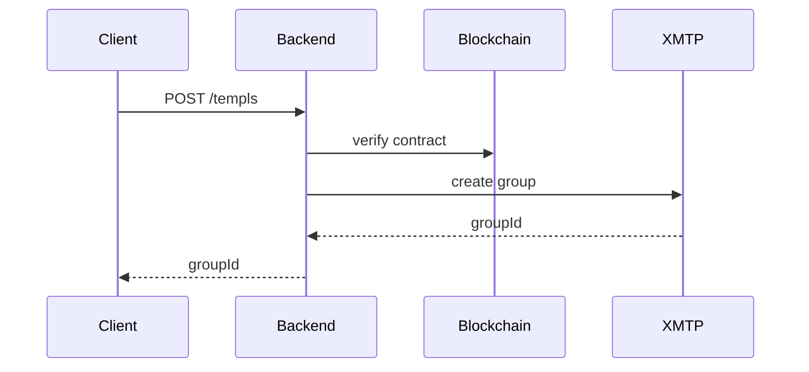
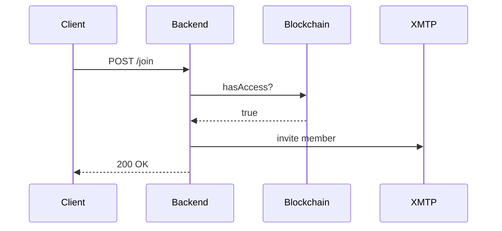

# TEMPL Backend

See the [README](./README.md#architecture) for how the backend fits into TEMPL; this document covers setup, configuration, and operations.

## Setup
Install dependencies:

```bash
npm --prefix backend install
```

## Environment variables

| Variable | Purpose | Default |
| --- | --- | --- |
| `RPC_URL` | RPC endpoint for on-chain reads and writes | — |
| `PORT` | HTTP port for the API service | `3001` |
| `BOT_PRIVATE_KEY` | Private key for the XMTP bot wallet | — |
| `ALLOWED_ORIGINS` | Comma-separated CORS origins | `http://localhost:5173` |
| `ENABLE_DEBUG_ENDPOINTS` | Expose debug endpoints when set to `1` | `0` |
| `XMTP_ENV` | XMTP network (`dev`, `production`, `local`) | `dev` |

### Optional variables

| Variable | Purpose | Default |
| --- | --- | --- |
| `LOG_LEVEL` | Pino log level (`info`, `debug`, etc.) | `info` |
| `RATE_LIMIT_STORE` | Rate limit store (`memory` or `redis`) | `memory` |
| `REDIS_URL` | Redis URL when `RATE_LIMIT_STORE=redis` | — |
| `DISABLE_XMTP_WAIT` | Skip XMTP readiness checks in tests | `0` |
| `XMTP_MAX_ATTEMPTS` | Limit XMTP client rotation attempts | unlimited |

See [README.md#environment-variables](./README.md#environment-variables) for minimal setup variables.
Startup fails without `RPC_URL` or `BOT_PRIVATE_KEY`.
`XMTP_ENV` selects the network (`dev`, `production`, `local`).
`ALLOWED_ORIGINS` configures CORS (default `http://localhost:5173`).
`LOG_LEVEL` controls Pino verbosity (default `info`).

### Rate limiting

The API rate-limits requests. Use the default in-memory store or install `redis`/`rate-limit-redis` and set `RATE_LIMIT_STORE=redis` with `REDIS_URL`.

## Development
Start the API service:

```bash
npm --prefix backend start
```

### Logging
Logging uses [Pino](https://github.com/pinojs/pino) (JSON to `stdout`; `LOG_LEVEL` controls verbosity and defaults to `info`). Pipe through `pino-pretty` in dev or redirect to a file in production.

## Tests & Lint

```bash
npm --prefix backend test
npm --prefix backend run lint
```

## Architecture
- **Ownership** – The bot wallet owns each XMTP group; no human has admin rights.
- **Endpoints**
  - `POST /templs` – create a group for a deployed contract; if a `connectContract` factory is supplied the backend also watches governance events.
  - `POST /join` – verify `hasAccess` on-chain and invite the wallet.
  - `POST /delegates` – priest assigns mute rights to a member.
  - `DELETE /delegates` – revoke a delegate's mute rights.
  - `POST /mute` – priest or delegate records an escalating mute for a member.
  - `GET /mutes` – list active mutes for a contract so the frontend can hide messages.
- **Dependencies** – XMTP JS SDK and an on-chain provider; event watching requires a `connectContract` factory.
- **Persistence** – group metadata persists to a SQLite database at `backend/groups.db` (or a custom path via `createApp({ dbPath })` in tests). The database is read on startup and updated when groups change; back it up to avoid losing state.

### Endpoint flows

#### Group creation (`/templs`)



#### Member join (`/join`)



### XMTP client details
- Client uses `appVersion` for diagnostics.
- Invitations require real inboxIds; the server resolves them and waits for visibility before inviting.
- After creation or join it syncs and records XMTP stats.

### Debug endpoints
When `ENABLE_DEBUG_ENDPOINTS=1`, these endpoints assist tests and local debugging:
- `GET /debug/group?contractAddress=<addr>&refresh=1` – returns server inboxId, stored/resolved groupId, and (when available) members.
- `GET /debug/conversations` – returns a count and the first few conversation ids seen by the server.
- `GET /debug/membership?contractAddress=<addr>&inboxId=<id>` – whether server group view contains `inboxId`.
- `GET /debug/last-join` – last join metadata.
- `GET /debug/inbox-state?inboxId=<id>&env=<local|dev|production>` – raw XMTP inbox state.

#### Running against a local XMTP node
- Start the local node: `npm run xmtp:local:up` (requires Docker) and watch logs with `(cd xmtp-local-node && docker compose logs -f)`.
- Set `XMTP_ENV=local` on the backend (Playwright config does this automatically when `E2E_XMTP_LOCAL=1`).
- Default local endpoints: API `http://localhost:5555`, History `http://localhost:5558`.

Playwright e2e uses `XMTP_ENV=production` by default and injects a random `BOT_PRIVATE_KEY` per run. When `E2E_XMTP_LOCAL=1`, it starts `xmtp-local-node` and sets `XMTP_ENV=local`.

## Security considerations
- The service trusts the provided wallet address; production deployments should authenticate requests.
- The bot key must be stored securely; compromise allows muting or invitation of arbitrary members.
- Governance events are forwarded to the group chat; untrusted RPC data could mislead voters.
- RPC responses are assumed honest; use a trusted provider.
