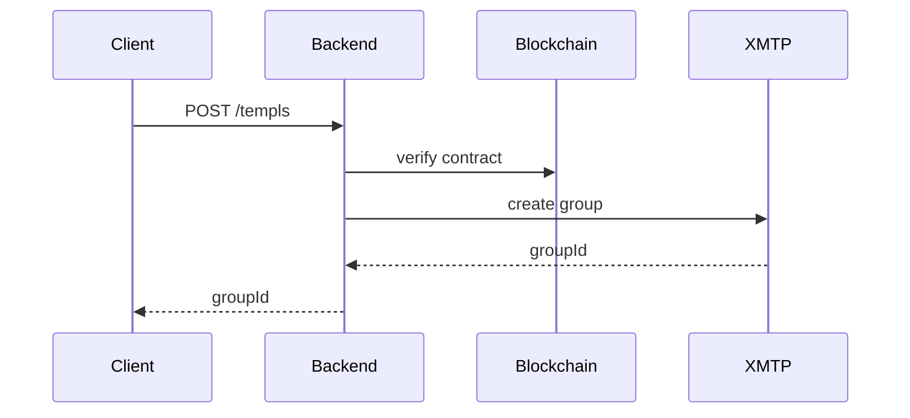
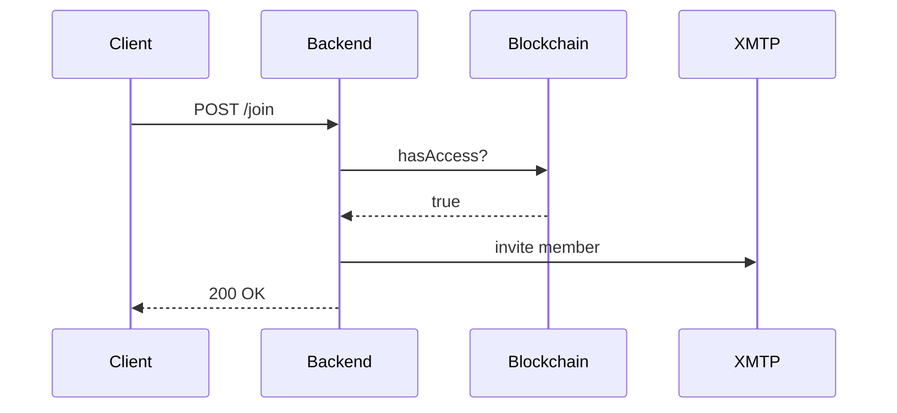

# TEMPL Backend

The TEMPL backend is an Express service that acts as the XMTP group owner. It creates rooms for new TEMPL deployments, verifies on-chain purchases, and invites members.

## Setup
Install dependencies:

```bash
npm --prefix backend install
```

## Environment variables

```env
RPC_URL=https://mainnet.base.org
PORT=3001
BOT_PRIVATE_KEY=0x...
ALLOWED_ORIGINS=http://localhost:5173
ENABLE_DEBUG_ENDPOINTS=1
XMTP_ENV=dev # XMTP network: dev|production|local (default: dev)
# Optional rate limit store ('redis' uses Redis)
RATE_LIMIT_STORE=redis
# When using Redis store
REDIS_URL=redis://localhost:6379
# Optional for tests to bypass network checks
DISABLE_XMTP_WAIT=1
# Optional cap on XMTP client rotation attempts
XMTP_MAX_ATTEMPTS=5
```

See [README.md#environment-variables](./README.md#environment-variables) for minimal setup variables.

The server will throw an error on startup if `RPC_URL` or `BOT_PRIVATE_KEY` are missing.

Use `XMTP_ENV=dev` for local development and integration tests. Set `XMTP_ENV=production` when connecting to the public XMTP network, such as during Playwright e2e runs or production deployments.

The API limits cross-origin requests using the [`cors`](https://www.npmjs.com/package/cors) middleware. Allowed origins are configured with the `ALLOWED_ORIGINS` environment variable (comma-separated list). By default only `http://localhost:5173` is permitted.

### Rate limiting

The API applies request rate limiting. By default, a local `MemoryStore` tracks requests, which is suitable for single-instance deployments. For distributed deployments, use a shared store such as Redis:

```bash
npm --prefix backend install redis rate-limit-redis
RATE_LIMIT_STORE=redis REDIS_URL=redis://localhost:6379 npm --prefix backend start
```

The store can also be supplied programmatically via `createApp({ rateLimitStore })`.

## Development
Start the API service:

```bash
npm --prefix backend start
```

### Logging
Structured logging is provided by [Pino](https://github.com/pinojs/pino). Logs are emitted in JSON format to `stdout` and the verbosity is controlled with the `LOG_LEVEL` environment variable. In development you may pipe the output through `pino-pretty` for human-readable logs. For production deployments, pipe the process output to a file and rotate it with a tool such as `logrotate`:

```bash
node src/server.js | pino >> /var/log/templ/backend.log
```

## Tests & Lint

```bash
npm --prefix backend test
npm --prefix backend run lint
```

## Architecture
- **Ownership** – The bot wallet owns each XMTP group; no human has admin rights.
- **Endpoints**
  - `POST /templs` – create a group for a deployed contract; if a `connectContract` factory is supplied the backend also watches governance events.
  - `POST /join` – verify `hasAccess` on-chain and invite the wallet.
  - `POST /delegates` – priest assigns mute rights to a member.
  - `DELETE /delegates` – revoke a delegate's mute rights.
  - `POST /mute` – priest or delegate records an escalating mute for a member.
  - `GET /mutes` – list active mutes for a contract so the frontend can hide messages.
- **Dependencies** – XMTP JS SDK and an on-chain provider; event watching requires a `connectContract` factory.
- **Persistence** – group metadata persists to a SQLite database at `backend/groups.db` (or a custom path via `createApp({ dbPath })` in tests). The database is read on startup and updated when groups change; back it up to avoid losing state.

### Endpoint flows

#### Group creation (`/templs`)



#### Member join (`/join`)



### XMTP client details
- The backend creates its XMTP client with `appVersion` for clearer network diagnostics.
- Invitations add members by real inboxId only (no deterministic fallbacks). The server resolves ids via `findInboxIdByIdentifier` when needed. Before inviting, it waits for the target inbox to be visible on the XMTP network to avoid “invite-before-ready” races.
- After creation/join, the backend syncs and records XMTP aggregate stats around operations for diagnostics.

### Debug endpoints
Enabled with `ENABLE_DEBUG_ENDPOINTS=1`:
- `GET /debug/group?contractAddress=<addr>&refresh=1` – server view of groupId, members (when available)
- `GET /debug/conversations` – server conversation ids
- `GET /debug/membership?contractAddress=<addr>&inboxId=<id>` – whether server group view contains `inboxId`
- `GET /debug/last-join` – last join metadata
- `GET /debug/inbox-state?inboxId=<id>&env=<local|dev|production>` – raw XMTP inbox state

#### Running against a local XMTP node
- Start the local node: `npm run xmtp:local:up` (requires Docker) and watch logs with `(cd xmtp-local-node && docker compose logs -f)`.
- Set `XMTP_ENV=local` on the backend (Playwright config does this automatically when `E2E_XMTP_LOCAL=1`).
- Default local endpoints: API `http://localhost:5555`, History `http://localhost:5558`.

### E2E and debug endpoints
When `ENABLE_DEBUG_ENDPOINTS=1`, additional endpoints assist tests and local debugging:
- `GET /debug/group?contractAddress=<addr>&refresh=1` – returns server inboxId, stored/resolved groupId, and (if available) members.
- `GET /debug/conversations` – returns a count and the first few conversation ids seen by the server.

Playwright e2e uses `XMTP_ENV=production` by default and injects a random `BOT_PRIVATE_KEY` per run. When `E2E_XMTP_LOCAL=1`, it starts `xmtp-local-node` and sets `XMTP_ENV=local`.

## Security considerations
- The service trusts the provided wallet address; production deployments should authenticate requests.
- The bot key must be stored securely; compromise allows muting or invitation of arbitrary members.
- Governance events are forwarded to the group chat; untrusted RPC data could mislead voters.
- RPC responses are assumed honest; use a trusted provider.
