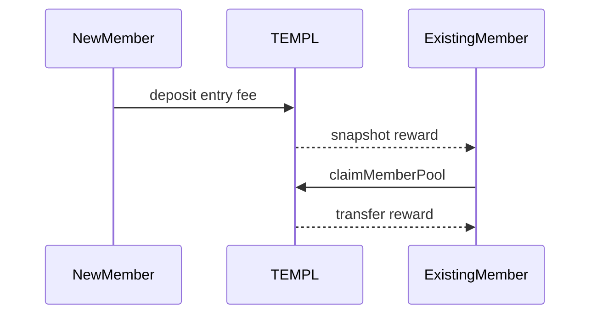
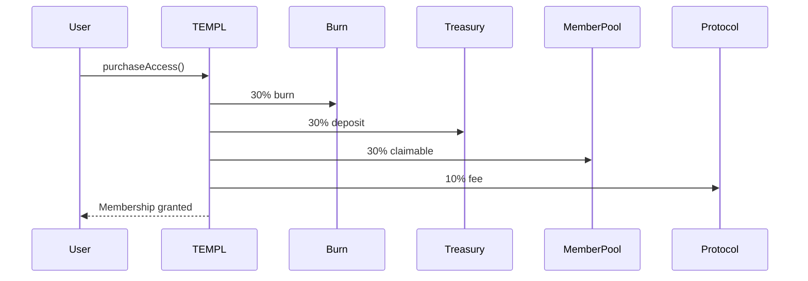
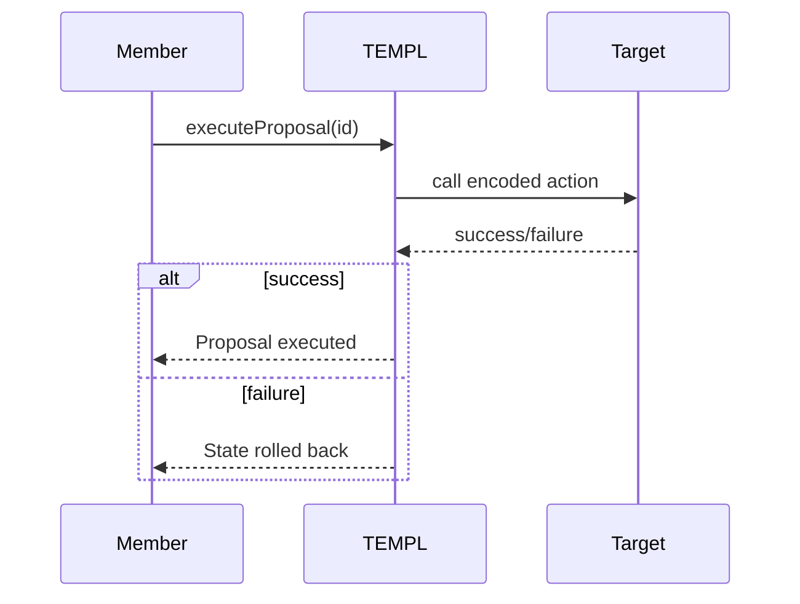

# TEMPL Contracts

## Overview
See the [README](./README.md#architecture) for a system overview; this document focuses on the on-chain contracts for auditors.

## Economic model
- **30% Burn** – sent to `0xdead`.
- **30% Treasury** – DAO controlled, released via proposals.
- **30% Member pool** – accrued for existing members (`n - 1`) to claim via `claimMemberPool`.
- **10% Protocol fee** – forwarded to a fixed recipient.

Rewards per existing member are `30% / (n - 1)` where `n` is current membership count (integer division may leave dust).

### Member pool claims
The member pool does not distribute automatically. Each entry fee increases
`memberPoolBalance` and `cumulativeMemberRewards`. Existing members accrue a
share of each new membership, tracked per address. To withdraw these rewards, a
member calls `claimMemberPool`, which transfers their unclaimed balance and
updates their snapshot. Unclaimed rewards continue to accumulate until claimed.

See the sequence diagram below for deposit, snapshot, and claim.



## DAO governance
- One member, one vote.
- Each member may have only one active proposal.
- Voting period: 7–30 days (`0` defaults to 7).
- Any address can execute a passed proposal; execution is atomic.
- Internal calls use `_executeCall` to invoke an allowlist of DAO functions during proposal execution.
- Proposals are restricted to the following actions only:
  - `setPausedDAO(bool)`
  - `updateConfigDAO(address,uint256)`
  - `withdrawTreasuryDAO(address,uint256,string)`
  - `withdrawAllTreasuryDAO(address,string)`
  - `withdrawTokenDAO(address,address,uint256,string)`
  - `withdrawETHDAO(address,uint256,string)`
  - `sweepMemberRewardRemainderDAO(address)`
  Arbitrary external calls are disabled for security.

### Anti‑attack checks
- **Flash loan protection** – `purchaseTimestamp[voter] < proposal.createdAt`.
- **Spam prevention** – `!hasActiveProposal[msg.sender]`.

## Configuration
The deployment script accepts the following environment variables (the priest defaults to the deploying wallet):

| Variable | Role | Required |
| --- | --- | --- |
| `PRIEST_ADDRESS` | Override priest address for tests | Optional |
| `PROTOCOL_FEE_RECIPIENT` | Recipient of protocol fee | Required |
| `TOKEN_ADDRESS` | ERC20 token used for membership fees | Required |
| `ENTRY_FEE` | Membership cost in wei (≥10 and divisible by 10) | Required |
| `PRIVATE_KEY` | Deployer wallet key | Required |
| `RPC_URL` | Base network RPC endpoint | Required |
| `BASESCAN_API_KEY` | BaseScan API key for verification | Optional |

More context appears in [README.md#environment-variables](README.md#environment-variables).

`ENTRY_FEE` must be at least 10 and a multiple of 10 so the 30/30/30/10
fee split divides evenly. This requirement is enforced in the
[constructor check](contracts/TEMPL.sol#L208-L210).

## Trust assumptions
- Contract code is immutable after deployment.
- ERC20 used for entry fees maintains expected behavior.
- Off‑chain actors broadcast transactions honestly.
 - Access token must be standard ERC‑20 without transfer fees/taxes; deflationary tokens are not supported by the current purchase flow (which pulls and redistributes fixed split amounts).

## Invariants
- Membership supply limited by entry fee cost.
- Proposal execution is all‑or‑nothing.
- Treasury transfers only happen via approved proposals.

## Failure modes
- Token depeg or liquidity loss.
- Malicious majority drains treasury.
- Network congestion delays proposal execution.

## Flows
### Membership purchase
The membership purchase splits fees among burn, treasury, member pool, and protocol.


### Proposal execution
Executing a proposal calls an allowlisted action and reverts on failure.


## Tests & Lint
Run contract tests and Slither:
```bash
npm test
npm run slither
```
The Hardhat suite covers: fee‑split invariants, reentrancy protection, voting rules (1 member = 1 vote, proposer auto‑YES, vote changes until deadline), eligibility by join time, DAO execution of allowlisted functions (pause/config/treasury), pagination, integration user journey, and all view functions.

## Deployment
```bash
npx hardhat compile
npm test
npx hardhat run scripts/deploy.js --network base
```
Artifacts and ABI are written to `deployments/` after deployment.
