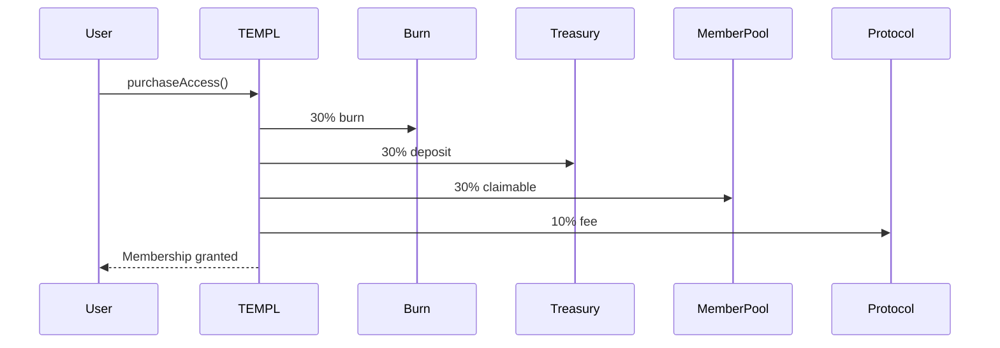
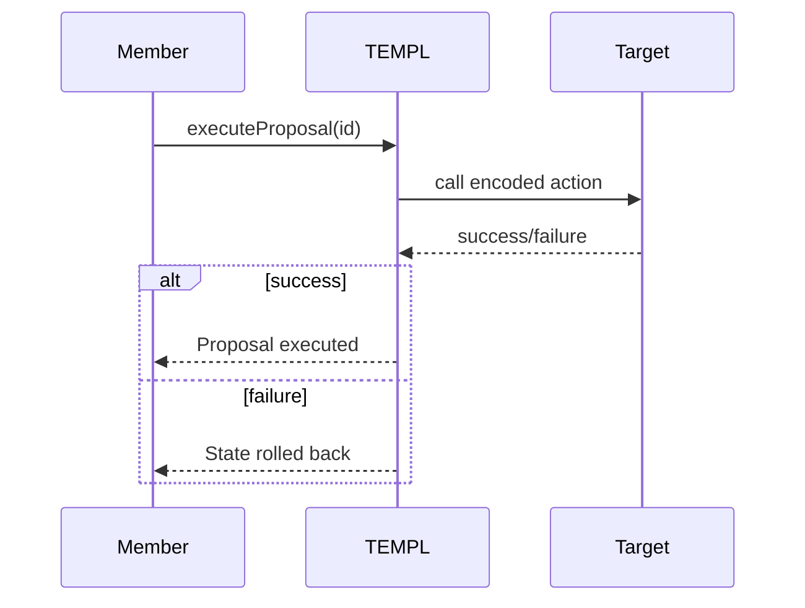

# Smart Contract Specification

This document describes the on-chain portion of TEMPL for auditors.

## Economic model
- **30% Burn** – sent to `0xdead`.
- **30% Treasury** – DAO controlled, released via proposals.
- **30% Member pool** – accrued for existing members (`n - 1`) to claim via `claimMemberPool`.
- **10% Protocol fee** – forwarded to a fixed recipient.

Rewards per existing member are `30% / (n - 1)` where `n` is current membership count (integer division may leave dust).

### Member pool claims
The member pool does not distribute automatically. Each entry fee increases
`memberPoolBalance` and `cumulativeMemberRewards`. Existing members accrue a
share of each new membership, tracked per address. To withdraw these rewards, a
member calls `claimMemberPool`, which transfers their unclaimed balance and
updates their snapshot. Unclaimed rewards continue to accumulate until claimed.

## DAO governance
- One member, one vote. The priest has `PRIEST_VOTE_WEIGHT` until membership exceeds `PRIEST_WEIGHT_THRESHOLD`.
- Each member may have only one active proposal.
- Voting period: 7–30 days (`0` defaults to 7).
- Any address can execute a passed proposal; execution is atomic.
- Internal calls use `_executeCall` and `_executeDAO` to allow nested operations without reentrancy.
- Proposals invoking `executeDAO` can perform arbitrary external calls with ETH.
  Members must review such proposals carefully to prevent malicious fund transfers or unsafe interactions.

### Anti‑attack checks
- **Flash loan protection** – `purchaseTimestamp[voter] < proposal.createdAt`.
- **Spam prevention** – `!hasActiveProposal[msg.sender]`.

## Configuration
The deployment script accepts the following environment variables (the priest defaults to the deploying wallet):

```env
# PRIEST_ADDRESS=0x...       # optional override for tests
PROTOCOL_FEE_RECIPIENT=0x... # required
TOKEN_ADDRESS=0x...          # required
ENTRY_FEE=100000000000000000 # wei, minimum 10 and divisible by 10
PRIEST_VOTE_WEIGHT=10
PRIEST_WEIGHT_THRESHOLD=10
PRIVATE_KEY=0x...
RPC_URL=https://mainnet.base.org
BASESCAN_API_KEY=...
```

`ENTRY_FEE` must be at least 10 and a multiple of 10 so the 30/30/30/10
fee split divides evenly. This requirement is enforced in the
[constructor check](contracts/TEMPL.sol#L213-L215).

## Trust assumptions
- Contract code is immutable after deployment.
- ERC20 used for entry fees maintains expected behavior.
- Off‑chain actors broadcast transactions honestly.

## Invariants
- Membership supply limited by entry fee cost.
- Proposal execution is all‑or‑nothing.
- Treasury transfers only happen via approved proposals.

## Failure modes
- Token depeg or liquidity loss.
- Malicious majority drains treasury.
- Network congestion delays proposal execution.

## Flows
### Membership purchase


### Proposal execution


## Testing
Run contract tests and Slither:
```bash
npm test
npm run slither
```

## Deployment
```bash
npx hardhat compile
npm test
npx hardhat run scripts/deploy.js --network base
```
Artifacts and ABI are written to `deployments/` after deployment.
