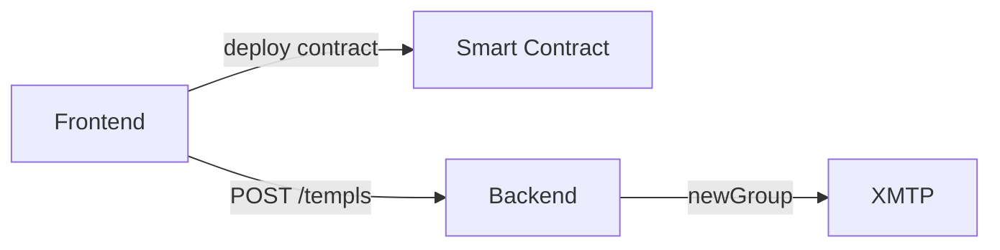
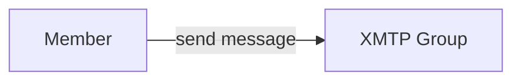
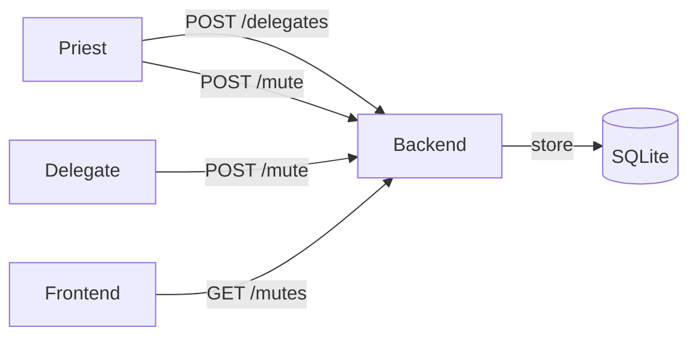
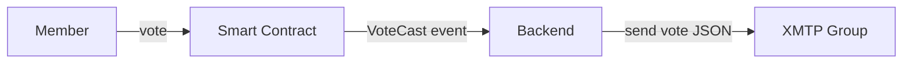
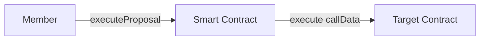

# Core Flow Service Diagrams

This document illustrates which service each core flow uses in TEMPL.

## 1. Templ creation


During Templ creation the backend's bot wallet creates and owns the XMTP group:

- The frontend sends the deployed contract address and the priest's inbox ID to the backend via `POST /templs` (if the inbox ID isn't provided, the backend derives it deterministically from the priest's address).
- The backend calls `newGroup` on XMTP, adds the priest as a member, and records the resulting group ID.
- Group ownership remains with the backend service; the priest does not control the group.

## 2. Pay-to-join
```mermaid
flowchart LR
    F[Frontend] -->|purchaseAccess| C[Smart Contract]
    F -->|POST /join| B[Backend]
    B -->|addMembers| X[XMTP]

The frontend signs `join:<contractAddress>` and the backend verifies purchase on‑chain before adding the member. The backend may send a small "member-joined" message to help clients discover the group quickly on XMTP dev.
```

## 3. Messaging


Discovery
- After a member joins, browser clients explicitly call `conversations.sync()` to fetch new welcomes, followed by `preferences.sync()` and `conversations.syncAll([...])`, and then poll/stream until the group is found. The UI requires discovery (no backend send fallback).

## 4. Moderation
The backend tracks mutes with escalating durations. The priest can delegate
mute power to other members. Frontends hide messages from muted members.



## 5. Proposal creation
```mermaid
flowchart LR
    F[Member] -->|createProposal| C[Smart Contract]
    C -->|ProposalCreated event| B[Backend]
    B -->|send proposal JSON| X[XMTP Group]

The backend watches on‑chain events and mirrors them into the group as JSON payloads so clients can render proposal and vote updates in real time.
```

Notes
- The backend adds members by inboxId only and linearizes invites by waiting for inbox readiness on XMTP before adding.
- After group creation/join, the backend syncs and records network stats. A small warm message may be sent; it is not used as a fallback in the UI.

## 6. Voting


## 7. Proposal execution

