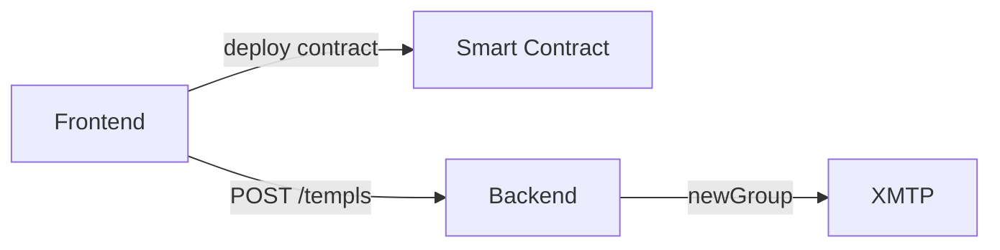
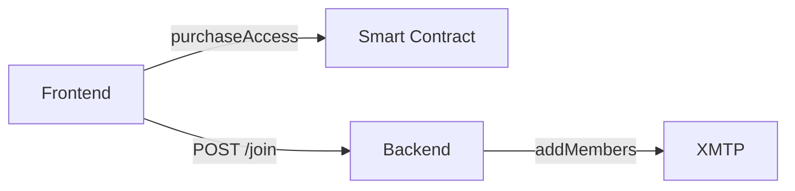
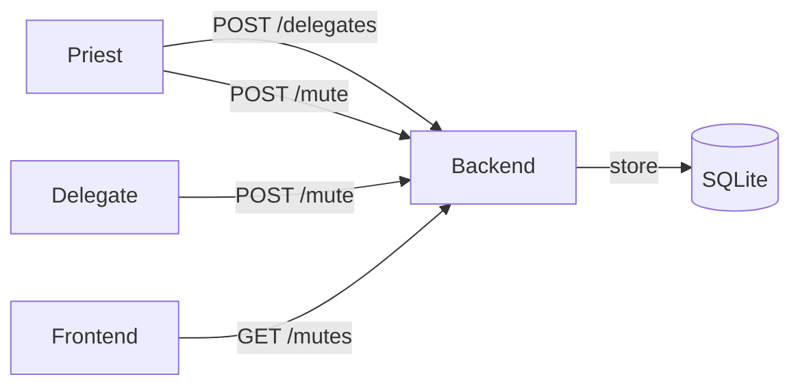
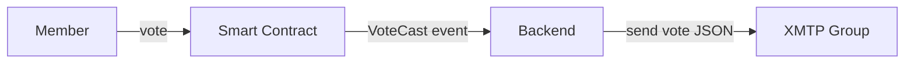
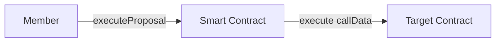

# Core Flow Service Diagrams

This document illustrates which service each core flow uses in TEMPL.

## 1. Templ creation

During Templ creation the backend's bot wallet creates and owns the XMTP group:

- The frontend sends the deployed contract address and the priest's inbox ID to the backend via `POST /templs`.
- The backend calls `newGroup` on XMTP, adds the priest as a member, and records the resulting group ID.
- Group ownership remains with the backend service; the priest does not control the group.

## 2. Pay-to-join

## 3. Messaging

## 4. Moderation
The backend tracks mutes with escalating durations. The priest can delegate
mute power to other members. Frontends hide messages from muted members.

## 5. Proposal creation

## 6. Voting

## 7. Proposal execution

