# Core Flow Service Diagrams

This document illustrates the components, endpoints, and message flows that power TEMPL’s core protocol functions. It includes visual diagrams and concrete request/response formats so auditors and implementers can understand every moving part.

## Actors & Legend
- Frontend: Browser app (XMTP Browser SDK) where users deploy, join, chat, and govern.
- Backend: Node service (XMTP Node SDK) that owns the group, verifies on-chain state, and manages moderation.
- Smart Contract: TEMPL on-chain logic (treasury, member pool, voting, execution allowlist).
- XMTP: Messaging network (env: local|dev|production).
- SQLite: Backend persistence for groups, delegates, and mutes.

Legend in diagrams: F = Frontend, B = Backend, C = Smart Contract, X = XMTP, D = SQLite.

## 1. Templ creation
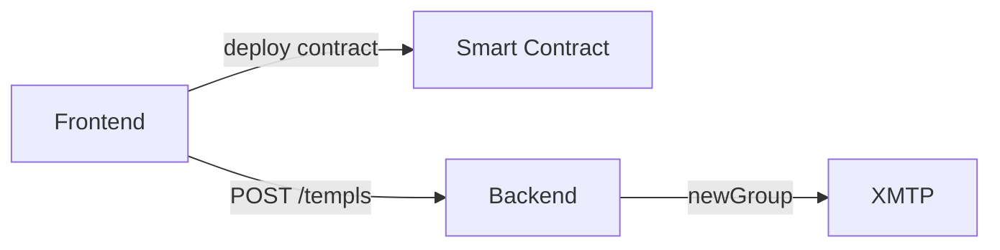

During Templ creation the backend's bot wallet creates and owns the XMTP group:

- The frontend sends the deployed contract address and the priest's inbox ID to the backend via `POST /templs`. If the inbox ID isn't provided, the backend resolves it on the XMTP network via `findInboxIdByIdentifier` and waits for the identity to be visible before inviting. No deterministic/fake inbox IDs are used.
- The backend calls `newGroup` on XMTP, adds the priest as a member, and records the resulting group ID.
- Group ownership remains with the backend service; the priest does not control the group.

## 2. Pay-to-join
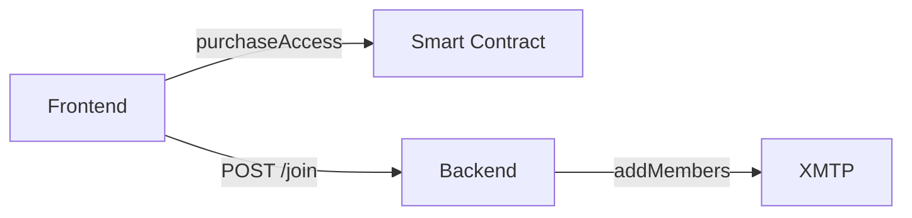

The frontend signs `join:<contractAddress>` and the backend verifies purchase on‑chain before adding the member. The backend may send a small "member-joined" message to help clients discover the group.

Sequence detail:
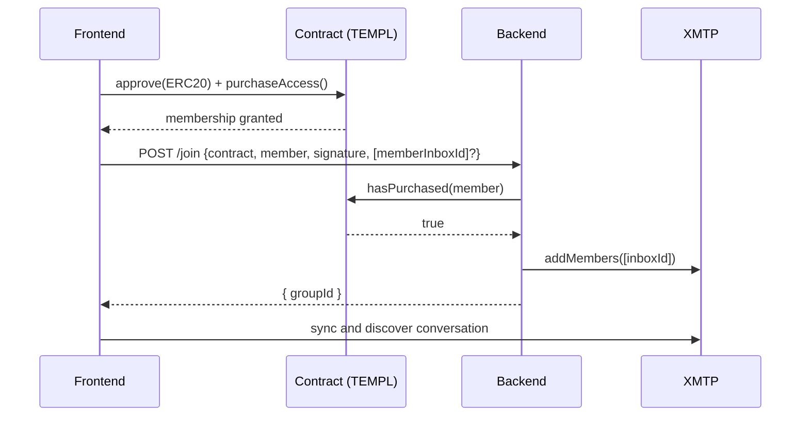

## 3. Messaging
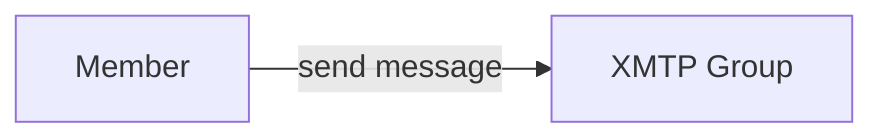

Discovery
- After a member joins, browser clients explicitly call `conversations.sync()` to fetch new welcomes, followed by `preferences.sync()` and `conversations.syncAll([...])`, and then poll/stream until the group is found. The UI requires discovery.

## 4. Moderation
The backend tracks mutes with escalating durations. The priest can delegate
mute power to other members. Frontends hide messages from muted members.

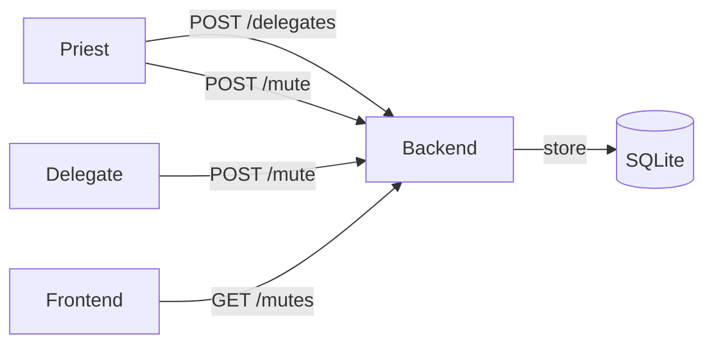

Sequence detail:
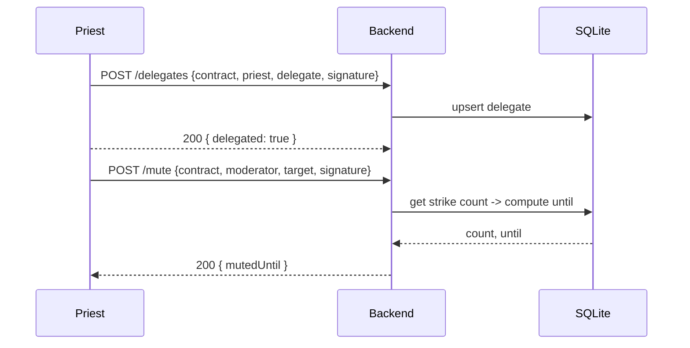

## 5. Proposal creation
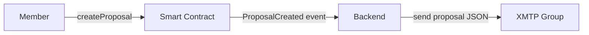

The backend watches on‑chain events and mirrors them into the group as JSON payloads so clients can render proposal and vote updates in real time.

Notes
- The backend adds members by inboxId only and linearizes invites by waiting for inbox readiness on XMTP before adding.
- After group creation/join, the backend syncs and records network stats. A small warm message may be sent.

## 6. Voting
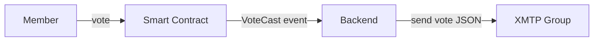

## 7. Proposal execution
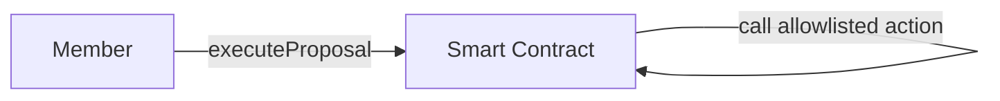
Execution is restricted to an allowlist of contract functions (pause/unpause, config updates, and treasury transfers of the TEMPL‑denominated token). Arbitrary external calls are disabled.

End-to-end proposal lifecycle (sequence):
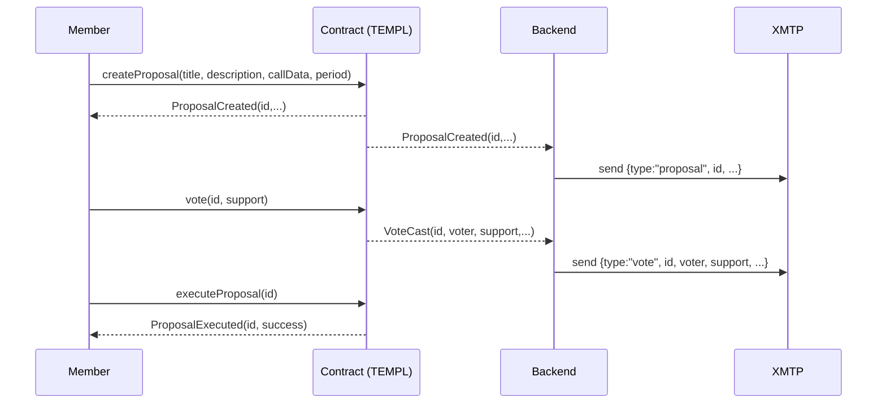

## Purchase Distribution (On-Chain)
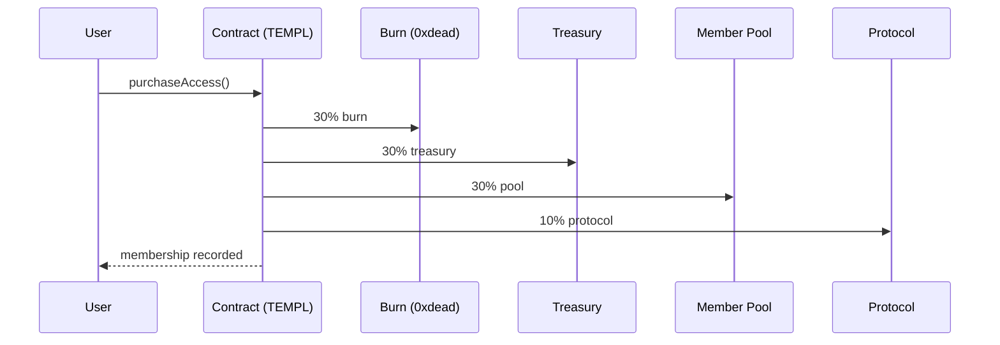

## Backend Endpoints & Signatures
- POST `/templs` – create group for a deployed TEMPL
  - Signature: `create:<contract>` signed by priest EOA.
  - Body: `{ contractAddress, priestAddress, signature, priestInboxId? }`
  - Response: `{ groupId }`
- POST `/join` – verify purchase and invite member
  - Signature: `join:<contract>` signed by member EOA.
  - Body: `{ contractAddress, memberAddress, signature, memberInboxId? }`
  - Response: `{ groupId }` or HTTP 503 until identity is visible on XMTP.
- POST `/delegates` – grant mute rights
  - Signature: `delegate:<contract>:<delegate>` signed by priest EOA.
  - Body: `{ contractAddress, priestAddress, delegateAddress, signature }`
  - Response: `{ delegated: true }`
- DELETE `/delegates` – revoke mute rights
  - Same signature format; `{ delegated: false }` on success.
- POST `/mute` – escalate mute for a target
  - Signature: `mute:<contract>:<target>` signed by priest or a delegate.
  - Response: `{ mutedUntil }` (ms since epoch; 0 means permanent after 5th strike).
- GET `/mutes?contractAddress=...` – list active mutes: `{ mutes: [{ address, count, until }] }`
- Debug (when `ENABLE_DEBUG_ENDPOINTS=1`): `/debug/group`, `/debug/conversations`, `/debug/membership`, `/debug/last-join`, `/debug/inbox-state`.

Backend resolves inboxIds from the XMTP network via `findInboxIdByIdentifier` and waits for identity readiness before `addMembers`. No deterministic/fake inboxIds are generated by the server.

## Governance Allowlist & Rules
- Proposal actions are restricted to an allowlist enforced at creation and execution:
  - `setPausedDAO(bool)`
  - `updateConfigDAO(address,uint256)`
  - `withdrawTreasuryDAO(address,uint256,string)`
  - `withdrawAllTreasuryDAO(address,string)`
  - `sweepMemberRewardRemainderDAO(address)`
- Voting: 1/member; priest weight = `priestVoteWeight` while `members.length < priestWeightThreshold`, else 1.
- Anti‑flash: voters must have joined before `proposal.createdAt`.
- Majority: `yesVotes > noVotes`, anyone may execute after `endTime`.

## Data & Storage
- SQLite tables:
  - `groups(contract TEXT PRIMARY KEY, groupId TEXT, priest TEXT)`
  - `mutes(contract TEXT, target TEXT, count INTEGER, until INTEGER, PRIMARY KEY(contract, target))`
  - `delegates(contract TEXT, delegate TEXT, PRIMARY KEY(contract, delegate))`
- XMTP client DBs:
  - Node: `xmtp-<env>-<inboxId>.db3` (SQLCipher when `dbEncryptionKey` provided).
  - Browser: OPFS per-origin; not OS-visible.

## Errors, Retries & Discovery
- `/join` may return HTTP 503 until the member identity is visible on XMTP; the frontend should retry.
- Browsers discover the group by calling `conversations.sync()`, `preferences.sync()`, `conversations.syncAll([...])` and polling/streaming for the conversation id.
