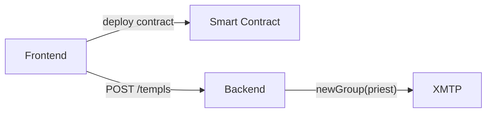
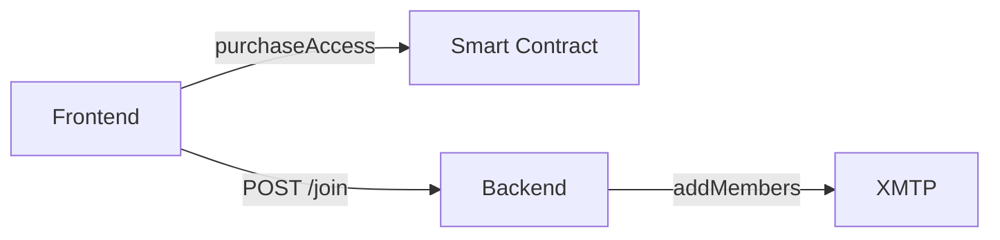

# Core Flow Service Diagrams

This document illustrates which service each core flow uses in TEMPL.

## 1. Templ creation

## 2. Pay-to-join

## 3. Messaging

## 4. Priest muting
XMTP groups do not yet support a true mute. When the priest mutes a member,
the backend removes them from the group to silence them.

## 5. Proposal creation

## 6. Voting

## 7. Proposal execution

