# Core Flow Service Diagrams

Components and message flows powering TEMPL's core protocol.

## Flow overview
- [1. Templ creation](#1-templ-creation)
- [2. Pay-to-join](#2-pay-to-join)
- [3. Messaging](#3-messaging)
- [4. Moderation](#4-moderation)
- [5. Proposal creation](#5-proposal-creation)
- [6. Voting](#6-voting)
- [7. Proposal execution](#7-proposal-execution)

## Actors & Legend
- Frontend: Browser app where users deploy, join, chat, and govern.
- Backend: Node service that owns the group, verifies chain state, and moderates.
- Contract: TEMPL logic (treasury, member pool, voting).
- XMTP: Messaging network.
- SQLite: Backend DB for groups, delegates, and mutes.

Legend: F=Frontend, B=Backend, C=Contract, X=XMTP, D=SQLite, M=Member, P=Priest.

## 1. Templ creation
The backend bot creates and owns the XMTP group when a TEMPL is deployed.
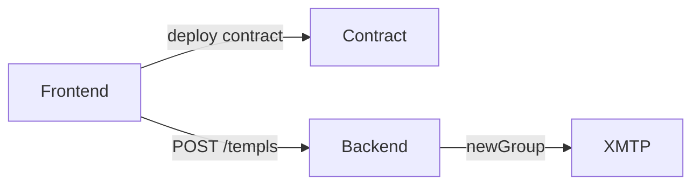

- Frontend posts `{contract}`; backend resolves the priest inbox from the network, creates the group, adds the priest, and stores the `groupId`.

## 2. Pay-to-join
Members sign a join message, and the backend verifies purchase before inviting them.
See [CONTRACTS.md#economic-model](CONTRACTS.md#economic-model) for membership fee split details.
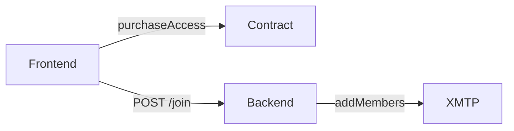

- Backend may send a small "member-joined" message to aid discovery.

Sequence detail:
The contract purchase and backend invite flow proceeds as follows.
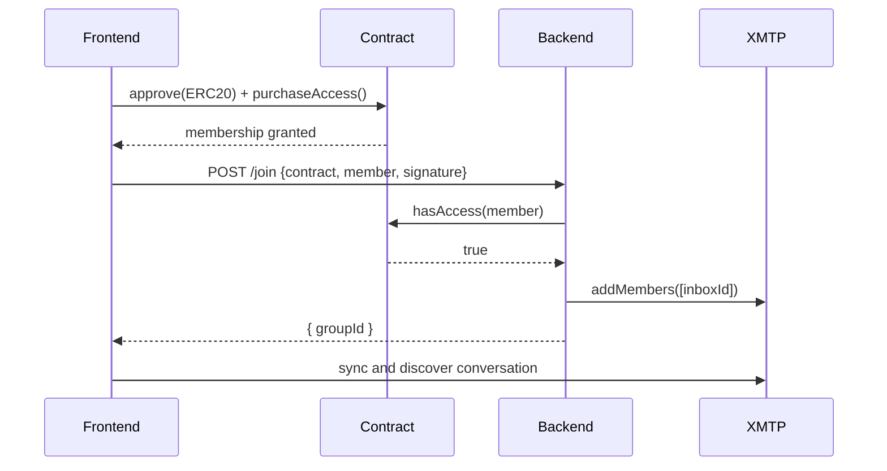

## 3. Messaging
Members send messages directly to the XMTP group.
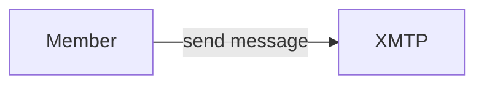

Discovery
- After joining, browser clients sync conversations and preferences until the group is found.

## 4. Moderation
The backend enforces escalating mutes and allows delegated moderation.
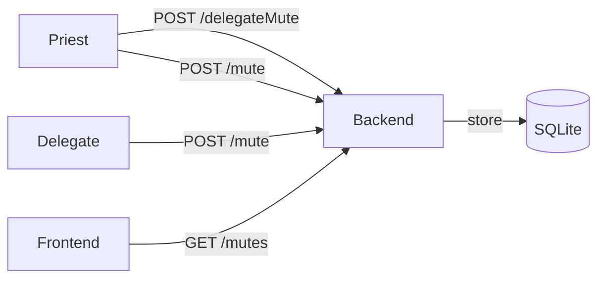

- Mutes escalate in duration.
- The priest can delegate mute power to other members.
- Frontends hide messages from muted members.

Sequence detail:
The moderation process from delegation to mute proceeds as follows.
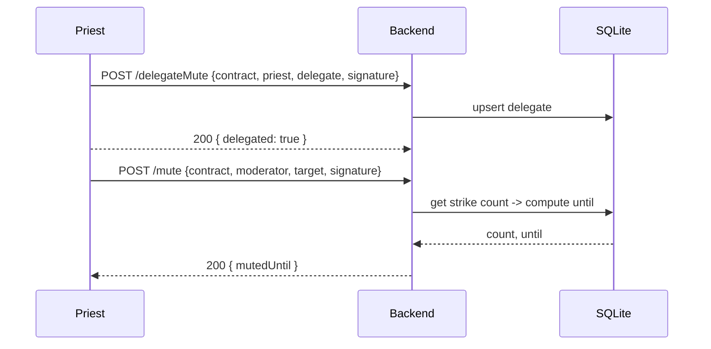

## 5. Proposal creation
The backend mirrors on-chain proposal events into the XMTP group.
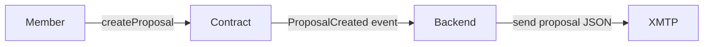

Notes
- The backend adds members by inboxId only and linearizes invites by waiting for inbox readiness on XMTP before adding.
- After group creation/join, the backend syncs and records network stats. A small warm message may be sent.

## 6. Voting
Members vote on proposals and the backend broadcasts vote events.
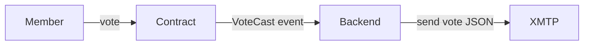

## 7. Proposal execution
Execution is limited to an allowlisted set of contract functions.
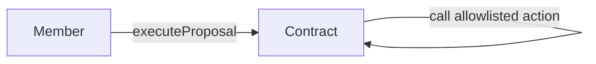

- Only pause/unpause, config updates, and treasury transfers are permitted.
- Arbitrary external calls are disabled.

End-to-end proposal lifecycle (sequence):
This sequence shows proposal creation, voting, and execution across the system.
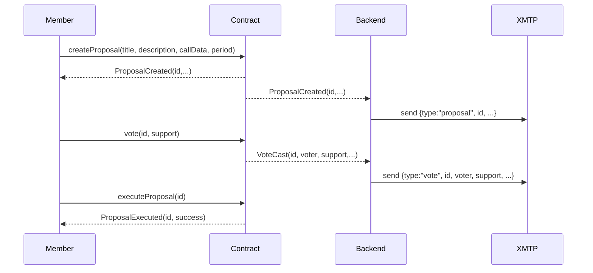

## Proposal lifecycle with treasury movement
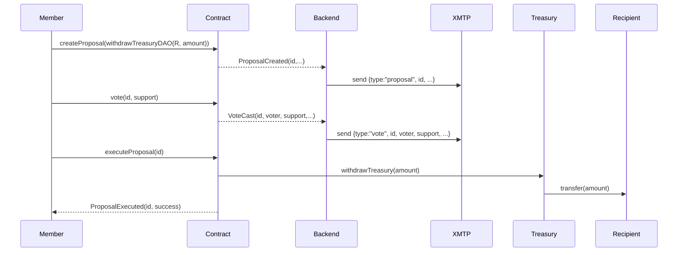

## Backend Endpoints & Signatures
- POST `/templs` – create group for a deployed TEMPL
  - Signature: EIP‑712 typed data `{ action:'create', contract, nonce, issuedAt, expiry }` signed by priest EOA.
  - Body: `{ contractAddress, priestAddress, signature, chainId }`
  - Response: `{ groupId }`
- POST `/join` – verify purchase and invite member
  - Signature: EIP‑712 `{ action:'join', contract, nonce, issuedAt, expiry }` signed by member EOA.
  - Body: `{ contractAddress, memberAddress, signature, chainId }`
  - Response: `{ groupId }` or HTTP 503 until identity is visible on XMTP.
- POST `/delegateMute` – grant mute rights
  - Signature: EIP‑712 `{ action:'delegateMute', contract, delegate, nonce, issuedAt, expiry }` signed by priest EOA.
  - Body: `{ contractAddress, priestAddress, delegateAddress, signature, chainId }`
  - Response: `{ delegated: true }`
- DELETE `/delegateMute` – revoke mute rights (same signature fields).
  - `{ delegated: false }` on success.
- POST `/mute` – escalate mute for a target
  - Signature: EIP‑712 `{ action:'mute', contract, target, nonce, issuedAt, expiry }` signed by priest or a delegate.
  - Response: `{ mutedUntil }` (ms since epoch; 0 means permanent after 5th strike).
- GET `/mutes?contractAddress=...` – list active mutes: `{ mutes: [{ address, count, until }] }`
- Debug (when `ENABLE_DEBUG_ENDPOINTS=1`): `/debug/group`, `/debug/conversations`, `/debug/membership`, `/debug/last-join`, `/debug/inbox-state`.

Backend resolves inboxIds from the XMTP network via `findInboxIdByIdentifier` and waits for identity readiness before `addMembers`. Client-supplied inboxIds are ignored.

## Governance Allowlist & Rules
- Proposal actions are restricted to an allowlist enforced at creation and execution:
  - `setPausedDAO(bool)`
  - `updateConfigDAO(address,uint256)`
  - `withdrawTreasuryDAO(address,uint256,string)`
  - `withdrawAllTreasuryDAO(address,string)`
  - `sweepMemberRewardRemainderDAO(address)`
- Voting: 1 vote per member; no priest bonus weighting.
- Anti‑flash: voters must have joined before `proposal.createdAt`.
- Majority: `yesVotes > noVotes`, anyone may execute after `endTime`.

## Data & Storage
- SQLite tables:
  - `groups(contract TEXT PRIMARY KEY, groupId TEXT, priest TEXT)`
  - `mutes(contract TEXT, target TEXT, count INTEGER, until INTEGER, PRIMARY KEY(contract, target))`
  - `delegates(contract TEXT, delegate TEXT, PRIMARY KEY(contract, delegate))`
- XMTP client DBs:
  - Node: `xmtp-<env>-<inboxId>.db3` (SQLCipher when `dbEncryptionKey` provided).
  - Browser: OPFS per-origin; not OS-visible.

## Errors, Retries & Discovery
- `/join` may return HTTP 503 until the member identity is visible on XMTP; the frontend should retry.
- Browsers discover the group by calling `conversations.sync()`, `preferences.sync()`, `conversations.syncAll([...])` and polling/streaming for the conversation id.
