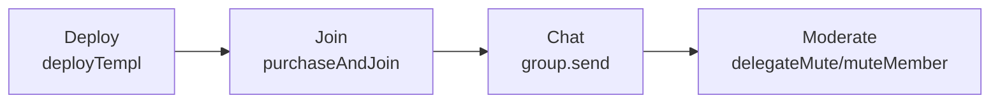

# TEMPL Frontend

See the [README](./README.md#architecture) for how the frontend fits into TEMPL; this document covers local development and testing.

## Prerequisites

- Node.js `22.18.0` and the repo-wide setup steps from the [root README](./README.md#quick-start).
- Environment variables like `VITE_XMTP_ENV`, `VITE_E2E_DEBUG`, and `E2E_XMTP_LOCAL` configure the frontend. See [Environment variables](#environment-variables) for details.

## Setup

Install dependencies:

```bash
npm --prefix frontend install
```

## Environment variables

| Name | Description | Default |
| --- | --- | --- |
| `VITE_XMTP_ENV` | XMTP environment for the Browser SDK (`local`, `dev`, `production`). Defaults to `dev` on `localhost`/`127.0.0.1` and `production` elsewhere. | `dev` (localhost) / `production` |
| `VITE_E2E_DEBUG` | Enables debug helpers (`window.__XMTP`, etc.) during E2E runs. | `0` |
| `E2E_XMTP_LOCAL` | When `1`, Playwright E2E tests connect to a local XMTP node instead of production. | `0` |

## Development

Start a hot-reloading dev server:

```bash
npm --prefix frontend run dev
```

## Tests & Lint

```bash
npm --prefix frontend test
npm --prefix frontend run lint
npm --prefix frontend run build
npm --prefix frontend test -- src/core-flows.integration.test.js # integration (local Hardhat + backend + XMTP dev)
npm --prefix frontend run test:e2e                          # end‑to‑end (Playwright)
```
To run e2e against a local XMTP node for logs/instrumentation:
```bash
git clone https://github.com/xmtp/xmtp-local-node.git
npm run xmtp:local:up
E2E_XMTP_LOCAL=1 npm --prefix frontend run test:e2e -- --project=tech-demo
npm run xmtp:local:down
```
## Architecture

- **Wallet connection** via `ethers` and `window.ethereum`.
- **Default configuration** – priest vote weight and priest weight threshold default to 10.
- **Governance** – members create proposals and vote from the chat; `watchProposals` updates the UI when events fire. The backend mirrors on‑chain events into the group as JSON so clients see real‑time updates.

### User flows



## Notes
- XMTP environment: defaults to `dev` on `localhost`/`127.0.0.1` and `production` elsewhere. Set `VITE_XMTP_ENV` to override (e.g. `local` for a local node); Playwright switches to `local` automatically when `E2E_XMTP_LOCAL=1`.
- E2E debug helpers: when `VITE_E2E_DEBUG=1`, the browser exposes `window.__XMTP`, `window.__xmtpList()` and `window.__xmtpGetById(id)` for diagnostics.
- Client options: the Browser SDK is constructed with `appVersion` for better diagnostics (see `src/App.jsx`).
- Typed flows: `src/flows.js` is documented with JSDoc and backed by `src/flows.types.d.ts`.

## Security considerations
- Membership verification happens on-chain; bypassing the backend would require membership proof.
- The app relies on the backend service for invitations; if the service is down no new members can join.
- Users must share the contract address and group ID manually; there is no routing.
- Proposal and vote transactions are signed by the connected wallet; proposal actions are restricted to an allowlist (pause/unpause, config, treasury transfers), but users should still review the action and parameters before approving.
