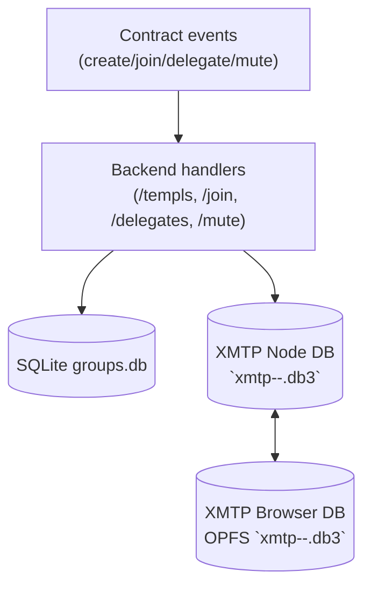

# Persistence Overview

This document explains every place we persist state across the TEMPL stack, how XMTP client storage works in Node versus the browser, what OPFS is, and why this matters for end-to-end (E2E) versus integration tests. If you understand the smart contract but not how XMTP storage is wired, start here.

| Storage | Location | Encryption | Usage |
| --- | --- | --- | --- |
| Backend DB | `backend/groups.db` (override with `DB_PATH`) | none | Maps contracts to XMTP `groupId` and moderation data |
| XMTP Node DB | `xmtp-<env>-<inboxId>.db3` in process CWD | SQLCipher via `dbEncryptionKey` | Client identity, installations, and conversation metadata |
| XMTP Browser DB | OPFS `xmtp-<env>-<inboxId>.db3` per origin | none | Browser client identity and metadata; handle limits |

## Backend DB

The backend service uses a SQLite database (`backend/groups.db` by default) to map TEMPL contracts to their XMTP group IDs and to track moderation. A lightweight in-memory cache mirrors the groups table so the server can restore state on boot. During E2E runs the path can be overridden with `DB_PATH` or cleared with `CLEAR_DB=1`.
- Tables and meaning:
  - `groups(contract TEXT PRIMARY KEY, groupId TEXT, priest TEXT)`
    - Maps on-chain TEMPL contract address to the XMTP group conversation ID and the priest’s EOA address.
    - Written on POST `/templs` (initial group registration). Re-read at server boot to restore in-memory cache.
  - `mutes(contract TEXT, target TEXT, count INTEGER, until INTEGER, PRIMARY KEY(contract, target))`
    - Stores moderation strikes and mute expiry for each address per TEMPL contract. Written on POST `/mute`.
  - `delegates(contract TEXT, delegate TEXT, PRIMARY KEY(contract, delegate))`
    - Stores which addresses are delegated moderation powers by the priest. Written on POST/DELETE `/delegates`.
- In-memory cache: a `Map()` mirrors `groups` records with `{ group, groupId, priest }`. The `group` object is the live XMTP group handle. On boot, the server tries to resolve each `groupId` via XMTP and populate the cache.

## XMTP Node DB

The XMTP Node SDK persists client identity and message metadata in SQLCipher databases named `xmtp-<env>-<inboxId>.db3` in the process's working directory. Each inboxId reuses its database across runs when opened with the same `dbEncryptionKey`. Both the backend service and integration tests rely on this storage.

### Identity model
  - `inboxId`: stable per “user” on XMTP, derived from the identity ledger for an EOA/SCW.
  - Installations: each inbox can have multiple installations (devices/agents). On the dev network, installs are limited (10 installations per inbox).
  - When creating an XMTP client, the Node SDK locates/creates a local DB for the inboxId and reuses it.

## XMTP Browser DB

The Browser SDK stores its SQLite database inside the Origin Private File System (OPFS), a per-origin sandbox not visible on the host OS. The SDK still names the file `xmtp-dev-<inboxId>.db3`, but it lives inside OPFS rather than on disk and cannot be encrypted even when a key is supplied. OPFS uses exclusive access handles, so creating multiple clients or rapidly opening and closing handles can trigger `NoModificationAllowedError`.

### Important behavior
  - OPFS uses “synchronous access handles” that are exclusive. If two handles or a writable stream are opened for the same file, further attempts can fail with `NoModificationAllowedError: createSyncAccessHandle` until the handle is released.
  - Don’t spin up multiple XMTP clients for the same inboxId concurrently in the browser.
  - Avoid repeatedly creating and tearing down clients in quick succession, which increases the chance of handle contention.
  - Prefer a single client per page lifecycle and reuse a stable installation.

## Data Flows

Several HTTP endpoints coordinate how data enters and leaves the system. The server writes to SQLite when groups are registered and updates moderation tables for delegate or mute actions. XMTP identity resolution and membership are managed by the XMTP network, not the backend database.

- POST `/templs` (create/register a TEMPL group)
  - Verifies the priest’s signature `create:<contract>`.
  - Creates a new XMTP group with the priest. If `priestInboxId` is provided it is used; otherwise the server resolves the inbox on the XMTP network via `findInboxIdByIdentifier` and waits for identity readiness before inviting. No deterministic/fake inbox IDs are generated by the server.
  - Optionally sets group metadata (name/description), tolerating the SDK’s “success reported as error” edge cases.
  - Sends a warm-up message to introduce initial activity.
  - Persists `{ contract, groupId, priest }` to SQLite and to the in-memory `groups` cache.
- POST `/join` (purchase check + add member to XMTP group)
  - Verifies `join:<contract>` signature.
  - Validates `hasAccess` against the contract (on-chain read via ethers).
  - Adds the member’s inboxId to the group. If `memberInboxId` is provided, it is used directly; otherwise the server resolves via `findInboxIdByIdentifier` and waits for identity readiness before inviting.
  - Re-syncs and sends a `member-joined` message to give the UI fresh content to discover.
  - Returns `groupId` but does NOT persist membership to our DB (membership is managed by XMTP/the group itself).
- POST/DELETE `/delegates`, POST `/mute`
  - Update the SQLite tables as described above.
- XMTP Identity, Installations, and Nonce
  - One inboxId per identity (EOA/SCW) representing the “user” on XMTP.
  - Installations represent devices/agents; dev network installs are capped at 10.
  - The signer’s `getIdentifier()` can include a `nonce`. Changing the nonce rotates to a fresh installation under the same inboxId.
  - Node: the DB is a real file you can see. Reusing the same `dbEncryptionKey` and inboxId attaches to the existing local database and doesn’t require creating a new installation each time.
  - Browser: the DB is in OPFS and cannot be seen directly by the OS. Repeatedly creating clients with different nonces can create repeated installations, and frequent create/dispose cycles may conflict with OPFS access handles.

## FAQ

This section answers common questions about what data is stored and why certain errors appear. It clarifies that chat messages and membership live in XMTP and explains common OPFS and test pitfalls.

- **Do we persist chat messages?**
  - No. Messages live in XMTP’s network + the client DB (OPFS in browser; SQLCipher DB on Node). Our backend doesn’t store chat messages.
- **Where is the “group membership” stored?**
  - In XMTP. We only store the mapping from TEMPL contract → `groupId` and the priest address. Adding/removing members happens via the XMTP group APIs and is reflected in the XMTP databases, not our SQLite.
- **Why did we see `NoModificationAllowedError` in E2E?**
  - That’s OPFS rejecting a new exclusive write handle to the DB while another handle or stream is still open. It’s a browser storage-level contention, not an XMTP core or contract issue.
- **Is this a protocol bug?**
  - No. Integration proves join works end-to-end at the protocol level using Node SDK. The E2E failures were due to Browser SDK storage/installation patterns and test-time storage manipulation.

## Testing

### Integration tests

- Node-based (Vitest) using the Node SDK and an in-process backend.
- Fresh random wallets each run avoid the dev network’s 10-installation cap.
- Deterministic: uses on-disk SQLCipher DBs, so no OPFS handle conflicts.

### E2E tests

- Browser SDK in Chromium; earlier nonce rotation with fixed Hardhat accounts and storage clearing caused
  - `10/10 installations reached` errors.
  - OPFS `createSyncAccessHandle` contention.
- **Mitigations**
  - Persist a nonce per wallet in `localStorage` to reuse the same installation and OPFS DB.
  - Generate fresh funded wallets for each run when continuity isn’t needed.
  - Avoid clearing OPFS or running multiple clients on a page; reload before switching wallets.
  - Backend Node client reuses its local DB and rarely needs installation rotation; clearing `groups.db` is safe.

