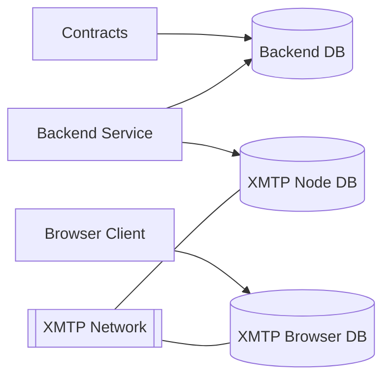
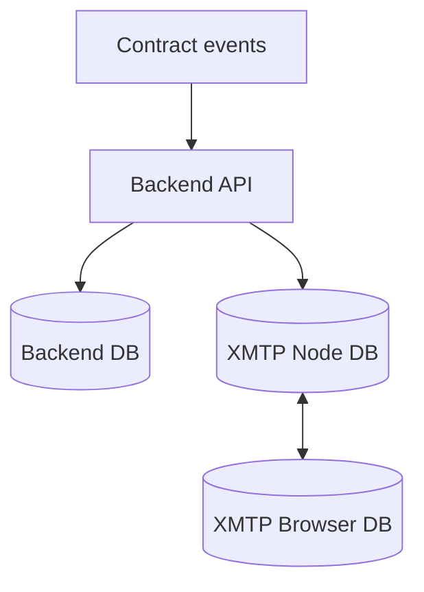

# Persistence Overview

This document outlines where TEMPL persists state, the storage technologies in play, and how data flows through the system. Detailed explanations live in [`PERSISTENCE_APPENDIX.md`](PERSISTENCE_APPENDIX.md).

| Storage          | Location                                            | Encryption                   | Usage                                            |
| ---------------- | --------------------------------------------------- | ---------------------------- | ------------------------------------------------ |
| Backend DB       | `backend/groups.db` (override with `DB_PATH`)       | none                         | Maps contracts to XMTP `groupId` and moderation  |
| XMTP Node DB     | `xmtp-<env>-<inboxId>.db3` in process CWD           | SQLCipher via `dbEncryptionKey` | Client identity and conversation metadata   |
| XMTP Browser DB  | OPFS `xmtp-<env>-<inboxId>.db3` per origin          | none                         | Browser client identity and metadata             |

## Storage Relationships

## Backend DB

- SQLite file `backend/groups.db` (override with `DB_PATH`).
- Stores contract → `groupId` mappings and moderation data.
- Mirror `groups` table in an in-memory `Map()` for quick boot.
- See [appendix details](PERSISTENCE_APPENDIX.md#backend-db-details) for schema.

## XMTP Node DB

- SQLCipher DB `xmtp-<env>-<inboxId>.db3` stored in process working dir.
- Holds client identity, installation info, and conversation metadata.
- Reused across runs with the same `dbEncryptionKey`.
- The server derives a 32-byte key from `BACKEND_DB_ENC_KEY` (if set) or from the bot private key and `XMTP_ENV`. Provide `BACKEND_DB_ENC_KEY` in production to avoid weak defaults.
- Identity model details in [appendix](PERSISTENCE_APPENDIX.md#xmtp-node-db-details).

## XMTP Browser DB

- Browser SDK stores DB in OPFS as `xmtp-<env>-<inboxId>.db3`.
- OPFS files are unencrypted and use exclusive access handles.
- Avoid concurrent clients or rapid client teardown to prevent handle contention.
- Additional notes in [appendix](PERSISTENCE_APPENDIX.md#xmtp-browser-db-details).

## Data Flows

- POST `/templs`: registers contract → `groupId` and seeds group.
- POST `/join`: verifies access and adds member to group. The server derives inboxIds from the member address; client-provided inboxIds are ignored.
- POST/DELETE `/delegateMute`, POST `/mute`: update moderation tables.
- Identity and installations are managed by XMTP; membership lives in XMTP, not SQLite.
- Endpoint specifics in [appendix](PERSISTENCE_APPENDIX.md#data-flow-endpoints).

## FAQ

This section answers common questions about what data is stored and why certain errors appear. It clarifies that chat messages and membership live in XMTP and explains common OPFS and test pitfalls.

- **Do we persist chat messages?**
  - No. Messages live in XMTP’s network + the client DB (OPFS in browser; SQLCipher DB on Node). Our backend doesn’t store chat messages.
- **Where is the “group membership” stored?**
  - In XMTP. We only store the mapping from TEMPL contract → `groupId` and the priest address. Adding/removing members happens via the XMTP group APIs and is reflected in the XMTP databases, not our SQLite.
- **Why did we see `NoModificationAllowedError` in E2E?**
  - That’s OPFS rejecting a new exclusive write handle to the DB while another handle or stream is still open. It’s a browser storage-level contention, not an XMTP core or contract issue.
- **Is this a protocol bug?**
  - No. Integration proves join works end-to-end at the protocol level using Node SDK. The E2E failures were due to Browser SDK storage/installation patterns and test-time storage manipulation.

## Testing

### Integration tests

- Node-based (Vitest) using the Node SDK and an in-process backend.
- Fresh random wallets each run avoid the dev network’s 10-installation cap.
- Deterministic: uses on-disk SQLCipher DBs, so no OPFS handle conflicts.

### E2E tests

- Browser SDK in Chromium; earlier nonce rotation with fixed Hardhat accounts and storage clearing caused:
  - `10/10 installations reached` errors.
  - OPFS `createSyncAccessHandle` contention.
- **Mitigations**
  - Persist a nonce per wallet to reuse installations and OPFS DB.
  - Use fresh funded wallets when continuity isn't needed.
  - Avoid clearing OPFS or running multiple clients on a page; reload before switching wallets.
  - Backend Node client reuses its local DB; clearing `groups.db` is safe.
