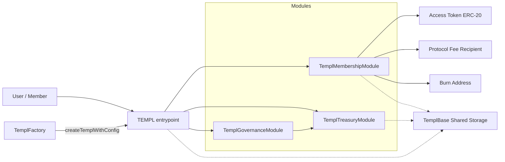
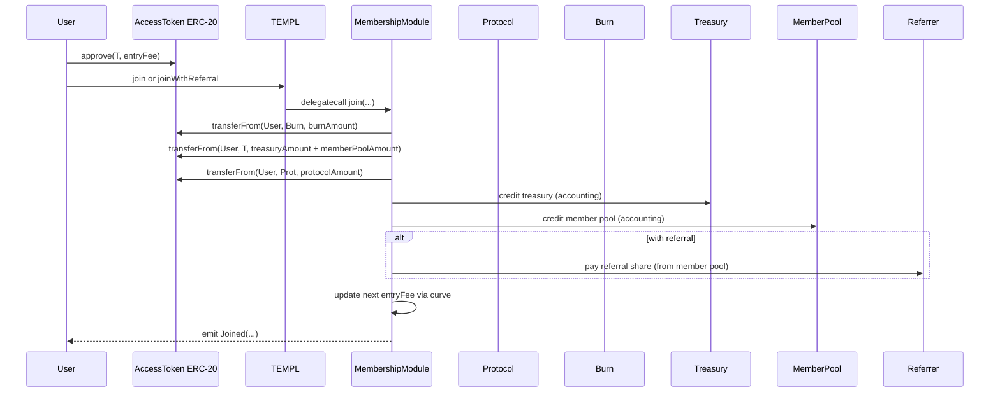

# templ.fun Protocol


Templ lets anyone create on-chain, token‑gated groups (“templs”) that accrue an access‑token treasury, stream rewards to existing members, and govern changes and payouts entirely on-chain.

Quick links: [At a Glance](#protocol-at-a-glance) · [Architecture](#architecture) · [Repo Map](#repo-map) · [Glossary](#glossary) · [Lifecycle](#lifecycle) · [Quickstart](#quickstart) · [Deploy](#deploy-locally) · [Safety Model](#safety-model) · [Security](#security) · [Reference](#reference) · [Docs Index](#docs-index) · [Constraints](#constraints) · [Limits](#limits--defaults) · [Indexing](#indexing-notes) · [Tests](#tests) · [FAQ](#faq) · [Troubleshooting](#troubleshooting) · [Gotchas](#gotchas)

## Protocol At a Glance
- Create a templ tied to a vanilla ERC‑20 access token; members join by paying an entry fee in that token. The fee is split into burn, treasury, member‑pool, and protocol slices.
- Existing members accrue pro‑rata rewards from the member‑pool slice and can claim at any time. Templs can also hold ETH or ERC‑20s as external rewards.
- Governance is member‑only: propose, vote, and execute actions to change parameters, move treasury, update curves/metadata, or call arbitrary external contracts.
- Optional dictatorship lets a designated “priest” directly execute DAO‑only actions when enabled; otherwise all such actions flow through governance.
- Pricing curves define how the entry fee evolves with membership growth (static, linear, exponential segments; see `CurveConfig` in `TemplCurve`).
- Everything is modular: `TEMPL` is a router that delegatecalls membership, treasury, and governance modules over a shared storage layout, keeping concerns clean.
- Deploy many templs via `TemplFactory`; run permissionless or with a gated deployer.


## Architecture
At runtime a templ behaves like one contract with clean separation of concerns via delegatecall modules sharing a single storage layout:

- Root router: [`TEMPL`](contracts/TEMPL.sol) (selector → module dispatch, common views)
- Membership: [`TemplMembershipModule`](contracts/TemplMembership.sol)
- Treasury: [`TemplTreasuryModule`](contracts/TemplTreasury.sol)
- Governance: [`TemplGovernanceModule`](contracts/TemplGovernance.sol)
- Shared storage: [`TemplBase`](contracts/TemplBase.sol)

Deployers configure pricing curves, fee splits, referral rewards, proposal fees, quorum/delay, membership caps, and an optional dictatorship (priest) override. The access token is any vanilla ERC‑20 you choose.

## How It Works



- `TEMPL` routes calls to modules via delegatecall and exposes selector→module lookup.
- Membership: joins, fee‑split accounting, member reward accrual and claims, eligibility snapshots.
- Treasury: governance/priests withdraw, disband, update config/splits/curve/metadata/referral/proposal fee.
- Governance: create/vote/execute proposals, quorum + delay, dictatorship toggle, safe external calls (single or batched).
- Shared storage: all persistent state lives in [`TemplBase`](contracts/TemplBase.sol).

## Key Concepts
- Fee split: burn / treasury / member pool / protocol; must sum to 10_000 bps.
- Member pool: portion of each join streamed to existing members pro‑rata; optional referral share is paid from this slice.
- Curves: entry fee evolves by static/linear/exponential segments; see [`TemplCurve`](contracts/TemplCurve.sol).
- Dictatorship: when enabled, the priest may call `onlyDAO` actions directly; otherwise all `onlyDAO` actions execute via governance.
- Snapshots: eligibility is frozen by join sequence at proposal creation, then again at quorum.
- Caps/pauses: optional `maxMembers` (auto‑pauses at cap) plus `joinPaused` toggle.
- Governance access: proposing and voting require membership; the proposer’s vote is counted YES at creation.

## Glossary
- templ: One deployed instance wired by `TEMPL` with membership, treasury, and governance modules.
- access token: The ERC‑20 used for joins, fees, and accounting. Must be vanilla (no fees/rebases/hooks).
- priest: A designated address with optional dictatorship powers when enabled.
- dictatorship: Mode where the priest may execute DAO‑only actions directly.
- member pool: Accounting bucket that streams join fees to existing members, claimable pro‑rata.
- external rewards: ETH/ERC‑20 balances held by the templ and distributed by proposals or claim logic.
- entry fee curve: Growth schedule for the next join price (see `CurveConfig` in `TemplCurve`).
- quorum bps: Percent of eligible members required to reach quorum.
- pre/post‑quorum window: Voting period before quorum and the anchored window after quorum.
- proposal fee: Fee paid (from the proposer) to create a proposal; a percentage of the current entry fee.
- referral share: Portion of the member‑pool slice paid to a valid referrer on join.

## Lifecycle
1) Deploy modules + factory or use an existing factory (`TemplFactory`).
2) Create a templ providing the access token, base entry fee, fee split, curve, governance params, and metadata (`createTemplWithConfig`).
3) Members join by paying the current entry fee in the access token (optionally with a referrer); fees split to burn/treasury/member‑pool/protocol. The next entry fee advances by the curve.
4) Members propose, vote, and execute: configuration changes, metadata updates, treasury withdrawals/disband, and arbitrary external calls.
5) Members claim accumulated member‑pool rewards and any external rewards credited to members.
6) Templs can evolve via governance—adjusting caps, curves, fees, and parameters—or be wound down by disbanding the treasury.

## Repo Map
- Contracts: `contracts/`
  - Core: `contracts/TEMPL.sol`, `contracts/TemplBase.sol`, `contracts/TemplMembership.sol`, `contracts/TemplTreasury.sol`, `contracts/TemplGovernance.sol`
  - Factory + config: `contracts/TemplFactory.sol`, `contracts/TemplCurve.sol`, `contracts/TemplDefaults.sol`, `contracts/TemplErrors.sol`
- Utilities: `contracts/tools/BatchExecutor.sol`, `contracts/mocks/*`, `contracts/echidna/*`
- Tests: `test/*.test.js` (ethers v6, hardhat). Helpers in `test/utils`.
- Scripts: `scripts/deploy-factory.cjs`, `scripts/deploy-templ.cjs`
- Config: `hardhat.config.cjs`, `echidna.yaml`, `slither.config.json`, `.solhint.json`

### Contract Organization
All contracts follow a consistent declaration order to keep code easy to scan and reason about:
- Constants
- Types (enums, structs)
- Events
- Storage (immutables, state variables)
- Modifiers
- Functions in order: constructor, fallback/receive, external, public, internal, private

Events are declared contiguously, and selector routing in `TEMPL.sol` keeps external views (e.g. `getProposalActionData`) listed with other external functions before internal helpers.

## Quickstart
- Prereqs: Node >=22, `npm`. Docker recommended for fuzzing.
- Install: `npm install`
- Compile: `npm run compile`
- Test: `npm test` (Hardhat). Coverage: `npm run coverage`.
- Docs (NatSpec): `npm run docs` (generates Markdown in `docs/`). Uses `solidity-docgen@0.5.16` with `solc@0.8.23`.
- Fuzzing (Echidna): `npm run test:fuzz` (via Docker; harness in `contracts/echidna/EchidnaTemplHarness.sol`).
- Static analysis: `npm run slither` (requires Slither in PATH).
- Lint: `npm run lint` (Prettier + Solhint; CI fails on formatting drift or any Solhint warning). Auto-fix: `npm run lint:fix`.
- Format: `npm run format` (applies Prettier with `prettier-plugin-solidity` to `contracts/**/*.sol`).

## Deploy Locally

```bash
# Deploy shared modules + factory
PROTOCOL_FEE_RECIPIENT=0xYourRecipient \
PROTOCOL_BPS=1000 \
npm run deploy:factory:local

# Deploy a templ via the factory
FACTORY_ADDRESS=0xFactoryFromPreviousStep \
TOKEN_ADDRESS=0xAccessToken \
ENTRY_FEE=100000000000000000000 \
TEMPL_NAME="templ.fun OG" \
TEMPL_DESCRIPTION="Genesis collective" \
npm run deploy:local
```

Verify on Base (optional):

```bash
# Factory (reads constructor args from chain)
BASESCAN_API_KEY=your_key \
npm run verify:factory -- --network base --factory 0xYourFactory

# TEMPL (reconstructs constructor args from chain + factory logs)
BASESCAN_API_KEY=your_key \
npm run verify:templ -- --network base --templ 0xYourTempl
```

Hardhat console (ethers v6) quick taste:

```js
// npx hardhat console --network localhost
const templ = await ethers.getContractAt("TEMPL", "0xYourTempl");
const token = await ethers.getContractAt("IERC20", (await templ.getConfig())[0]);
await token.approve(templ.target, (await templ.getConfig())[1]);
await templ.join();
const id = await templ.createProposalSetJoinPaused(true, 36*60*60, "Pause joins", "Cooldown");
await templ.vote(id, true);
// ...advance time...
await templ.executeProposal(id);

```

### Batched External Calls (approve → stake)
Use the included [`BatchExecutor`](contracts/tools/BatchExecutor.sol) to sequence multiple downstream calls atomically via a single governance proposal. For a simple staking target used in examples/tests, see `contracts/mocks/MockStaking.sol`.

```js
// npx hardhat console --network localhost
const templ = await ethers.getContractAt("TEMPL", "0xYourTempl");
const token = await ethers.getContractAt("IERC20", (await templ.getConfig())[0]);

// 1) Prepare inner calls: approve -> stake
const staking = await ethers.getContractAt("MockStaking", "0xStaking");
const approveSel = token.interface.getFunction("approve").selector;
const approveArgs = ethers.AbiCoder.defaultAbiCoder().encode(
  ["address","uint256"],
  [await staking.getAddress(), ethers.parseUnits("100", 18)]
);
const approveData = ethers.concat([approveSel, approveArgs]);

const stakeSel = staking.interface.getFunction("stake").selector;
const stakeArgs = ethers.AbiCoder.defaultAbiCoder().encode(
  ["address","uint256"],
  [await token.getAddress(), ethers.parseUnits("100", 18)]
);
const stakeData = ethers.concat([stakeSel, stakeArgs]);

// 2) Encode BatchExecutor.execute(targets, values, calldatas)
// Deploy a fresh BatchExecutor (or use an existing address)
const Executor = await ethers.getContractFactory("BatchExecutor");
const executor = await Executor.deploy();
await executor.waitForDeployment();
const targets = [await token.getAddress(), await staking.getAddress()];
const values = [0, 0]; // no ETH in this example
const calldatas = [approveData, stakeData];

const execSel = executor.interface.getFunction("execute").selector;
const execParams = ethers.AbiCoder.defaultAbiCoder().encode(
  ["address[]","uint256[]","bytes[]"],
  [targets, values, calldatas]
);

// 3) Propose the external call (templ -> BatchExecutor)
const votingPeriod = 36 * 60 * 60;
const pid = await templ.createProposalCallExternal(
  await executor.getAddress(),
  0, // forward 0 ETH to the executor
  execSel,
  execParams,
  votingPeriod,
  "Approve and stake",
  "Approve token then stake in a single atomic batch"
);

// 4) Vote and execute after quorum + delay
await templ.vote(pid, true);
// ...advance time to satisfy post‑quorum voting period...
await templ.executeProposal(pid);
```

Notes
- To forward ETH in the batch, set `values` for the specific inner call(s) and pass the top-level `value` argument in `createProposalCallExternal` to `sum(values)`.
- If any inner call reverts, the entire batch reverts; no partial effects.
- Proposing and voting require membership; ensure the caller has joined.
```



Curves (see [`TemplCurve`](contracts/TemplCurve.sol)) support static, linear, and exponential segments. A final segment with `length=0` creates an infinite tail.

## Scripts & Env Vars
- Scripts: `deploy:factory`, `deploy:factory:local`, `deploy:local`, `coverage`, `slither`, `verify:templ`, `verify:factory`.
- `scripts/deploy-factory.cjs`:
  - Required: `PROTOCOL_FEE_RECIPIENT`
  - Optional: `PROTOCOL_BPS`, `FACTORY_ADDRESS` (reuse), `FACTORY_DEPLOYER` (defaults to signer address)
  - Deploys modules if not provided via env and wires them into the factory constructor.
- `scripts/deploy-templ.cjs`: key envs are `FACTORY_ADDRESS` (or omit to auto‑deploy modules + factory locally), `TOKEN_ADDRESS`, `ENTRY_FEE`, plus optional metadata (`TEMPL_NAME`, `TEMPL_DESCRIPTION`, `TEMPL_LOGO_LINK`). Many toggles are supported (priest, quorum/post‑quorum voting periods, caps, fee splits, referral share, curve). Optional: `POST_QUORUM_VOTING_PERIOD_SECONDS`.
- Verify helpers (see `scripts/verify-templ.cjs`, `scripts/verify-factory.cjs`):
  - `verify:templ` verifies a TEMPL instance, reconstructing constructor args from chain data. Provide `TEMPL_ADDRESS` or `--templ 0x...` and run with a configured Hardhat network.
  - `verify:factory` verifies a TemplFactory deployment using on‑chain getters. Provide `FACTORY_ADDRESS` or `--factory 0x...`.
- Permissioning:
  - `TemplFactory.setPermissionless(true)` allows anyone to create templs.
  - `TemplFactory.transferDeployer(newAddr)` hands off deployer rights when permissionless is disabled.

## Reference
- Contract APIs (NATSpec):
  - Membership: [`contracts/TemplMembership.sol`](contracts/TemplMembership.sol)
  - Treasury: [`contracts/TemplTreasury.sol`](contracts/TemplTreasury.sol)
  - Governance: [`contracts/TemplGovernance.sol`](contracts/TemplGovernance.sol)
  - Root router: [`contracts/TEMPL.sol`](contracts/TEMPL.sol) — `getRegisteredSelectors()` lists the canonical ABI surface.
  - Factory: [`contracts/TemplFactory.sol`](contracts/TemplFactory.sol) — constructor accepts explicit `factoryDeployer`; use `transferDeployer` to rotate.
- Proposal views: `getProposal`, `getProposalSnapshots`, `getProposalJoinSequences`, `getActiveProposals*` in [`contracts/TemplGovernance.sol`](contracts/TemplGovernance.sol). Payload helper `getProposalActionData` in [`contracts/TEMPL.sol`](contracts/TEMPL.sol).
  - CallExternal payload shape: `(address target, uint256 value, bytes data)`

## Docs Index
- Router: `docs/TEMPL.md`
- Shared storage: `docs/TemplBase.md`
- Membership module: `docs/TemplMembershipModule.md`
- Treasury module: `docs/TemplTreasuryModule.md`
- Governance module: `docs/TemplGovernanceModule.md`
- Factory: `docs/TemplFactory.md`
- Defaults: `docs/TemplDefaults.md`
- Errors: `docs/TemplErrors.md`
- Tools: `docs/tools/BatchExecutor.md`
- Fuzz harness: `docs/echidna/EchidnaTemplHarness.md`
- Events: see [`contracts/TemplBase.sol`](contracts/TemplBase.sol).
- Learn by tests: see [Tests](#tests) for direct links by topic.
- DAO setters of interest: `setPreQuorumVotingPeriodDAO`, `setPostQuorumVotingPeriodDAO`, `setQuorumBpsDAO`, `setBurnAddressDAO`, `setEntryFeeCurveDAO`, `setProposalCreationFeeBpsDAO`, `setReferralShareBpsDAO`, `setMaxMembersDAO`, `setJoinPausedDAO`, `updateConfigDAO`.

## Constraints
- Entry fee: must be ≥10 and divisible by 10.
- Fee split: burn + treasury + member pool + protocol must sum to 10_000 bps.
- Pre‑quorum voting window: bounded to [36 hours, 30 days].

## Limits & Defaults
- `BPS_DENOMINATOR = 10_000`.
- Defaults via [`TemplDefaults`](contracts/TemplDefaults.sol): quorum bps, post‑quorum voting period, burn address.
- `MAX_EXTERNAL_REWARD_TOKENS = 256` (UI enumeration bound).
- `MAX_ENTRY_FEE = type(uint128).max` (entry fee safety guard).
- Pre‑quorum voting window: default 36 hours (min 36h, max 30 days); view `preQuorumVotingPeriod`; adjust via `setPreQuorumVotingPeriodDAO`.
- Factory defaults (when not explicitly provided):
  - Fee split: burn 3_000 bps, treasury 3_000 bps, member pool 3_000 bps (plus protocol bps from factory).
  - Membership cap: 249.
  - Curve: exponential primary segment at 10_094 bps for 248 paid joins, then static tail (price holds if cap expands).
  - Proposal fee: 2_500 bps (25% of current entry fee); Referral share: 2_500 bps (25% of member‑pool slice).

## Indexing Notes
- Track `ProposalCreated` then hydrate with `getProposal` + `getProposalSnapshots`.
- Use `getActiveProposals()` for lists; `getActiveProposalsPaginated(offset,limit)` for pagination.
- Treasury views: `getTreasuryInfo()` and/or `TreasuryAction`/`TreasuryDisbanded` deltas.
- Curves: consume `EntryFeeCurveUpdated` for UI refresh.

## Safety Model
- Vanilla ERC‑20 only: the access token must not tax, rebase, or hook transfers; accounting assumes exact in/out.
- Router‑only entry: modules can only be reached via `TEMPL` delegatecalls; direct module calls revert by design.
- Reentrancy containment: module boundaries and state updates are organized to prevent cross‑module reentrancy; tests probe reentrant tokens and hooks.
- Snapshotting: proposal eligibility freezes at creation, then re‑snapshots at quorum to prevent late join swings.
- Anchored execution: the post‑quorum window is anchored at quorum time to avoid timing manipulation.
- Fee invariants: burn + treasury + member‑pool + protocol must sum to 10_000 bps; entry fee ≥10 and divisible by 10; hard cap on max entry fee.
- Enumeration bounds: external reward tokens are capped for safe pagination and UI enumeration.
- External call proposals: powerful and dangerous—treat as timelocked admin calls; the system bubbles downstream reverts and executes atomically.
- Dictatorship guardrails: enabling/disabling dictatorship is a governed action; while enabled, `onlyDAO` actions are priest‑callable.

Proof points in tests:
- Reentrancy and hooks: `test/Reentrancy.test.js`, `test/ProposalFeeReentrancy.test.js`.
- Direct‑call guard: `test/DirectModuleCallGuard.test.js`.
- Voting and snapshots: `test/GovernanceCoverage.test.js`, `test/SingleProposal.test.js`.
- Fee math and validation: `test/FeeValidationReverts.test.js`, `test/FeeExtremes.test.js`.
- Curves: `test/EntryFeeCurve.test.js`, `test/ExponentialTinyFactor.test.js`.
- Treasury safety: `test/TreasuryCoverage.test.js`, `test/TreasuryWithdrawReverts.test.js`.

## Security
- Access token must be vanilla ERC‑20 (no fee‑on‑transfer, no rebasing, no hooks). Accounting assumes exact transfer amounts.
- External‑call proposals can execute arbitrary logic; treat with the same caution as timelocked admin calls.
- Reentrancy is guarded; modules are only reachable via the `TEMPL` router (direct module calls revert).
- No external audit yet. Treat as experimental and keep treasury exposure conservative until audited.

## Troubleshooting
- `InvalidEntryFee` / `EntryFeeTooSmall`: fee must be ≥10 and divisible by 10.
- `InvalidPercentageSplit`: burn + treasury + member + protocol must sum to 10_000 bps.
- `ActiveProposalExists`: one active proposal per proposer.
- `QuorumNotReached` / `ExecutionDelayActive`: execution preconditions not satisfied.
- Direct module call guard: only call through `TEMPL` (see tests below).

## FAQ
- Can the access token change later? No — deploy a new templ.
- Why divisible by 10? Prevents rounding drift in fee math.
- How do referrals work? Paid from the member‑pool slice when the referrer is a member and not the joiner.
- Can I enumerate external reward tokens? Yes: `getExternalRewardTokens()` (or paginated) and `getExternalRewardState(token)`; cleanup via DAO‑only `cleanupExternalRewardToken`.

## Tests
- Default: `npm test` (heavy `@load` suite is excluded).
- High‑load stress: `npm run test:load` with `TEMPL_LOAD=...` to scale joiners.
  - Optional: `TEMPL_LOAD_PROPOSALS=...` caps concurrent proposals in the load suite (default scales with members).
  - Optional: `TEMPL_LOAD_TOKENS=...` fans out distinct external reward tokens to disband/claim under load (default 12).
- Coverage: `npm run coverage`. Static: `npm run slither`.
- Property fuzzing: `npm run test:fuzz` (via Docker) using `echidna.yaml` and `contracts/echidna/EchidnaTemplHarness.sol`.

Learn by topic (a non‑exhaustive map):
- Membership: `test/MembershipCoverage.test.js`, `test/MemberPool.test.js`, `test/ClaimMemberPool.test.js`
- Governance: `test/GovernanceCoverage.test.js`, `test/SingleProposal.test.js`, `test/GovernanceExternalCall*.test.js`
- Treasury: `test/TreasuryCoverage.test.js`, `test/TreasuryWithdrawAssets.test.js`, `test/DisbandTreasury.test.js`
- Curves: `test/EntryFeeCurve.test.js`, `test/FeeExtremes.test.js`, `test/FeeValidationReverts.test.js`
- Dictatorship/Priest: `test/PriestDictatorship.test.js`, `test/DictatorshipPriestOnlyReverts.test.js`
- Indexing helpers: `test/ActiveProposalsIndex.test.js`, `test/ProposalPagination.test.js`, `test/GetProposalStatus.test.js`
- Defenses/guards: `test/Reentrancy.test.js`, `test/ProposalFeeReentrancy.test.js`, `test/DirectModuleCallGuard.test.js`
- Selectors/ABI surface: `test/TEMPLRegisteredSelectors.test.js`, `test/TEMPLSelectors.test.js`

CI runs on PRs when source, tests, scripts, or docs change (contracts, tests, scripts, docs, and key configs), keeping checks focused on relevant changes.

## Gotchas
- Use a vanilla ERC‑20 for access token (no transfer fees/rebases/hooks).
- Entry fee must be ≥10 and divisible by 10; there’s a `MAX_ENTRY_FEE` guard.
- Only one active proposal per proposer.
- `TemplFactory` can be set permissionless to let anyone create templs.
- Direct calls to module addresses revert; always go via `TEMPL`.
- Default voting window is 36 hours; quorum and post‑quorum delay are configurable.
