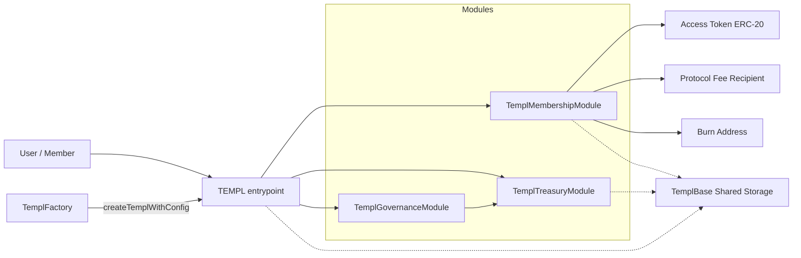
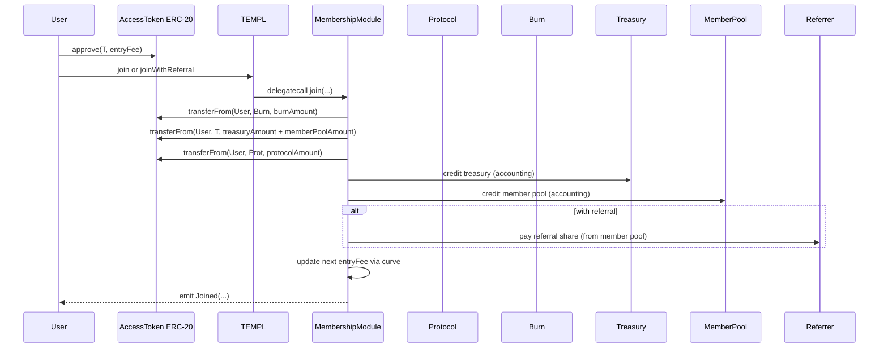

# templ.fun Protocol


## What It Does
- Spin up on-chain, token-gated groups (“templs”) that collect an access‑token treasury, stream rewards to existing members, and govern changes and payouts on-chain.
- A templ is three delegatecall modules — membership, treasury, governance — orchestrated by the root [`TEMPL`](contracts/TEMPL.sol) with shared storage in [`TemplBase`](contracts/TemplBase.sol). It behaves like one contract with clean separation of concerns.
- Deployers configure pricing curves, fee splits, referral rewards, proposal fees, quorum/delay, membership caps, and an optional dictatorship (priest) override.

## Safety
- Vanilla ERC‑20 only for the access token (no fee‑on‑transfer, no rebasing, no hooks). Protocol accounting assumes exact transfer amounts; using non‑standard tokens will desync balances and can break claims/withdrawals. Choose a vanilla token.
- External‑call proposals can execute arbitrary logic; treat with the same caution as timelocked admin calls in other protocols.
- No external audit yet. Treat as experimental and keep treasury exposure conservative until audited.

## Quickstart
- Prereqs: Node >=22, `npm`. Docker recommended for fuzzing.
- Install: `npm install`
- Test: `npm test` (Hardhat). Coverage: `npm run coverage`.
- Fuzzing (Echidna): `npm run test:fuzz` (via Docker; harness in `contracts/echidna/EchidnaTemplHarness.sol`).
- Static analysis: `npm run slither` (requires Slither in PATH).

## How It Works



- `TEMPL` routes calls to modules via delegatecall and exposes selector→module lookup.
- Membership: joins, fee‑split accounting, member reward accrual and claims, eligibility snapshots.
- Treasury: governance/priests withdraw, disband, update config/splits/curve/metadata/referral/proposal fee.
- Governance: create/vote/execute proposals, quorum + delay, dictatorship toggle, safe external calls.
- Shared storage: all persistent state lives in [`TemplBase`](contracts/TemplBase.sol), so modules act as facets of one contract.

## Key Concepts
- Fee split: burn / treasury / member pool / protocol; must sum to 10_000 bps.
- Member pool: portion of each join streamed to existing members pro‑rata; optional referral share is paid from this slice.
- Curves: entry fee evolves by static/linear/exponential segments; see [`TemplCurve`](contracts/TemplCurve.sol).
- Dictatorship: when enabled, the priest may call `onlyDAO` actions directly; otherwise all `onlyDAO` actions execute via governance.
- Snapshots: eligibility is frozen by join sequence at proposal creation, then again at quorum.
- Caps/pauses: optional `maxMembers` (auto‑pauses at cap) plus `joinPaused` toggle.

## Deploy Locally

```bash
# Deploy shared modules + factory
PROTOCOL_FEE_RECIPIENT=0xYourRecipient \
PROTOCOL_BPS=1000 \
npm run deploy:factory:local

# Deploy a templ via the factory
FACTORY_ADDRESS=0xFactoryFromPreviousStep \
TOKEN_ADDRESS=0xAccessToken \
ENTRY_FEE=100000000000000000000 \
TEMPL_NAME="templ.fun OG" \
TEMPL_DESCRIPTION="Genesis collective" \
npm run deploy:local
```

Hardhat console (ethers v6) quick taste:

```js
// npx hardhat console --network localhost
const templ = await ethers.getContractAt("TEMPL", "0xYourTempl");
const token = await ethers.getContractAt("IERC20", (await templ.getConfig())[0]);
await token.approve(templ.target, (await templ.getConfig())[1]);
await templ.join();
const id = await templ.createProposalSetJoinPaused(true, 7*24*60*60, "Pause joins", "Cooldown");
await templ.vote(id, true);
// ...advance time...
await templ.executeProposal(id);
```

## Governance Model
- Creation auto‑casts one YES for the proposer; if that alone satisfies quorum vs. the snapshot baseline, the proposal jumps straight into the execution‑delay window.
- Eligibility: voters must have joined before the relevant snapshot (at creation pre‑quorum, or at `quorumJoinSequence` post‑quorum).
- Execution:
  - Priest‑initiated Disband is quorum‑exempt: requires endTime elapsed and YES > NO.
  - All others: require quorum reached, delay elapsed, YES > NO, and quorum still satisfied vs. post‑quorum eligible voters.
- Dictatorship: while enabled, only SetDictatorship proposals are allowed; otherwise priest may call `onlyDAO` actions directly.

## Economics & Flows



Curves (see [`TemplCurve`](contracts/TemplCurve.sol)) support static, linear, and exponential segments. A final segment with `length=0` creates an infinite tail.

## Scripts & Env Vars
- Scripts: `deploy:factory`, `deploy:factory:local`, `deploy:local`, `coverage`, `slither`.
- `scripts/deploy-factory.cjs`: requires `PROTOCOL_FEE_RECIPIENT`; optional `PROTOCOL_BPS`. You can reuse an existing factory by setting `FACTORY_ADDRESS`. See the script for module overrides and verification notes.
- `scripts/deploy-templ.cjs`: key envs are `FACTORY_ADDRESS` (or omit to auto‑deploy modules + factory locally), `TOKEN_ADDRESS`, `ENTRY_FEE`, plus optional metadata (`TEMPL_NAME`, `TEMPL_DESCRIPTION`, `TEMPL_LOGO_LINK`). The script supports many toggles (priest, quorum/delay, caps, fee splits, referral share, curve). See the script for the complete list and validation rules.
- Permissionless mode: `TemplFactory.setPermissionless(true)` to allow anyone to create templs.

## Reference
- Contract APIs: read NATSpec in:
  - Membership: [`contracts/TemplMembership.sol`](contracts/TemplMembership.sol)
  - Treasury: [`contracts/TemplTreasury.sol`](contracts/TemplTreasury.sol)
  - Governance: [`contracts/TemplGovernance.sol`](contracts/TemplGovernance.sol)
  - Root router: [`contracts/TEMPL.sol`](contracts/TEMPL.sol) — `getRegisteredSelectors()` enumerates the canonical ABI surface.
- Proposal views: `getProposal`, `getProposalSnapshots`, `getProposalJoinSequences`, and `getActiveProposals*` are defined in [`contracts/TemplGovernance.sol`](contracts/TemplGovernance.sol). Payload helper `getProposalActionData` is provided in [`contracts/TEMPL.sol`](contracts/TEMPL.sol).
- Events: see definitions in [`contracts/TemplBase.sol`](contracts/TemplBase.sol).
- Learn by tests: browse `test/*.test.js` for end‑to‑end flows with ethers v6.

## Limits & Defaults
- `BPS_DENOMINATOR = 10_000`.
- Defaults via [`TemplDefaults`](contracts/TemplDefaults.sol): quorum bps, execution delay, burn address.
- `MAX_EXTERNAL_REWARD_TOKENS = 256` (UI enumeration bound).
- `MAX_ENTRY_FEE = type(uint128).max` (entry fee safety guard).
- Voting period: default 7 days (min 7, max 30).

## Indexing Notes
- Track `ProposalCreated` then hydrate with `getProposal` + `getProposalSnapshots`.
- Use `getActiveProposals()` for lists; `getActiveProposalsPaginated(offset,limit)` for pagination.
- Treasury views: `getTreasuryInfo()` and/or `TreasuryAction`/`TreasuryDisbanded` deltas.
- Curves: consume `EntryFeeCurveUpdated` for UI refresh.

## Troubleshooting
- `InvalidEntryFee` / `EntryFeeTooSmall`: fee must be ≥10 and divisible by 10.
- `InvalidPercentageSplit`: burn + treasury + member + protocol must sum to 10_000 bps.
- `ActiveProposalExists`: one active proposal per proposer.
- `QuorumNotReached` / `ExecutionDelayActive`: execution preconditions not satisfied.


## FAQ
- Can the access token change later? No — deploy a new templ.
- Why divisible by 10? Prevents rounding drift in fee math.
- How do referrals work? Paid from the member‑pool slice when the referrer is a member and not the joiner.
- Can I enumerate external reward tokens? Yes: `getExternalRewardTokens()` (or paginated) and `getExternalRewardState(token)`; cleanup via DAO‑only `cleanupExternalRewardToken`.

## Test Suites
- Default: `npm test` (heavy `@load` suite is excluded).
- High‑load stress: `npm run test:load` with `TEMPL_LOAD=...` to scale joiners.
- Coverage: `npm run coverage`. Static: `npm run slither`.
- Property fuzzing: `npm run test:fuzz` (via Docker) using `echidna.yaml` and `contracts/echidna/EchidnaTemplHarness.sol`.
- CI runs on PRs only when Solidity contracts or tests change (`contracts/**`, `test/**`), keeping checks focused on relevant changes.
