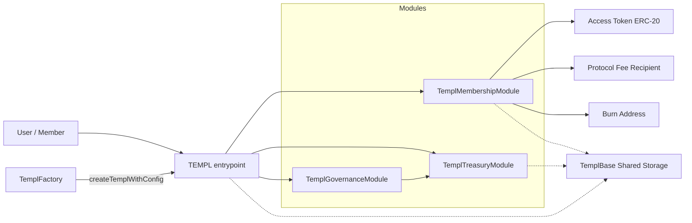
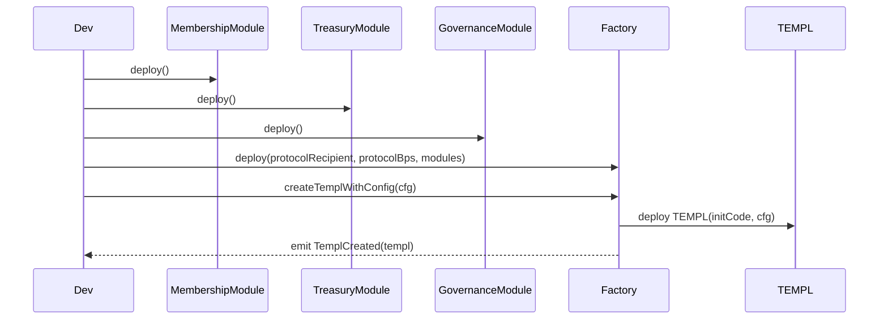
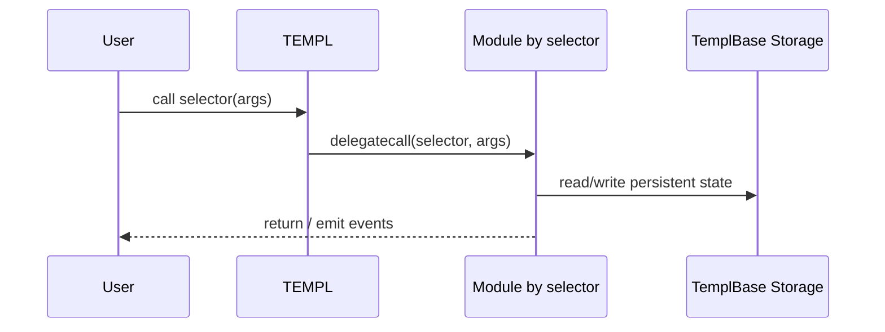
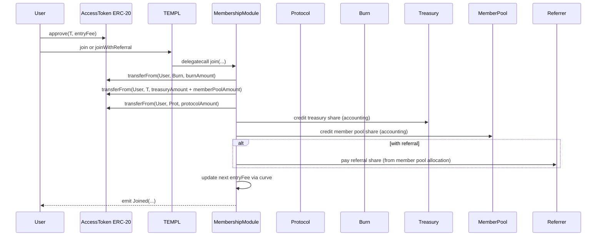
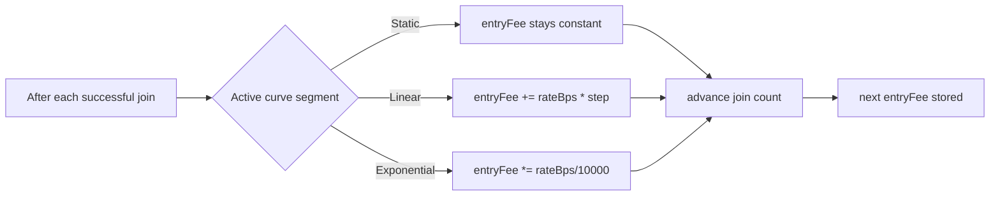
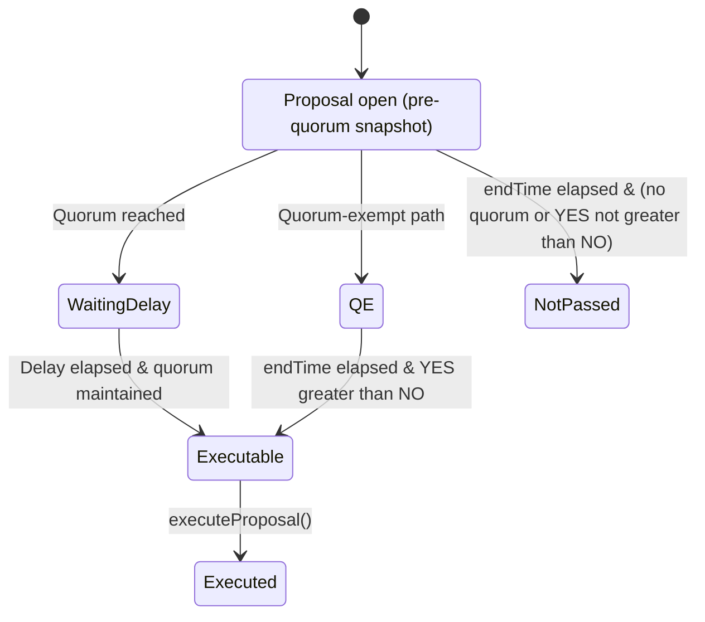
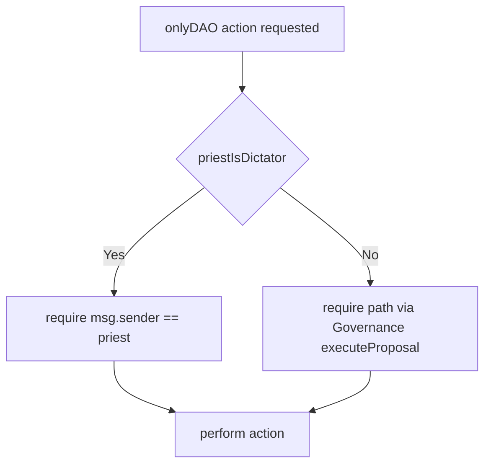
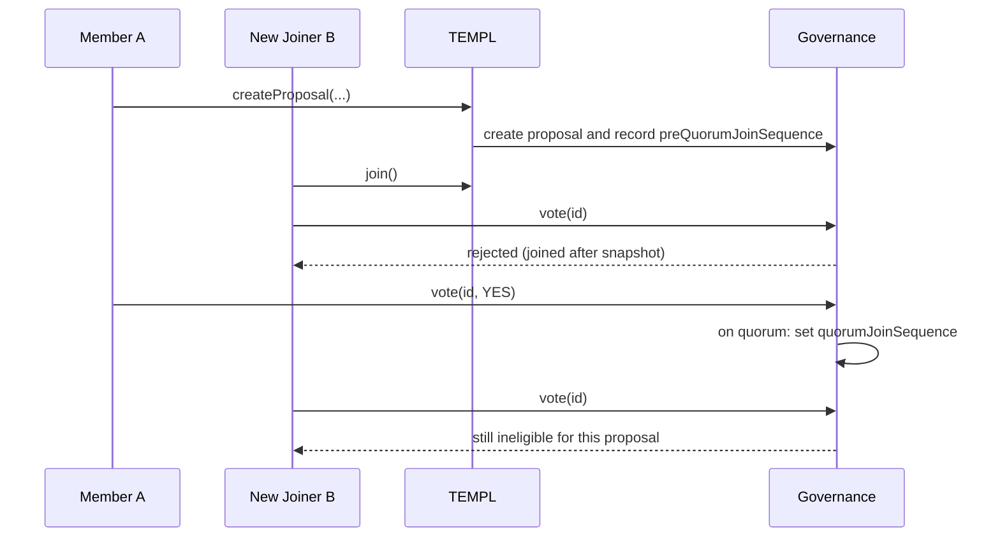

# templ.fun Protocol Overview


## What It Does
- templ.fun lets communities spin up private “templ” groups that collect an access-token treasury, stream rewards to existing members, and govern configuration or payouts on-chain.
- Each templ is composed from three delegatecall modules – membership, treasury, and governance – orchestrated by the root [`TEMPL`](contracts/TEMPL.sol) contract. All persistent state lives in [`TemplBase`](contracts/TemplBase.sol), so modules share storage and act like facets of a single contract.
- Deployers can apply join-fee curves, referral rewards, proposal fees, and an optional dictatorship (priest) override. By default, governance controls all DAO actions and the priest is a regular member.

## Quickstart

- Prereqs: Node >=22, `npm`, Foundry optional.
- Setup: `npm install`
- Test: `npm test` (Hardhat). Coverage: `npx hardhat coverage`.
- Static analysis: `npm run slither` (requires Slither in PATH)

Local deploy (scripts mirror production flow):

```bash
# Deploy shared modules + factory
PROTOCOL_FEE_RECIPIENT=0xYourRecipient \
PROTOCOL_BP=1000 \
npx hardhat run --network localhost scripts/deploy-factory.cjs

# Deploy a templ via the factory
FACTORY_ADDRESS=0xFactoryFromPreviousStep \
TOKEN_ADDRESS=0xAccessToken \
ENTRY_FEE=100000000000000000000 \
TEMPL_NAME="templ.fun OG" \
TEMPL_DESCRIPTION="Genesis collective" \
npx hardhat run --network localhost scripts/deploy-templ.cjs
```

Hardhat console example (ethers v6):

```js
// npx hardhat console --network localhost
const templ = await ethers.getContractAt("TEMPL", "0xYourTempl");
// Approve and join
const token = await ethers.getContractAt("IERC20", (await templ.getConfig())[0]);
await token.approve(templ.target, (await templ.getConfig())[1]);
await templ.join();
// Create + pass a pause proposal
const id = await templ.createProposalSetJoinPaused(true, 7*24*60*60, "Pause joins", "Cooldown");
await templ.vote(id, true);
// Wait delay, then execute
// ...advance time on local chain...
await templ.executeProposal(id);
```

## Conventions

- Units
  - Percentages use basis points out of 10,000 (`BPS_DENOMINATOR = 10_000`).
  - Durations are seconds (e.g., `7*24*60*60` for 7 days).
  - Token amounts are in the token’s smallest units (no decimals on-chain).
- ETH sentinel
  - Use `address(0)` to represent ETH in withdraw/disband/claim flows and external reward APIs.
- Ethers v6
  - Contract address is available at `contract.target` (examples here use this pattern).
- Call routing
  - All public calls go to the deployed `TEMPL` and are delegated to modules by selector; unknown selectors revert with `InvalidCallData`.

## Five-Minute Tour

1) Start a local chain and deploy factory + modules
```bash
npx hardhat node &
PROTOCOL_FEE_RECIPIENT=0x000000000000000000000000000000000000dEaD \
npx hardhat run --network localhost scripts/deploy-factory.cjs
```

2) Create a templ
```bash
FACTORY_ADDRESS=0xFactoryFromPreviousStep \
TOKEN_ADDRESS=0xYourLocalERC20 \
ENTRY_FEE=100000000000000000000 \
TEMPL_NAME="My Templ" \
TEMPL_DESCRIPTION="Docs demo" \
npx hardhat run --network localhost scripts/deploy-templ.cjs
```

3) Join and propose (from Hardhat console)
```js
const templ = await ethers.getContractAt('TEMPL', '0xTempl');
const token = await ethers.getContractAt('IERC20', (await templ.getConfig())[0]);
await token.approve(templ.target, (await templ.getConfig())[1]);
await templ.join();
const id = await templ.createProposalSetJoinPaused(true, 7*24*60*60, 'Pause', 'Cooldown');
await templ.vote(id, true);
// fast-forward time on localhost, then
await templ.executeProposal(id);
```

## Protocol At A Glance

- Components: [`TEMPL`](contracts/TEMPL.sol) entrypoint delegating to [`TemplMembershipModule`](contracts/TemplMembership.sol), [`TemplTreasuryModule`](contracts/TemplTreasury.sol), and [`TemplGovernanceModule`](contracts/TemplGovernance.sol) with shared storage in [`TemplBase`](contracts/TemplBase.sol).
- Token & Join: ERC‑20 `accessToken`; `entryFee` ≥ 10 and divisible by 10; each join updates the next fee via the pricing curve from [`TemplCurve.sol`](contracts/TemplCurve.sol).
- Fee Splits: burn/treasury/member plus protocol must sum to 10_000 bps; defaults (with `protocolBps`=1_000) are 3_000/3_000/3_000/1_000.
- Fees: `proposalCreationFeeBps` and `referralShareBps` configurable via governance.
- Governance: `quorumBps` and `executionDelayAfterQuorum` are governable (defaults: 3_300 bps and 7 days). One vote per member; proposer auto‑casts an initial YES; join‑sequence snapshots enforce eligibility; immediate quorum detection can shorten windows to the post‑quorum delay; dictatorship toggle via priest.
  - Quorum setter accepts either 0–100 (interpreted as %) or 0–10_000 (basis points).
- Limits/Pauses: optional `maxMembers` (factory default 249); auto‑pauses at cap; `joinPaused` toggleable.
- Treasury Ops: withdraw/disband (disband disperses the treasury equally across members), config/split/entry fee/curve updates, metadata, priest changes.
- Factory: [`TemplFactory`](contracts/TemplFactory.sol) with `setPermissionless`, `createTempl`, `createTemplFor`, `createTemplWithConfig`.

### Token Requirements
- Access token must be a vanilla ERC‑20 (no fee‑on‑transfer, no rebasing). Accounting assumes exact transfer amounts. Non‑standard tokens can desync balances and break claims.
- If you need to support non‑standard tokens, consider an adapter token or gateway outside this core protocol.

### Build Settings
- Solidity 0.8.23, via‑IR enabled by default. For production, consider increasing optimizer runs (e.g., 200–500) for lower runtime gas; keep runs=1 for coverage.

### Proposal Views
- `getProposal(id)`: essential metadata + derived pass status
- `getProposalSnapshots(id)`: quorum timing + blocks + eligible counts
- `getProposalJoinSequences(id)`: pre‑quorum and quorum join‑sequence snapshots
- `getActiveProposals()` / `getActiveProposalsPaginated(offset,limit)` → returns `(uint256[] proposalIds, bool hasMore)`
- `getProposalActionData(id)`: returns `(Action action, bytes payload)` where `payload` is ABI‑encoded per action:
  - SetJoinPaused → (bool paused)
  - UpdateConfig → (address token, uint256 newEntryFee, bool updateFeeSplit, uint256 newBurnBps, uint256 newTreasuryBps, uint256 newMemberPoolBps)
  - SetMaxMembers → (uint256 newMaxMembers)
  - SetMetadata → (string name, string description, string logoLink)
  - SetProposalFee → (uint256 newFeeBps)
  - SetReferralShare → (uint256 newReferralShareBps)
  - SetEntryFeeCurve → (CurveConfig curve, uint256 baseEntryFee)
  - CallExternal → (address target, uint256 value, bytes data)
  - WithdrawTreasury → (address token, address recipient, uint256 amount, string reason)
  - DisbandTreasury → (address token)
  - CleanupExternalRewardToken → (address token)
  - ChangePriest → (address newPriest)
  - SetDictatorship → (bool enable)
  - SetQuorumBps → (uint256 newQuorumBps)
  - SetExecutionDelay → (uint256 newDelaySeconds)
  - SetBurnAddress → (address newBurn)

Learn-by-reading map (each claim backed by code/tests):
- Entry fee constraints: enforced in constructors and updates: see [`contracts/TemplFactory.sol`](contracts/TemplFactory.sol), [`contracts/TEMPL.sol`](contracts/TEMPL.sol), [`contracts/TemplGovernance.sol`](contracts/TemplGovernance.sol); tests in `test/TemplFactory.test.js`, `test/UpdateConfigDAO.test.js`.
- Fee split totals: validated in [`contracts/TemplFactory.sol`](contracts/TemplFactory.sol); invariant tests in `test/FeeDistributionInvariant.test.js`.
- Curves: curve math and guards in [`contracts/TemplCurve.sol`](contracts/TemplCurve.sol); tests in `test/EntryFeeCurve.test.js`, `test/TemplHighLoadStress.test.js`.
- Dictatorship and gating: `onlyDAO` gate in [`contracts/TemplBase.sol`](contracts/TemplBase.sol); tests in `test/PriestDictatorship.test.js`.
- Snapshot voting: lifecycle in [`contracts/TemplGovernance.sol`](contracts/TemplGovernance.sol); tests in `test/VotingEligibility.test.js`, `test/SingleProposal.test.js`.
- Governable quorum/delay/burn address: setters + proposals in contracts; tests in `test/GovernanceAdjustParams.test.js`.

### Governance Controls (quick list)
- Pausing joins, membership cap, fee config and curve, metadata, proposal fee, referral share, treasury withdraw/disband/cleanup, priest changes, dictatorship mode, quorum threshold, post‑quorum execution delay, and burn address. All are adjustable via proposals or `onlyDAO` calls.


### Proposal Execution Rules
- Eligibility snapshots:
  - On creation: store `eligibleVoters` (member count) and `preQuorumJoinSequence`.
  - On quorum: record `quorumReachedAt`, `quorumSnapshotBlock`, and freeze `quorumJoinSequence`. Members who joined after the relevant snapshot cannot vote on that proposal.
- Pre‑quorum window:
  - Voting is open until `endTime = createdAt + votingPeriod`.
  - Quorum is reached when `YES * 10_000 >= quorumBps * eligibleVoters` (eligibleVoters is the baseline captured at creation).
- Post‑quorum delay (timelock):
  - When quorum is reached, `endTime` is reset to `block.timestamp + executionDelayAfterQuorum`.
  - Voting remains allowed during this delay window; join eligibility stays frozen by `quorumJoinSequence`.
- Execution checks:
  - Quorum‑exempt proposals (priest‑initiated Disband only): require `(block.timestamp >= endTime)` and `YES > NO`.
  - All other proposals: require quorum was reached, `block.timestamp >= quorumReachedAt + executionDelayAfterQuorum`, `YES > NO`, and quorum still maintained vs. the baseline: `YES * 10_000 >= quorumBps * eligibleVoters`.
  - On success, the proposal executes once and is marked `executed`.
- External rewards: accounting in [`contracts/TemplBase.sol`](contracts/TemplBase.sol); tests in `test/RewardWithdrawals.test.js`, `test/MembershipCoverage.test.js`.

### Governance Behaviors
- Proposal creation auto‑casts a YES vote for the proposer.
- If the immediate YES satisfies quorum relative to the snapshot baseline, the proposal jumps straight into the execution‑delay window and `endTime` is updated accordingly.
- While dictatorship is enabled, only SetDictatorship proposals can be created and voted; other governance interactions revert and `onlyDAO` actions may be called directly by the priest.

### Architecture Overview



Architecture map (see more at [Module Responsibilities](#module-responsibilities))
- `TEMPL` (router): Entry point that routes calls to modules via delegatecall and exposes selector→module lookup.
- Membership: Joins, fee split accounting, member rewards accrual/claims, join snapshots.
- Treasury: DAO/priest actions for withdrawals, disbands, config/split/fee/curve/metadata/priest updates.
- Governance: Proposal create/vote/execute, quorum and delay tracking, dictatorship toggle, external calls.
- TemplBase (shared storage): Single storage layout and helpers used by all modules through delegatecall.
- Priest role: Stored in shared storage and used by onlyDAO gating; see Dictatorship Gate for behavior (#dictatorship-gate-onlydao).

Key terms
- Priest: address set at deploy; auto‑enrolled as a member at `joinSequence=1`. Not privileged unless dictatorship mode is enabled.
- Member pool: portion of each join streamed to existing members pro‑rata.
- Treasury: funds held by the templ and controlled by governance (or by the priest only when dictatorship is enabled).
- Quorum: YES threshold in bps relative to eligible voters before execution delay starts.

What “TemplBase Shared Storage” means
- All persistent state is declared in [`TemplBase`](contracts/TemplBase.sol). Because modules execute via `delegatecall`, they read/write the same storage as `TEMPL`.
- This pattern keeps module code small and composable while behaving like one contract from a state perspective.
- It centralizes helpers (entry‑fee curves, safe token transfers, reward math) and ensures storage layout consistency across modules.
- Standards note: This is a diamond‑style modular architecture (EIP‑2535–inspired) using `delegatecall` and shared storage. It is not a full EIP‑2535 implementation (no `diamondCut`/loupe and modules are wired once in the constructor), and it is not an ERC; it’s a common Solidity composition pattern.

## Deployment Flow & Public Interfaces
The canonical workflow deploys shared modules once, followed by a factory and any number of templ instances. The snippets below assume a Hardhat project (`npx hardhat console` or scripts that import `hardhat`) using ethers v6.

### Deployment Sequence



1. **Deploy the shared modules**
   ```js
   const Membership = await ethers.getContractFactory("TemplMembershipModule");
   const membershipModule = await Membership.deploy();
   await membershipModule.waitForDeployment();

   const Treasury = await ethers.getContractFactory("TemplTreasuryModule");
   const treasuryModule = await Treasury.deploy();
   await treasuryModule.waitForDeployment();

   const Governance = await ethers.getContractFactory("TemplGovernanceModule");
   const governanceModule = await Governance.deploy();
   await governanceModule.waitForDeployment();
   ```
   These modules map directly to [`contracts/TemplMembership.sol`](contracts/TemplMembership.sol), [`contracts/TemplTreasury.sol`](contracts/TemplTreasury.sol), and [`contracts/TemplGovernance.sol`](contracts/TemplGovernance.sol). They are pure logic contracts; all storage lives in [`contracts/TemplBase.sol`](contracts/TemplBase.sol).

2. **Deploy the factory**
   ```js
   const protocolFeeRecipient = "0x..."; // collects protocol share of each join
   const protocolBps = 1_000;            // 10% (expressed in basis points)

   const Factory = await ethers.getContractFactory("TemplFactory");
   const factory = await Factory.deploy(
     protocolFeeRecipient,
     protocolBps,
     await membershipModule.getAddress(),
     await treasuryModule.getAddress(),
     await governanceModule.getAddress()
   );
   await factory.waitForDeployment();
   ```
   Constructor parameters (see [`contracts/TemplFactory.sol`](contracts/TemplFactory.sol)):
   - `protocolFeeRecipient`: receives the protocol’s share of every join.
   - `protocolBps`: splitter share (basis points) kept by the protocol. All templ splits must sum to 10_000, so templ-level burn/treasury/member shares must account for this.
   - Module addresses: delegatecall targets for every templ the factory deploys.

3. **Create a templ instance**
   ```js
   const templTx = await factory.createTemplWithConfig({
     priest: "0xPriest...",                 // auto-enrolled 'priest' address
     token: "0xAccessToken...",             // ERC-20 used for joins / treasury accounting
     entryFee: ethers.parseUnits("100", 18),// base entry fee (must be ≥10 and divisible by 10)
     burnBps: -1,                           // burn share (bps), -1 keeps factory default
     treasuryBps: -1,                       // treasury share (bps), -1 keeps factory default
     memberPoolBps: -1,                     // member pool share (bps), -1 keeps factory default
     quorumBps: 3_300,                      // YES votes required for quorum (basis points)
     executionDelaySeconds: 7 * 24 * 60 * 60,// execution delay after quorum (seconds)
     burnAddress: ethers.ZeroAddress,       // burn destination (defaults to 0x...dEaD)
     priestIsDictator: false,               // true lets the priest bypass governance
     maxMembers: 250,                       // optional membership cap (0 = uncapped)
     curveProvided: true,                   // provide custom curve instead of factory default
     curve: {
       primary: { style: 2, rateBps: 11_000, length: 0 }, // exponential tail (infinite length)
       additionalSegments: []              // optional extra segments (empty keeps single segment)
     },
     name: "MOG MOGGERS",                   // templ metadata surfaced to UIs
     description: "mog or get mogged",      // metadata short description (can be empty)
     logoLink: "https://example.com/logo.png",// metadata image (can be empty)
     proposalFeeBps: 500,                   // 5% of the current entry fee charged per proposal
     referralShareBps: 500                  // 5% of the member-pool allocation paid to referrals
   });
   const receipt = await templTx.wait();
   const templAddress = receipt.logs.find(log => log.eventName === "TemplCreated").args.templ;
   ```

   Key configuration knobs (resolved inside [`TemplFactory`](contracts/TemplFactory.sol) and [`TEMPL`](contracts/TEMPL.sol)):
   - `priest`: auto-enrolled member. When `priestIsDictator` is true, the priest can call `onlyDAO` functions directly until dictatorship is disabled.
   - `token`: ERC-20 used for joins, rewards, and treasury balances.
   - `entryFee`: initial fee (must be ≥10 and divisible by 10). The pricing curve adjusts the next `entryFee` after each successful join.
   - `burnBps/treasuryBps/memberPoolBps`: fee split (basis points) between burn address, templ treasury, and member rewards pool. Must sum with `protocolBps` to 10_000.
   - `quorumBps`: minimum YES threshold (basis points) to satisfy quorum.
   - `executionDelaySeconds`: waiting period after quorum before execution can occur.
   - `burnAddress`: recipient of the burned allocation (default: `0x...dEaD`).
   - `priestIsDictator`: if true, governance functions are priest-only until the dictator disables it.
   - `maxMembers`: optional membership cap that auto-pauses joins when reached.
   - `curveProvided`: set to `true` when supplying a custom `CurveConfig`; otherwise the factory default is applied.
   - `curve`: `CurveConfig` describing how the entry fee evolves. The factory ships an exponential default; additional segments can model piecewise-linear or static phases. See [`contracts/TemplCurve.sol`](contracts/TemplCurve.sol) for enum definitions.
   - `proposalFeeBps`: optional fee (basis points) deducted from the proposer’s wallet and credited to the templ treasury when a proposal is created.
   - `referralShareBps`: portion of the member pool allocation paid to a referrer on each join.

Once the templ is live, all user interactions flow through the deployed [`TEMPL`](contracts/TEMPL.sol) address, which delegates to the module responsible for the invoked selector. The [`TemplFactory`](contracts/TemplFactory.sol) can be toggled to permissionless mode via `setPermissionless` to allow anyone to deploy new templs.

### Hardhat Deployment Scripts
The repository ships end-to-end scripts at the repository root that mirror the sequence above:

- [`scripts/deploy-factory.cjs`](scripts/deploy-factory.cjs) – Deploys the shared modules (if addresses aren’t supplied via env vars) and produces a wired `TemplFactory`.
- [`scripts/deploy-templ.cjs`](scripts/deploy-templ.cjs) – Uses an existing factory (or deploys one with modules) to instantiate a templ and dumps a deployment artifact under `deployments/`.
- [`scripts/verify-templ.cjs`](scripts/verify-templ.cjs) – Utility for reconstructing constructor arguments and verifying a templ instance on chain.

Example commands (environment variables follow the same names used inside each script):

```bash
# Deploy shared modules + factory (examples use Base mainnet; adjust --network as needed)
PROTOCOL_FEE_RECIPIENT=0xYourRecipient \
PROTOCOL_BP=1000 \
npx hardhat run --network base scripts/deploy-factory.cjs

# Deploy a templ via factory (token, priest, fee splits, etc. come from env)
FACTORY_ADDRESS=0xFactoryFromPreviousStep \
TOKEN_ADDRESS=0xAccessToken \
ENTRY_FEE=100000000000000000000 \
TEMPL_NAME="templ.fun OG" \
TEMPL_DESCRIPTION="Genesis collective" \
npx hardhat run --network base scripts/deploy-templ.cjs

# Verify the factory (on Basescan for chain 8453)
npx hardhat verify --network base 0xFactoryFromPreviousStep 0xYourRecipient 1000 0xMembershipModule 0xTreasuryModule 0xGovernanceModule

# Verify a templ (script auto-reconstructs constructor args)
npx hardhat run --network base scripts/verify-templ.cjs --templ 0xYourTempl --factory 0xFactoryFromPreviousStep
```

Refer to the inline env-variable docs in `scripts/deploy-factory.cjs` and `scripts/deploy-templ.cjs` for the latest configuration options and verification helpers.

Factory permissionless mode
```js
// Only the factory deployer can toggle this
const factory = await ethers.getContractAt("TemplFactory", "0xFactory");
await factory.setPermissionless(true); // anyone can create templs now
```

## Script Env Vars
- scripts/deploy-factory.cjs
  - `PROTOCOL_FEE_RECIPIENT` (required)
  - `PROTOCOL_BP` (optional; default 1000)
  - `MEMBERSHIP_MODULE_ADDRESS`, `TREASURY_MODULE_ADDRESS`, `GOVERNANCE_MODULE_ADDRESS` (optional; reuse existing)
  - `FACTORY_ADDRESS` (optional; reuse existing factory; script introspects protocol bps and modules)
- scripts/deploy-templ.cjs
  - `FACTORY_ADDRESS`, `TOKEN_ADDRESS`, `ENTRY_FEE`, `TEMPL_NAME`, `TEMPL_DESCRIPTION`, `LOGO_LINK`
  - Optional: `PRIEST_ADDRESS`, `QUORUM_BPS`, `EXECUTION_DELAY_SECONDS`, `BURN_ADDRESS`, `PRIEST_IS_DICTATOR`, `MAX_MEMBERS`, `PROPOSAL_FEE_BPS`, `REFERRAL_SHARE_BPS`, and curve config (see script for shapes)

## Module Responsibilities

### Delegatecall Routing


- **[TemplMembershipModule](contracts/TemplMembership.sol)**
  - Handles joins (with optional referrals), distributes entry-fee splits, accrues member rewards, and exposes read APIs for membership state and treasury summaries.
  - Maintains join sequencing to enforce governance eligibility snapshots and reports cumulative burns (`getTreasuryInfo` → `burned`).

- **[TemplTreasuryModule](contracts/TemplTreasury.sol)**
  - Provides governance-controlled treasury actions: withdrawals, disbands to member/external pools, priest changes, metadata updates, referral/proposal-fee adjustments, and entry-fee curve updates.
  - Surfaces helper actions such as cleaning empty external reward tokens.

- **[TemplGovernanceModule](contracts/TemplGovernance.sol)**
  - Manages proposal lifecycle (creation, voting, execution), quorum/eligibility tracking, dictatorship toggles, and external call execution with optional ETH value.
  - Exposes proposal metadata, snapshot data, join sequence snapshots, voter state, and active proposal pagination.

- **[TemplFactory](contracts/TemplFactory.sol)**
  - Normalizes deployment config, validates split sums (bps), enforces permissionless toggles, and emits creation metadata (including curve details).
  - Stores `TEMPL` init code across chunks to avoid large constructor bytecode.

These components share [`TemplBase`](contracts/TemplBase.sol), which contains storage, shared helpers (entry-fee curves from [`TemplCurve.sol`](contracts/TemplCurve.sol), reward accounting), and cross-module events.

### Economics & Flows

Joins and fee distribution with optional referral:



Entry fee curve mechanics (see [`contracts/TemplCurve.sol`](contracts/TemplCurve.sol)):



### Quick Reference
- **Testing:** `npx hardhat test` (default), `npx hardhat coverage` for coverage, `npm run slither` for static analysis.
- **Treasury Insights:** `getTreasuryInfo()` returns `(treasuryAvailable, memberPool, protocolFeeRecipient, totalBurned)`.
- **Entry Fee Curves:** configure piecewise segments (`CurveConfig`) in [`TemplCurve.sol`](contracts/TemplCurve.sol) to unlock linear or exponential pricing after a given number of joins.
- **Proposal Fees:** governance updates them via `setProposalCreationFeeBpsDAO` (see [`TemplTreasury.sol`](contracts/TemplTreasury.sol)); the templ contract auto-collects the fee (in the access token) before recording a proposal.

## Typical Flows (Ethers v6)

Join and claim rewards
```js
const [,, alice] = await ethers.getSigners();
const templ = await ethers.getContractAt("TEMPL", "0xTempl");
const token = await ethers.getContractAt("IERC20", (await templ.getConfig())[0]);
const entryFee = (await templ.getConfig())[1];
await token.connect(alice).approve(templ.target, entryFee);
await templ.connect(alice).join();
// Later, claim member rewards
await templ.connect(alice).claimMemberRewards();
```

Create, vote, and execute a proposal
```js
const id = await templ.createProposalWithdrawTreasury(
  token.target, "0xRecipient", ethers.parseUnits("100", 18), "Grants Payout",
  7*24*60*60, "Pay grants", "Transfer funds to grants wallet"
);
await templ.vote(id, true);
// Advance time by the execution delay, then execute
await templ.executeProposal(id);
```

Set referral share and use it
```js
// Enable referrals via governance
const id = await templ.createProposalSetReferralShareBps(1500, 7*24*60*60, "Enable referrals", "15% of member pool");
await templ.vote(id, true);
// ...advance time...
await templ.executeProposal(id);
// New member joins with referral
await token.approve(templ.target, (await templ.getConfig())[1]);
await templ.joinWithReferral("0xReferrer");
```

Distribute external rewards (ERC‑20 or ETH)
```js
// DAO disbands external token to members
const id = await templ.createProposalDisbandTreasury(otherErc20.target, 7*24*60*60, "Distribute rewards", "Airdrop");
await templ.vote(id, true);
// ...advance time...
await templ.executeProposal(id);
// Members claim
await templ.connect(alice).claimExternalReward(otherErc20.target);
```

### Core Interfaces
- Membership (from [`TemplMembershipModule`](contracts/TemplMembership.sol)):
  - Actions: `join()`, `joinWithReferral(address)`, `joinFor(address)`, `joinForWithReferral(address,address)`, `claimMemberRewards()`, `claimExternalReward(address)`.
  - Views: `getClaimableMemberRewards(address)`, `getExternalRewardTokens()`, `getExternalRewardState(address)`, `getClaimableExternalReward(address,address)`, `isMember(address)`, `getJoinDetails(address)`, `getTreasuryInfo()`, `getConfig()`, `getMemberCount()`, `totalJoins()`, `getVoteWeight(address)`.
  - `getConfig()` returns `(accessToken, entryFee, joinPaused, totalJoins, treasuryAvailable, memberPoolBalance, burnBps, treasuryBps, memberPoolBps, protocolBps)`.
- Treasury (from [`TemplTreasuryModule`](contracts/TemplTreasury.sol), callable by DAO via governance or priest during dictatorship):
  - `withdrawTreasuryDAO(address token, address recipient, uint256 amount, string reason)`
  - `disbandTreasuryDAO(address token)`
  - `updateConfigDAO(address tokenOrZero, uint256 newEntryFeeOrZero, bool applySplit, uint256 burnBps, uint256 treasuryBps, uint256 memberPoolBps)`
  - `setMaxMembersDAO(uint256)`, `setJoinPausedDAO(bool)`, `changePriestDAO(address)`, `setDictatorshipDAO(bool)`, `setTemplMetadataDAO(string,string,string)`, `setProposalCreationFeeBpsDAO(uint256)`, `setReferralShareBpsDAO(uint256)`, `setEntryFeeCurveDAO(CurveConfig,uint256)`, `setQuorumBpsDAO(uint256)`, `setExecutionDelayAfterQuorumDAO(uint256)`, `setBurnAddressDAO(address)`
  - DAO-only helper: `cleanupExternalRewardToken(address)` — removes an exhausted external reward token slot once balances are fully settled.
- Governance (from [`TemplGovernanceModule`](contracts/TemplGovernance.sol)):
  - Create proposals: `createProposalSetJoinPaused`, `createProposalUpdateConfig`, `createProposalWithdrawTreasury`, `createProposalDisbandTreasury`, `createProposalCleanupExternalRewardToken`, `createProposalChangePriest`, `createProposalSetDictatorship`, `createProposalSetMaxMembers`, `createProposalUpdateMetadata`, `createProposalSetProposalFeeBps`, `createProposalSetReferralShareBps`, `createProposalSetEntryFeeCurve`, `createProposalCallExternal`, `createProposalSetQuorumBps`, `createProposalSetExecutionDelay`, `createProposalSetBurnAddress`.
  - Vote/execute: `vote(uint256,bool)`, `executeProposal(uint256)`, `pruneInactiveProposals(uint256)`.
  - Views: `getProposal(uint256)`, `getProposalSnapshots(uint256)`, `getProposalJoinSequences(uint256)`, `getActiveProposals()`, `getActiveProposalsPaginated(uint256,uint256)`, `hasVoted(uint256,address)`.

### Root Contract Introspection (from [`TEMPL`](contracts/TEMPL.sol))
- `getModuleForSelector(bytes4)` — returns the module address responsible for a given function selector.
  - Notes: the `fallback` routes only registered selectors; unknown selectors revert (`InvalidCallData`).

## Access Control & Modifiers

- onlyMember
  - Caller must have joined; otherwise `NotMember`.
- onlyDAO
  - When `priestIsDictator == false`, only the contract (via governance execution) may call; otherwise `NotDAO`.
  - When `priestIsDictator == true`, the priest or the contract may call; others revert `PriestOnly`.
- whenNotPaused
  - Protects join flows; reverts with `JoinIntakePaused`.
- notSelf
  - Blocks direct calls from the contract in join flows; reverts `InvalidSender`.
- Proposal creation limits
  - One active proposal per proposer at a time (`ActiveProposalExists` if another is still active). Proposer auto‑casts an initial YES.

### Factory API (from [`TemplFactory`](contracts/TemplFactory.sol))
- `setPermissionless(bool)` — toggles who may call create functions (deployer-only vs anyone).
- `createTempl(address token, uint256 entryFee, string name, string description, string logoLink)` → `address`
- `createTemplFor(address priest, address token, uint256 entryFee, string name, string description, string logoLink, uint256 proposalFeeBps, uint256 referralShareBps)` → `address`
- `createTemplWithConfig(CreateConfig)` → `address`

### Behavior Notes
- Dictatorship mode (`priestIsDictator`) allows the priest to call `onlyDAO` functions directly. Otherwise, all `onlyDAO` actions are executed by governance via `executeProposal`.
- `maxMembers` caps membership. When the cap is reached, `joinPaused` auto-enables; unpausing doesn’t remove the cap.
- External-call proposals can execute arbitrary calls with optional ETH; they should be used cautiously.
- Only priest-initiated disband proposals are quorum‑exempt; this exists to safely unwind inactive templs without bricking governance. Disband distributes the treasury evenly across members (still requires YES greater than NO).

## Events
- Member lifecycle: `MemberJoined`, `MemberRewardsClaimed`, `ReferralRewardPaid`
- Governance: `ProposalCreated`, `VoteCast`, `ProposalExecuted`
- Treasury/config/params: `TreasuryAction`, `TreasuryDisbanded`, `ConfigUpdated`, `JoinPauseUpdated`, `MaxMembersUpdated`, `EntryFeeCurveUpdated`, `PriestChanged`, `TemplMetadataUpdated`, `ProposalCreationFeeUpdated`, `ReferralShareBpsUpdated`, `QuorumBpsUpdated`, `ExecutionDelayAfterQuorumUpdated`, `BurnAddressUpdated`, `DictatorshipModeChanged`
- Rewards: `ExternalRewardClaimed`
- Factory: `TemplCreated`, `PermissionlessModeUpdated`

Notes
- `MemberJoined.joinId` starts at 0 for the first non‑priest joiner and increments per successful join.
- Event field highlights
  - `MemberJoined(payer, member, totalAmount, burnedAmount, treasuryAmount, memberPoolAmount, protocolAmount, timestamp, blockNumber, joinId)`
  - `TreasuryAction(proposalId, token /* address(0) for ETH */, recipient, amount, reason)`
  - `TemplCreated(templ, creator, priest, token, entryFee, burnBps, treasuryBps, memberPoolBps, quorumBps, executionDelaySeconds, burnAddress, priestIsDictator, maxMembers, curveStyles, curveRateBps, curveLengths, name, description, logoLink, proposalFeeBps, referralShareBps)`

## Limits & Constants
- `BPS_DENOMINATOR = 10_000`
- `DEFAULT_QUORUM_BPS = 3_300`, `DEFAULT_EXECUTION_DELAY = 7 days`, `DEFAULT_BURN_ADDRESS = 0x…dEaD`
- `MAX_EXTERNAL_REWARD_TOKENS = 256` — cap on concurrently tracked external reward tokens
- `MAX_ENTRY_FEE = type(uint128).max` — upper safety bound on entry fee
- Reward rounding: per‑member splits use integer division; remainders are carried forward and periodically flushed into cumulative rewards to avoid dust loss (applies to member pool and external rewards).
- Proposal voting window: `DEFAULT_VOTING_PERIOD = 7 days` (`MIN=7 days`, `MAX=30 days`)
- Default factory splits assume `protocolBps = 1_000`: 3_000/3_000/3_000/1_000; customize via `createTemplWithConfig`
 - Factory defaults: `DEFAULT_MAX_MEMBERS = 249`, `DEFAULT_CURVE_EXP_RATE_BPS = 11_000`

Formulas
- Member pool per join: `memberPoolAmount = entryFee * memberPoolBps / 10_000`
- Referral payout: `referralAmount = memberPoolAmount * referralShareBps / 10_000`
- Proposal fee: `proposalFee = entryFee * proposalCreationFeeBps / 10_000` (credited to treasury)
- Treasury split per join: `treasuryAmount = entryFee - burn - memberPool - protocol`

## Curve Math Details
- Segments: `Static`, `Linear(rateBps)`, `Exponential(rateBps)`; `length` is number of paid joins in the segment (`0 = infinite tail`).
- Linear segment across `n` joins scales linearly from the segment’s start amount: `price = base * (1 + rateBps * n / 10_000)`.
- Exponential segment across `n` joins scales multiplicatively: `price = base * (rateBps/10_000)^n`.
- Segment rules: if there are extras, primary must have `length > 0`; all middle extras must have `length > 0`; the final segment must have `length = 0` (unbounded tail).
- The contract keeps `baseEntryFee` and recomputes current `entryFee` from the stored curve and completed paid joins after each join.

Multi‑segment example
```js
// Static for first 100 members, then linear for next 900, then exponential for next 1000,
// then freeze price (static tail as required by the final length=0 rule)
const curve = {
  primary: { style: 0, rateBps: 0,    length: 100 },   // Static
  additionalSegments: [
    { style: 1, rateBps: 10,   length: 900 },          // Linear: +0.10% per join
    { style: 2, rateBps: 10050, length: 1000 },        // Exponential: ~+0.50% per join
    { style: 0, rateBps: 0,    length: 0 }             // Final static tail (required)
  ]
};
// Segment activation points (paid joins = non‑priest joins):
// - Linear starts at join #101, exponential at #1,001, final tail at #2,001
```

Notes
- Exponential segments can model price decreases when `rateBps < 10_000` (e.g., 9_500 = −5% per join). Linear segments are non‑decreasing in this design.

## Core Invariants
- Entry fee must be ≥ 10 and divisible by 10 (constructor and updates enforce).
- Fee splits must sum to 10_000 with protocol share included.
- Token changes are disabled via governance (create a new templ to migrate tokens).
- Dictatorship gate allows priest to call `onlyDAO` actions directly while enabled.
- Membership cap: joins revert upon reaching the cap; unpausing does not lift the cap.
- External rewards capacity capped by `MAX_EXTERNAL_REWARD_TOKENS`.
- Fallback routes only registered selectors; unknown selectors revert.

## Indexing Guide (UIs)
- Persist `ProposalCreated`, then fetch metadata with `getProposal(id)` and `getProposalSnapshots(id)` to drive state.
- Use `getActiveProposals()` for quick lists; `getActiveProposalsPaginated(offset,limit)` for pagination.
- Track `VoteCast` and `ProposalExecuted` for live updates.
- For treasury views, either derive from `getTreasuryInfo()` or track `TreasuryAction`/`TreasuryDisbanded` with access-token balance deltas.
- Use `EntryFeeCurveUpdated` to reflect curve changes without recomputing from storage.

Compatibility
- Node: `>=22` (see `package.json:engines`)
- Solidity: `0.8.23`
- Hardhat: `^2.19.2`, ethers v6

See event definitions in [`contracts/TemplBase.sol`](contracts/TemplBase.sol) and usage across modules; tests assert on these logs throughout `test/*.test.js` (e.g. `test/MembershipCoverage.test.js`, `test/GovernanceCoverage.test.js`).

### Proposal Lifecycle



### Dictatorship Gate (onlyDAO)



### Snapshot-Based Voting Eligibility (example)



## Learn by Example (tests)
- Membership basics: `test/MembershipCoverage.test.js`, `test/MemberPool.test.js`
- Referral rewards: `test/MembershipCoverage.test.js` ("pays referral rewards…" and update via governance)
- Governance flows: `test/SingleProposal.test.js`, `test/GovernanceCoverage.test.js`, `test/ProposalPagination.test.js`
- Dictatorship mode: `test/PriestDictatorship.test.js`
- Treasury actions: `test/TreasuryWithdrawAssets.test.js`, `test/DisbandTreasury.test.js`
- Entry fee curves: `test/EntryFeeCurve.test.js`, `test/TemplHighLoadStress.test.js`
- Security: `test/Reentrancy.test.js`, `test/ProposalFeeReentrancy.test.js`, `test/ExecuteProposalReverts.test.js`
- Invariants and edge cases: `test/FeeDistributionInvariant.test.js`, `test/TEMPL.test.js`

Each section of this README links to the exact contracts that implement the described behavior. The tests above are the fastest way to confirm semantics and see end‑to‑end usage with ethers v6.

## Caveats & Security
- External calls: `createProposalCallExternal` can execute arbitrary calls; frontends should communicate that this can drain funds. Tests cover revert bubbling and failure modes.
- Fee-on-transfer tokens: unsupported. Accounting assumes vanilla ERC‑20 semantics (see comment in [`contracts/TemplMembership.sol`](contracts/TemplMembership.sol)).
- Quorum math: quorum is computed against eligible voters at snapshot; losing quorum post‑snapshot prevents execution.
- Dictatorship: when enabled, `onlyDAO` gates accept calls from the priest or the contract itself. Disabling restores governance‑only.

## FAQ
- Can the access token be changed later?
  - No. Governance rejects token changes (`TokenChangeDisabled`). Deploy a new templ if you need a different token.
- Why must the entry fee be divisible by 10?
  - To avoid rounding issues in fee distributions and keep math predictable on-chain.
- What happens if quorum is never reached?
  - The proposal cannot be executed. Consider priest-initiated disband proposals which are quorum-exempt to safely unwind inactive templs.
- How do referrals work?
  - The referral is paid from the member pool slice of each join, as `memberPoolAmount * referralShareBps / 10_000`, only if the referral is a member and distinct from the new joiner.
- Can I enumerate external reward tokens?
  - Yes: `getExternalRewardTokens()` and `getExternalRewardState(token)`; remove exhausted tokens via `cleanupExternalRewardToken` (DAO-only).

## Troubleshooting (Common Errors)
- `InvalidEntryFee` / `EntryFeeTooSmall`: entry fee must be ≥10 and divisible by 10.
- `InvalidPercentageSplit`: burn/treasury/member plus protocol must sum to 10_000 bps.
- `ActiveProposalExists`: one active proposal per proposer at a time.
- `QuorumNotReached` / `ExecutionDelayActive`: quorum never reached or delay not elapsed.
- `ExternalRewardsNotSettled`: cannot cleanup an external reward token while balances remain.

Error definitions live in [`contracts/TemplErrors.sol`](contracts/TemplErrors.sol) and are exercised across `test/*`.

## Deployments & Verification
- Deployments recorded under `deployments/` by the scripts in `scripts/`.
- Verify via `scripts/verify-templ.cjs` which reconstructs constructor args.

## Contributing & Dev
- Lint/format: follow existing style.
- Tests: `npx hardhat test`; focused files under `test/` mirror module boundaries.
- Coverage: `npx hardhat coverage`
- Static analysis: `npm run slither`
