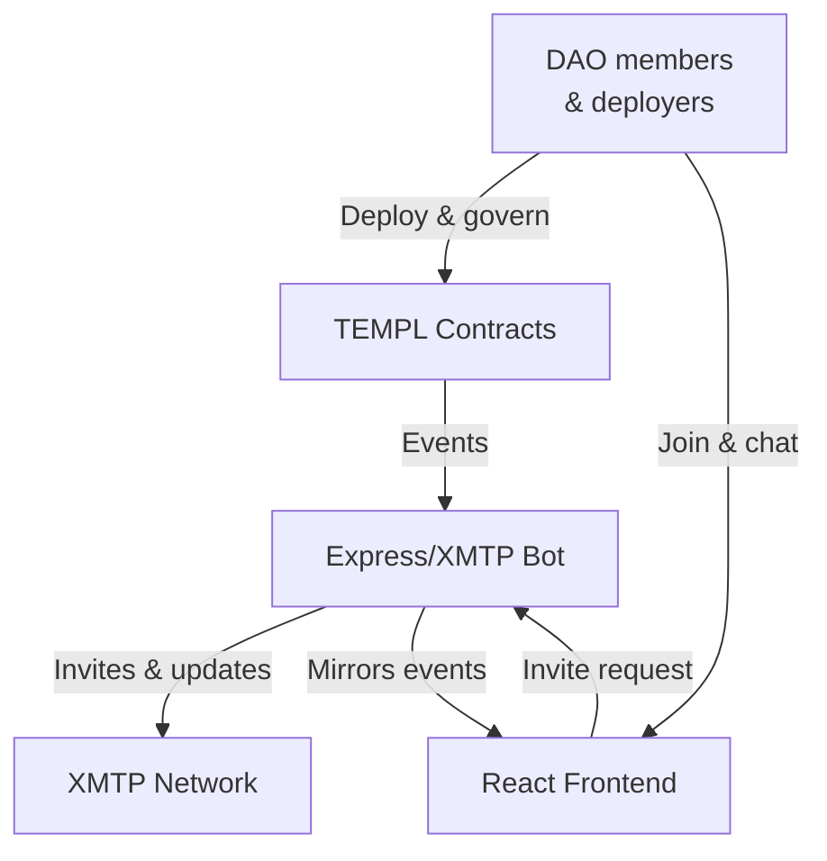
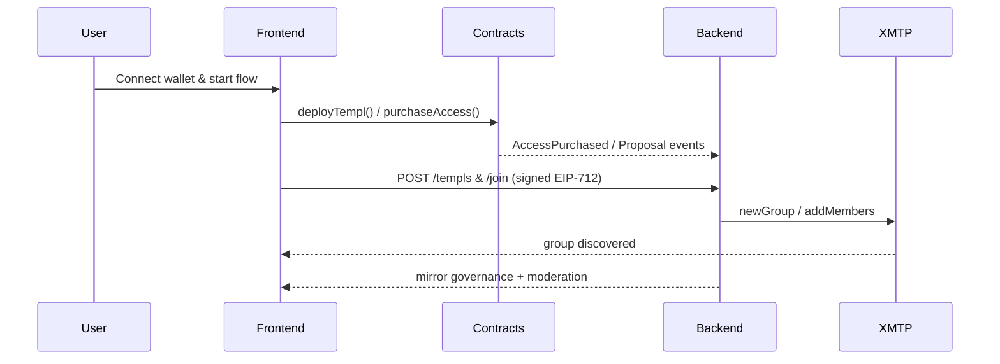
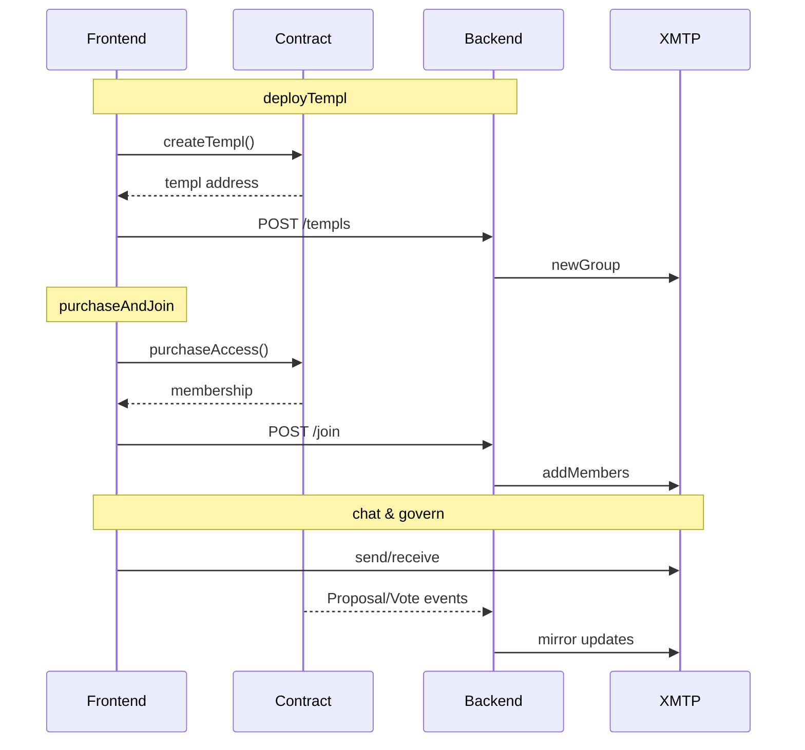

# TEMPL

[](https://dl.circleci.com/status-badge/redirect/gh/MarcoWorms/templ/tree/main)
[](https://codecov.io/github/MarcoWorms/templ)

DAO-governed, token-gated private groups with on-chain treasury management and XMTP messaging. Visit [templ.fun](https://templ.fun) for the public demo.

## System at a Glance
- Smart contracts on Base enforce access with a one-time ERC-20 entry fee and typed governance.
- An Express bot watches the chain, owns the XMTP group, and only invites wallets that purchased access.
- A React client deploys contracts, guides purchases, mirrors proposals, and embeds chat.
- Shared helpers keep EIP-712 signatures, XMTP polling, and test utilities consistent across the stack.



## Read in this Order
1. **[docs/TEMPL_TECH_SPEC.MD](./docs/TEMPL_TECH_SPEC.MD)** — protocol motivation, economic rules, and governance model.
2. **[docs/CORE_FLOW_DOCS.MD](./docs/CORE_FLOW_DOCS.MD)** — diagrams for deploy, join, moderation, voting, and treasury moves.
3. **Implementation deep-dives**
   - [docs/CONTRACTS.md](./docs/CONTRACTS.md) — Solidity modules, invariants, and typed actions.
   - [docs/BACKEND.md](./docs/BACKEND.md) — API surface, env configuration, runbooks.
   - [docs/FRONTEND.md](./docs/FRONTEND.md) — Vite app flows, env flags, testing.
   - [docs/SHARED.md](./docs/SHARED.md) — cross-package signing/XMTP helpers.
4. **Operations & tooling**
   - [docs/PERSISTENCE.md](./docs/PERSISTENCE.md) — storage map (SQLite, XMTP node/browser DBs).
   - [docs/TEST_LOCALLY.md](./docs/TEST_LOCALLY.md) — quick path to run the full stack.
   - [scripts/README.md](./scripts/README.md) — deploy/test scripts you will call repeatedly.

Each doc ends with a pointer to the next item so you can read straight through without context switching.

## Component Overview
- **Contracts** (`contracts/`) — modular TEMPL implementation (`TemplBase`, `TemplMembership`, `TemplTreasury`, `TemplGovernance`, `TEMPL`, `TemplFactory`) plus Hardhat config and tests.
- **Backend** (`backend/`) — Node 22 Express server that creates XMTP groups with an ephemeral key, promotes a persistent invite-bot, and exposes `/templs`, `/join`, and moderation endpoints.
- **Frontend** (`frontend/`) — Vite + React interface for deploying, joining, chatting, and submitting proposals.
- **Shared utilities** (`shared/`) — ESM helpers for signing, XMTP waits, and deterministic tests consumed by all packages.
- **Scripts** (`scripts/`) — deployment, wallet generation, and CI orchestration helpers.

Primary deploy/join flow:



## Getting Started

### Prerequisites
- Node.js `22.18.0`
- `npm ci` in the repo root installs top-level dependencies.
- Run `npm run prepare` once to install Husky hooks.

### Install
```bash
npm ci
npm --prefix backend ci
npm --prefix frontend ci
```

### Test the Monorepo
```bash
npm run test:all
```
This aggregates contract tests, Slither, backend `node --test`, frontend Vitest, and Playwright e2e. Review package docs for individual commands when iterating locally.

### Run the Apps (dev)
```bash
npm --prefix backend start
npm --prefix frontend run dev
```
The backend expects `backend/.env` with `RPC_URL`, `BOT_PRIVATE_KEY`, `ALLOWED_ORIGINS`, and `BACKEND_SERVER_ID`. The frontend reads matching `VITE_*` variables; see component docs for full matrices.

## Repository Layout
- `contracts/` — Hardhat project, Solidity 0.8.23 contracts, tests under `test/`.
- `backend/` — Express service, `src/` for code, `test/` for `node --test`, coverage reports under `coverage/`.
- `frontend/` — Vite app, `src/`, `e2e/` Playwright specs, `dist/` build output.
- `shared/` — shared JS utilities.
- `scripts/` — helper scripts (`deploy.js`, `gen-wallets.js`, `test-all.sh`).
- `deployments/` — network artifacts written by deployment scripts.
- `artifacts/`, `cache/` — Hardhat build outputs.

## Everyday Commands
| Domain | Commands |
| --- | --- |
| Contracts | `npm run compile`, `npm test`, `npm run node`, `npm run deploy:local`, `npm run slither`, `npm run coverage` |
| Backend | `npm --prefix backend start`, `npm --prefix backend test`, `npm --prefix backend run lint`, `npm --prefix backend run coverage` |
| Frontend | `npm --prefix frontend run dev`, `npm --prefix frontend test`, `npm --prefix frontend run lint`, `npm --prefix frontend run build`, `npm --prefix frontend run test:e2e` |
| Shared | `npm --prefix shared test` or run specific files through frontend/backend runners |
| CI mirror | `./scripts/test-all.sh` |

## Configuration & Environment
Essential variables to set early:

| Variable | Location | Purpose |
| --- | --- | --- |
| `RPC_URL` | `backend/.env`, deploy scripts | Provider for on-chain reads/writes |
| `BOT_PRIVATE_KEY` | `backend/.env` | XMTP invite-bot identity (Hardhat key in local dev) |
| `BACKEND_DB_ENC_KEY` | `backend/.env` (prod) | SQLCipher key for XMTP Node DB (32-byte hex) |
| `ALLOWED_ORIGINS` | `backend/.env` | CORS allowlist |
| `BACKEND_SERVER_ID` / `VITE_BACKEND_SERVER_ID` | Backend + frontend env | Shared identifier bound into typed signatures |
| `VITE_XMTP_ENV` / `XMTP_ENV` | Frontend `.env`, backend `.env` | Target XMTP network (`local`, `dev`, `production`) |
| `TEMPL_ENABLE_LOCAL_FALLBACK` | Frontend env/tests | Merge local registry with `/templs` (tests only) |

Each package doc expands on optional flags (`DISABLE_XMTP_WAIT`, `RATE_LIMIT_STORE`, debug toggles). Production setups must align backend and frontend server IDs and provide encryption keys; refer to [docs/BACKEND.md](./docs/BACKEND.md#environment-variables) and [docs/CONTRACTS.md](./docs/CONTRACTS.md#configuration--deployment) for full matrices.

## Deploying to Production
1. Populate `.env` (root) for scripts and `backend/.env` for the bot. Required fields: provider URL, `FACTORY_ADDRESS` (optional), fees, quorum/delay, bot key, server IDs, and `BACKEND_DB_ENC_KEY`.
2. Run `npm run test:all` plus `npm run slither` to satisfy CI requirements.
3. Deploy via `npx hardhat run scripts/deploy.js --network <network>`. Record factory + templ addresses and the XMTP group ID emitted by the backend.
4. Host the backend with `NODE_ENV=production` and `REQUIRE_CONTRACT_VERIFY=1`. Align `ALLOWED_ORIGINS` with your frontend domain.
5. Build and host the frontend (`npm --prefix frontend run build`). Ensure runtime `VITE_*` variables match backend configuration.
6. Keep `DISABLE_XMTP_WAIT`, `VITE_ENABLE_BACKEND_FALLBACK`, and other test toggles disabled in production.

### Production Checklist
- Shared server id (`BACKEND_SERVER_ID` == `VITE_BACKEND_SERVER_ID`).
- Provide `BACKEND_DB_ENC_KEY`; backend refuses to boot without it in production.
- Monitor XMTP install counts (max 10 per inbox; 256 action cap per inbox run).
- Use trusted RPC endpoints; backend assumes honest responses when guarding invites.

## Core Flows
High-level deploy → join → chat sequence (see [docs/CORE_FLOW_DOCS.MD](./docs/CORE_FLOW_DOCS.MD) for expanded diagrams):



## XMTP Essentials
- Set `XMTP_ENV`/`VITE_XMTP_ENV` to `dev`, `production`, or `local`. Playwright defaults to `dev`; set `E2E_XMTP_LOCAL=1` to boot the bundled local node.
- Inbox identities are shared across installations; XMTP dev caps installs at 10 per inbox and ~256 total actions. Rotate wallets or reuse local DBs to stay under caps.
- Node-side XMTP DBs are SQLCipher-encrypted; browsers store OPFS files per origin (not encrypted). Avoid running multiple clients for the same inbox on one page.
- Backend resolves inbox IDs server-side and enforces invite sequencing; client-provided IDs are ignored outside local/test fallbacks.

## Security & Hardening
- **Contracts** — one-member-one-vote governance, typed proposal actions (pause/config/withdraw/disband/change priest), non-reentrant handlers, member pool cannot be withdrawn except via disband. No arbitrary external calls.
- **Backend** — EIP-712 signatures include `{ action, contract, chainId, nonce, issuedAt, expiry, server }`, stored in SQLite for replay protection. Production mode enforces on-chain priest and bytecode checks on `/templs`.
- **Operations** — never enable debug/test flags (`DISABLE_XMTP_WAIT`, `VITE_ENABLE_BACKEND_FALLBACK`, etc.) in production. Protect bot keys and encryption keys; compromise allows unauthorized invites/mutes.

## Operational References
- **E2E environments** — defaults to XMTP dev; set `E2E_XMTP_LOCAL=1` to start `xmtp-local-node`. Details live in [docs/TEST_LOCALLY.md](./docs/TEST_LOCALLY.md).
- **Debug endpoints** — enable with `ENABLE_DEBUG_ENDPOINTS=1`; see [docs/BACKEND.md#debug-endpoints](./docs/BACKEND.md#debug-endpoints) for `/debug/group`, `/debug/conversations`, `/debug/membership`, `/debug/last-join`, `/debug/inbox-state`, `/debug/send`.
- **Troubleshooting** — `npm run test:all` failures often stem from port contention (8545/3001/5173) or XMTP readiness; component docs include runbooks for XMTP outages, bot key rotation, and DB encryption.

## Next Step
Continue with the protocol deep dive in [docs/TEMPL_TECH_SPEC.MD](./docs/TEMPL_TECH_SPEC.MD). Every subsequent doc links forward so you can walk the entire stack without backtracking.
