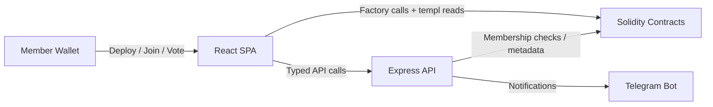

# templ.fun

Templ turns any ERC-20 community into a gated club with on-chain economics, typed governance, and optional Telegram alerts. Holders deploy their own templ, charge an entry fee, and redistribute tributes between burn, treasury, protocol upkeep, and member rewards.

## What you ship

- Self-serve deployments from a factory with configurable fee splits and optional member caps.
- One-member/one-vote governance covering pause/config/withdraw/priest/dictatorship/home-link actions.
- Static frontend (Vite + React) that handles deploy, join, vote, and reward flows.
- Long-lived Express backend that verifies signatures, keeps a templ registry (contract address + optional Telegram chat id), and streams on-chain events.
- Shared signing helpers and Solidity contracts tested through Hardhat, Vitest, and Playwright harnesses.

## System map



More detailed diagrams live in `docs/CORE_FLOW_DOCS.MD`.

## Getting started

```bash
npm ci                      # install root deps
npm --prefix backend ci     # install backend deps
npm --prefix frontend ci    # install frontend deps
npm run compile             # compile contracts
npm --prefix backend test   # backend tests
npm --prefix frontend run dev
```

Run `npm run test:all` before shipping changes; it mirrors the CI matrix. Additional coverage commands live in the package scripts (`npm --prefix backend run coverage`, `npm --prefix frontend run coverage`).

## Documentation

See [docs/README.md](docs/README.md) for complete documentation.

### Learning templ

1. Big-picture spec – [docs/TEMPL_TECH_SPEC.MD](./docs/TEMPL_TECH_SPEC.MD)  
2. Flow diagrams – [docs/CORE_FLOW_DOCS.MD](./docs/CORE_FLOW_DOCS.MD)  
3. Smart contracts – [docs/CONTRACTS.md](./docs/CONTRACTS.md)  
4. Backend API + persistence – [docs/BACKEND.md](docs/BACKEND.md) and [docs/PERSISTENCE.md](./docs/PERSISTENCE.md)  
5. Frontend routes – [docs/FRONTEND.md](./docs/FRONTEND.md)  
6. Local setup → prod rollout – [docs/TEST_LOCALLY.md](./docs/TEST_LOCALLY.md) then [docs/DEPLOYMENT_GUIDE.md](./docs/DEPLOYMENT_GUIDE.md)  

## Modules

- [./contracts/](./contracts/)   – Solidity sources and Hardhat tests.
- [./backend/](./backend/) – Express API, Telegram notifier.
- [./frontend/](./frontend/) – Vite + React app with Vitest + E2E tests.
- [./shared/](./shared/) – Shared utilities (signing helpers, formatting).
- [./scripts/](./scripts/) – Deployment and maintenance scripts.
