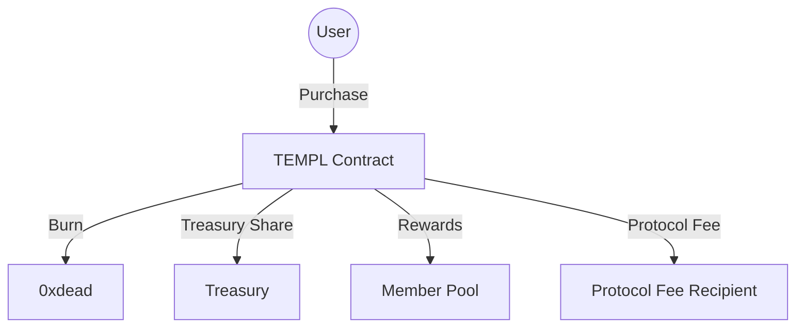
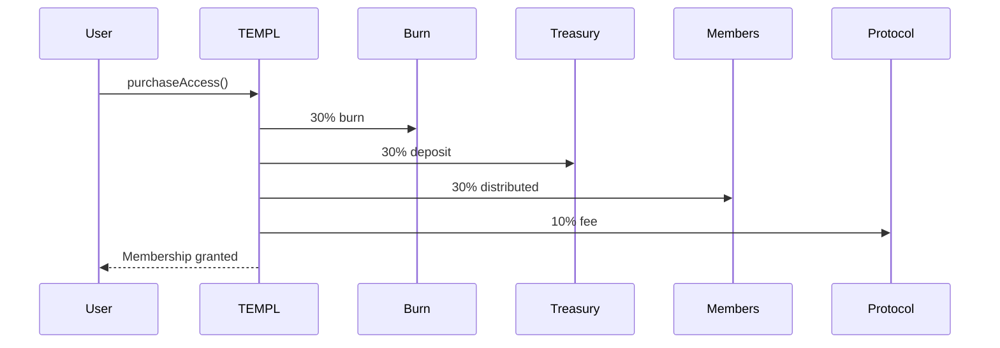
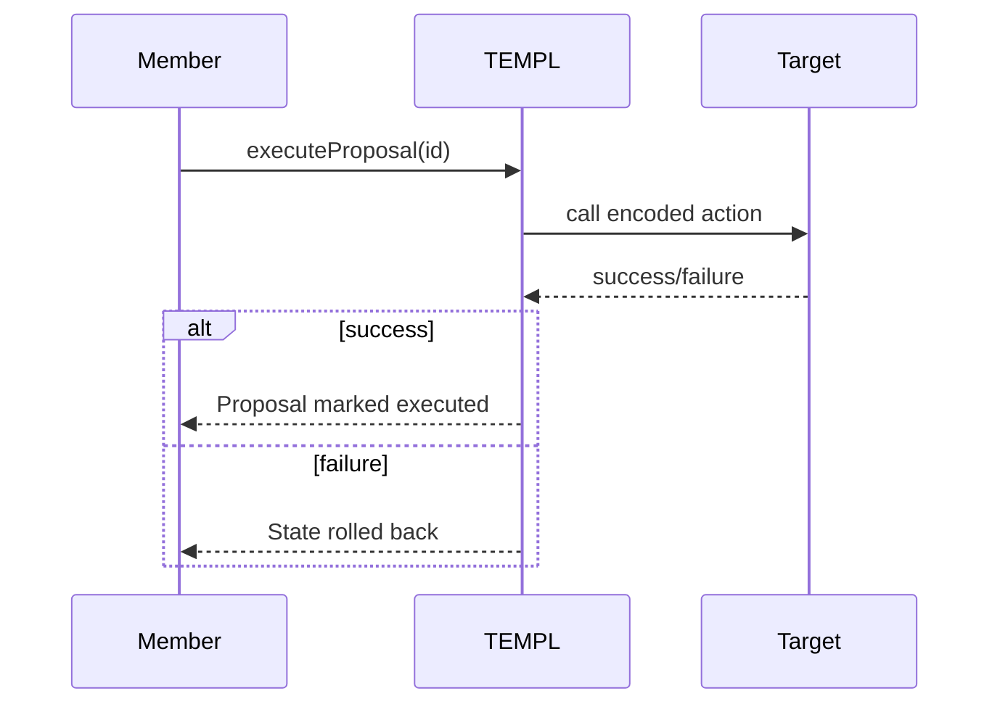
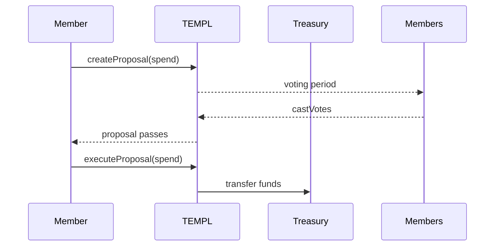

# TEMPL - Token Entry Management Protocol

Open-source contracts for decentralized membership management and automated treasury governance on the BASE blockchain.

[](./LICENSE)

## 💰 Economic Model

### Immutable Fee Distribution
Every membership purchase is atomically split:
- **30% Burn** → Permanent deflation via `0xdead`
- **30% Treasury** → DAO-controlled, proposal-gated
- **30% Member Pool** → Pro-rata to existing members
- **10% Protocol** → Sustainability fee

### Member Rewards Distribution
```
Members | Each Member Receives
--------|--------------------
   1    | 30% of next joiner's fee
   2    | 15% each
   3    | 10% each
   4    | 7.5% each
   n    | 30% / n each
```
*Note: Integer division may leave dust (<members wei)*

## 🏛️ DAO Governance

### Core Principles
- **One Member, One Vote** (with priest weight exception)
- **Proposal Limits**: 1 active per member with auto-cleanup
- **Time-Bounded Voting**: 7-30 day periods (0 defaults to 7 days)
- **Open Execution**: Any address can execute passed proposals
- **Simple Majority**: >50% yes votes to pass
- **Atomic Execution**: All-or-nothing proposal execution with state restore on failure

### Nested Execution Flow
`executeProposal` routes encoded function calls through an internal `_executeCall` helper. When the call targets `executeDAO`,
the helper decodes the parameters and forwards them to the internal `_executeDAO` directly. This allows proposals to perform
nested DAO operations without tripping the `nonReentrant` guard on the external `executeDAO` while still enforcing target and
execution checks. Auditors should review this indirection carefully.

### Anti-Attack Mechanisms

#### Flash Loan Protection
```solidity
require(purchaseTimestamp[voter] < proposal.createdAt)
```
Members must join before proposal creation to vote

#### Spam Prevention  
```solidity
require(!hasActiveProposal[msg.sender])
```
One active proposal per member with auto-cleanup

#### Priest Weight Decay
```solidity
weight = members < threshold ? priestWeight : 1
```
Enhanced early control, automatic decentralization

## 📋 Quick Start

### Prerequisites
- Node.js 18+
- BASE RPC endpoint
- Deployment wallet with ETH

### Installation
```bash
# Clone repository
git clone <repo>
cd templ

# Install dependencies
npm install

# Enable Git hooks
npm run prepare

Commits will now automatically run backend and frontend linters with `--fix` and abort if any lint errors remain.

# Run tests (critical!)
npm test

# Deploy to BASE
npm run deploy
```

### Backend Service
Run the backend bot that owns each XMTP group and verifies membership on-chain:

```bash
# Install backend dependencies
npm --prefix backend install

# Start the service (uses RPC_URL and BOT_PRIVATE_KEY env vars)
npm --prefix backend start
```

## ⚙️ Configuration

### Environment Setup (.env)
```env
# Security Critical (Immutable after deploy!)
PRIEST_ADDRESS=0x...              # Temple creator
PROTOCOL_FEE_RECIPIENT=0x...      # 10% fee recipient
TOKEN_ADDRESS=0x...               # ERC20 token

# Economic Parameters
ENTRY_FEE=100000000000000000      # In wei (min: 10)

# Governance Parameters
PRIEST_VOTE_WEIGHT=10             # Voting multiplier
PRIEST_WEIGHT_THRESHOLD=10        # Decentralization point

# Network
PRIVATE_KEY=0x...                 # Deployer wallet
RPC_URL=https://mainnet.base.org
BASESCAN_API_KEY=...              # For verification
```

⚠️ **All addresses are immutable after deployment!**

## 🔧 Core Functions

### Protected Member Functions
```solidity
purchaseAccess()         // Join (reentrancy protected, pausable)
claimMemberPool()        // Claim rewards safely (reverts if not a member)
createProposal()         // 1 active limit enforced, auto-cleanup & default period
vote()                   // Flash-loan protected
executeProposal()        // Anyone can execute; reverts restore state
```

### DAO-Only Functions (Double Protected)
```solidity
withdrawTreasuryDAO()    // Proposal + reentrancy guard
withdrawAllTreasuryDAO() // Withdraw entire treasury balance (proposal required)
executeDAO()             // Arbitrary calls protected
updateConfigDAO()        // Change parameters (no reentrancy; token change risky)
setPausedDAO()           // Pause new memberships
```

`updateConfigDAO` can change the access token; executing this mid-flight may break accounting. Both `updateConfigDAO` and `setPausedDAO` omit reentrancy guards. Treasury withdrawals derive the proposal ID internally and emit it with the `TreasuryAction` event.

### Gas-Optimized Views
```solidity
getActiveProposalsPaginated()  // Prevents unbounded loops
getClaimablePoolAmount()       // O(n) complexity documented
getVoteWeight()                // Returns weighted power
```

# Threat Model

## System Architecture
- **TEMPL Contract**: Governs memberships, proposals, and treasury.
- **Member Pool**: Distributes portions of entry fees to existing members.
- **Treasury**: Stores DAO funds released through successful proposals.
- **Protocol Fee Recipient**: Receives fixed sustainability fee.



## Trust Assumptions
- Contract code is immutable after deployment.
- External ERC20 token used for entry fees maintains expected behavior.
- Off-chain users and signers act honestly when broadcasting transactions.

## Invariants
- Total supply of memberships is capped by economic cost per entry.
- Proposal execution is atomic; state reverts on failure.
- Treasury transfers only occur through approved proposals.

## Failure Modes
- **Economic**: Entry fee token may depeg or lose liquidity.
- **Governance**: Malicious majority can drain treasury via proposals.
- **Operational**: Network congestion may delay proposal execution.

## Membership Purchase Flow


## Proposal Execution Flow


## Treasury Operation Flow


## 🧪 Testing

### Test Coverage
Run `npm test` to execute the suite and generate coverage information. Results and coverage percentages are printed in the console and reflected in the badge above. The tests exercise core functions, reentrancy scenarios, flash loan attempts, and other boundary cases.

### Run Tests
```bash
# Full test suite
npm test

# Specific categories
npx hardhat test test/TEMPL.test.js              # Core
npx hardhat test test/MemberPool.test.js         # Rewards
npx hardhat test test/ProposalPagination.test.js # Gas optimization
npx hardhat test test/SingleProposal.test.js     # Anti-spam
npx hardhat test test/VotingEligibility.test.js  # Flash loan protection

# With gas reporting
REPORT_GAS=true npm test
```

## 🚀 Deployment

### Pre-Deployment Checklist
- [ ] Verify TOKEN_ADDRESS decimals
- [ ] Calculate ENTRY_FEE with decimals
- [ ] Test priest weight/threshold balance
- [ ] Ensure deployer has gas ETH
- [ ] Double-check addresses (immutable!)
- [ ] Run full test suite

### Deploy Process
```bash
# 1. Compile contracts
npx hardhat compile

# 2. Run tests
npm test

# 3. Deploy to BASE
npx hardhat run scripts/deploy.js --network base

# 4. Save deployment info immediately!
# Contract address and ABI saved to deployments/
```

The deployment script:
1. Shows 5-second mainnet countdown
2. Deploys with all protections
3. Verifies configuration on-chain
4. Auto-verifies on BaseScan
5. Saves artifacts to `deployments/`

## 📄 License

MIT - See [LICENSE](./LICENSE) file
