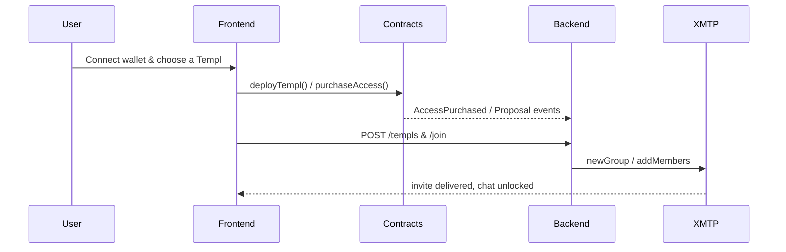

# templ.fun

[](https://dl.circleci.com/status-badge/redirect/gh/MarcoWorms/templ/tree/main)
[](https://codecov.io/github/MarcoWorms/templ)

**Turning coins into cults**

> Templ.fun is the sacred ground where coin holders rally, reward each other, and set their token on a deflationary march upward. We converge the energy of everyone already invested in a token so the price goes up together.

- Smart contracts on Base gate membership, manage treasuries, and enforce typed governance with ERC-20 entry fees.
- An Express backend runs the XMTP invite-bot, mirroring governance events and policing access with EIP-712 signatures.
- A Vite + React client deploys templs, guides purchases, embeds chat, and streams proposal state in real time.
- Shared utilities keep signing, XMTP polling, and test helpers consistent across packages.

## Why Now

Every day more than 100,000 tokens roar into existence. Memecoins already command a $100B+ market and the broader crypto supply floats above $4T. People crave a way to turn passive holding into an active, aligned movement. Templ delivers the rails that upgrade memecoins from jokes into thriving cults with real cash flow.

## How Templ Works

Templ lets anyone launch a pay-to-access chapel (a “Templ”) around any token. Admission requires a one-time tribute in the cult’s chosen token. That flow simultaneously:

- **Increases demand** by recruiting new members who must buy the token to join.
- **Removes supply** by burning a slice of every tribute.

We build the sacred gathering grounds for these cults: on-chain membership, protocol-enforced splits, treasury controls, and XMTP-powered chat.

### The Templ Flywheel

By default each tribute is split the moment a new believer walks through the gates:

| Slice | Percent (10% protocol tithe) | What it signals |
| --- | --- | --- |
| Burn | 30% | Permanent sacrifice to make the token scarcer. |
| Treasury | 30% | Adds to the cult’s war chest - governed on-chain by members. |
| Member rewards | 30% | Redistributed to existing members so they evangelize the Templ. |
| Protocol tithe | 10% | Routes to the templ.fun protocol treasury to power future upgrades. |

<sub>*Factories split the `(100 - protocolPercent)` remainder evenly across burn/treasury/member. When the remainder isn’t divisible by three, the extra 1-2% is assigned deterministically to burn first, then treasury. A 10% protocol share therefore lands on 30/30/30.*</sub>

### Example: PEPE Palace

Spin up a “PEPE Palace” with a 1,000,000 PEPE entry fee (~$10). When a new initiate pays the tribute:

- 300,000 PEPE is sent to the burn address.
- 300,000 PEPE fills the PEPE Palace treasury, ready for member proposals.
- 300,000 PEPE is split across existing members - each recruit enriches the faithful.
- 100,000 PEPE flows to the protocol tithe that keeps templ.fun running and funds future upgrades.

Templs feel like DAOs born *after* a token is liquid. People co-own a narrative, harvest upside, and coordinate spend from day one.

### Why a Fee Gate Instead of Token Gating?

Fees keep bots at bay, demand proof-of-faith (skin in the game), and continuously refill the community treasury. They also let us route the economics to people who are already aligned, instead of letting lurkers loiter behind a token-balance gate.

### Configurable Splits

The founding Priest can choose any split at deploy time – by default we evenly divide the `(100 - protocolPercent)` remainder across burn, treasury, and member rewards (assigning an extra 1-2% to burn first, then treasury when needed). The protocol tithe comes from the factory configuration: whatever percentage and recipient the factory was deployed with is appended to the priest-selected splits so the totals sum to 100. Teams can stand up alternate factories with different protocol percentages, but every templ created through the same factory shares the immutable protocol fee recipient and rate.

### Protocol Tithe (factory-defined)

Every tribute also powers the protocol. The templ factory forwards its configured protocol-share of every entry fee to the templ.fun protocol treasury, funding keeper costs, future rewards programs, and long-term upgrades. The repo’s tooling and examples default to 10%, but the factory owner can pick any percentage when the factory is deployed.

## Infinite Templs

One token can host an entire pantheon of Templs. Maybe PEPE splits into low-cost public plazas and ultra-elite sanctums. Maybe a creator coin spins up VIP circles for superfans. Templ works for memecoins, utility tokens, streamer coins, content coins, card coins, RWAs, xStocks - any community that wants to go from passive bag holding to active coordination.

## Priests, Governance, and Rewards

Whoever launches a Templ becomes its Priest. Priests set the initial economics, steward the vibe, and, like any member, collect rewards when new initiates arrive. Example: if it costs 200,000 tokens to enter and you’re the Priest, the second believer nets you 60,000 tokens, the third sends you 30,000, and so on.

Members propose and vote on treasury moves or config changes directly inside the gathering grounds. Governance is on-chain, proposal actions are typed, and the treasury can only move on sanctioned paths. Tribute remainders accrue and keep rewarding the faithful even as distribution sizes shrink.

## What You Get

- Memecoins upgraded from 1.0 speculation to 2.0 cult coordination with deflationary tokenomics.
- Social clubs that mint revenue, reputation, and rewards - no new token required.
- Templs as schelling points: multiple tiers per token, tailored fees, and unique missions for every faction.
- Shared infrastructure that routes value back to the originating token instead of diluting it with clones.
- A path to turn any tokenized thing into a cashflowing, evangelizing tribe.

## Architecture

Templ is a three-headed beast that keeps the ritual tight:

- **Smart contracts** on Base enforce membership, tribute splits, governance, and treasury safety.
- **Backend bot** (Node 22/Express) watches the chain, owns the XMTP group, and only invites wallets that paid to enter.
- **Frontend** (Vite + React) deploys Templs, guides purchases, mirrors governance, and embeds the chat.
- **Shared utilities** keep signatures, XMTP handling, and tests aligned across packages.



## Developer Quickstart

### Prerequisites

- Node.js `22.18.0`
- Install dependencies once with `npm ci` at the repo root.
- Run `npm run prepare` to install Husky hooks.

### Install Everything

```bash
npm ci
npm --prefix backend ci
npm --prefix frontend ci
```

### Test the Stack

```bash
npm run test:all
```

This includes Hardhat unit tests, Slither, backend `node --test`, Vitest, and Playwright e2e. Drill into each package for focused iteration when needed.

### Run Locally

```bash
npm --prefix backend start
npm --prefix frontend run dev
```

The backend expects `backend/.env` with `RPC_URL`, `BOT_PRIVATE_KEY`, `ALLOWED_ORIGINS`, and `BACKEND_SERVER_ID`. The frontend reads matching `VITE_*` variables; see the deep dives below for full matrices.

## Repository Layout

- `contracts/` - Solidity 0.8.23 contracts, Hardhat config, and tests under `test/`.
- `backend/` - Express service (`src/` + `test/` + `coverage/`) that operates the XMTP cult bot.
- `frontend/` - Vite + React client with `src/`, Vitest specs, and Playwright `e2e/` runs.
- `shared/` - Utilities shared across packages (signing, XMTP helpers, tests).
- `scripts/` - Deployment helpers, wallet generators, CI orchestration.
- `deployments/` - Network artifacts emitted by deployment scripts.

## Everyday Commands

| Domain | Rituals |
| --- | --- |
| Contracts | `npm run compile`, `npm test`, `npm run node`, `npm run deploy:local`, `npm run coverage`, `npm run slither` |
| Backend | `npm --prefix backend start`, `npm --prefix backend test`, `npm --prefix backend run lint`, `npm --prefix backend run coverage` |
| Frontend | `npm --prefix frontend run dev`, `npm --prefix frontend run build`, `npm --prefix frontend run test`, `npm --prefix frontend run coverage`, `npm --prefix frontend run test:e2e` |
| Full stack | `npm run test:all`, `npm run deploy:local`, `npm run coverage:all` |

## Deep Dives & Docs

Read these in order to understand every layer of the cult machinery:

1. **[docs/TEMPL_TECH_SPEC.MD](./docs/TEMPL_TECH_SPEC.MD)** - protocol lore, economic guarantees, and governance rules.
2. **[docs/CORE_FLOW_DOCS.MD](./docs/CORE_FLOW_DOCS.MD)** - diagrams for deploy, join, moderation, voting, and treasury moves.
3. Implementation handbooks:
   - [docs/CONTRACTS.md](./docs/CONTRACTS.md)
   - [docs/BACKEND.md](./docs/BACKEND.md)
   - [docs/FRONTEND.md](./docs/FRONTEND.md)
   - [docs/SHARED.md](./docs/SHARED.md)
4. Operations
   - [docs/PERSISTENCE.md](./docs/PERSISTENCE.md) - storage maps (SQLite, XMTP DBs).
   - [docs/TEST_LOCALLY.md](./docs/TEST_LOCALLY.md) - your field guide for spinning up the full stack.

## Production Launch Notes

- Keep `BACKEND_SERVER_ID` ≙ `VITE_BACKEND_SERVER_ID` and provide `BACKEND_DB_ENC_KEY`; the backend refuses to boot in production without it.
- Deploy with trusted RPC endpoints; invite enforcement assumes honest answers.
- XMTP dev inboxes cap at ~10 installs and ~256 actions - rotate wallets or reuse DBs to stay within limits.
- Leave test toggles (`DISABLE_XMTP_WAIT`, `VITE_ENABLE_BACKEND_FALLBACK`, etc.) off in production so ritual order stays strict.

## Next Steps

Start with [docs/TEMPL_TECH_SPEC.MD](./docs/TEMPL_TECH_SPEC.MD) and walk the docs end-to-end. By the time you return, you’ll know how to launch cults, protect their treasuries, and make templ.fun the schelling point for every token tribe.
