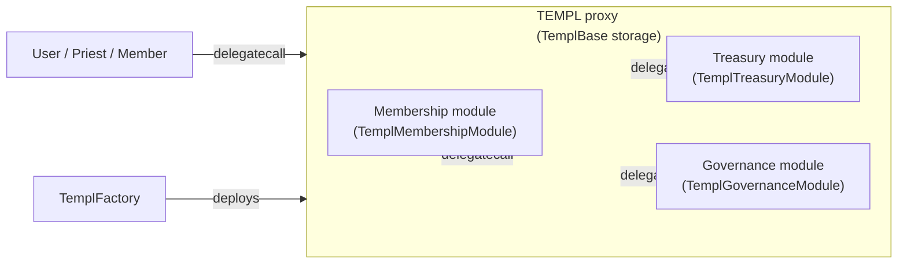
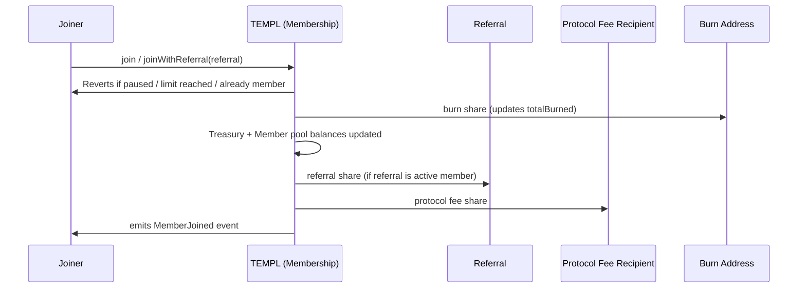
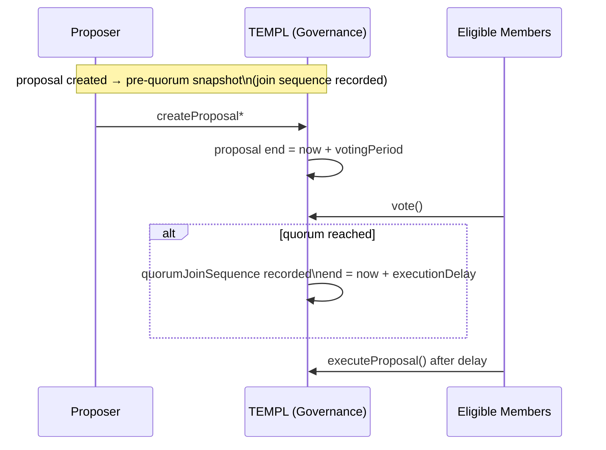

# templ.fun Protocol Overview

## What It Does
- templ.fun lets communities spin up private “templ” groups that collect an access-token treasury, stream rewards to existing members, and govern configuration or payouts on-chain.
- Each templ is composed from three delegatecall modules – membership, treasury, and governance – orchestrated by the root `TEMPL` contract. All persistent state lives in `TemplBase`, so modules share storage and act like facets of a single contract.
- Deployers can apply join-fee curves, referral rewards, proposal fees, and dictatorship (priest) overrides. Governance maintains control after launch by voting on configuration changes or treasury actions.

## Deployment Flow & Public Interfaces
The canonical workflow deploys shared modules once, followed by a factory and any number of templ instances. The snippets below assume a Hardhat project (`npx hardhat console` or scripts that import `hardhat`) using ethers v6.

1. **Deploy the shared modules**
   ```js
   const Membership = await ethers.getContractFactory("TemplMembershipModule");
   const membershipModule = await Membership.deploy();
   await membershipModule.waitForDeployment();

   const Treasury = await ethers.getContractFactory("TemplTreasuryModule");
   const treasuryModule = await Treasury.deploy();
   await treasuryModule.waitForDeployment();

   const Governance = await ethers.getContractFactory("TemplGovernanceModule");
   const governanceModule = await Governance.deploy();
   await governanceModule.waitForDeployment();
   ```
   These modules map directly to [`contracts/TemplMembership.sol`](contracts/TemplMembership.sol), [`contracts/TemplTreasury.sol`](contracts/TemplTreasury.sol), and [`contracts/TemplGovernance.sol`](contracts/TemplGovernance.sol). They are pure logic contracts; all storage lives in `TemplBase`.

2. **Deploy the factory**
   ```js
   const protocolFeeRecipient = "0x..."; // collects protocol share of each join
   const protocolPercentBps = 1_000;     // 10% (expressed in basis points)

   const Factory = await ethers.getContractFactory("TemplFactory");
   const factory = await Factory.deploy(
     protocolFeeRecipient,
     protocolPercentBps,
     await membershipModule.getAddress(),
     await treasuryModule.getAddress(),
     await governanceModule.getAddress()
   );
   await factory.waitForDeployment();
   ```
   Constructor parameters (see [`contracts/TemplFactory.sol`](contracts/TemplFactory.sol)):
   - `protocolFeeRecipient`: receives the protocol’s share of every join.
   - `protocolPercent`: splitter share (basis points) kept by the protocol. All templ splits must sum to 10_000, so templ-level burn/treasury/member percentages must account for this share.
   - Module addresses: delegatecall targets for every templ the factory deploys.

3. **Create a templ instance**
   ```js
   const templTx = await factory.createTemplWithConfig({
     priest: "0xPriest...",                 // initial administrator
     token: "0xAccessToken...",             // ERC-20 gatekeeping membership
     entryFee: ethers.parseUnits("100", 18),
     burnPercent: -1,                       // use factory defaults (expressed with sentinel -1)
     treasuryPercent: -1,
     memberPoolPercent: -1,
     quorumPercent: 3_300,                  // 33% quorum in basis points
     executionDelaySeconds: 7 * 24 * 60 * 60,
     burnAddress: ethers.ZeroAddress,       // defaults to 0x...dEaD
     priestIsDictator: false,               // if true, priest bypasses normal governance
     maxMembers: 249,
     curveProvided: true,
     curve: {
       primary: { style: 2 /* Exponential */, rateBps: 11_000, length: 0 },
       additionalSegments: []
     },
     name: "templ.fun OG",
     description: "Genesis collective",
     logoLink: "https://example.com/logo.png",
     proposalFeeBps: 0,
     referralShareBps: 500                  // 5% of the member pool allocation goes to referrers
   });
   const receipt = await templTx.wait();
   const templAddress = receipt.logs.find(log => log.eventName === "TemplCreated").args.templ;
   ```

   Key configuration knobs (resolved inside `TemplFactory._deploy` and `TEMPL`):
   - `priest`: auto-enrolled member with the ability to toggle dictatorship or act before governance is active.
   - `token`: ERC-20 used for joins, rewards, and treasury balances.
   - `entryFee`: initial fee (must be ≥10 and divisible by 10); the curve determines how it scales.
   - `burn/treasury/member pool percents`: fee split between burn address, templ treasury, and member rewards pool. Accepts either basis points summing with protocol share to 10_000 or raw percents summing with protocol share to 100 (factory normalizes both).
   - `quorumPercent`: minimum YES percentage (basis points) to satisfy quorum. Values ≤100 are automatically scaled to basis points.
   - `executionDelaySeconds`: waiting period after quorum before execution can occur.
   - `burnAddress`: recipient of the burned allocation (default: `0x...dEaD`).
   - `priestIsDictator`: if true, governance functions are priest-only until the dictator disables it.
   - `maxMembers`: optional membership cap that auto-pauses joins when reached.
   - `curve`: `CurveConfig` describing how the entry fee evolves. The factory ships an exponential default; additional segments can model piecewise-linear or static phases. See [`contracts/TemplCurve.sol`](contracts/TemplCurve.sol) for enum definitions.
   - `proposalFeeBps`: optional fee paid in the access token to open proposals (credited to the templ treasury).
   - `referralShareBps`: portion of the member pool allocation paid to a referrer on each join.

Once the templ is live, all user interactions flow through the deployed `TEMPL` address (`contracts/TEMPL.sol`), which delegates to the module responsible for the invoked selector. The `TemplFactory` can be toggled to permissionless mode (see `setPermissionless`) to allow anyone to deploy new templs.

### Hardhat Deployment Scripts
The repository ships end-to-end scripts at the repository root that mirror the sequence above:

- [`scripts/deploy-factory.cjs`](scripts/deploy-factory.cjs) – Deploys the shared modules (if addresses aren’t supplied via env vars) and produces a wired `TemplFactory`.
- [`scripts/deploy-templ.cjs`](scripts/deploy-templ.cjs) – Uses an existing factory (or deploys one with modules) to instantiate a templ and dumps a deployment artifact under `deployments/`.
- [`scripts/verify-templ.cjs`](scripts/verify-templ.cjs) – Utility for reconstructing constructor arguments and verifying a templ instance on chain.

Example commands (environment variables follow the same names used inside each script):

```bash
# Deploy shared modules + factory (examples use Base mainnet; adjust --network as needed)
PROTOCOL_FEE_RECIPIENT=0xYourRecipient \
PROTOCOL_PERCENT=10 \
npx hardhat run --network base scripts/deploy-factory.cjs

# Deploy a templ via factory (token, priest, fee splits, etc. come from env)
FACTORY_ADDRESS=0xFactoryFromPreviousStep \
TOKEN_ADDRESS=0xAccessToken \
ENTRY_FEE=100000000000000000000 \
TEMPL_NAME="templ.fun OG" \
TEMPL_DESCRIPTION="Genesis collective" \
npx hardhat run --network base scripts/deploy-templ.cjs

# Verify the factory (on Basescan for chain 8453)
npx hardhat verify --network base 0xFactoryFromPreviousStep 0xYourRecipient 1000 0xMembershipModule 0xTreasuryModule 0xGovernanceModule

# Verify a templ (script auto-reconstructs constructor args)
npx hardhat run --network base scripts/verify-templ.cjs --templ 0xYourTempl --factory 0xFactoryFromPreviousStep
```

Refer to the inline env-variable docs in `scripts/deploy-factory.cjs` and `scripts/deploy-templ.cjs` for the latest configuration options and verification helpers.

## Module Responsibilities
- **TemplMembershipModule**
  - Handles joins (with optional referrals), distributes entry-fee splits, accrues member rewards, and exposes read APIs for membership state and treasury summaries.
  - Maintains join sequencing to enforce governance eligibility snapshots and reports cumulative burns (`getTreasuryInfo` → `burned`).

- **TemplTreasuryModule**
  - Provides governance-controlled treasury actions: withdrawals, disbands to member/external pools, priest changes, metadata updates, referral/proposal-fee adjustments, and entry-fee curve updates.
  - Surfaces helper actions such as cleaning empty external reward tokens.

- **TemplGovernanceModule**
  - Manages proposal lifecycle (creation, voting, execution), quorum/eligibility tracking, dictatorship toggles, and external call execution with optional ETH value.
  - Exposes proposal metadata, snapshot data, join sequence snapshots, voter state, and active proposal pagination.

- **TemplFactory**
  - Normalizes deployment config, validates percentage splits, enforces permissionless toggles, and emits creation metadata (including curve details).
  - Stores `TEMPL` init code across chunks to avoid large constructor bytecode.

These components share `TemplBase`, which contains storage, shared helpers (entry-fee curves, reward accounting, SafeERC20 transfers), and cross-module events.

### High-Level Architecture


### Join & Referral Flow at a Glance


### Governance Timeline Overview


### Quick Reference
- **Testing:** `npx hardhat test` (default), `npx hardhat coverage` for coverage, `npm run slither` for static analysis.
- **Treasury Insights:** `getTreasuryInfo()` returns `(treasuryAvailable, memberPool, protocolFeeRecipient, totalBurned)`.
- **Entry Fee Curves:** configure piecewise segments (`CurveConfig`) to unlock linear or exponential pricing after a given number of joins.
- **Proposal Fees:** governance updates them via `setProposalCreationFeeBpsDAO`; the templ contract auto-collects the fee (in the access token) before recording a proposal.
