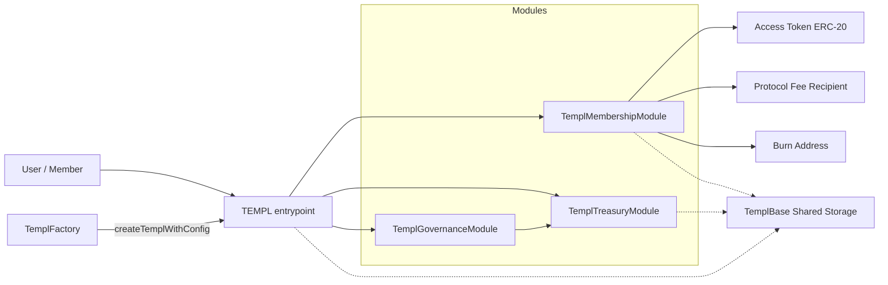
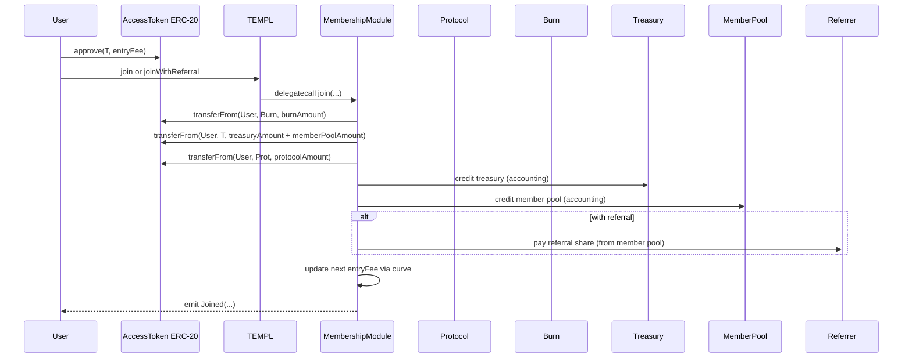

# templ.fun Protocol


Templ lets anyone create on-chain, token‑gated groups (“templs”) that accrue an access‑token treasury, stream rewards to existing members, and govern changes and payouts entirely on-chain.

Quick links: [At a Glance](#protocol-at-a-glance) · [Architecture](#architecture) · [Governance‑Controlled Upgrades](#governance-controlled-upgrades) · [Solidity Patterns](#solidity-patterns) · [Repo Map](#repo-map) · [Glossary](#glossary) · [Lifecycle](#lifecycle) · [Quickstart](#quickstart) · [Deploy](#deploy-locally) · [Safety Model](#safety-model) · [Security](#security) · [Reference](#reference) · [Constraints](#constraints) · [Limits](#limits--defaults) · [Indexing](#indexing-notes) · [Proposal Views](#proposal-views) · [Tests](#tests) · [FAQ](#faq) · [Troubleshooting](#troubleshooting) · [Gotchas](#gotchas)

## Protocol At a Glance
- Create a templ tied to a vanilla ERC‑20 access token; members join by paying an entry fee in that token. The fee is split into burn, treasury, member‑pool, and protocol slices.
- Existing members accrue pro‑rata rewards from the member‑pool slice and can claim at any time. Templs can also hold ETH or ERC‑20s as external rewards.
- Donations (ETH or ERC‑20) sent directly to the templ address are held by the templ and governed: governance can withdraw these funds to recipients, or disband them into claimable external rewards for members. ERC‑721 NFTs can also be custodied by a templ and later moved via governance (see NFT notes below).
- Governance is member‑only: propose, vote, and execute actions to change parameters, move treasury, update curves/metadata, or call arbitrary external contracts.
- Optional dictatorship lets a designated “priest” directly execute DAO‑only actions when enabled; otherwise all such actions flow through governance.
- Pricing curves define how the entry fee evolves with membership growth (static, linear, exponential segments; see `CurveConfig` in `TemplCurve`).
- Everything is modular: `TEMPL` is a router that delegatecalls membership, treasury, and governance modules over a shared storage layout, keeping concerns clean.
- Deploy many templs via `TemplFactory`; run permissionless or with a gated deployer.

Priest bootstrap
- On deploy, the priest is auto‑enrolled as member #1. `joinSequence` starts at 1 and the priest’s `rewardSnapshot` is initialized to the current `cumulativeMemberRewards`.

## Templ Factories

- Base: [`0xc47c3088a0be67a5c29c3649be6e7ca8e8aeb5e3`](https://basescan.org/address/0xc47c3088a0be67a5c29c3649be6e7ca8e8aeb5e3)

## Architecture
At runtime a templ behaves like one contract with clean separation of concerns via delegatecall modules sharing a single storage layout:

- Root router: [`TEMPL`](contracts/TEMPL.sol) (selector → module dispatch, common views)
- Membership: [`TemplMembershipModule`](contracts/TemplMembership.sol)
- Treasury: [`TemplTreasuryModule`](contracts/TemplTreasury.sol)
- Governance: [`TemplGovernanceModule`](contracts/TemplGovernance.sol)
- Shared storage: [`TemplBase`](contracts/TemplBase.sol)

Deployers configure pricing curves, fee splits, referral rewards, proposal fees, quorum/delay, membership caps, and an optional dictatorship (priest) override. The access token is any vanilla ERC‑20 you choose.

## Governance‑Controlled Upgrades

Templ supports governance‑controlled routing updates. There is no protocol admin key and no owner that can change behavior out from under a templ. The only way to change routing is via that templ’s own on‑chain governance. The priest can perform these actions only when dictatorship is explicitly enabled for that templ.

What is fixed vs dynamic
- Dynamic routing table: The authoritative mapping is internal (`_moduleForSelector[bytes4] → address`) and can be changed at runtime.
- Static helper: `getRegisteredSelectors()` returns static, canonical selector sets for the three shipped modules for tooling and quick introspection. It does not change when you update routing. To inspect the live mapping for any selector, call `getModuleForSelector(bytes4)`.

Permissions and safety
- Only by governance (no protocol admin): `setRoutingModuleDAO(address,bytes4[])` is `onlyDAO`. With dictatorship disabled, direct calls from EOAs (including protocol devs) revert; it is only reachable during execution of a passed governance proposal targeting the router. With dictatorship enabled, the priest may call it directly.
- Direct module calls revert: Modules enforce delegatecall‑only access; always call the `TEMPL` router.
- Arbitrary calls are powerful: `createProposalCallExternal` and `batchDAO` execute from the templ address and can move funds or rewire routing. Only governance (or the priest in dictatorship) can execute them. Frontends must surface strong warnings and quorum requirements protect abuse.

Add or replace modules
1) Deploy your module implementation (recommended: inherit `TemplBase` and do not declare new storage variables).
2) Choose the function selectors to route to it.
3) Update routing via governance (or priest in dictatorship mode).

Inspect current routing

```js
// npx hardhat console --network <net>
const templ = await ethers.getContractAt("TEMPL", "0xYourTempl");
const Membership = await ethers.getContractFactory("TemplMembershipModule");
const sel = Membership.interface.getFunction("getMemberCount").selector;
await templ.getModuleForSelector(sel); // → current module address (0x0 if unregistered)
```

Governance: map selectors to a new module (single)

```js
// Prepare routing update (map one selector)
const templ = await ethers.getContractAt("TEMPL", "0xYourTempl");
const NewMod = await ethers.getContractFactory("MockMembershipOverride"); // example
const newModule = await NewMod.deploy();
const setRoutingSel = templ.interface.getFunction("setRoutingModuleDAO").selector;

// bytes4[] with one entry
const Membership = await ethers.getContractFactory("TemplMembershipModule");
const selector = Membership.interface.getFunction("getMemberCount").selector;
const params = ethers.AbiCoder.defaultAbiCoder().encode([
  "address","bytes4[]"
], [await newModule.getAddress(), [selector]]);

// Create proposal to call templ.setRoutingModuleDAO(module, selectors)
const pid = await templ.createProposalCallExternal(
  await templ.getAddress(),
  0,
  setRoutingSel,
  params,
  36 * 60 * 60, // voting period
  "Route getMemberCount to new module",
  "Demonstrate routing upgrade via governance"
);
// vote() and executeProposal(pid) per usual
```

Governance: map a batch of selectors

```js
// Build an array of selectors implemented by your module
const Gov = await ethers.getContractFactory("TemplGovernanceModule");
const selectors = [
  Gov.interface.getFunction("getActiveProposals").selector,
  Gov.interface.getFunction("getActiveProposalsPaginated").selector,
];
const params = ethers.AbiCoder.defaultAbiCoder().encode([
  "address","bytes4[]"
], [await newModule.getAddress(), selectors]);
// Propose via createProposalCallExternal targeting templ.setRoutingModuleDAO as above
```

Dictatorship (priest‑only) path

```js
// When dictatorship is enabled, the priest can call directly
await templ.setRoutingModuleDAO(await newModule.getAddress(), [selector]);
```

Add a brand‑new module
- You are not limited to the three shipped modules. Any new selectors you map will be routed by the fallback and execute via `delegatecall` with the templ’s storage.
- Best practice: implement your module as `contract MyModule is TemplBase { ... }` and avoid declaring new storage variables to prevent slot collisions. If you need bespoke storage, use a dedicated diamond‑storage pattern under a unique slot hash.

Rollbacks and verification
- Rollback: route selectors back to the previous module address using the same flow.
- Verify: call `getModuleForSelector(bytes4)` for each selector you updated to confirm the live mapping.
- Events: `setRoutingModuleDAO` does not emit an event; rely on on‑chain calls and `getModuleForSelector` for introspection.

Security notes
- There is no protocol‑level upgrade authority. Routing and external calls are controlled by each templ’s governance.
- Treat `setRoutingModuleDAO` and `CallExternal` as highly privileged. A malicious routing change can brick functions or drain funds through arbitrary calls. Use conservative quorum and clear UI warnings for proposals that target the router.
- In dictatorship mode, the priest (a templ‑specific address chosen at deploy time or by governance) can perform any `onlyDAO` action (including `batchDAO`). Keep dictatorship disabled for decentralized control.

Storage/layout policy
- Modules share a single storage layout via `TemplBase`. Keep layout compatible across upgrades. For changes to storage‑backed structs after a mainnet launch, preserve slot order or introduce reserved/deprecated fields to avoid state corruption on upgrade.

## How It Works



- `TEMPL` routes calls to modules via delegatecall and exposes selector→module lookup.
- Membership: joins, fee‑split accounting, member reward accrual and claims, eligibility snapshots.
- Treasury: governance/priests withdraw, disband, update config/splits/curve/metadata/referral/proposal fee.
- Governance: create/vote/execute proposals, quorum + delay, dictatorship toggle, safe external calls (single or batched), and opportunistic tail‑pruning of inactive proposals on execution to keep the active index compact.
- Shared storage: all persistent state lives in [`TemplBase`](contracts/TemplBase.sol).

## Solidity Patterns
- Delegatecall router: `TEMPL` fallback maps `selector → module` and uses `delegatecall` to execute in shared storage (contracts/TEMPL.sol).
- Delegatecall‑only modules: Each module stores an immutable `SELF` and reverts when called directly, enforcing router‑only entry (contracts/TemplMembership.sol, contracts/TemplTreasury.sol, contracts/TemplGovernance.sol).
- Only‑DAO guard: `onlyDAO` in `TemplBase` gates actions to either the router itself (when dictatorship is disabled) or the router/priest (when enabled) (contracts/TemplBase.sol).
- Reentrancy guards: User‑facing mutators like joins, claims, proposal creation/execution, and withdrawals use `nonReentrant` (contracts/TemplMembership.sol, contracts/TemplGovernance.sol, contracts/TemplTreasury.sol).
- Snapshotting by join sequence: Proposals capture `preQuorumJoinSequence`; at quorum, a second snapshot anchors eligibility (`quorumJoinSequence`) (contracts/TemplBase.sol, contracts/TemplGovernance.sol).
- Bounded enumeration: External reward tokens capped at 256; active proposals support paginated reads with a 1..100 `limit` (contracts/TemplBase.sol, contracts/TemplGovernance.sol).
- Safe token ops: Uses OpenZeppelin `SafeERC20` for ERC‑20 transfers and explicit ETH forwarding with revert bubbling (contracts/TemplBase.sol, contracts/TemplGovernance.sol).
- Saturating math for curves: Price growth saturates at `MAX_ENTRY_FEE` to avoid overflow during linear/exponential scaling (contracts/TemplBase.sol).
- Governance‑controlled upgrades: `setRoutingModuleDAO(address,bytes4[])` rewires selectors under `onlyDAO` (contracts/TEMPL.sol).

## Key Concepts
- Fee split: burn / treasury / member pool / protocol; must sum to 10_000 bps.
- Member pool: portion of each join streamed to existing members pro‑rata; optional referral share is paid from this slice.
- Curves: entry fee evolves by static/linear/exponential segments; see [`TemplCurve`](contracts/TemplCurve.sol).
- Dictatorship: when enabled, the priest may call `onlyDAO` actions directly with no voting window or timelock. The priest can exercise the full DAO surface, including `batchDAO` for arbitrary external calls executed from the templ address. When dictatorship is disabled, all `onlyDAO` actions execute via governance.
- Snapshots: eligibility is frozen by join sequence at proposal creation, then again at quorum.
- Caps/pauses: optional `maxMembers` (auto‑pauses at cap) plus `joinPaused` toggle.
- Governance access: proposing and voting require membership; the proposer’s vote is counted YES at creation.

### Donations: Address and Custody
- Donation address: Send donations to the templ contract address (the TEMPL/router address). There is no separate “treasury address”. “Treasury” is an accounting bucket inside the templ that tracks how much of the templ’s on-chain balance is available for governance withdrawals versus reserved for member rewards.
- ETH: Send ETH directly to the templ address. ETH is held by the templ and governed. Governance can later withdraw it to recipients or disband it into claimable external rewards.
- ERC‑20: Transfer tokens to the templ address (e.g., `transfer(templAddress, amount)`). Governance can withdraw or disband these balances just like ETH.
- NFTs (ERC‑721): The templ can custody NFTs. It does not implement `IERC721Receiver`, so `safeTransferFrom(..., templAddress, ...)` will revert. Use `transferFrom` to the templ, or have the DAO “pull” the NFT via `transferFrom(owner, templ, tokenId)` after the owner approves the templ. NFTs are governed treasury items and are moved via external‑call proposals.

- Membership note: Donations (including in the access token) do not grant membership. Membership requires calling `join*` and paying the entry fee through the contract, which updates accounting and emits the `MemberJoined` event.

## Glossary
- templ: One deployed instance wired by `TEMPL` with membership, treasury, and governance modules.
- access token: The ERC‑20 used for joins, fees, and accounting. Must be vanilla (no fees/rebases/hooks).
- priest: A designated address with optional dictatorship powers when enabled.
- dictatorship: Mode where the priest may execute DAO‑only actions directly.
- member pool: Accounting bucket that streams join fees to existing members, claimable pro‑rata.
- external rewards: ETH/ERC‑20 balances held by the templ and distributed by proposals or claim logic.
- entry fee curve: Growth schedule for the next join price (see `CurveConfig` in `TemplCurve`).
- quorum bps: Percent of eligible members required to reach quorum.
- pre/post‑quorum window: Voting period before quorum and the anchored window after quorum.
- proposal fee: Fee paid (from the proposer) to create a proposal; a percentage of the current entry fee.
- referral share: Portion of the member‑pool slice paid to a valid referrer on join.

## Lifecycle
1) Deploy modules + factory or use an existing factory (`TemplFactory`).
2) Create a templ providing the access token, base entry fee, fee split, curve, governance params, and metadata (`createTemplWithConfig`).
3) Members join by paying the current entry fee in the access token (optionally with a referrer); fees split to burn/treasury/member‑pool/protocol. The next entry fee advances by the curve.
4) Members propose, vote, and execute: configuration changes, metadata updates, treasury withdrawals/disband, and arbitrary external calls.
5) Members claim accumulated member‑pool rewards and any external rewards credited to members.
6) Templs can evolve via governance—adjusting caps, curves, fees, and parameters—or be wound down by disbanding the treasury.

## Repo Map
- Contracts: [contracts/](contracts/)
- Tools and mocks: [contracts/tools/](contracts/tools/) · [contracts/mocks/](contracts/mocks/) · [contracts/echidna/](contracts/echidna/)
- Scripts: [scripts/](scripts/) ([deploy-factory.cjs](scripts/deploy-factory.cjs), [deploy-templ.cjs](scripts/deploy-templ.cjs), [verify-factory.cjs](scripts/verify-factory.cjs), [verify-templ.cjs](scripts/verify-templ.cjs))
- Tests: [test/](test/)
- Deployments: [deployments/](deployments/)
- Docs template: [docs-templates/contract.hbs](docs-templates/contract.hbs)
- UI integration guide: [UI.md](UI.md)

## Quickstart
- Prereqs: Node >=22, `npm`. Docker recommended for fuzzing.
- Install: `npm install`
- Compile: `npm run compile`
- Test: `npm test` (Hardhat). Coverage: `npm run coverage`.
- Browse NatSpec in [contracts/](contracts/) (each contract documents its API inline).
- Fuzzing (Echidna): `npm run test:fuzz` (via Docker; harness in `contracts/echidna/EchidnaTemplHarness.sol`).
- Static analysis: `npm run slither` (requires Slither in PATH).
- Lint: `npm run lint` (Prettier + Solhint; CI fails on formatting drift or any Solhint warning). Auto-fix: `npm run lint:fix`.
- Format: `npm run format` (applies Prettier with `prettier-plugin-solidity` to `contracts/**/*.sol`).

## Deploy Locally

```bash
# Deploy shared modules + factory
PROTOCOL_FEE_RECIPIENT=0xYourRecipient \
PROTOCOL_BPS=1000 \
npm run deploy:factory:local

# Deploy a templ via the factory
FACTORY_ADDRESS=0xFactoryFromPreviousStep \
TOKEN_ADDRESS=0xAccessToken \
ENTRY_FEE=100000000000000000000 \
TEMPL_NAME="templ.fun OG" \
TEMPL_DESCRIPTION="Genesis collective" \
npm run deploy:local
```

Safe deploy (vanilla token probe):

```bash
# 1) Approve the factory to pull the probe amount (100,000 units)
#    from the account that will call safeDeployFor
#    Example using ethers in Hardhat console:
#      const token = await ethers.getContractAt("IERC20", TOKEN_ADDRESS)
#      await token.approve(FACTORY_ADDRESS, 100000)

# 2) Call safeDeployFor to atomically probe + deploy
#    (reverts with NonVanillaToken when the access token taxes/rebases/hooks transfers)
// npx hardhat console --network localhost
const factory = await ethers.getContractAt("TemplFactory", FACTORY_ADDRESS);
await factory.safeDeployFor(
  "0xPriest",
  TOKEN_ADDRESS,
  ENTRY_FEE,
  TEMPL_NAME,
  TEMPL_DESCRIPTION,
  "https://example.com/logo.png",
  0, // proposal fee bps
  0  // referral share bps
);
```

Verify on Base (optional):

```bash
# Factory + Modules (reads constructor args and module addresses from chain)
BASESCAN_API_KEY=your_key FACTORY_ADDRESS=0xYourFactory \
npm run verify:factory -- --network base

# TEMPL + Modules (reconstructs constructor args from chain + factory logs)
BASESCAN_API_KEY=your_key TEMPL_ADDRESS=0xYourTempl \
npm run verify:templ -- --network base

# Manual (explicit verify commands)
npx hardhat verify --contract contracts/TemplMembership.sol:TemplMembershipModule --network base 0xMembership
npx hardhat verify --contract contracts/TemplTreasury.sol:TemplTreasuryModule --network base 0xTreasury
npx hardhat verify --contract contracts/TemplGovernance.sol:TemplGovernanceModule --network base 0xGovernance
npx hardhat verify --contract contracts/TemplFactory.sol:TemplFactory --network base 0xFactory 0xFactoryDeployer 0xProtocolRecipient 1000 0xMembership 0xTreasury 0xGovernance
```

Hardhat console (ethers v6) quick taste:

```js
// npx hardhat console --network localhost
const templ = await ethers.getContractAt("TEMPL", "0xYourTempl");
const token = await ethers.getContractAt("IERC20", (await templ.getConfig())[0]);
// Approve a bounded buffer (~2× entryFee) to absorb join races and cover first proposal fee
const entryFee = (await templ.getConfig())[1];
await token.approve(templ.target, entryFee * 2n);
await templ.join();
const id = await templ.createProposalSetJoinPaused(true, 36*60*60, "Pause joins", "Cooldown");
await templ.vote(id, true);
// ...advance time...
await templ.executeProposal(id);

```

### Batched External Calls (approve → stake)
Use the built‑in `batchDAO(address[],uint256[],bytes[])` to execute multiple calls atomically from the templ address in a single proposal. For a simple staking target used in examples/tests, see [contracts/mocks/MockStaking.sol](contracts/mocks/MockStaking.sol).

```js
// npx hardhat console --network localhost
const templ = await ethers.getContractAt("TEMPL", "0xYourTempl");
const token = await ethers.getContractAt("IERC20", (await templ.getConfig())[0]);

// 1) Prepare inner calls: approve -> stake
const staking = await ethers.getContractAt("MockStaking", "0xStaking");
const approveSel = token.interface.getFunction("approve").selector;
const approveArgs = ethers.AbiCoder.defaultAbiCoder().encode(
  ["address","uint256"],
  [await staking.getAddress(), ethers.parseUnits("100", 18)]
);
const approveData = ethers.concat([approveSel, approveArgs]);

const stakeSel = staking.interface.getFunction("stake").selector;
const stakeArgs = ethers.AbiCoder.defaultAbiCoder().encode(
  ["address","uint256"],
  [await token.getAddress(), ethers.parseUnits("100", 18)]
);
const stakeData = ethers.concat([stakeSel, stakeArgs]);

// 2) Encode templ.batchDAO(targets, values, calldatas)
const targets = [await token.getAddress(), await staking.getAddress()];
const values = [0, 0];
const calldatas = [approveData, stakeData];

// Use the Treasury module ABI to get the batch selector
const Treasury = await ethers.getContractFactory("TemplTreasuryModule");
const batchSel = Treasury.interface.getFunction("batchDAO").selector;
const batchParams = ethers.AbiCoder.defaultAbiCoder().encode(
  ["address[]","uint256[]","bytes[]"],
  [targets, values, calldatas]
);

// 3) Propose the external call (templ -> templ.batchDAO)
const votingPeriod = 36 * 60 * 60;
const pid = await templ.createProposalCallExternal(
  await templ.getAddress(),
  0, // no ETH forwarded in this example
  batchSel,
  batchParams,
  votingPeriod,
  "Approve and stake",
  "Approve token then stake in a single atomic batch (sender = templ)"
);

// 4) Vote and execute after quorum + delay
await templ.vote(pid, true);
// ...advance time to satisfy post‑quorum voting period...
await templ.executeProposal(pid);
```

Notes
- Calls execute from the templ address. Any approvals and transfers affect the templ’s allowances and balances.
- To forward ETH in the batch, set `values` per inner call and set the top‑level `value` in `createProposalCallExternal` to at least `sum(values)` (or ensure the templ holds enough ETH to cover the forwarded values).
- If any inner call reverts, the entire batch reverts; no partial effects.
- Proposing and voting require membership; ensure the caller has joined.

### Batched External Calls (approve → deploy vesting)
This example shows how to batch an ERC‑20 `approve` with a downstream call to a vesting/stream factory, executing both from the templ via `batchDAO`.

```js
// npx hardhat console --network localhost
const templ = await ethers.getContractAt("TEMPL", "0xYourTempl");
const token = await ethers.getContractAt("IERC20", (await templ.getConfig())[0]);

// 1) Build inner calls
const factory = await ethers.getContractAt("IERC165", "0xcf61782465Ff973638143d6492B51A85986aB347");
const amount = ethers.parseUnits("1000", 18);
const recipient = "0xRecipient";
const vestingDuration = 60n * 60n * 24n * 365n; // 1 year

// approve(token -> factory, amount)
const approveSel = token.interface.getFunction("approve").selector;
const approveArgs = ethers.AbiCoder.defaultAbiCoder().encode(["address","uint256"],[await factory.getAddress(), amount]);
const approveData = ethers.concat([approveSel, approveArgs]);

// deploy_vesting_contract(token, recipient, amount, vesting_duration)
const deploySel = "0x0551ebac"; // function selector
const deployArgs = ethers.AbiCoder.defaultAbiCoder().encode([
  "address","address","uint256","uint256"
],[await token.getAddress(), recipient, amount, vestingDuration]);
const deployData = ethers.concat([deploySel, deployArgs]);

// 2) Wrap both in templ.batchDAO
const targets = [await token.getAddress(), await factory.getAddress()];
const values = [0, 0];
const calldatas = [approveData, deployData];

const Treasury = await ethers.getContractFactory("TemplTreasuryModule");
const batchSel = Treasury.interface.getFunction("batchDAO").selector;
const batchParams = ethers.AbiCoder.defaultAbiCoder().encode([
  "address[]","uint256[]","bytes[]"
],[targets, values, calldatas]);

// 3) Create the external-call proposal
const pid = await templ.createProposalCallExternal(
  await templ.getAddress(),
  0,
  batchSel,
  batchParams,
  36 * 60 * 60,
  "Approve + Deploy Vesting",
  "Approve access token then call deploy_vesting_contract"
);
```

Notes
- Calls execute from the templ address. Approvals and transfers affect the templ’s allowance/balance. This is the canonical way to interact with other protocols while keeping custody in the templ.
- Keep `value=0` unless the target expects ETH.
 
### NFTs and Arbitrary Assets
- Custody: A templ can hold ERC‑721 NFTs. They are governed treasury assets (not streamed as member rewards). Governance can transfer them using `createProposalCallExternal` or `batchDAO`, e.g., calling `safeTransferFrom(address(this), to, tokenId)` on the NFT contract from the templ address.
- Receiving ERC‑721: The templ does not implement `IERC721Receiver`. Sending with `safeTransferFrom` to the templ will revert. Use `transferFrom` to the templ, or have governance “pull” the NFT by calling `transferFrom(owner, templ, tokenId)` after the owner grants approval to the templ.
- ERC‑1155: The templ does not implement `IERC1155Receiver`, so `safeTransferFrom` will revert. If you need ERC‑1155 custody, route through a vault that implements the receiver interface and control it via external calls.
- Distribution: NFTs are not part of the templ’s reward streaming. Treat them as governed treasury items and move or sell them via proposals.
```



Curves (see [`TemplCurve`](contracts/TemplCurve.sol)) support static, linear, and exponential segments. A final segment with `length=0` creates an infinite tail.

## Scripts & Env Vars
- Scripts: `deploy:factory`, `deploy:factory:local`, `deploy:local`, `coverage`, `slither`, `verify:templ`, `verify:factory`.
- [scripts/deploy-factory.cjs](scripts/deploy-factory.cjs):
  - Required: `PROTOCOL_FEE_RECIPIENT`
  - Optional: `PROTOCOL_BPS`, `FACTORY_ADDRESS` (reuse), `FACTORY_DEPLOYER` (defaults to signer address)
  - Deploys modules if not provided via env and wires them into the factory constructor.
- [scripts/deploy-templ.cjs](scripts/deploy-templ.cjs): key envs are `FACTORY_ADDRESS` (or omit to auto‑deploy modules + factory locally), `TOKEN_ADDRESS`, `ENTRY_FEE`, plus optional metadata (`TEMPL_NAME`, `TEMPL_DESCRIPTION`, `TEMPL_LOGO_LINK`). Many toggles are supported (priest, quorum/post‑quorum voting periods, caps, fee splits, referral share, curve). Optional: `POST_QUORUM_VOTING_PERIOD_SECONDS`.
- Verify helpers (see [scripts/verify-templ.cjs](scripts/verify-templ.cjs), [scripts/verify-factory.cjs](scripts/verify-factory.cjs)):
  - `verify:templ` verifies a TEMPL instance, reconstructing constructor args from chain data. Provide `TEMPL_ADDRESS` or `--templ 0x...` and run with a configured Hardhat network.
  - `verify:factory` verifies a TemplFactory deployment using on‑chain getters. Provide `FACTORY_ADDRESS` or `--factory 0x...`.
- Permissioning:
  - `TemplFactory.setPermissionless(true)` allows anyone to create templs.
  - `TemplFactory.transferDeployer(newAddr)` hands off deployer rights when permissionless is disabled.

## Constraints
- Entry fee: must be ≥10 and divisible by 10.
- Fee split: burn + treasury + member pool + protocol must sum to 10_000 bps.
- Pre‑quorum voting window: bounded to [36 hours, 30 days].
- Pagination: `getActiveProposalsPaginated` requires `1 ≤ limit ≤ 100`.

## Limits & Defaults
- `BPS_DENOMINATOR = 10_000`.
- Defaults via [`TemplDefaults`](contracts/TemplDefaults.sol): quorum bps, post‑quorum voting period, burn address.
- `MAX_EXTERNAL_REWARD_TOKENS = 256` (UI enumeration bound).
- `MAX_ENTRY_FEE = type(uint128).max` (entry fee safety guard).
- `MAX_CURVE_SEGMENTS = 8` (primary + additional; prevents curve OOG griefing).
- Proposal metadata caps: title ≤256 bytes; description ≤2048 bytes.
- Templ metadata caps: name ≤256 bytes; description ≤2048 bytes; logo URI ≤2048 bytes.
- Pre‑quorum voting window: default 36 hours (min 36h, max 30 days); view `preQuorumVotingPeriod`; adjust via `setPreQuorumVotingPeriodDAO`.
- Factory defaults (when not explicitly provided):
  - Fee split: burn 3_000 bps, treasury 3_000 bps, member pool 3_000 bps (plus protocol bps from factory).
  - Membership cap: 249.
  - Curve: exponential primary segment at 10_094 bps for 248 paid joins, then static tail (price holds if cap expands).
  - Proposal fee: 2_500 bps (25% of current entry fee); Referral share: 2_500 bps (25% of member‑pool slice).

## Indexing Notes
- Track `ProposalCreated` then hydrate with `getProposal` + `getProposalSnapshots`.
- Use `getActiveProposals()` for lists; `getActiveProposalsPaginated(offset,limit)` for pagination.
- Treasury views: `getTreasuryInfo()` and/or `TreasuryAction`/`TreasuryDisbanded` deltas.
- Curves: consume `EntryFeeCurveUpdated` for UI refresh.

## Proposal Views
- For any proposal id, `TEMPL.getProposalActionData(id)` returns `(Action action, bytes payload)`. Decode `payload` using the shapes below:
- SetJoinPaused → `abi.encode(bool joinPaused)`
- UpdateConfig → `abi.encode(uint256 newEntryFee, bool updateFeeSplit, uint256 newBurnBps, uint256 newTreasuryBps, uint256 newMemberPoolBps)`
- SetMaxMembers → `abi.encode(uint256 newMaxMembers)`
- SetMetadata → `abi.encode(string name, string description, string logoLink)`
- SetProposalFee → `abi.encode(uint256 newProposalCreationFeeBps)`
- SetReferralShare → `abi.encode(uint256 newReferralShareBps)`
- SetEntryFeeCurve → `abi.encode(CurveConfig curve, uint256 baseEntryFee)`
- CallExternal → `abi.encode(address target, uint256 value, bytes calldata)`
- WithdrawTreasury → `abi.encode(address token, address recipient, uint256 amount)`
- DisbandTreasury → `abi.encode(address token)`
- CleanupExternalRewardToken → `abi.encode(address token)`
- ChangePriest → `abi.encode(address newPriest)`
- SetDictatorship → `abi.encode(bool enabled)`
- SetQuorumBps → `abi.encode(uint256 newQuorumBps)`
- SetPostQuorumVotingPeriod → `abi.encode(uint256 newPostQuorumVotingPeriod)`
- SetBurnAddress → `abi.encode(address newBurnAddress)`

## Safety Model
- Vanilla ERC‑20 only: the access token must not tax, rebase, or hook transfers; accounting assumes exact in/out.
- Factory enforcement option: use `safeDeployFor` to probe vanilla semantics before deploying.
- Router‑only entry: modules can only be reached via `TEMPL` delegatecalls; direct module calls revert by design.
- Reentrancy containment and snapshotting of eligibility at creation/quorum.
- Anchored execution window post‑quorum; strict fee invariants; bounded enumeration.
- External call proposals are powerful; treat like timelocked admin calls.
- Dictatorship mode is explicit and governed.

See tests by topic in [test/](test/).

## Security
- Access token must be vanilla ERC‑20 (no fee‑on‑transfer, no rebasing, no hooks). Accounting assumes exact transfer amounts.
- External‑call proposals can execute arbitrary logic; treat with the same caution as timelocked admin calls.
- Reentrancy is guarded; modules are only reachable via the `TEMPL` router (direct module calls revert).
- No external audit yet. Treat as experimental and keep treasury exposure conservative until audited.

## Troubleshooting
- `InvalidEntryFee` / `EntryFeeTooSmall`: fee must be ≥10 and divisible by 10.
- `InvalidPercentageSplit`: burn + treasury + member + protocol must sum to 10_000 bps.
- `ActiveProposalExists`: one active proposal per proposer.
- `QuorumNotReached` / `ExecutionDelayActive`: execution preconditions not satisfied.
- Direct module call guard: only call through `TEMPL` (see tests below).

## FAQ
- Can the access token change later? No — deploy a new templ.
- Why divisible by 10? It is an on‑chain invariant enforced by `_validateEntryFeeAmount`; updates that don’t meet it revert.
- How do referrals work? Paid from the member‑pool slice when the referrer is a member and not the joiner.
- Can I enumerate external reward tokens? Yes: `getExternalRewardTokens()` (or paginated) and `getExternalRewardState(token)`; cleanup via DAO‑only `cleanupExternalRewardToken`.

## Tests
- Default: `npm test` (heavy `@load` suite is excluded).
- High‑load stress: `npm run test:load` with `TEMPL_LOAD=...`.
- End‑to‑end readiness: see [test/UltimateProdReadiness.test.js](test/UltimateProdReadiness.test.js).
- Coverage: `npm run coverage`. Static: `npm run slither`.
- Property fuzzing: `npm run test:fuzz` (via Docker) using [echidna.yaml](echidna.yaml) and [contracts/echidna/EchidnaTemplHarness.sol](contracts/echidna/EchidnaTemplHarness.sol).

For topic-specific suites, browse [test/](test/).

CI runs on PRs when source, tests, scripts, or docs change (contracts, tests, scripts, docs, and key configs), keeping checks focused on relevant changes.

## Gotchas
- Use a vanilla ERC‑20 for access token (no transfer fees/rebases/hooks).
- Entry fee must be ≥10 and divisible by 10; there’s a `MAX_ENTRY_FEE` guard.
- Only one active proposal per proposer.
- `TemplFactory` can be set permissionless to let anyone create templs.
- Direct calls to module addresses revert; always go via `TEMPL`.
- Default voting window is 36 hours; quorum and post‑quorum delay are configurable.
