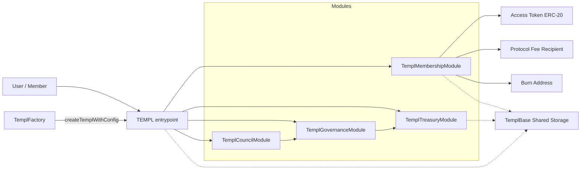
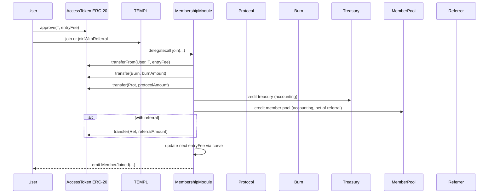

# templ.fun protocol - WARNING: NOT AUDITED


Templ lets anyone create on-chain, token‑gated groups (“templs”) that accrue an access‑token treasury, stream rewards to existing members, and govern changes and payouts entirely on-chain.

Quick links: [At a Glance](#protocol-at-a-glance) · [Architecture](#architecture) · [Governance‑Controlled Upgrades](#governance-controlled-upgrades) · [Solidity Patterns](#solidity-patterns) · [Repo Map](#repo-map) · [Glossary](#glossary) · [Lifecycle](#lifecycle) · [Quickstart](#quickstart) · [Deploy](#deploy-locally) · [Safety Model](#safety-model) · [Security](#security) · [Constraints](#constraints) · [Limits](#limits--defaults) · [Indexing](#indexing-notes) · [Proposal Views](#proposal-views) · [Tests](#tests) · [FAQ](#faq) · [Troubleshooting](#troubleshooting) · [Gotchas](#gotchas)

## Protocol At a Glance
- Create a templ tied to a vanilla ERC‑20 access token (assumed, not enforced); members join by paying an entry fee in that token. The fee is split into burn, treasury, member‑pool, and protocol slices.
- Existing members accrue pro‑rata rewards from the member‑pool slice and can claim at any time. Templs can also hold ETH or other ERC‑20s as unaccounted treasury assets.
- Donations (ETH or ERC‑20) sent directly to the templ address are held by the templ and governed: governance can withdraw these funds to recipients. Disbanding the access token moves treasury into the member pool; disbanding other tokens sweeps the full balance to the protocol fee recipient. ERC‑721 NFTs can also be custodied by a templ and later moved via governance (see NFT notes below).
- Governance is member-gated for proposing; voting is member-wide or council-only depending on mode. Execution is permissionless once a proposal passes. Actions can change parameters, move treasury, update curves/metadata, or call arbitrary external contracts.
- Council mode (default for `createTempl` / `createTemplFor` deployments) narrows voting power to a curated council while still letting any member open most proposals (council‑member removals require a council proposer). Council composition changes via governance. Council members are fee‑exempt while council mode is active.
- The YES vote threshold (bps of votes cast) is configurable per templ (default 5,100 bps, i.e. 51%) and can be changed via governance alongside quorum/post‑quorum windows.
- Instant quorum (bps of eligible voters, default 10,000 bps) lets proposals bypass the post‑quorum execution delay when a higher approval ratio—never lower than the normal quorum threshold—is satisfied.
- Pricing curves define how the entry fee evolves with membership growth (static, linear, exponential segments; see `CurveConfig` in `TemplCurve`).
- Everything is modular: `TEMPL` is a router that delegatecalls membership, treasury, governance, and council modules over a shared storage layout, keeping concerns clean.
- Deploy many templs via `TemplFactory`; run permissionless or with a gated deployer.

Priest enrollment
- On deploy, the priest is auto‑enrolled as member #1 and becomes the initial council member. `joinSequence` starts at 1 and the priest’s `rewardSnapshot` is initialized to the current `cumulativeMemberRewards`.

## Templ Factories

- The factory delegates TEMPL construction to a dedicated `TemplDeployer` helper, keeping the factory bytecode well under the 24,576 byte EIP-170 limit.
- Deterministic multichain deployment: `node scripts/deploy-factory-multichain.mjs` deploys the modules, `TemplDeployer`, and `TemplFactory` to mainnet/Base/Optimism/Arbitrum using the same constructor args so the factory address matches across chains. Defaults to the shared treasury multisig `0x420f7D96FcEFe9D4708312F454c677ceB61D8420` and `PROTOCOL_BPS=1000`; override via env. Requires a deployer with the same starting nonce on every chain (fresh key recommended) plus `RPC_MAINNET_URL`, `RPC_BASE_URL`, `RPC_OPTIMISM_URL`, `RPC_ARBITRUM_URL`, and `PRIVATE_KEY`. Outputs to `scripts/out/factory-addresses.json` and prints verification commands per chain.

## Architecture
At runtime a templ behaves like one contract with clean separation of concerns via delegatecall modules sharing a single storage layout:

- Root router: [`TEMPL`](contracts/TEMPL.sol) (selector → module dispatch, common views)
- Membership: [`TemplMembershipModule`](contracts/TemplMembership.sol)
- Treasury: [`TemplTreasuryModule`](contracts/TemplTreasury.sol)
- Governance: [`TemplGovernanceModule`](contracts/TemplGovernance.sol)
- Council governance: [`TemplCouncilModule`](contracts/TemplCouncil.sol)
- Shared storage: [`TemplBase`](contracts/TemplBase.sol)

Deployers configure pricing curves, fee splits, referral rewards, proposal fees, quorum/delay, and membership caps. The access token is assumed to be a vanilla ERC‑20.

### Council governance
- Factory-created templs start in council mode by default. The priest is the first council member; additional council members are added through proposals.
- Council mode restricts voting to the council set but any member can still open most proposals (council‑member removals require a council proposer).
- Proposal voting mode and council roster are snapshotted at creation; later council toggles or roster changes do not affect eligibility for that proposal (see `getProposalVotingMode`).
- Proposal fees apply to non-council proposers; council members are fee‑exempt while council mode is active.
- With default instant quorum, a one‑member council can pass proposals immediately after voting, so the priest can add the next council member without delay.
- Disable council mode via the `SetCouncilMode` proposal type to return to member-wide voting.

#### Migrating Existing Templs to Council Governance
Templs deployed with `councilMode=false` can adopt council governance through the following process:

**Prerequisites**:
- Priest must already be a member (true for all templs) so `councilMemberCount > 0`

**Migration Steps**:

1. **Add Council Members via Governance**:
   ```solidity
   // Create proposals to add each council member (requires quorum + majority)
   templ.createProposalAddCouncilMember(
     memberAddress,
     votingPeriod,
     "Add Alice to Council",
     "Appointing Alice as the first council member"
   );
   ```
   Repeat this process to add as many council members as you want; council mode can operate with a single council member, but adding more improves resilience.

2. **Enable Council Mode**:
   ```solidity
   // Once at least 1 council member exists, enable council mode
   templ.createProposalSetCouncilMode(
     true,  // enable council mode
     votingPeriod,
     "Activate Council Governance",
     "Transitioning from member-wide voting to council governance"
   );
   ```
   This proposal requires member-wide voting (the last vote before council mode activates).

3. **Post-Migration Governance**:
- After council mode is enabled, only council members can vote on proposals (non-council members cannot vote)
- Any member can still create proposals (council proposers are fee‑exempt)
   - Council composition changes via `createProposalAddCouncilMember` / `createProposalRemoveCouncilMember`
   - Only council members may propose removals; additions remain open to all members

**Reverting to Member-Wide Voting**:
To disable council mode and return to member-wide governance:
```solidity
// Council members vote to disable council mode
templ.createProposalSetCouncilMode(
  false,  // disable council mode
  votingPeriod,
  "Return to Member Voting",
  "Transitioning back to member-wide governance"
);
```
This proposal requires council approval while council mode is active. Once disabled, all members can vote again.

**Important Notes**:
- Ensure you maintain at least one active council member; removals that would leave the council empty are blocked. For resilience, add additional council members when possible.
- For new templs deployed with `councilMode=true`, the priest is automatically added as the first council member.

## Governance‑Controlled Upgrades

Templ supports governance‑controlled routing updates. There is no protocol admin key and no owner that can change behavior out from under a templ. The only way to change routing is via that templ’s own on‑chain governance.

What is fixed vs dynamic
- Dynamic routing table: The authoritative mapping is internal (`_moduleForSelector[bytes4] → address`) and can be changed at runtime.
- Static helper: `getRegisteredSelectors()` returns static, canonical selector sets for the shipped modules (membership/treasury/governance/council) for tooling and quick introspection. It does not change when you update routing. To inspect the live mapping for any selector, call `getModuleForSelector(bytes4)`.

Permissions and safety
- Only by governance (no protocol admin): `setRoutingModuleDAO(address,bytes4[])` is `onlyDAO` and only reachable during execution of a passed governance proposal targeting the router; direct calls from EOAs (including protocol devs) revert.
- Direct module calls revert: Modules enforce delegatecall‑only access; always call the `TEMPL` router.
- Arbitrary calls are powerful: `createProposalCallExternal` and `batchDAO` execute from the templ address and can move funds or rewire routing. Only passed proposals can trigger them; execution is permissionless once conditions are met. Frontends must surface strong warnings and quorum requirements protect abuse.
- Evented: `setRoutingModuleDAO` emits `RoutingUpdated(module, selectors)` on success.

Add or replace modules
1) Deploy your module implementation (recommended: inherit `TemplBase` and do not declare new storage variables).
2) Choose the function selectors to route to it.
3) Update routing via governance.

Inspect current routing

```js
// npx hardhat console --network <net>
const templ = await ethers.getContractAt("TEMPL", "0xYourTempl");
const Membership = await ethers.getContractFactory("TemplMembershipModule");
const sel = Membership.interface.getFunction("getMemberCount").selector;
await templ.getModuleForSelector(sel); // → current module address (0x0 if unregistered)
```

Governance: map selectors to a new module (single)

```js
// Prepare routing update (map one selector)
const templ = await ethers.getContractAt("TEMPL", "0xYourTempl");
const NewMod = await ethers.getContractFactory("MockMembershipOverride"); // example
const newModule = await NewMod.deploy();
const setRoutingSel = templ.interface.getFunction("setRoutingModuleDAO").selector;

// bytes4[] with one entry
const Membership = await ethers.getContractFactory("TemplMembershipModule");
const selector = Membership.interface.getFunction("getMemberCount").selector;
const params = ethers.AbiCoder.defaultAbiCoder().encode([
  "address","bytes4[]"
], [await newModule.getAddress(), [selector]]);

// Create proposal to call templ.setRoutingModuleDAO(module, selectors)
const pid = await templ.createProposalCallExternal(
  await templ.getAddress(),
  0,
  setRoutingSel,
  params,
  36 * 60 * 60, // voting period
  "Route getMemberCount to new module",
  "Demonstrate routing upgrade via governance"
);
// vote() and executeProposal(pid) per usual
```

Governance: map a batch of selectors

```js
// Build an array of selectors implemented by your module
const Membership = await ethers.getContractFactory("TemplMembershipModule");
const selectors = [
  Membership.interface.getFunction("getMemberCount").selector,
  Membership.interface.getFunction("getVoteWeight").selector,
];
const params = ethers.AbiCoder.defaultAbiCoder().encode([
  "address","bytes4[]"
], [await newModule.getAddress(), selectors]);
// Propose via createProposalCallExternal targeting templ.setRoutingModuleDAO as above
```

Note: Only fallback‑routed selectors (module functions) can be upgraded. Selectors implemented directly on `TEMPL` (for example, `getActiveProposals` or `getProposal*`) bypass the fallback and cannot be remapped.

Add a brand‑new module
- You are not limited to the three shipped modules. Any new selectors you map will be routed by the fallback and execute via `delegatecall` with the templ’s storage.
- Best practice: implement your module as `contract MyModule is TemplBase { ... }` and avoid declaring new storage variables to prevent slot collisions. If you need bespoke storage, use a dedicated diamond‑storage pattern under a unique slot hash.

Rollbacks and verification
- Rollback: route selectors back to the previous module address using the same flow.
- Verify: call `getModuleForSelector(bytes4)` for each selector you updated to confirm the live mapping.
- Events: `setRoutingModuleDAO` emits `RoutingUpdated(module, selectors)`; use `getModuleForSelector` for introspection.

Security notes
- There is no protocol‑level upgrade authority. Routing and external calls are controlled by each templ’s governance.
- Treat `setRoutingModuleDAO` and `CallExternal` as highly privileged. A malicious routing change can brick functions or drain funds through arbitrary calls. Use conservative quorum and clear UI warnings for proposals that target the router.

Storage/layout policy
- Modules share a single storage layout via `TemplBase`. Keep layout compatible across upgrades. For changes to storage‑backed structs, preserve slot order or introduce reserved/deprecated fields to avoid state corruption on upgrade.

## How It Works



- `TEMPL` routes calls to modules via delegatecall and exposes selector→module lookup.
- Membership: joins, fee‑split accounting, member reward accrual and claims, eligibility snapshots.
- Treasury: governance manages pause/cap/config/curve, change the priest, adjust referral/proposal fees, quorum + pre/post‑quorum windows, YES/instant thresholds, council mode/roster, burn address, member‑pool remainder sweeps, withdraw/disband assets, and run atomic multi‑call batches via `batchDAO`.
- Governance: create/vote/execute/cancel proposals covering all treasury setters (including quorum/burn/curve metadata), safe external calls (single or batched), and opportunistic tail‑pruning of inactive proposals on execution to keep the active index compact.
- Council: council‑specific proposal creators for YES threshold, council mode, and council membership changes.
- Shared storage: all persistent state lives in [`TemplBase`](contracts/TemplBase.sol).

## Solidity Patterns
- Delegatecall router: `TEMPL` fallback maps `selector → module` and uses `delegatecall` to execute in shared storage (contracts/TEMPL.sol).
- Delegatecall‑only modules: Each module stores an immutable `SELF` and reverts when called directly, enforcing router‑only entry (contracts/TemplMembership.sol, contracts/TemplTreasury.sol, contracts/TemplGovernance.sol, contracts/TemplCouncil.sol).
- Only‑DAO guard: `onlyDAO` in `TemplBase` gates actions to the router itself (contracts/TemplBase.sol).
- Reentrancy guards: User‑facing mutators like joins, claims, proposal creation/execution, and withdrawals use `nonReentrant` (contracts/TemplMembership.sol, contracts/TemplGovernance.sol, contracts/TemplTreasury.sol, contracts/TemplCouncil.sol).
- Snapshotting by join sequence: Proposals capture `preQuorumJoinSequence`; at quorum, a second snapshot anchors eligibility (`quorumJoinSequence`) (contracts/TemplBase.sol, contracts/TemplGovernance.sol).
- Bounded enumeration: active proposals support paginated reads with a 1..100 `limit` (contracts/TemplBase.sol, contracts/TEMPL.sol).
- Safe token ops: Uses OpenZeppelin `SafeERC20` for ERC‑20 transfers; ETH treasury sends revert on failure (no reason bubbling), while `CallExternal`/`batchDAO` bubble downstream reverts (contracts/TemplBase.sol, contracts/TemplGovernance.sol, contracts/TemplTreasury.sol).
- Saturating math for curves: Price growth saturates at `MAX_ENTRY_FEE`; recomputed `entryFee` values are normalized to ≥10 and divisible by 10 (contracts/TemplBase.sol).
- Governance‑controlled upgrades: `setRoutingModuleDAO(address,bytes4[])` rewires selectors under `onlyDAO` (contracts/TEMPL.sol).

## Key Concepts
- Fee split: burn / treasury / member pool / protocol; must sum to 10_000 bps. No minimums apply to burn/treasury/member‑pool; only the protocol share is fixed per factory config.
- Member pool: portion of each join streamed to existing members pro‑rata; optional referral share is paid from this slice.
- Curves: entry fee evolves by static/linear/exponential segments; see [`TemplCurve`](contracts/TemplCurve.sol).
- Base entry fee anchor: stored anchor for curve math; may be non-divisible after retargets while `entryFee` remains normalized.
- Snapshots: eligibility is frozen by join sequence at proposal creation, then again at quorum; proposals also snapshot their voting mode and (if council-only) the council roster. For member-wide proposals, the post‑quorum eligible voter count snapshots `memberCount` at quorum even if council mode changes later.
- Caps/pauses: optional `maxMembers` (auto‑pauses at cap) plus `joinPaused` toggle.
- Governance access: proposing requires membership; voting is member-wide or council-only depending on mode; proposers auto-vote YES only when they are allowed to vote (i.e., not excluded by council mode).

### Donations: Address and Custody
- Donation address: Send donations to the templ contract address (the TEMPL/router address). There is no separate “treasury address”. “Treasury” is an accounting bucket inside the templ that tracks how much of the templ’s on-chain balance is available for governance withdrawals versus reserved for member rewards.
- ETH: Send ETH directly to the templ address. ETH is held by the templ and governed. Governance can later withdraw it to recipients or disband it (sweeps to the protocol fee recipient).
- ERC‑20: Transfer tokens to the templ address (e.g., `transfer(templAddress, amount)`). Governance can withdraw these balances; disbanding non‑access tokens sweeps the full balance to the protocol fee recipient.
- NFTs (ERC‑721): The templ can custody NFTs. It does not implement `IERC721Receiver`, so `safeTransferFrom(..., templAddress, ...)` will revert. Use `transferFrom` to the templ, or have the DAO “pull” the NFT via `transferFrom(owner, templ, tokenId)` after the owner approves the templ. NFTs are governed treasury items and are moved via external‑call proposals.

- Membership note: Donations (including in the access token) do not grant membership. Membership requires calling `join*` and paying the entry fee through the contract, which updates accounting and emits the `MemberJoined` event.

## Glossary
- templ: One deployed instance wired by `TEMPL` with membership, treasury, governance, and council modules.
- access token: The ERC‑20 used for joins, fees, and accounting. Must be vanilla (no fees/rebases/hooks).
- priest: The designated address set at deployment (governance can update it); auto‑enrolled and the initial council member.
- member pool: Accounting bucket that streams join fees to existing members, claimable pro‑rata.
- entry fee curve: Growth schedule for the next join price (see `CurveConfig` in `TemplCurve`).
- quorum bps: Percent of eligible members whose YES votes are required to reach quorum.
- pre/post‑quorum window: Voting period before quorum and the anchored window after quorum.
- proposal fee: Fee paid (from the proposer) to create a proposal; a percentage of the current entry fee.
- referral share: Portion of the member‑pool slice paid to a valid referrer on join.

## Lifecycle
1) Deploy modules + factory or use an existing factory (`TemplFactory`).
2) Create a templ providing the access token, base entry fee, fee split, curve, governance params, and metadata (`createTemplWithConfig`).
3) Members join by paying the current entry fee in the access token (optionally with a referrer); fees split to burn/treasury/member‑pool/protocol. The next entry fee advances by the curve.
4) Members propose; voting is member-wide or council-only depending on mode; proposers can cancel before other votes; any address can execute once conditions are met: configuration changes, metadata updates, treasury withdrawals/disband, and arbitrary external calls.
5) Members claim accumulated member‑pool rewards.
6) Templs can evolve via governance—adjusting caps, curves, fees, and parameters—or be wound down by disbanding the treasury.

## Repo Map
- Contracts: [contracts/](contracts/)
- Tools and mocks: [contracts/tools/](contracts/tools/) · [contracts/mocks/](contracts/mocks/) · [contracts/echidna/](contracts/echidna/)
- Scripts: [scripts/](scripts/) ([deploy-factory.cjs](scripts/deploy-factory.cjs), [deploy-templ.cjs](scripts/deploy-templ.cjs), [verify-factory.cjs](scripts/verify-factory.cjs), [verify-templ.cjs](scripts/verify-templ.cjs))
- Tests: [test/](test/)
- Deployments: [deployments/](deployments/)
- Docs template: [docs-templates/contract.hbs](docs-templates/contract.hbs)
- UI integration guide: [UI.md](UI.md)

## Quickstart
- Prereqs: Node >=22, `npm`. Docker recommended for fuzzing.
- Install: `npm install`
- Compile: `npm run compile`
- Test: `npm test` (Hardhat). Coverage: `npm run coverage`.
- Browse NatSpec in [contracts/](contracts/) (each contract documents its API inline).
- Fuzzing (Echidna): `npm run test:fuzz` (via Docker; harness in `contracts/echidna/EchidnaTemplHarness.sol`).
- Static analysis: `npm run slither` (requires Slither in PATH).
- Lint: `npm run lint` (Prettier + Solhint; CI fails on formatting drift or any Solhint warning). Auto-fix: `npm run lint:fix`.
- Format: `npm run format` (applies Prettier with `prettier-plugin-solidity` to `contracts/**/*.sol`).

## Deploy Locally

```bash
# Deploy shared modules + factory
PROTOCOL_FEE_RECIPIENT=0xYourRecipient \
PROTOCOL_BPS=1000 \
npm run deploy:factory:local

# Deploy a templ via the factory
FACTORY_ADDRESS=0xFactoryFromPreviousStep \
TOKEN_ADDRESS=0xAccessToken \
ENTRY_FEE=100000000000000000000 \
TEMPL_NAME="templ.fun OG" \
TEMPL_DESCRIPTION="Genesis collective" \
npm run deploy:local
```

Verify on Base (optional):

```bash
# Factory + Modules (reads constructor args and module addresses from chain)
BASESCAN_API_KEY=your_key FACTORY_ADDRESS=0xYourFactory \
npm run verify:factory -- --network base

# TEMPL + Modules (reconstructs constructor args from chain + factory logs)
BASESCAN_API_KEY=your_key TEMPL_ADDRESS=0xYourTempl \
npm run verify:templ -- --network base

# Manual (explicit verify commands)
npx hardhat verify --contract contracts/TemplMembership.sol:TemplMembershipModule --network base 0xMembership
npx hardhat verify --contract contracts/TemplTreasury.sol:TemplTreasuryModule --network base 0xTreasury
npx hardhat verify --contract contracts/TemplGovernance.sol:TemplGovernanceModule --network base 0xGovernance
npx hardhat verify --contract contracts/TemplCouncil.sol:TemplCouncilModule --network base 0xCouncil
npx hardhat verify --contract contracts/TemplDeployer.sol:TemplDeployer --network base 0xTemplDeployer
npx hardhat verify --contract contracts/TemplFactory.sol:TemplFactory --network base 0xFactory 0xFactoryDeployer 0xProtocolRecipient 1000 0xMembership 0xTreasury 0xGovernance 0xCouncil 0xTemplDeployer
```

### Production Deployment Checklist
When you are ready to deploy everything to Base mainnet and register verified sources, follow this sequence. This “genesis” templ exists purely so block explorers have verified constructors for all components—future templs can trust these artifacts, so the first templ is not really used beyond serving as verification for all future ones.

1. **Deploy the factory in prod**  
   ```bash
   HARDHAT_NETWORK=base \
   FACTORY_DEPLOYER=0xFactoryOps \
   PROTOCOL_FEE_RECIPIENT=0xProtocolMultisig \
   PROTOCOL_BPS=1000 \
   npm run deploy:factory
   ```
   Capture the emitted `FACTORY_ADDRESS` and module addresses.

2. **Verify the factory + modules**  
   ```bash
   HARDHAT_NETWORK=base \
   BASESCAN_API_KEY=your_key \
   FACTORY_ADDRESS=0xFactory \
   npm run verify:factory
   ```
   This step makes “verifying factory in prod” a one-liner any time you redeploy.

3. **Deploy a templ through the script** (uses the new factory and any real ERC‑20 you control for smoke testing/verification)  
   ```bash
   HARDHAT_NETWORK=base \
   FACTORY_ADDRESS=0xFactory \
   TOKEN_ADDRESS=0xAccessToken \
   ENTRY_FEE=100000000000000000000 \
   TEMPL_NAME="Templ Verification" \
   TEMPL_DESCRIPTION="Canonical verified templ" \
   npm run deploy
   ```
   This is just to deploy all to prod and have verified artifacts; again, the first templ is mostly a verification harness.

4. **Verify the templ + constructor args**  
   ```bash
   HARDHAT_NETWORK=base \
   BASESCAN_API_KEY=your_key \
   FACTORY_ADDRESS=0xFactory \
   TEMPL_ADDRESS=0xTempl \
   npm run verify:templ
   ```
   Once this succeeds, explorers show verified source for the modules, factory, and a templ instance, simplifying future audits and on-chain references.

Hardhat console (ethers v6) quick taste:

```js
// npx hardhat console --network localhost
const templ = await ethers.getContractAt("TEMPL", "0xYourTempl");
const token = await ethers.getContractAt("IERC20", (await templ.getConfig())[0]);
// Approve a bounded buffer (~2× entryFee) to absorb join races and cover first proposal fee
const entryFee = (await templ.getConfig())[1];
const maxEntryFee = entryFee; // cap slippage at the current price
await (await token.approve(templ.target, entryFee * 2n)).wait();
await (await templ.joinWithMaxEntryFee(maxEntryFee)).wait();
const id = await templ.createProposalSetJoinPaused.staticCall(true, 36 * 60 * 60, "Pause joins", "Cooldown");
await (await templ.createProposalSetJoinPaused(true, 36 * 60 * 60, "Pause joins", "Cooldown")).wait();
await (await templ.vote(id, true)).wait();
// ...advance time...
await (await templ.executeProposal(id)).wait();

```

### Batched External Calls (approve → stake)
Use the built‑in `batchDAO(address[],uint256[],bytes[])` to execute multiple calls atomically from the templ address in a single proposal. For a simple staking target used in examples/tests, see [contracts/mocks/MockStaking.sol](contracts/mocks/MockStaking.sol).

```js
// npx hardhat console --network localhost
const templ = await ethers.getContractAt("TEMPL", "0xYourTempl");
const token = await ethers.getContractAt("IERC20", (await templ.getConfig())[0]);

// 1) Prepare inner calls: approve -> stake
const staking = await ethers.getContractAt("MockStaking", "0xStaking");
const approveSel = token.interface.getFunction("approve").selector;
const approveArgs = ethers.AbiCoder.defaultAbiCoder().encode(
  ["address","uint256"],
  [await staking.getAddress(), ethers.parseUnits("100", 18)]
);
const approveData = ethers.concat([approveSel, approveArgs]);

const stakeSel = staking.interface.getFunction("stake").selector;
const stakeArgs = ethers.AbiCoder.defaultAbiCoder().encode(
  ["address","uint256"],
  [await token.getAddress(), ethers.parseUnits("100", 18)]
);
const stakeData = ethers.concat([stakeSel, stakeArgs]);

// 2) Encode templ.batchDAO(targets, values, calldatas)
const targets = [await token.getAddress(), await staking.getAddress()];
const values = [0, 0];
const calldatas = [approveData, stakeData];

// Use the Treasury module ABI to get the batch selector
const Treasury = await ethers.getContractFactory("TemplTreasuryModule");
const batchSel = Treasury.interface.getFunction("batchDAO").selector;
const batchParams = ethers.AbiCoder.defaultAbiCoder().encode(
  ["address[]","uint256[]","bytes[]"],
  [targets, values, calldatas]
);

// 3) Propose the external call (templ -> templ.batchDAO)
const votingPeriod = 36 * 60 * 60;
const pid = await templ.createProposalCallExternal.staticCall(
  await templ.getAddress(),
  0, // no ETH forwarded in this example
  batchSel,
  batchParams,
  votingPeriod,
  "Approve and stake",
  "Approve token then stake in a single atomic batch (sender = templ)"
);
await (
  await templ.createProposalCallExternal(
    await templ.getAddress(),
    0,
    batchSel,
    batchParams,
    votingPeriod,
    "Approve and stake",
    "Approve token then stake in a single atomic batch (sender = templ)"
  )
).wait();

// 4) Vote and execute after quorum + delay
await (await templ.vote(pid, true)).wait();
// ...advance time to satisfy post‑quorum voting period...
await (await templ.executeProposal(pid)).wait();
```

Notes
- Calls execute from the templ address. Any approvals and transfers affect the templ’s allowances and balances.
- To forward ETH in the batch, set `values` per inner call and ensure the templ holds enough ETH to cover `sum(values)` (top-level `value` can be 0 when targeting `templ.batchDAO`).
- If any inner call reverts, the entire batch reverts; no partial effects.
- Proposing and voting require membership; ensure the caller has joined.

### NFTs and Arbitrary Assets
- Custody: A templ can hold ERC‑721 NFTs. They are governed treasury assets (not streamed as member rewards). Governance can transfer them using `createProposalCallExternal` or `batchDAO`, e.g., calling `safeTransferFrom(address(this), to, tokenId)` on the NFT contract from the templ address.
- Receiving ERC‑721: The templ does not implement `IERC721Receiver`. Sending with `safeTransferFrom` to the templ will revert. Use `transferFrom` to the templ, or have governance “pull” the NFT by calling `transferFrom(owner, templ, tokenId)` after the owner grants approval to the templ.
- ERC‑1155: The templ does not implement `IERC1155Receiver`, so `safeTransferFrom` will revert. If you need ERC‑1155 custody, route through a vault that implements the receiver interface and control it via external calls.
- Distribution: NFTs are not part of the templ’s reward streaming. Treat them as governed treasury items and move or sell them via proposals.



Curves (see [`TemplCurve`](contracts/TemplCurve.sol)) support static, linear, and exponential segments. Valid configs must end with a `length=0` tail (the primary segment when no extras exist, or the last additional segment when extras exist); intermediate segments must have `length > 0`.

## Scripts & Env Vars
- Scripts: `deploy:factory`, `deploy:factory:local`, `deploy:local`, `coverage`, `slither`, `verify:templ`, `verify:factory`.
- [scripts/deploy-factory.cjs](scripts/deploy-factory.cjs):
  - Required: `PROTOCOL_FEE_RECIPIENT`
  - Optional: `PROTOCOL_BPS`, `FACTORY_ADDRESS` (reuse), `FACTORY_DEPLOYER` (defaults to signer address)
  - Deploys modules if not provided via env and wires them into the factory constructor.
- [scripts/deploy-templ.cjs](scripts/deploy-templ.cjs): key envs are `FACTORY_ADDRESS` (or omit to auto-deploy modules + factory on the configured Hardhat network), `TOKEN_ADDRESS`, `ENTRY_FEE`, plus optional metadata (`TEMPL_NAME`, `TEMPL_DESCRIPTION`, `TEMPL_LOGO_LINK`). Many toggles are supported (priest, quorum/post-quorum voting periods, caps, fee splits, referral share, curve). Optional: `POST_QUORUM_VOTING_PERIOD_SECONDS`, `YES_VOTE_THRESHOLD_BPS` (100-10,000 bps; defaults to 5,100), `INSTANT_QUORUM_BPS` (1-10,000 bps; defaults to 10,000), and `COUNCIL_MODE`/`START_COUNCIL_MODE` (defaults to council mode when unset) to launch directly in council governance.
- Verify helpers (see [scripts/verify-templ.cjs](scripts/verify-templ.cjs), [scripts/verify-factory.cjs](scripts/verify-factory.cjs)):
  - `verify:templ` verifies a TEMPL instance, reconstructing constructor args from chain data. Provide `TEMPL_ADDRESS` or `--templ 0x...` and run with a configured Hardhat network.
  - `verify:factory` verifies a TemplFactory deployment using on‑chain getters. Provide `FACTORY_ADDRESS` or `--factory 0x...`.
- Permissioning:
- `TemplFactory.setPermissionless(true)` allows anyone to create templs.
- `TemplFactory.transferDeployer(newAddr)` hands off deployer rights when permissionless is disabled.

## Constraints
- Entry fee target: must be ≥10 and divisible by 10 (base anchors may be non-divisible and are normalized on join).
- Entry fee (runtime): curve recomputes normalize to ≥10 and divisible by 10 (decaying curves floor at 10). Base anchors may be non-divisible.
- Fee split: burn + treasury + member pool + protocol must sum to 10_000 bps.
- Curve config: ≤8 total segments; if `additionalSegments` is empty, `primary.length` must be 0 (infinite tail). If `additionalSegments` is non-empty, `primary.length` must be >0, intermediate additional segments must have `length > 0`, and the final additional segment must have `length = 0`. Static segments require `rateBps = 0`; exponential segments require `rateBps > 0` (linear allows any `rateBps`, including 0 for no growth).
- Pre‑quorum voting window: bounded to [36 hours, 30 days].
- Post-quorum voting window: bounded to [1 hour, 30 days].
- Pagination: `getActiveProposalsPaginated` requires `1 ≤ limit ≤ 100`.

## Limits & Defaults
- `BPS_DENOMINATOR = 10_000`.
- Defaults via [`TemplDefaults`](contracts/TemplDefaults.sol): quorum bps, post‑quorum voting period, burn address, YES vote threshold, instant quorum.
- `MAX_ENTRY_FEE = type(uint128).max` (entry fee safety guard).
- `MAX_CURVE_SEGMENTS = 8` (primary + additional; prevents curve OOG griefing).
- `MAX_EXTERNAL_CALLDATA_BYTES = 4096` (selector + params cap for `CallExternal` proposals).
- Proposal metadata caps: title ≤256 bytes; description ≤2048 bytes.
- Templ metadata caps: name ≤256 bytes; description ≤2048 bytes; logo URI ≤2048 bytes.
- Pre‑quorum voting window: default 36 hours (min 36h, max 30 days); view `preQuorumVotingPeriod`; adjust via `setPreQuorumVotingPeriodDAO`.
- Post-quorum voting window: default 36 hours (min 1h, max 30 days); view `postQuorumVotingPeriod`; adjust via `setPostQuorumVotingPeriodDAO`.
- Factory defaults when using `createTempl` / `createTemplFor`:
  - Fee split: burn 3_000 bps, treasury 3_000 bps, member pool 3_000 bps (plus protocol bps from factory).
  - Membership cap: 249.
  - Curve: exponential primary segment at 10_094 bps for 248 paid joins, then static tail (price holds if cap expands).
  - Proposal fee / referral share: defaults to 2_500 bps each only for `createTempl`; `createTemplFor` uses caller-provided values, and `createTemplWithConfig` requires explicit values.
- YES vote threshold: 5_100 bps (51%); valid range [100, 10_000] bps via governance or deploy config.
  - `createTemplWithConfig` auto-fills quorum, execution delay, burn address, curve, YES threshold, and instant quorum when passed as 0/false; use `-1` for split fields to receive defaults; `maxMembers` is never auto-filled (0 = uncapped).

## Indexing Notes
- Track `ProposalCreated` then hydrate with `getProposal` + `getProposalSnapshots`.
- Use `getActiveProposals()` for lists; `getActiveProposalsPaginated(offset,limit)` for pagination.
- Treasury views: `getTreasuryInfo()` and/or `TreasuryAction`/`TreasuryDisbanded` deltas.
- Curves: consume `EntryFeeCurveUpdated` for UI refresh.

## Proposal Views
- For any proposal id, `TEMPL.getProposalActionData(id)` returns `(Action action, bytes payload)`. Decode `payload` using the shapes below:
- SetJoinPaused → `abi.encode(bool joinPaused)`
- UpdateConfig → `abi.encode(uint256 newEntryFee, bool updateFeeSplit, uint256 newBurnBps, uint256 newTreasuryBps, uint256 newMemberPoolBps)`
- SetMaxMembers → `abi.encode(uint256 newMaxMembers)`
- SetMetadata → `abi.encode(string name, string description, string logoLink)`
- SetProposalFee → `abi.encode(uint256 newProposalCreationFeeBps)`
- SetReferralShare → `abi.encode(uint256 newReferralShareBps)`
- SetEntryFeeCurve → `abi.encode(CurveConfig curve, uint256 baseEntryFee)` (base anchors may be non-divisible; `entryFee` is normalized on-chain)
- CallExternal → `abi.encode(address target, uint256 value, bytes calldata)`
- WithdrawTreasury → `abi.encode(address token, address recipient, uint256 amount)`
- DisbandTreasury → `abi.encode(address token)`
- ChangePriest → `abi.encode(address newPriest)` (new priest must be an active member)
- SetQuorumBps → `abi.encode(uint256 newQuorumBps)`
- SetInstantQuorumBps → `abi.encode(uint256 newInstantQuorumBps)`
- SetPostQuorumVotingPeriod → `abi.encode(uint256 newPostQuorumVotingPeriod)`
- SetBurnAddress → `abi.encode(address newBurnAddress)`
- SetYesVoteThreshold → `abi.encode(uint256 newThresholdBps)`
- SetCouncilMode → `abi.encode(bool enabled)`
- AddCouncilMember / RemoveCouncilMember → `abi.encode(address member)`

## Safety Model
- Vanilla ERC‑20 assumption: the access token must not tax, rebase, or hook transfers; accounting assumes exact in/out and is not enforced on-chain.
- Router‑only entry: modules can only be reached via `TEMPL` delegatecalls; direct module calls revert by design.
- Reentrancy containment and snapshotting of eligibility at creation/quorum.
- Anchored execution window post‑quorum; strict fee invariants; bounded enumeration.
- External call proposals are powerful; treat like timelocked admin calls.

See tests by topic in [test/](test/).

## Security
- Access token is assumed to be vanilla ERC‑20 (no fee‑on‑transfer, no rebasing, no hooks). Accounting assumes exact transfer amounts and does not enforce compatibility on-chain.
- External‑call proposals can execute arbitrary logic; treat with the same caution as timelocked admin calls.
- `CallExternal` and `batchDAO` can move the access token without updating internal accounting; avoid targeting the templ or its modules and prefer the dedicated DAO actions for treasury moves.
- Reentrancy is guarded; modules are only reachable via the `TEMPL` router (direct module calls revert).
- No external audit yet. Treat as experimental and keep treasury exposure conservative until audited.

### Threat Model & Assumptions
Governance is powerful by design: it can upgrade modules and perform arbitrary external calls (CallExternal).

`batchDAO` is intended only for batching external contract calls (like a multisig) and is not meant for calling back into the templ itself.

The access token is assumed to be vanilla ERC‑20 (no fee‑on‑transfer, rebasing, or hooks). Non‑vanilla tokens can break accounting or liveness; deployers must choose compatible tokens.

Entry fee base anchors may be non-divisible; the entry fee charged for joins is normalized down to the nearest multiple of 10, and this small discount is an accepted tradeoff.

Council Mode is intended to be a stable governance configuration, but the protocol supports transitioning between governance modes.

### Security Considerations

#### Council Member Minimum (1 Member)
Removing council members is blocked when it would leave the council empty (`councilMemberCount < 2`):
- **Why**: Council mode requires at least one eligible voter; a zero-member council deadlocks all council voting.
- **Enforcement**: Removal proposals and DAO removal paths revert with `CouncilMemberMinimum` (see `contracts/TemplCouncil.sol`, `contracts/TemplBase.sol`).
- **Startup scenario**: The priest starts as the only council member. Council governance can run with one member, but adding more improves resilience.

#### Instant Quorum Execution & endTime Mutation
When instant quorum is satisfied (default: 100% of eligible voters cast YES votes), proposals can be executed immediately:
- **Behavior**: Upon reaching the instant quorum threshold, the contract **mutates the proposal's `endTime` to `block.timestamp`** (see `contracts/TemplBase.sol`), effectively closing the voting window; an explicit `executeProposal` call is still required to perform the action.
- **Why this matters**:
  - The `endTime` field no longer reflects the originally configured voting period when instant quorum triggers.
  - This is **by design** to allow rapid execution when overwhelming support exists.
  - Indexers and UIs should check `instantQuorumMet` and `instantQuorumReachedAt` fields to detect this state.
- **Security guarantee**: Instant quorum threshold (`instantQuorumBps`) must always be ≥ normal quorum (`quorumBps`) to prevent weakening quorum requirements. This invariant is enforced in the constructor and DAO setters (see `contracts/TemplBase.sol`).
- **Example**: With `instantQuorumBps = 7_500` (75%), a proposal receiving 75%+ YES votes from eligible voters can execute immediately without waiting for the post-quorum delay.

#### Proposal Fee Behavior
Proposal fees apply to non-council proposers; council proposers are fee‑exempt while council mode is active:
- **Rationale**: Council governance is intended to be fast to operate while preserving fee signals for non-council members.
- **Implementation**: Fees are charged when `proposalCreationFeeBps > 0` and the proposer is not a council member while council mode is enabled (entryFee * bps / 10_000, integer math).

## Troubleshooting
- `InvalidEntryFee` / `EntryFeeTooSmall`: fee must be ≥10 and divisible by 10.
- `InvalidPercentageSplit`: burn + treasury + member + protocol must sum to 10_000 bps.
- `ActiveProposalExists`: one active proposal per proposer.
- `QuorumNotReached` / `ExecutionDelayActive`: execution preconditions not satisfied.
- Direct module call guard: only call through `TEMPL` (see tests below).

## FAQ
- Can the access token change later? No — deploy a new templ.
- Why divisible by 10? It is an on‑chain invariant enforced by `_validateEntryFeeAmount`; updates that don’t meet it revert.
- How do referrals work? Paid from the member‑pool slice when the referrer is a member and not the joiner.

## Tests
- Default: `npm test` (heavy `@load` suite is excluded).
- High‑load stress: `npm run test:load` with `TEMPL_LOAD=...`.
- Coverage: `npm run coverage`. Static: `npm run slither`.
- Property fuzzing: `npm run test:fuzz` (via Docker) using [echidna.yaml](echidna.yaml) and [contracts/echidna/EchidnaTemplHarness.sol](contracts/echidna/EchidnaTemplHarness.sol).

For topic-specific suites, browse [test/](test/).

CI runs on PRs when contracts, tests, package files, or `hardhat.config.cjs` change, keeping checks focused on relevant changes.

## Gotchas
- Use a vanilla ERC‑20 for access token (no transfer fees/rebases/hooks); this is assumed and not enforced on-chain.
- Entry fee must be ≥10 and divisible by 10; runtime curve outputs are floored to the nearest 10 with a minimum of 10, and there’s a `MAX_ENTRY_FEE` guard.
- Entry fee can move with the curve between submission and mining; use `joinWithMaxEntryFee` variants to cap slippage.
- Only one active proposal per proposer.
- `TemplFactory` can be set permissionless to let anyone create templs.
- Direct calls to module addresses revert; always go via `TEMPL`.
- Default voting window is 36 hours; quorum and post‑quorum delay are configurable.
