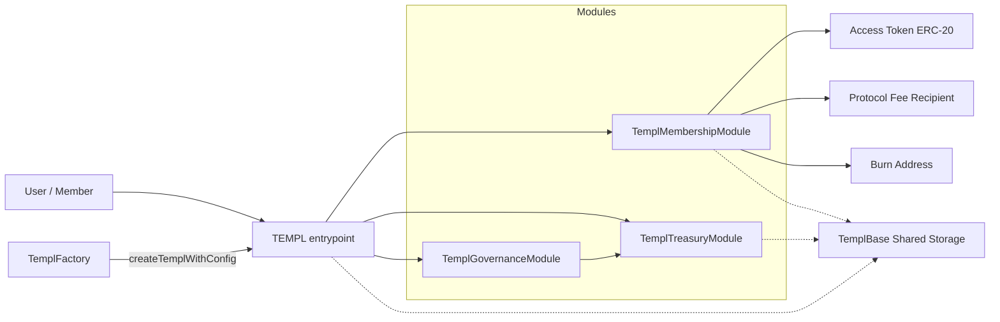
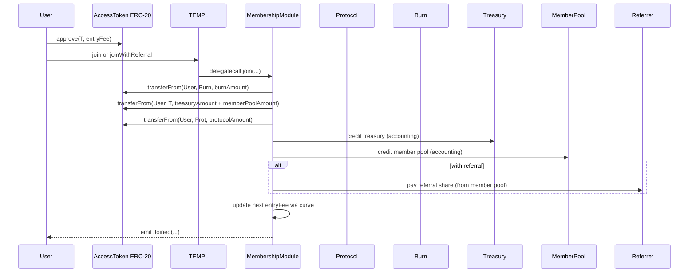

# templ.fun Protocol


Templ lets anyone create on-chain, token-gated groups (“templs”) that accrue an access‑token treasury, stream rewards to existing members, and govern changes and payouts entirely on-chain.

Quick links: [Architecture](#architecture) · [Repo Map](#repo-map) · [Quickstart](#quickstart) · [Deploy](#deploy-locally) · [Security](#security) · [Reference](#reference) · [Limits](#limits--defaults) · [Indexing](#indexing-notes) · [Tests](#tests) · [FAQ](#faq) · [Troubleshooting](#troubleshooting) · [Gotchas](#gotchas)

## Architecture
At runtime a templ behaves like one contract with clean separation of concerns via delegatecall modules sharing a single storage layout:

- Root router: [`TEMPL`](contracts/TEMPL.sol) (selector → module dispatch, common views)
- Membership: [`TemplMembershipModule`](contracts/TemplMembership.sol)
- Treasury: [`TemplTreasuryModule`](contracts/TemplTreasury.sol)
- Governance: [`TemplGovernanceModule`](contracts/TemplGovernance.sol)
- Shared storage: [`TemplBase`](contracts/TemplBase.sol)

Deployers configure pricing curves, fee splits, referral rewards, proposal fees, quorum/delay, membership caps, and an optional dictatorship (priest) override. The access token is any vanilla ERC‑20 you choose.

## How It Works



- `TEMPL` routes calls to modules via delegatecall and exposes selector→module lookup.
- Membership: joins, fee‑split accounting, member reward accrual and claims, eligibility snapshots.
- Treasury: governance/priests withdraw, disband, update config/splits/curve/metadata/referral/proposal fee.
- Governance: create/vote/execute proposals, quorum + delay, dictatorship toggle, safe external calls (single or batched).
- Shared storage: all persistent state lives in [`TemplBase`](contracts/TemplBase.sol).

## Key Concepts
- Fee split: burn / treasury / member pool / protocol; must sum to 10_000 bps.
- Member pool: portion of each join streamed to existing members pro‑rata; optional referral share is paid from this slice.
- Curves: entry fee evolves by static/linear/exponential segments; see [`TemplCurve`](contracts/TemplCurve.sol).
- Dictatorship: when enabled, the priest may call `onlyDAO` actions directly; otherwise all `onlyDAO` actions execute via governance.
- Snapshots: eligibility is frozen by join sequence at proposal creation, then again at quorum.
- Caps/pauses: optional `maxMembers` (auto‑pauses at cap) plus `joinPaused` toggle.

## Repo Map
- Contracts: `contracts/`
  - Core: `TEMPL.sol`, `TemplBase.sol`, `TemplMembership.sol`, `TemplTreasury.sol`, `TemplGovernance.sol`
  - Factory + config: `TemplFactory.sol`, `TemplCurve.sol`, `TemplDefaults.sol`, `TemplErrors.sol`
  - Utilities: `tools/BatchExecutor.sol`, `libraries/*`, `mocks/*`, `echidna/*`
- Tests: `test/*.test.js` (ethers v6, hardhat). Helpers in `test/utils`.
- Scripts: `scripts/deploy-factory.cjs`, `scripts/deploy-templ.cjs`
- Config: `hardhat.config.cjs`, `echidna.yaml`, `slither.config.json`, `.solhint.json`

## Quickstart
- Prereqs: Node >=22, `npm`. Docker recommended for fuzzing.
- Install: `npm install`
- Compile: `npm run compile`
- Test: `npm test` (Hardhat). Coverage: `npm run coverage`.
- Fuzzing (Echidna): `npm run test:fuzz` (via Docker; harness in `contracts/echidna/EchidnaTemplHarness.sol`).
- Static analysis: `npm run slither` (requires Slither in PATH).
- Lint: `npm run lint` (Solhint + Prettier). Format: `npm run lint:fix`.

## Deploy Locally

```bash
# Deploy shared modules + factory
PROTOCOL_FEE_RECIPIENT=0xYourRecipient \
PROTOCOL_BPS=1000 \
npm run deploy:factory:local

# Deploy a templ via the factory
FACTORY_ADDRESS=0xFactoryFromPreviousStep \
TOKEN_ADDRESS=0xAccessToken \
ENTRY_FEE=100000000000000000000 \
TEMPL_NAME="templ.fun OG" \
TEMPL_DESCRIPTION="Genesis collective" \
npm run deploy:local
```

Hardhat console (ethers v6) quick taste:

```js
// npx hardhat console --network localhost
const templ = await ethers.getContractAt("TEMPL", "0xYourTempl");
const token = await ethers.getContractAt("IERC20", (await templ.getConfig())[0]);
await token.approve(templ.target, (await templ.getConfig())[1]);
await templ.join();
const id = await templ.createProposalSetJoinPaused(true, 7*24*60*60, "Pause joins", "Cooldown");
await templ.vote(id, true);
// ...advance time...
await templ.executeProposal(id);

```

### Batched External Calls (approve → stake)
Use the included [`BatchExecutor`](contracts/tools/BatchExecutor.sol) to sequence multiple downstream calls atomically via a single governance proposal.

```js
// npx hardhat console --network localhost
const templ = await ethers.getContractAt("TEMPL", "0xYourTempl");
const token = await ethers.getContractAt("IERC20", (await templ.getConfig())[0]);

// 1) Prepare inner calls: approve -> stake
const staking = await ethers.getContractAt("MockStaking", "0xStaking");
const approveSel = token.interface.getFunction("approve").selector;
const approveArgs = ethers.AbiCoder.defaultAbiCoder().encode(
  ["address","uint256"],
  [await staking.getAddress(), ethers.parseUnits("100", 18)]
);
const approveData = ethers.concat([approveSel, approveArgs]);

const stakeSel = staking.interface.getFunction("stake").selector;
const stakeArgs = ethers.AbiCoder.defaultAbiCoder().encode(
  ["address","uint256"],
  [await token.getAddress(), ethers.parseUnits("100", 18)]
);
const stakeData = ethers.concat([stakeSel, stakeArgs]);

// 2) Encode BatchExecutor.execute(targets, values, calldatas)
const executor = await ethers.getContractAt("BatchExecutor", "0xExecutor");
const targets = [await token.getAddress(), await staking.getAddress()];
const values = [0, 0]; // no ETH in this example
const calldatas = [approveData, stakeData];

const execSel = executor.interface.getFunction("execute").selector;
const execParams = ethers.AbiCoder.defaultAbiCoder().encode(
  ["address[]","uint256[]","bytes[]"],
  [targets, values, calldatas]
);

// 3) Propose the external call (templ -> BatchExecutor)
const votingPeriod = 7 * 24 * 60 * 60;
const pid = await templ.createProposalCallExternal(
  await executor.getAddress(),
  0,                // forward 0 ETH to the executor
  execSel,
  execParams,
  votingPeriod,
  "Approve and stake",
  "Approve token then stake in a single atomic batch"
);

// 4) Vote and execute after quorum + delay
await templ.vote(pid, true);
// ...advance time to satisfy execution delay...
await templ.executeProposal(pid);
```

Notes
- To forward ETH in the batch, set `values` for the specific inner call(s) and pass the top-level `value` argument in `createProposalCallExternal` to `sum(values)`.
- If any inner call reverts, the entire batch reverts; no partial effects.
```



Curves (see [`TemplCurve`](contracts/TemplCurve.sol)) support static, linear, and exponential segments. A final segment with `length=0` creates an infinite tail.

## Scripts & Env Vars
- Scripts: `deploy:factory`, `deploy:factory:local`, `deploy:local`, `coverage`, `slither`.
- `scripts/deploy-factory.cjs`: requires `PROTOCOL_FEE_RECIPIENT`; optional `PROTOCOL_BPS`. You can reuse an existing factory by setting `FACTORY_ADDRESS`.
- `scripts/deploy-templ.cjs`: key envs are `FACTORY_ADDRESS` (or omit to auto‑deploy modules + factory locally), `TOKEN_ADDRESS`, `ENTRY_FEE`, plus optional metadata (`TEMPL_NAME`, `TEMPL_DESCRIPTION`, `TEMPL_LOGO_LINK`). Many toggles are supported (priest, quorum/delay, caps, fee splits, referral share, curve).
- Permissionless mode: `TemplFactory.setPermissionless(true)` allows anyone to create templs.

## Reference
- Contract APIs (NATSpec):
  - Membership: [`contracts/TemplMembership.sol`](contracts/TemplMembership.sol)
  - Treasury: [`contracts/TemplTreasury.sol`](contracts/TemplTreasury.sol)
  - Governance: [`contracts/TemplGovernance.sol`](contracts/TemplGovernance.sol)
  - Root router: [`contracts/TEMPL.sol`](contracts/TEMPL.sol) — `getRegisteredSelectors()` lists the canonical ABI surface.
- Proposal views: `getProposal`, `getProposalSnapshots`, `getProposalJoinSequences`, `getActiveProposals*` in [`contracts/TemplGovernance.sol`](contracts/TemplGovernance.sol). Payload helper `getProposalActionData` in [`contracts/TEMPL.sol`](contracts/TEMPL.sol).
  - CallExternal payload shape: `(address target, uint256 value, bytes data)`
- Events: see [`contracts/TemplBase.sol`](contracts/TemplBase.sol).
- Learn by tests: see [Tests](#tests) for direct links by topic.

## Limits & Defaults
- `BPS_DENOMINATOR = 10_000`.
- Defaults via [`TemplDefaults`](contracts/TemplDefaults.sol): quorum bps, execution delay, burn address.
- `MAX_EXTERNAL_REWARD_TOKENS = 256` (UI enumeration bound).
- `MAX_ENTRY_FEE = type(uint128).max` (entry fee safety guard).
- Voting period: default 7 days (min 7, max 30).

## Indexing Notes
- Track `ProposalCreated` then hydrate with `getProposal` + `getProposalSnapshots`.
- Use `getActiveProposals()` for lists; `getActiveProposalsPaginated(offset,limit)` for pagination.
- Treasury views: `getTreasuryInfo()` and/or `TreasuryAction`/`TreasuryDisbanded` deltas.
- Curves: consume `EntryFeeCurveUpdated` for UI refresh.

## Security
- Access token must be vanilla ERC‑20 (no fee‑on‑transfer, no rebasing, no hooks). Accounting assumes exact transfer amounts.
- External‑call proposals can execute arbitrary logic; treat with the same caution as timelocked admin calls.
- Reentrancy is guarded; modules are only reachable via the `TEMPL` router (direct module calls revert).
- No external audit yet. Treat as experimental and keep treasury exposure conservative until audited.

## Troubleshooting
- `InvalidEntryFee` / `EntryFeeTooSmall`: fee must be ≥10 and divisible by 10.
- `InvalidPercentageSplit`: burn + treasury + member + protocol must sum to 10_000 bps.
- `ActiveProposalExists`: one active proposal per proposer.
- `QuorumNotReached` / `ExecutionDelayActive`: execution preconditions not satisfied.
- Direct module call guard: only call through `TEMPL` (see tests below).

## FAQ
- Can the access token change later? No — deploy a new templ.
- Why divisible by 10? Prevents rounding drift in fee math.
- How do referrals work? Paid from the member‑pool slice when the referrer is a member and not the joiner.
- Can I enumerate external reward tokens? Yes: `getExternalRewardTokens()` (or paginated) and `getExternalRewardState(token)`; cleanup via DAO‑only `cleanupExternalRewardToken`.

## Tests
- Default: `npm test` (heavy `@load` suite is excluded).
- High‑load stress: `npm run test:load` with `TEMPL_LOAD=...` to scale joiners.
  - Optional: `TEMPL_LOAD_PROPOSALS=...` caps concurrent proposals in the load suite (default scales with members).
  - Optional: `TEMPL_LOAD_TOKENS=...` fans out distinct external reward tokens to disband/claim under load (default 12).
- Coverage: `npm run coverage`. Static: `npm run slither`.
- Property fuzzing: `npm run test:fuzz` (via Docker) using `echidna.yaml` and `contracts/echidna/EchidnaTemplHarness.sol`.

Learn by topic (a non‑exhaustive map):
- Membership: `test/MembershipCoverage.test.js`, `test/MemberPool.test.js`, `test/ClaimMemberPool.test.js`
- Governance: `test/GovernanceCoverage.test.js`, `test/SingleProposal.test.js`, `test/GovernanceExternalCall*.test.js`
- Treasury: `test/TreasuryCoverage.test.js`, `test/TreasuryWithdrawAssets.test.js`, `test/DisbandTreasury.test.js`
- Curves: `test/EntryFeeCurve.test.js`, `test/FeeExtremes.test.js`, `test/FeeValidationReverts.test.js`
- Dictatorship/Priest: `test/PriestDictatorship.test.js`, `test/DictatorshipPriestOnlyReverts.test.js`
- Indexing helpers: `test/ActiveProposalsIndex.test.js`, `test/ProposalPagination.test.js`, `test/GetProposalStatus.test.js`
- Defenses/guards: `test/Reentrancy.test.js`, `test/ProposalFeeReentrancy.test.js`, `test/DirectModuleCallGuard.test.js`
- Selectors/ABI surface: `test/TEMPLRegisteredSelectors.test.js`, `test/TEMPLSelectors.test.js`

CI runs on PRs only when Solidity contracts or tests change (`contracts/**`, `test/**`), keeping checks focused on relevant changes.

## Gotchas
- Use a vanilla ERC‑20 for access token (no transfer fees/rebases/hooks).
- Entry fee must be ≥10 and divisible by 10; there’s a `MAX_ENTRY_FEE` guard.
- Only one active proposal per proposer.
- `TemplFactory` can be set permissionless to let anyone create templs.
- Direct calls to module addresses revert; always go via `TEMPL`.
- Default voting period is 7 days; quorum and delay are configurable.
