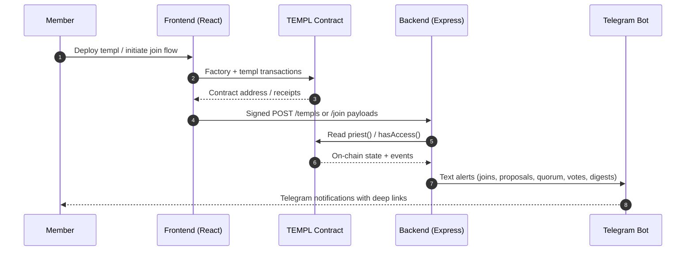

# templ.fun

Templ turns any ERC-20 into a gated club with on-chain economics. Holders deploy their own templ, charge newcomers an entry fee, run proposals, and split every tribute between burn, treasury, member rewards, and protocol upkeep. Telegram alerts sourced from on-chain events keep members synced without embedding chat in the app.

## Architecture



Reference diagrams live in [`docs/CORE_FLOW_DOCS.MD`](docs/CORE_FLOW_DOCS.MD).

## Current Stack

- **Contracts** – Solidity 0.8.x templates (see `contracts/`) mint templ instances that collect entry fees, burn supply, accumulate treasury funds, and expose governance primitives. Each templ stores an on-chain "home link" so frontends, bots, and docs can reference the canonical landing page for the community. Deploying a templ auto-enrols the priest as the founding member so the first paid join streams its member-pool slice directly to them. When a harness wipes the member list (the only time a templ begins with zero members), the pioneer pool share is redirected into the treasury until another wallet joins, letting that first payer reclaim their entire fee minus burns/protocol once a second member arrives. Disband proposals immediately engage a join lock so latecomers cannot sneak in during the wind-down, and the lock clears only when the proposal executes or expires. Optional member caps pause joins once the limit is hit; new purchases revert with `MemberLimitReached` until governance raises or removes the cap.
- **Backend API + Telegram bot** – Node 22/Express server performs signature verification, tracks registered templs, confirms membership, and streams contract events to a Telegram group via a bot token.
- **Frontend control center** – Vite + React single-page app for deploying templs, joining with proof-of-purchase, raising proposals (with on-chain title/description), and casting votes. The landing page pulls templ deployments directly from the configured factory (and merges Telegram metadata from the backend) so every community is one click away. Flows are split into dedicated routes:
- `/templs/create` – deploy + register and optionally bind a Telegram chat id.
- `/templs/join` – purchase access, then verify membership via the backend.
- `/templs/:address` – overview, quick links, and routing to proposal tools.
- `/templs/:address/proposals/new` – create governance actions.
- `/templs/:address/proposals/:id/vote` – cast a YES/NO vote.
- `/templs/:address/claim` – view the member pool balance and claim rewards.

Telegram notifications are optional but encouraged. When a templ is registered, the backend issues a one-time binding code. Invite `@templfunbot` to your group and post the code (e.g. `templ abcd1234`)—the bot confirms the chat and begins posting newline-delimited text messages with deep links back to the frontend (join screen, proposal details, claim page, etc.). Priests can later rotate the chat from the templ overview: request a replacement code, sign the EIP-712 proof, and share the snippet in the new group. Alerts cover new members (with live treasury/member-pool totals), proposal creation, quorum, voting closure, priest changes, templ home-link updates, daily "gm" digests, and a binding acknowledgement when a chat connects. No Telegram secrets are stored on-chain; linking happens entirely through the bot token, binding handshake, and signed priest rebind requests.

## Quick start

```bash
npm ci                         # install root + subpackage deps
npm run compile                # compile contracts
npm --prefix backend test      # backend tests (includes shared signing tests)
npm --prefix frontend run dev  # run the SPA against your local backend
```

Detailed deployment steps (contracts, backend, frontend, and Telegram binding) live in [docs/DEPLOYMENT_GUIDE.md](docs/DEPLOYMENT_GUIDE.md).

In separate terminals you’ll typically run:

1. `npx hardhat node` – local chain with default accounts.
2. `npm --prefix backend start` – Express API and Telegram notifier (expects `RPC_URL`).
3. `npm --prefix frontend run dev` – Vite dev server on http://localhost:5173.

## Documentation

- [`docs/TEMPL_TECH_SPEC.MD`](docs/TEMPL_TECH_SPEC.MD) – canonical architecture across contracts, backend, frontend, and Telegram alerts.
- [`docs/CORE_FLOW_DOCS.MD`](docs/CORE_FLOW_DOCS.MD) – detailed sequence + flow charts for creation, join, governance, and notifications.
- [`docs/CONTRACTS.md`](docs/CONTRACTS.md) – smart contract modules, fee mechanics, and governance APIs.
- [`docs/BACKEND.md`](docs/BACKEND.md) – Express service responsibilities, environment, and notifier behavior.
- [`docs/FRONTEND.md`](docs/FRONTEND.md) – SPA routes, env vars, and lifecycle walkthroughs.
- [`docs/SHARED.md`](docs/SHARED.md) – cross-package utilities for signatures and environment helpers.
- [`docs/PERSISTENCE.md`](docs/PERSISTENCE.md) – storage story across contracts, backend, and frontend caches.
- [`docs/DEPLOYMENT_GUIDE.md`](docs/DEPLOYMENT_GUIDE.md) – end-to-end deployment steps including Telegram binding.
- [`docs/TEST_LOCALLY.md`](docs/TEST_LOCALLY.md) – local development recipe for the full stack.

## Environment & configuration

### Backend (`backend/.env`)

| Variable | Purpose |
| --- | --- |
| `RPC_URL` | **Required.** JSON-RPC endpoint used to read chain state, verify contracts, and watch events. |
| `PORT` | Port for the HTTP server (defaults to `3001`). |
| `ALLOWED_ORIGINS` | Comma-separated origins for CORS (defaults to `http://localhost:5173`). |
| `BACKEND_SERVER_ID` | String embedded in EIP-712 messages; must match the frontend. |
| `TELEGRAM_BOT_TOKEN` | Optional bot token. If set, governance events post to Telegram chats registered per templ. |
| `APP_BASE_URL` | Optional base URL used when building deep links in Telegram messages. |
| `LOG_LEVEL` | Pino log level (`info` by default). |
| `RATE_LIMIT_STORE` | `memory` or `redis`; auto-selects Redis when `REDIS_URL` is set. |
| `REDIS_URL` | Redis endpoint used for distributed rate limiting (required when `RATE_LIMIT_STORE=redis`). |
| `REQUIRE_CONTRACT_VERIFY` | Set to `1` in production to enforce on-chain contract + priest validation. |
| `CLEAR_DB` | When `1`, deletes the SQLite DB before boot (handy for tests). |
| `DB_PATH` | Override file path for the SQLite DB that stores Telegram bindings (`backend/groups.db` by default). |

The backend stores templ registrations in SQLite (`templ_bindings`). Each row maps a templ contract to an optional Telegram chat id so bindings survive restarts while still allowing templs to exist without Telegram wiring.

### Frontend (`frontend/.env`)

| Variable | Purpose |
| --- | --- |
| `VITE_BACKEND_URL` | API base URL; defaults to `http://localhost:3001`. |
| `VITE_BACKEND_SERVER_ID` | Must equal the backend’s `BACKEND_SERVER_ID` so signatures align. |
| `VITE_TEMPL_FACTORY_*` | Optional overrides for the default factory address (`address`), protocol recipient (`protocolRecipient`), and protocol percent (`protocolPercent`). |
| `VITE_RPC_URL` | Optional read-only RPC endpoint used to list templs from the factory on the landing page (falls back to the connected wallet provider). |

The frontend connects to the user’s browser wallet (MetaMask or any `window.ethereum` provider) and reuses Hardhat accounts during local development.

### Telegram wiring

1. Create a bot with [@BotFather](https://t.me/botfather) and grab the token.
2. Invite <a href="https://t.me/templfunbot" target="_blank" rel="noreferrer">@templfunbot</a> to your Telegram group and allow it to post.
3. Register or deploy your templ from the UI (or API). If you already know the numeric chat id (e.g. by using [@getidsbot](https://t.me/getidsbot)) you can provide it in the form — the backend links the templ immediately.
4. Otherwise, copy the one-time binding snippet shown after registration and post it into the Telegram group, for example:
   ```
   templ ca83cfbc0f47a9d1
   ```
   The backend polls the bot API, detects the code, and acknowledges the binding in the same chat. Once confirmed, all templ events (joins, proposals, quorum, vote closure, priest changes, daily digests, home-link updates) stream into the channel as plaintext notifications with deep links back to the frontend.

Leaving the chat id empty is perfectly fine — the templ remains usable, and you can complete the binding later from the templ overview page. When governance appoints a new priest or the community moves chats, request a new binding code from the overview, sign the EIP-712 rebind payload, and post the snippet in the destination group to re-link the bot.

## Repository layout

- `contracts/` – Solidity sources (`TEMPL.sol`, `TemplFactory.sol`) plus Hardhat tests in `test/`.
- `backend/` – Express API, Telegram notifier (`src/`), and Node tests in `test/`.
- `frontend/` – Vite + React app, Vitest setup, and Playwright specs in `e2e/`.
- `shared/` – Common JS helpers (EIP-712 signing, debug utilities).
- `scripts/` – Deployment/test scripts, wallet generators, CI hooks.
- `deployments/` – Network artifacts emitted by Hardhat deployments.

## Testing

- `npm test` (root) – Hardhat contract tests.
- `npm --prefix backend test` – backend + shared unit tests.
- `npm --prefix frontend run test` – Vitest suite for the SPA.
- `npm --prefix frontend run test:e2e` – Playwright smoke tests (starts Hardhat, backend, and a preview build). The harness now focuses on deployment/join/vote flows; Telegram messaging is stubbed by leaving `TELEGRAM_BOT_TOKEN` unset.

Code coverage targets remain enforced by Codecov for contracts and JS packages. Run `npm run coverage:all` before shipping large changes.
