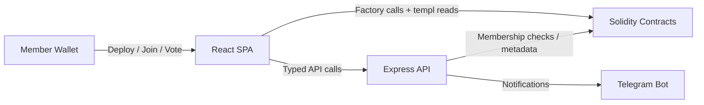

# templ.fun

Templ turns any ERC-20 community into a gated club with on-chain economics, typed governance, and optional Telegram alerts. Holders deploy their own templ, charge an entry fee, and redistribute tributes between burn, treasury, protocol upkeep, and member rewards.

## What you ship

- Self-serve deployments from a factory with configurable fee splits and optional member caps.
- One-member/one-vote governance covering pause/config/withdraw/priest/dictatorship/home-link actions.
- Static frontend (Vite + React) that handles deploy, join, vote, and reward flows.
- Long-lived Express backend that verifies signatures, persists templ metadata, and streams on-chain events to Telegram.
- Shared signing helpers and Solidity contracts tested through Hardhat, Vitest, and Playwright harnesses.

## System map



More detailed diagrams live in `docs/CORE_FLOW_DOCS.MD`.

## Getting started

```bash
npm ci                      # install root deps
npm --prefix backend ci     # install backend deps
npm --prefix frontend ci    # install frontend deps
npm run compile             # compile contracts
npm --prefix backend test   # backend tests
npm --prefix frontend run dev
```

Run `npm run test:all` before shipping changes; it mirrors the CI matrix. Additional coverage commands live in the package scripts (`npm --prefix backend run coverage`, `npm --prefix frontend run coverage`).

## Documentation

Start with `docs/README.md` for the full documentation index. Highlights:

- Architecture overview – `docs/TEMPL_TECH_SPEC.MD`
- Contract internals – `docs/CONTRACTS.md`
- Backend API + persistence – `docs/BACKEND.md` / `docs/PERSISTENCE.md`
- Frontend routes and env – `docs/FRONTEND.md`
- Local/dev/prod guides – `docs/TEST_LOCALLY.md`, `docs/DEPLOYMENT_GUIDE.md`

## Repository layout

- `contracts/` – Solidity sources and Hardhat tests.
- `backend/` – Express API, Telegram notifier, and node:test suite.
- `frontend/` – Vite + React app with Vitest + Playwright specs.
- `shared/` – Shared utilities (signing helpers, formatting).
- `scripts/` – Deployment and maintenance scripts.
- `docs/` – Living documentation for every part of the stack.

## Contributing

Follow the repo’s linting and formatting defaults (2 spaces, trailing semicolons, ESM imports). Conventional commits keep history tidy, and PRs should list the checks you ran. Secrets stay in `.env` files—never commit production keys.
