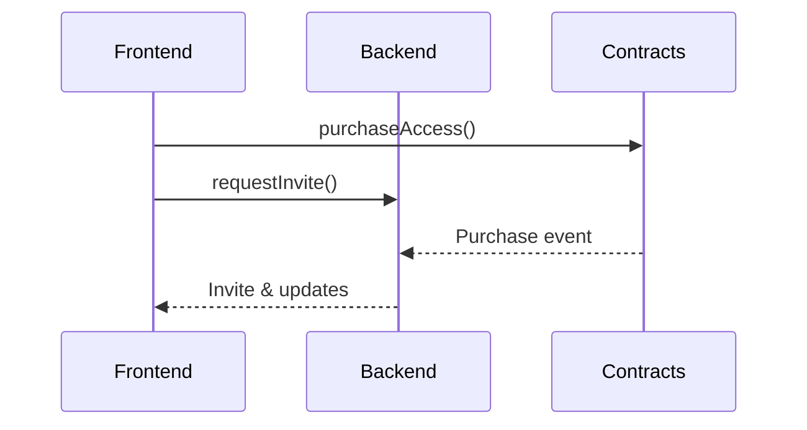

# TEMPL

DAO‑governed token‑gated private groups with onchain treasury management and XMTP messaging

<p align="center">

</p>
<p align="center">
<a href="https://templ.fun">templ.fun</a> 
</p>

## Architecture

A TEMPL is composed of three parts that work together:

- **Smart contracts** on Base gate access by requiring a paid `purchaseAccess` call.
- **Backend bot** owns the XMTP group and only invites wallets that purchased.
- **React frontend** deploys contracts, verifies purchases and lets members chat.

The frontend calls the contract to purchase membership, then asks the backend to invite
the wallet into the group. The backend can also watch contract events and forward
proposal or vote updates to the chat.



## Documentation
Use the docs below to dive into each component:

- [CORE_FLOW_DOCS.MD](./CORE_FLOW_DOCS.MD) – core flow service diagrams
- [CONTRACTS.md](./CONTRACTS.md) – smart‑contract specification
- [BACKEND.md](./BACKEND.md) – XMTP bot and API
- [FRONTEND.md](./FRONTEND.md) – React client
- [PERSISTENCE.md](./PERSISTENCE.md) – data storage and XMTP DBs
- [WEB3_AUDIT_REPORT.MD](./WEB3_AUDIT_REPORT.MD) – web3 audit summary
  
## Monorepo Structure
- `contracts/` – Hardhat + Solidity 0.8.23
- `backend/` – Node service with XMTP bot and HTTP API
- `frontend/` – Vite + React demo app with Playwright e2e
- `shared/` – JS utilities shared by backend and frontend
- `deployments/` – network-specific contract records
- `scripts/` – Hardhat deployment and utility scripts
- `test/` – Hardhat contract tests
- `artifacts/` – compiled contract artifacts
- `cache/` – Hardhat compilation cache

## Quick Start
1. **Install**  
   Install dependencies for contracts, the backend, and the frontend. See [CONTRACTS.md](./CONTRACTS.md), [BACKEND.md](./BACKEND.md), and [FRONTEND.md](./FRONTEND.md) for detailed commands.

2. **Test**  
   Run the full suite:
   ```bash
   npm run test:all
   ```
   Component-specific test commands are documented in [CONTRACTS.md](./CONTRACTS.md), [BACKEND.md](./BACKEND.md), and [FRONTEND.md](./FRONTEND.md).

3. **Run**  
   Start the backend and frontend services. Deployment and runtime details are available in [CONTRACTS.md](./CONTRACTS.md), [BACKEND.md](./BACKEND.md), and [FRONTEND.md](./FRONTEND.md).

## Environment Variables

| Variable | Description | Location |
| --- | --- | --- |
| `RPC_URL` | RPC endpoint for Base network | `.env`, `backend/.env` |
| `PRIVATE_KEY` | Deployer wallet key for contract deployments | `.env` |
| `BOT_PRIVATE_KEY` | XMTP bot wallet key | `backend/.env` |
| `ALLOWED_ORIGINS` | Comma-separated frontend origins allowed to call the backend | `backend/.env` |
| `PROTOCOL_FEE_RECIPIENT` | Address receiving protocol fees | `.env` |
| `TOKEN_ADDRESS` | ERC-20 token used for membership purchases | `.env` |
| `ENTRY_FEE` | Membership cost in wei | `.env` |
| `PRIEST_VOTE_WEIGHT` | Priest vote weight multiplier | `.env` |
| `PRIEST_WEIGHT_THRESHOLD` | Total weight required for priest proposals | `.env` |
| `BASESCAN_API_KEY` | API key for contract verification on BaseScan | `.env` |
| `XMTP_ENV` | XMTP network (`dev`, `production`, or `local`) | `backend/.env` |
| `ENABLE_DEBUG_ENDPOINTS` | Enable backend debug endpoints | `backend/.env` |
| `PORT` | Backend HTTP server port | `backend/.env` |
| `DISABLE_XMTP_WAIT` | Skip XMTP readiness checks in tests | `backend/.env` |
| `XMTP_MAX_ATTEMPTS` | Max XMTP client rotation attempts | `backend/.env` |

## Deploying to production
See [Environment Variables](#environment-variables) for descriptions of required configuration.
1. Create a `.env` file in the project root for the deployment scripts. This file is distinct from `backend/.env` used by the bot; copy any overlapping variables (e.g., `RPC_URL`, keys) into `backend/.env` if the bot requires them. The bot's key (`BOT_PRIVATE_KEY`) belongs only in `backend/.env`. The deploying wallet becomes the priest automatically, so `PRIEST_ADDRESS` is only needed when overriding in tests.
    ```env
    PROTOCOL_FEE_RECIPIENT=0x...
    TOKEN_ADDRESS=0x...
    ENTRY_FEE=100000000000000000 # wei
    RPC_URL=https://mainnet.base.org
    PRIVATE_KEY=0x...
    PRIEST_VOTE_WEIGHT=10
    PRIEST_WEIGHT_THRESHOLD=10
    BASESCAN_API_KEY=...
    ```
   See [`CONTRACTS.md`](./CONTRACTS.md) for the full list of supported variables.
2. Run the full test suite and Slither analysis.
3. Deploy with `scripts/deploy.js` and record the contract address and XMTP group ID.
4. Host the backend bot (e.g., on a VM) using the contract address and bot key. Ensure
   `backend/.env` sets `ALLOWED_ORIGINS` to the frontend URL(s) permitted to call the API.
5. Build the frontend (`npm --prefix frontend run build`) and serve the static files.

## Core flows
1. **Templ creation** – deploy contract and create a private XMTP group with the priest added at creation time.
2. **Pay‑to‑join** – wallet calls `purchaseAccess` and backend invites it into the group.
3. **Messaging** – members send and receive XMTP messages in the group chat.
4. **Priest muting** – priest can silence members or delegate that power to
   other moderators via the backend. Each mute is recorded in SQLite with
   escalating durations of 1 hour, 1 day, 1 week, 1 month and finally
   permanent after the fifth strike. Frontends query the backend for active
   mutes and hide messages from muted addresses.
5. **Proposal creation** – any member drafts a proposal to call one of the allowlisted DAO actions (pause/unpause, update config, withdraw treasury, sweep remainder). The backend rebroadcasts ProposalCreated as JSON to the group.
6. **Voting** – members cast yes/no votes and see live tallies as events arrive.
7. **Proposal execution** – proposals that pass execute the allowlisted action atomically.

For auditing guides, continue with the docs linked above.

## Security considerations

- Proposal execution is restricted to an allowlist of safe DAO actions; arbitrary external calls are disabled.
 - The backend owns the XMTP group. The priest does not control membership directly; actions are mediated via the backend’s bot, which verifies on‑chain purchase. See BACKEND.md for API auth and rate‑limit details.
 - XMTP dev network has a 10‑installation limit per inbox and 256 total actions limit per inbox (install and revoke each count as 1 action). Tests rotate wallets or reuse local XMTP databases to avoid hitting this limit.
 - For auditors: CONTRACTS.md documents all custom errors, events, invariants, fee splits, and DAO constraints. The Hardhat test suite covers these invariants; Slither reports are part of CI.


## E2E Environments
- Default: XMTP production
  - Playwright sets `XMTP_ENV=production` for backend, `VITE_XMTP_ENV=production` for frontend
- Local XMTP: set `E2E_XMTP_LOCAL=1`
  - Playwright starts `xmtp-local-node`, sets `XMTP_ENV=local` and `VITE_XMTP_ENV=local`
  - Local-only repro tests are enabled

## Debug Endpoints (backend)
- Requires `ENABLE_DEBUG_ENDPOINTS=1` on the backend.
- `GET /debug/group?contractAddress=<addr>&refresh=1`
- `GET /debug/conversations`
- `GET /debug/membership?contractAddress=<addr>&inboxId=<id>`
- `GET /debug/last-join`
- `GET /debug/inbox-state?inboxId=<id>&env=production`

## Troubleshooting test:all
- If backend tests appear to “hang”, ensure network gating isn’t blocking. The backend skips XMTP readiness checks in test mode by default. You can also set `DISABLE_XMTP_WAIT=1` for the backend during tests.
- For e2e, ensure ports 8545/3001/5179 are free.
