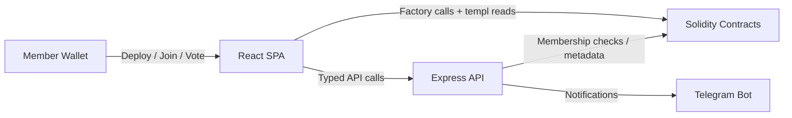

# templ.fun

Templ lets any ERC-20 community spin up a gated club with transparent economics, one-member/one-vote governance, and optional Telegram alerts. A single factory mints templs, each templ tracks its own members and fee splits, and the surrounding tooling keeps every surface in sync.

---

## Core capabilities

| Area | What ships |
| --- | --- |
| On-chain | `TemplFactory` deployments with configurable priest, entry fee, burn/treasury/member splits, quorum, execution delay, optional caps, and home links. Each templ wires membership, treasury, and typed-governance modules together so communities can join, vote, withdraw, or disband without bespoke code. |
| Frontend | Static Vite + React SPA that handles templ creation, join + gifting flows, proposal creation/voting/execution, reward claims, and Telegram rebinding. |
| Backend | Node 22 Express service that verifies typed signatures, persists templ ↔ Telegram bindings in SQLite, streams contract events, and emits MarkdownV2 Telegram notifications. Designed to run as a long-lived process (Fly, Render, Railway, bare metal) with optional Redis-backed rate limiting. |
| Shared utilities | Signing helpers, factories for typed data, and Hardhat/Vitest/Playwright harnesses that keep the stack coherent. |

## Architecture snapshot



More detailed diagrams and sequence charts live in [`docs/CORE_FLOW_DOCS.MD`](docs/CORE_FLOW_DOCS.MD).

## Get started locally

```bash
npm ci
npm --prefix backend ci
npm --prefix frontend ci

npm run compile                 # compile contracts
npm --prefix backend start      # start the API (requires RPC_URL)
npm --prefix frontend run dev   # run the SPA on http://localhost:5173
```

Hardhat tests, Vitest specs, Playwright smoke tests, and backend unit tests are wired together under one script:

```bash
npm run test:all
```

Run that command before handing off a change. Package-specific coverage targets remain available via `npm --prefix backend run coverage` and `npm --prefix frontend run coverage`.

## Documentation map

| Topic | Reference |
| --- | --- |
| Protocol handbook & glossary | [`docs/README.md`](docs/README.md) |
| Technical spec (contracts ↔ backend ↔ frontend) | [`docs/TEMPL_TECH_SPEC.MD`](docs/TEMPL_TECH_SPEC.MD) |
| Flow diagrams | [`docs/CORE_FLOW_DOCS.MD`](docs/CORE_FLOW_DOCS.MD) |
| Contract reference | [`docs/CONTRACTS.md`](docs/CONTRACTS.md) |
| Backend API, env, and persistence | [`docs/BACKEND.md`](docs/BACKEND.md), [`docs/PERSISTENCE.md`](docs/PERSISTENCE.md) |
| Frontend routes and configuration | [`docs/FRONTEND.md`](docs/FRONTEND.md) |
| Local dev checklist | [`docs/TEST_LOCALLY.md`](docs/TEST_LOCALLY.md) |
| Production rollout | [`docs/DEPLOYMENT_GUIDE.md`](docs/DEPLOYMENT_GUIDE.md) |

## Repository tour

- [`contracts/`](contracts/) – Solidity sources, libraries, and Hardhat tests.
- [`backend/`](backend/) – Express API, Telegram notifier, persistence adapters, and integration tests.
- [`frontend/`](frontend/) – Vite + React app, Vitest suite, and Playwright harness.
- [`shared/`](shared/) – Typed-data builders and utilities reused across packages.
- [`scripts/`](scripts/) – Deployment helpers, factory/templ registrars, and Cloudflare automation.
