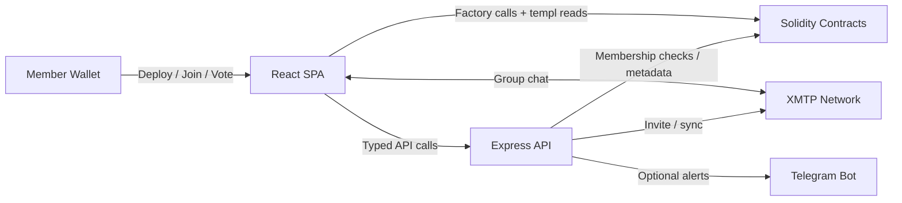

# templ.fun

Templ lets any ERC-20 community spin up a gated club with transparent economics, one-member/one-vote governance, and an XMTP-powered private chat. A single factory mints templs, each templ tracks its own members and fee splits, and the surrounding tooling keeps every surface in sync—with Telegram notifications remaining available as an optional add-on.

---

## Core capabilities

| Area | What ships |
| --- | --- |
| On-chain | `TemplFactory` deployments with configurable priest, entry fee, burn/treasury/member splits, quorum, execution delay, optional caps, and home links. Each templ wires membership, treasury, and typed-governance modules together so communities can join, vote, withdraw, or disband without bespoke code. |
| Frontend | Static Vite + React SPA centred on XMTP chat. Members land in the conversation immediately after joining, compose proposals, vote on poll cards, execute actions, and claim rewards without navigating away. Telegram rebinding controls remain available for communities opting into alerts. |
| Backend | Node 22 Express service that verifies typed signatures, orchestrates XMTP group creation and membership, caches templ ↔ XMTP group mappings in SQLite, refreshes priest/home-link metadata from the chain, streams contract events, and (optionally) emits MarkdownV2 Telegram notifications. Designed to run as a long-lived process (Fly, Render, Railway, bare metal) with optional Redis-backed rate limiting. |
| Shared utilities | Signing helpers, factories for typed data, and Hardhat/Vitest/Playwright harnesses that keep the stack coherent. |

## Architecture snapshot



More detailed diagrams and sequence charts live in [`docs/CORE_FLOW_DOCS.MD`](docs/CORE_FLOW_DOCS.MD).

## Chat-first UI

The `/templs/:address/chat` route is the heart of the application:

- Successful joins redirect straight into chat with history already synced.
- The composer raises governance actions and publishes poll-style proposal cards inline.
- Vote, execute, and reward actions all happen inside the timeline, keeping members context-switched on XMTP.
- Telegram remains optional—the chat UI serves as the canonical control centre.

Every supporting document in `docs/` has been refreshed to reflect the chat-first flow (see [`docs/FRONTEND.md`](docs/FRONTEND.md) and [`docs/BACKEND.md`](docs/BACKEND.md) for deeper details).

## Get started locally

```bash
npm ci
npm --prefix backend ci
npm --prefix frontend ci

npm run compile                 # compile contracts
npm --prefix backend start      # start the API (requires RPC_URL and SQLITE_DB_PATH)
npm --prefix frontend run dev   # run the SPA on http://localhost:5173
```

Set `SQLITE_DB_PATH` to a writable path (for example `./templ.local.db`) before starting the backend so templ ↔ XMTP group mappings persist across restarts.

Hardhat tests, Vitest specs, Playwright smoke tests, and backend unit tests are wired together under one script:

```bash
npm run test:all
```

The Playwright harness (`frontend/e2e/basic-flows.pw.spec.js`) deploys a templ, registers it with the backend, joins from the chat UI, proposes, votes, executes, and asserts the on-chain side effects—all inside the conversation. Use `npm run test:e2e:local` to exercise the flow against the bundled XMTP local node (ensure `git submodule update --init xmtp-local-node && npm run xmtp:local:up` beforehand) and `npm run test:e2e:prod` to exercise the same steps against the hosted XMTP network. `npm run test:e2e:matrix` runs both sequentially, automatically skipping the local leg whenever Docker is unavailable. Tear the local node down with `npm run xmtp:local:down` when you are done.

Run that command ahead of handing off a change. Package-specific coverage targets remain available via `npm --prefix backend run coverage` and `npm --prefix frontend run coverage`.

## Documentation map

| Topic | Reference |
| --- | --- |
| Protocol handbook & glossary | [`docs/README.md`](docs/README.md) |
| Technical spec (contracts ↔ backend ↔ frontend) | [`docs/TEMPL_TECH_SPEC.MD`](docs/TEMPL_TECH_SPEC.MD) |
| Flow diagrams | [`docs/CORE_FLOW_DOCS.MD`](docs/CORE_FLOW_DOCS.MD) |
| Contract reference | [`docs/CONTRACTS.md`](docs/CONTRACTS.md) |
| Backend API, env, and persistence | [`docs/BACKEND.md`](docs/BACKEND.md), [`docs/PERSISTENCE.md`](docs/PERSISTENCE.md) |
| Frontend routes and configuration | [`docs/FRONTEND.md`](docs/FRONTEND.md) |
| Local dev checklist | [`docs/TEST_LOCALLY.md`](docs/TEST_LOCALLY.md) |
| Production rollout | [`docs/DEPLOYMENT_GUIDE.md`](docs/DEPLOYMENT_GUIDE.md) |

## Repository tour

- [`contracts/`](contracts/) – Solidity sources, libraries, and Hardhat tests.
- [`backend/`](backend/) – Express API, Telegram notifier, persistence adapters, and integration tests.
- [`frontend/`](frontend/) – Vite + React app, Vitest suite, and Playwright harness.
- [`shared/`](shared/) – Typed-data builders and utilities reused across packages.
- [`scripts/`](scripts/) – Deployment helpers, factory/templ registrars, and Cloudflare automation.
