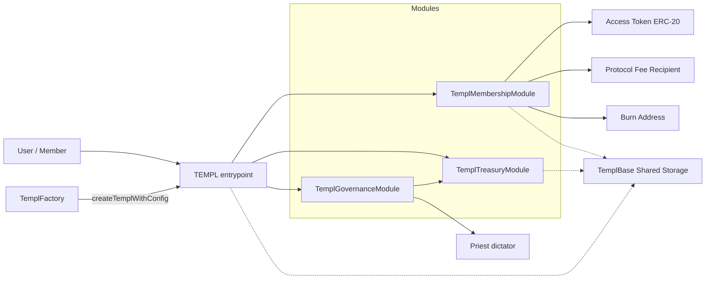

# templ.fun Protocol Overview

## What It Does
- templ.fun lets communities spin up private “templ” groups that collect an access-token treasury, stream rewards to existing members, and govern configuration or payouts on-chain.
- Each templ is composed from three delegatecall modules – membership, treasury, and governance – orchestrated by the root [`TEMPL`](contracts/TEMPL.sol) contract. All persistent state lives in [`TemplBase`](contracts/TemplBase.sol), so modules share storage and act like facets of a single contract.
- Deployers can apply join-fee curves, referral rewards, proposal fees, and dictatorship (priest) overrides. Governance maintains control after launch by voting on configuration changes or treasury actions.

## Protocol At A Glance

- Components: [`TEMPL`](contracts/TEMPL.sol) entrypoint delegating to [`TemplMembershipModule`](contracts/TemplMembership.sol), [`TemplTreasuryModule`](contracts/TemplTreasury.sol), and [`TemplGovernanceModule`](contracts/TemplGovernance.sol) with shared storage in [`TemplBase`](contracts/TemplBase.sol).
- Token & Join: ERC‑20 `accessToken`; `entryFee` ≥ 10 and divisible by 10; each join updates the next fee via the pricing curve from [`TemplCurve.sol`](contracts/TemplCurve.sol).
- Fee Splits: burn/treasury/member plus protocol must sum to 10_000 bps; defaults (with `protocolBps`=1_000) are 3_000/3_000/3_000/1_000.
- Fees: `proposalCreationFeeBps` and `referralShareBps` configurable via governance.
- Governance: default `quorumBps`=3_300; `executionDelayAfterQuorum`=7 days; one vote per member; join‑sequence snapshots enforce eligibility; dictatorship toggle via priest.
- Limits/Pauses: optional `maxMembers` (factory default 249); auto‑pauses at cap; `joinPaused` toggleable.
- Treasury Ops: withdraw/disband, config/split/entry fee/curve updates, metadata, priest changes.
- Factory: [`TemplFactory`](contracts/TemplFactory.sol) with `setPermissionless`, `createTempl`, `createTemplFor`, `createTemplWithConfig`.

### Architecture Overview



Architecture map (see more at [Module Responsibilities](#module-responsibilities))
- `TEMPL` (router): Entry point that routes calls to modules via delegatecall and exposes selector→module lookup.
- Membership: Joins, fee split accounting, member rewards accrual/claims, join snapshots.
- Treasury: DAO/priest actions for withdrawals, disbands, config/split/fee/curve/metadata/priest updates.
- Governance: Proposal create/vote/execute, quorum and delay tracking, dictatorship toggle, external calls.
- TemplBase (shared storage): Single storage layout and helpers used by all modules through delegatecall.

What “TemplBase Shared Storage” means
- All persistent state is declared in [`TemplBase`](contracts/TemplBase.sol). Because modules execute via `delegatecall`, they read/write the same storage as `TEMPL`.
- This pattern keeps module code small and composable while behaving like one contract from a state perspective.
- It centralizes helpers (entry‑fee curves, safe token transfers, reward math) and ensures storage layout consistency across modules.
- Standards note: This is a diamond‑style modular architecture (EIP‑2535–inspired) using `delegatecall` and shared storage. It is not a full EIP‑2535 implementation (no `diamondCut`/loupe and modules are wired once in the constructor), and it is not an ERC; it’s a common Solidity composition pattern.

## Deployment Flow & Public Interfaces
The canonical workflow deploys shared modules once, followed by a factory and any number of templ instances. The snippets below assume a Hardhat project (`npx hardhat console` or scripts that import `hardhat`) using ethers v6.

### Deployment Sequence


1. **Deploy the shared modules**
   ```js
   const Membership = await ethers.getContractFactory("TemplMembershipModule");
   const membershipModule = await Membership.deploy();
   await membershipModule.waitForDeployment();

   const Treasury = await ethers.getContractFactory("TemplTreasuryModule");
   const treasuryModule = await Treasury.deploy();
   await treasuryModule.waitForDeployment();

   const Governance = await ethers.getContractFactory("TemplGovernanceModule");
   const governanceModule = await Governance.deploy();
   await governanceModule.waitForDeployment();
   ```
   These modules map directly to [`contracts/TemplMembership.sol`](contracts/TemplMembership.sol), [`contracts/TemplTreasury.sol`](contracts/TemplTreasury.sol), and [`contracts/TemplGovernance.sol`](contracts/TemplGovernance.sol). They are pure logic contracts; all storage lives in [`contracts/TemplBase.sol`](contracts/TemplBase.sol).

2. **Deploy the factory**
   ```js
   const protocolFeeRecipient = "0x..."; // collects protocol share of each join
   const protocolBps = 1_000;            // 10% (expressed in basis points)

   const Factory = await ethers.getContractFactory("TemplFactory");
   const factory = await Factory.deploy(
     protocolFeeRecipient,
     protocolBps,
     await membershipModule.getAddress(),
     await treasuryModule.getAddress(),
     await governanceModule.getAddress()
   );
   await factory.waitForDeployment();
   ```
   Constructor parameters (see [`contracts/TemplFactory.sol`](contracts/TemplFactory.sol)):
   - `protocolFeeRecipient`: receives the protocol’s share of every join.
   - `protocolBps`: splitter share (basis points) kept by the protocol. All templ splits must sum to 10_000, so templ-level burn/treasury/member shares must account for this.
   - Module addresses: delegatecall targets for every templ the factory deploys.

3. **Create a templ instance**
   ```js
   const templTx = await factory.createTemplWithConfig({
     priest: "0xPriest...",                 // auto-enrolled administrator (priest)
     token: "0xAccessToken...",             // ERC-20 used for joins / treasury accounting
     entryFee: ethers.parseUnits("100", 18),// base entry fee (must be ≥10 and divisible by 10)
     burnBps: -1,                           // burn share (bps), -1 keeps factory default
     treasuryBps: -1,                       // treasury share (bps), -1 keeps factory default
     memberPoolBps: -1,                     // member pool share (bps), -1 keeps factory default
     quorumBps: 3_300,                      // YES votes required for quorum (basis points)
     executionDelaySeconds: 7 * 24 * 60 * 60,// execution delay after quorum (seconds)
     burnAddress: ethers.ZeroAddress,       // burn destination (defaults to 0x...dEaD)
     priestIsDictator: false,               // true lets the priest bypass governance
     maxMembers: 250,                       // optional membership cap (0 = uncapped)
     curveProvided: true,                   // provide custom curve instead of factory default
     curve: {
       primary: { style: 2, rateBps: 11_000, length: 0 }, // exponential tail (infinite length)
       additionalSegments: []              // optional extra segments (empty keeps single segment)
     },
     name: "MOG MOGGERS",                   // templ metadata surfaced to UIs
     description: "mog or get mogged",      // metadata short description (can be empty)
     logoLink: "https://example.com/logo.png",// metadata image (can be empty)
     proposalFeeBps: 500,                   // 5% of the current entry fee charged per proposal
     referralShareBps: 500                  // 5% of the member-pool allocation paid to referrals
   });
   const receipt = await templTx.wait();
   const templAddress = receipt.logs.find(log => log.eventName === "TemplCreated").args.templ;
   ```

   Key configuration knobs (resolved inside [`TemplFactory`](contracts/TemplFactory.sol) and [`TEMPL`](contracts/TEMPL.sol)):
   - `priest`: auto-enrolled member with the ability to toggle dictatorship or act before governance is active.
   - `token`: ERC-20 used for joins, rewards, and treasury balances.
   - `entryFee`: initial fee (must be ≥10 and divisible by 10). The pricing curve adjusts the next `entryFee` after each successful join.
   - `burnBps/treasuryBps/memberPoolBps`: fee split (basis points) between burn address, templ treasury, and member rewards pool. Must sum with `protocolBps` to 10_000.
   - `quorumBps`: minimum YES threshold (basis points) to satisfy quorum.
   - `executionDelaySeconds`: waiting period after quorum before execution can occur.
   - `burnAddress`: recipient of the burned allocation (default: `0x...dEaD`).
   - `priestIsDictator`: if true, governance functions are priest-only until the dictator disables it.
   - `maxMembers`: optional membership cap that auto-pauses joins when reached.
   - `curveProvided`: set to `true` when supplying a custom `CurveConfig`; otherwise the factory default is applied.
   - `curve`: `CurveConfig` describing how the entry fee evolves. The factory ships an exponential default; additional segments can model piecewise-linear or static phases. See [`contracts/TemplCurve.sol`](contracts/TemplCurve.sol) for enum definitions.
   - `proposalFeeBps`: optional fee (basis points) deducted from the proposer’s wallet and credited to the templ treasury when a proposal is created.
   - `referralShareBps`: portion of the member pool allocation paid to a referrer on each join.

Once the templ is live, all user interactions flow through the deployed [`TEMPL`](contracts/TEMPL.sol) address, which delegates to the module responsible for the invoked selector. The [`TemplFactory`](contracts/TemplFactory.sol) can be toggled to permissionless mode via `setPermissionless` to allow anyone to deploy new templs.

### Hardhat Deployment Scripts
The repository ships end-to-end scripts at the repository root that mirror the sequence above:

- [`scripts/deploy-factory.cjs`](scripts/deploy-factory.cjs) – Deploys the shared modules (if addresses aren’t supplied via env vars) and produces a wired `TemplFactory`.
- [`scripts/deploy-templ.cjs`](scripts/deploy-templ.cjs) – Uses an existing factory (or deploys one with modules) to instantiate a templ and dumps a deployment artifact under `deployments/`.
- [`scripts/verify-templ.cjs`](scripts/verify-templ.cjs) – Utility for reconstructing constructor arguments and verifying a templ instance on chain.

Example commands (environment variables follow the same names used inside each script):

```bash
# Deploy shared modules + factory (examples use Base mainnet; adjust --network as needed)
PROTOCOL_FEE_RECIPIENT=0xYourRecipient \
PROTOCOL_BP=1000 \
npx hardhat run --network base scripts/deploy-factory.cjs

# Deploy a templ via factory (token, priest, fee splits, etc. come from env)
FACTORY_ADDRESS=0xFactoryFromPreviousStep \
TOKEN_ADDRESS=0xAccessToken \
ENTRY_FEE=100000000000000000000 \
TEMPL_NAME="templ.fun OG" \
TEMPL_DESCRIPTION="Genesis collective" \
npx hardhat run --network base scripts/deploy-templ.cjs

# Verify the factory (on Basescan for chain 8453)
npx hardhat verify --network base 0xFactoryFromPreviousStep 0xYourRecipient 1000 0xMembershipModule 0xTreasuryModule 0xGovernanceModule

# Verify a templ (script auto-reconstructs constructor args)
npx hardhat run --network base scripts/verify-templ.cjs --templ 0xYourTempl --factory 0xFactoryFromPreviousStep
```

Refer to the inline env-variable docs in `scripts/deploy-factory.cjs` and `scripts/deploy-templ.cjs` for the latest configuration options and verification helpers.

## Module Responsibilities

### Delegatecall Routing


- **[TemplMembershipModule](contracts/TemplMembership.sol)**
  - Handles joins (with optional referrals), distributes entry-fee splits, accrues member rewards, and exposes read APIs for membership state and treasury summaries.
  - Maintains join sequencing to enforce governance eligibility snapshots and reports cumulative burns (`getTreasuryInfo` → `burned`).

- **[TemplTreasuryModule](contracts/TemplTreasury.sol)**
  - Provides governance-controlled treasury actions: withdrawals, disbands to member/external pools, priest changes, metadata updates, referral/proposal-fee adjustments, and entry-fee curve updates.
  - Surfaces helper actions such as cleaning empty external reward tokens.

- **[TemplGovernanceModule](contracts/TemplGovernance.sol)**
  - Manages proposal lifecycle (creation, voting, execution), quorum/eligibility tracking, dictatorship toggles, and external call execution with optional ETH value.
  - Exposes proposal metadata, snapshot data, join sequence snapshots, voter state, and active proposal pagination.

- **[TemplFactory](contracts/TemplFactory.sol)**
  - Normalizes deployment config, validates split sums (bps), enforces permissionless toggles, and emits creation metadata (including curve details).
  - Stores `TEMPL` init code across chunks to avoid large constructor bytecode.

These components share [`TemplBase`](contracts/TemplBase.sol), which contains storage, shared helpers (entry-fee curves from [`TemplCurve.sol`](contracts/TemplCurve.sol), reward accounting), and cross-module events.

### Economics & Flows

Joins and fee distribution with optional referral:


Entry fee curve mechanics (see [`contracts/TemplCurve.sol`](contracts/TemplCurve.sol)):


### Quick Reference
- **Testing:** `npx hardhat test` (default), `npx hardhat coverage` for coverage, `npm run slither` for static analysis.
- **Treasury Insights:** `getTreasuryInfo()` returns `(treasuryAvailable, memberPool, protocolFeeRecipient, totalBurned)`.
- **Entry Fee Curves:** configure piecewise segments (`CurveConfig`) in [`TemplCurve.sol`](contracts/TemplCurve.sol) to unlock linear or exponential pricing after a given number of joins.
- **Proposal Fees:** governance updates them via `setProposalCreationFeeBpsDAO` (see [`TemplTreasury.sol`](contracts/TemplTreasury.sol)); the templ contract auto-collects the fee (in the access token) before recording a proposal.

### Core Interfaces
- Membership (from [`TemplMembershipModule`](contracts/TemplMembership.sol)):
  - Actions: `join()`, `joinWithReferral(address)`, `joinFor(address)`, `joinForWithReferral(address,address)`, `claimMemberRewards()`, `claimExternalReward(address)`.
  - Views: `getClaimableMemberRewards(address)`, `getExternalRewardTokens()`, `getExternalRewardState(address)`, `getClaimableExternalReward(address,address)`, `isMember(address)`, `getJoinDetails(address)`, `getTreasuryInfo()`, `getConfig()`, `getMemberCount()`, `totalJoins()`, `getVoteWeight(address)`.
  - `getConfig()` returns `(accessToken, entryFee, joinPaused, totalJoins, treasuryAvailable, memberPoolBalance, burnBps, treasuryBps, memberPoolBps, protocolBps)`.
- Treasury (from [`TemplTreasuryModule`](contracts/TemplTreasury.sol), callable by DAO via governance or priest during dictatorship):
  - `withdrawTreasuryDAO(address token, address recipient, uint256 amount, string reason)`
  - `disbandTreasuryDAO(address token)`
  - `updateConfigDAO(address tokenOrZero, uint256 newEntryFeeOrZero, bool applySplit, uint256 burnBps, uint256 treasuryBps, uint256 memberPoolBps)`
  - `setMaxMembersDAO(uint256)`, `setJoinPausedDAO(bool)`, `changePriestDAO(address)`, `setDictatorshipDAO(bool)`, `setTemplMetadataDAO(string,string,string)`, `setProposalCreationFeeBpsDAO(uint256)`, `setReferralShareBpsDAO(uint256)`, `setEntryFeeCurveDAO(CurveConfig,uint256)`
  - DAO-only helper: `cleanupExternalRewardToken(address)` — removes an exhausted external reward token slot once balances are fully settled.
- Governance (from [`TemplGovernanceModule`](contracts/TemplGovernance.sol)):
  - Create proposals: `createProposalSetJoinPaused`, `createProposalUpdateConfig`, `createProposalWithdrawTreasury`, `createProposalDisbandTreasury`, `createProposalCleanupExternalRewardToken`, `createProposalChangePriest`, `createProposalSetDictatorship`, `createProposalSetMaxMembers`, `createProposalUpdateMetadata`, `createProposalSetProposalFeeBps`, `createProposalSetReferralShareBps`, `createProposalSetEntryFeeCurve`, `createProposalCallExternal`.
  - Vote/execute: `vote(uint256,bool)`, `executeProposal(uint256)`, `pruneInactiveProposals(uint256)`.
  - Views: `getProposal(uint256)`, `getProposalSnapshots(uint256)`, `getProposalJoinSequences(uint256)`, `getActiveProposals()`, `getActiveProposalsPaginated(uint256,uint256)`, `hasVoted(uint256,address)`.

### Root Contract Introspection (from [`TEMPL`](contracts/TEMPL.sol))
- `getModuleForSelector(bytes4)` — returns the module address responsible for a given function selector.

### Factory API (from [`TemplFactory`](contracts/TemplFactory.sol))
- `setPermissionless(bool)` — toggles who may call create functions (deployer-only vs anyone).
- `createTempl(address token, uint256 entryFee, string name, string description, string logoLink)` → `address`
- `createTemplFor(address priest, address token, uint256 entryFee, string name, string description, string logoLink, uint256 proposalFeeBps, uint256 referralShareBps)` → `address`
- `createTemplWithConfig(CreateConfig)` → `address`

### Behavior Notes
- Dictatorship mode (`priestIsDictator`) allows the priest to call `onlyDAO` functions directly. Otherwise, all `onlyDAO` actions are executed by governance via `executeProposal`.
- `maxMembers` caps membership. When the cap is reached, `joinPaused` auto-enables; unpausing doesn’t remove the cap.
- External-call proposals can execute arbitrary calls with optional ETH; they should be used cautiously.
- Only priest-initiated disband proposals are quorum‑exempt; this exists to safely unwind inactive templs without bricking governance, distributing treasury evenly across members (still requires YES greater than NO).

### Proposal Lifecycle


### Dictatorship Gate (onlyDAO)


### Snapshot-Based Voting Eligibility (example)


