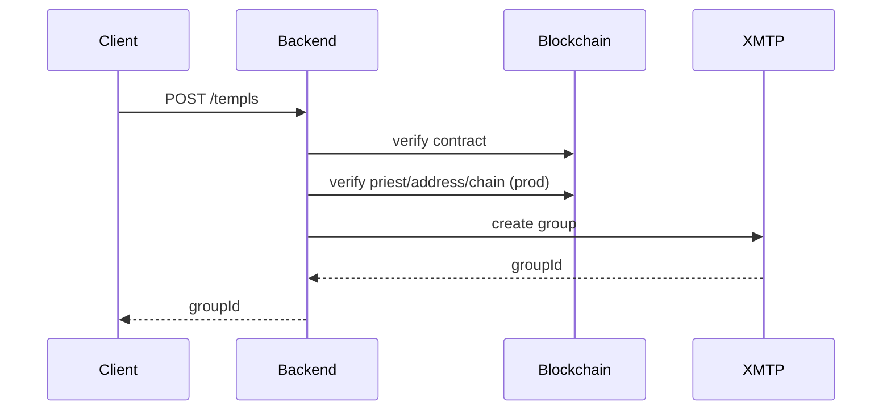
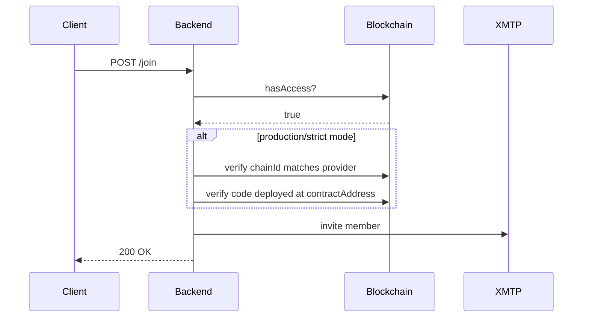

# TEMPL Backend

See the [README](../README.md#architecture) for how the backend fits into TEMPL and the flows in [CORE_FLOW_DOCS.MD](./CORE_FLOW_DOCS.MD); this document covers setup, configuration, and operations.

## Setup
Install dependencies:

```bash
npm --prefix backend ci
```

## Environment variables

| Variable | Purpose | Default |
| --- | --- | --- |
| `RPC_URL` | RPC endpoint for on-chain reads and writes | — |
| `PORT` | HTTP port for the API service | `3001` |
| `BOT_PRIVATE_KEY` | Private key for the XMTP invite-bot wallet | auto-generated (persisted) |
| `ALLOWED_ORIGINS` | Comma-separated CORS origins | `http://localhost:5173` |
| `ENABLE_DEBUG_ENDPOINTS` | Expose debug endpoints when set to `1` | `0` |
| `XMTP_ENV` | XMTP network (`dev`, `production`, `local`) | `dev` |
| `REQUIRE_CONTRACT_VERIFY` | When `1`, `/templs` verifies target is a deployed contract | `0` |
| `BACKEND_DB_ENC_KEY` | 32-byte hex string to encrypt the XMTP Node DB; if omitted, a key is derived from the bot private key and env | — |
| `XMTP_BOOT_MAX_TRIES` | Max boot retries for XMTP client initialization | `30` |
| `XMTP_METADATA_UPDATES` | Set to `0` to skip name/description updates on groups | `1` |
| `BACKEND_SERVER_ID` | String identifier included in EIP‑712 messages; must match frontend `VITE_BACKEND_SERVER_ID` | — |

### Optional variables

| Variable | Purpose | Default |
| --- | --- | --- |
| `LOG_LEVEL` | Pino log level (`info`, `debug`, etc.) | `info` |
| `RATE_LIMIT_STORE` | Rate limit store (`memory` or `redis`) | auto (uses `redis` when `REDIS_URL` is set; else `memory`) |
| `REDIS_URL` | Redis URL for distributed rate limiting | — |
| `DISABLE_XMTP_WAIT` | Skip XMTP readiness checks in tests (keep `0` in prod) | `0` |
| `XMTP_MAX_ATTEMPTS` | Limit XMTP client rotation attempts | `20` (set to override) |
| `DB_PATH` | Custom SQLite path for group metadata | `backend/groups.db` |
| `EPHEMERAL_CREATOR` | When `1` (default and recommended), create groups with a fresh, throwaway key | `1` |
| `CLEAR_DB` | Wipe database on startup (dev-only; leave `0` in prod) | `0` |

See [README.md#environment-variables](../README.md#environment-variables) for minimal setup variables and [PERSISTENCE.md](./PERSISTENCE.md) for database details.
Startup fails without `RPC_URL`. If `BOT_PRIVATE_KEY` is not provided, the server generates one on first boot and persists it in SQLite (table `kv`, key `bot_private_key`) so the invite-bot identity stays stable across restarts.
`XMTP_ENV` selects the network (`dev`, `production`, `local`).
`ALLOWED_ORIGINS` configures CORS (default `http://localhost:5173`).
`LOG_LEVEL` controls Pino verbosity (default `info`).
`XMTP_MAX_ATTEMPTS` defaults to `20`, matching the retry budget passed to `createXmtpWithRotation`; raise or lower it when you need to rotate through more installation slots.
When `REQUIRE_CONTRACT_VERIFY=1` (or `NODE_ENV=production`), the server requires a provider and will:
  - Verify contract code is deployed at `contractAddress`.
  - Ensure the typed `chainId` matches the provider’s `chainId`.
  - Check that `priestAddress` equals `await contract.priest()` on-chain when creating groups.

### Rate limiting

The API rate-limits requests.
- In development and tests, it uses the in-memory store.
- In production, when `REDIS_URL` is set, it automatically uses Redis (no extra config needed).
- To force Redis explicitly, set `RATE_LIMIT_STORE=redis` and provide `REDIS_URL`.
- If Redis is unavailable or misconfigured, it safely falls back to memory and logs a warning. Avoid memory in production as it is not resilient or horizontally scalable.

## Development
Start the API service:

```bash
npm --prefix backend start
```

### Logging
Logging uses [Pino](https://github.com/pinojs/pino) (JSON to `stdout`; `LOG_LEVEL` controls verbosity and defaults to `info`). Pipe through `pino-pretty` in dev or redirect to a file in production.

## Tests & Lint

```bash
npm --prefix backend test
npm --prefix backend run lint
```

## Architecture
- **Ownership** – Groups are created by an ephemeral wallet (fresh key per group) and then managed by a single persistent invite-bot identity. The ephemeral creator key is not persisted ("burned") after creation. The invite-bot is only used to invite members; it is not intended to hold admin powers like banning.
- **Endpoints**
- `POST /templs` – create a group for a deployed contract; if a `connectContract` factory is supplied the backend also watches governance events.
- `POST /join` – verify `hasAccess` on-chain and invite the wallet.
  - `POST /delegateMute` – priest assigns mute rights to a member.
  - `DELETE /delegateMute` – revoke a delegate's mute rights.
  - `POST /mute` – priest or delegate records an escalating mute for a member.
  - `GET /mutes` – list active mutes for a contract so the frontend can hide messages.
- **Dependencies** – XMTP JS SDK and an on-chain provider; event watching requires a `connectContract` factory.
- **Persistence** – group metadata persists to a SQLite database at `backend/groups.db` (or a custom path via `createApp({ dbPath })` in tests). The database is read on startup and updated when groups change; back it up to avoid losing state.
- **On‑chain surface** – proposal allowlist and events are defined in the contracts. See [CONTRACTS.md](./CONTRACTS.md#governance) for allowed actions and events mirrored into chat.

When watching governance events, the backend relays:
- `ProposalCreated(id, proposer, endTime)` → sends `{ type: 'proposal', id, proposer, endTime }` to the group. Human‑readable metadata (title/description) is not on‑chain and should be sent by clients as a regular XMTP message alongside the id.
- `VoteCast(id, voter, support, timestamp)` → sends `{ type: 'vote', id, voter, support, timestamp }`.
- `PriestChanged(oldPriest, newPriest)` → updates the stored priest, deletes all delegate rows, clears the mute table for that contract, and announces `{ type: 'priest-changed', ... }` in chat so a new priest always starts from a clean moderation slate.

### Endpoint flows

#### Group creation (`/templs`)



#### Member join (`/join`)



### XMTP client details
- Client uses `appVersion` for diagnostics.
- Invitations require real inboxIds; the server resolves them and waits for visibility before inviting.
- After creation or join it syncs and records XMTP stats.
- The XMTP Node DB uses SQLCipher with a 32-byte key. Provide `BACKEND_DB_ENC_KEY` or a key is derived from the bot private key and environment; avoid zero-keys in production.
 - When `EPHEMERAL_CREATOR` is enabled (default), `/templs` uses a fresh XMTP identity to create the group and set metadata. The server’s invite-bot identity is included as a member at creation time and used only for invitations thereafter.

### Debug endpoints
When `ENABLE_DEBUG_ENDPOINTS=1`, these endpoints assist tests and local debugging:
- `GET /debug/group?contractAddress=<addr>&refresh=1` – returns server inboxId, stored/resolved groupId, and (when available) members.
- `GET /debug/conversations` – returns a count and the first few conversation ids seen by the server.
- `GET /debug/membership?contractAddress=<addr>&inboxId=<id>` – whether server group view contains `inboxId`.
- `GET /debug/last-join` – last join metadata (consumed by e2e diagnostics; the frontend may re-register via `/templs` and retry `/join` automatically when this endpoint shows a missing contract).
- `GET /debug/inbox-state?inboxId=<id>&env=<local|dev|production>` – raw XMTP inbox state.
 - `POST /debug/send` – send a free‑form message to a group's conversation (for discovery warmup and diagnostics).

#### Running against a local XMTP node
See the [E2E Environments](../README.md#e2e-environments) section of the README for full setup details. In short, setting `E2E_XMTP_LOCAL=1` starts `xmtp-local-node` and sets `XMTP_ENV=local`; otherwise Playwright runs against XMTP production with a random `BOT_PRIVATE_KEY`.

## Security considerations
- All state-changing endpoints require EIP‑712 typed signatures (with `chainId`, `nonce`, `issuedAt`, `expiry`). The backend verifies signatures and enforces replay protection by recording used signatures in SQLite.
- The service resolves XMTP inboxIds server-side; client-provided inboxIds are ignored in normal environments. In local/test fallback modes (e.g., E2E), if network resolution is unavailable the server may deterministically accept a provided inboxId or generate one to keep tests moving.
- The bot key must be stored securely; compromise allows muting or invitation of arbitrary members.
- Governance events are forwarded to the group chat; untrusted RPC data could mislead voters.
- RPC responses are assumed honest; use a trusted provider.

### Production Checklist
- `NODE_ENV=production` and `REQUIRE_CONTRACT_VERIFY=1` (enforce chainId/code/priest checks).
- `BACKEND_DB_ENC_KEY` must be set (32-byte hex) to encrypt the XMTP Node DB. The server refuses to boot without it in production.
- Set and align `BACKEND_SERVER_ID` with `VITE_BACKEND_SERVER_ID` so signatures are bound to this server.
### Additional endpoints

- `GET /templs` – list known TEMPLs from persistence. Returns `{ templs: [{ contract, priest } ...] }` by default; add `?include=groupId` to include `groupId` in each record.

### Debug endpoints
- Do not enable any test‑only flags in production (e.g., `DISABLE_XMTP_WAIT`).

## Runbooks

### Regenerate the invite-bot key
1. **Announce downtime** – group invites will pause while the bot identity rotates.
2. **Stop the backend** service.
3. **Back up `backend/groups.db`**: `cp backend/groups.db backend/groups.db.bak.$(date +%s)`.
4. **Choose the key source**:
   - Supply a freshly generated key by exporting `BOT_PRIVATE_KEY` (e.g., `export BOT_PRIVATE_KEY=$(node -e "const { ethers } = require('ethers'); console.log(ethers.Wallet.createRandom().privateKey);")`).
   - Or update the persisted value directly: `sqlite3 backend/groups.db "DELETE FROM kv WHERE key='bot_private_key';"` (the backend will auto-generate and store a new key at boot when the entry is absent).
5. **Restart the backend**. On boot it logs the invite-bot address; confirm that the address matches expectations and that `/templs` returns existing groups.
6. **Verify invites** by running a join test wallet through `POST /join`. If the old identity should no longer be trusted, purge any cached XMTP credentials for it.

### Seed or rotate `BACKEND_DB_ENC_KEY`
1. **Generate a 32-byte hex key**: `export BACKEND_DB_ENC_KEY=$(openssl rand -hex 32)`.
2. **Stop the backend** service.
3. **If this is the first key**: set the variable in your process manager (systemd, PM2, etc.) and restart the service. The SQLite/XMTP database will be encrypted with that key moving forward.
4. **If rotating an existing key**: the existing database must be re-encrypted. Back up `backend/groups.db`, then wipe it (`rm backend/groups.db*`) so the backend recreates it with the new key. After boot, re-register templs with `/templs` so state is repopulated.
5. **Restart the backend** and confirm the server logs “Using provided BACKEND_DB_ENC_KEY”.

### XMTP outage response
1. **Detect symptoms** – watch application logs for repeated `XMTP boot not ready`, `Member identity not registered`, or add-member failures.
2. **Check XMTP status** – use `npx @xmtp/probe status --env ${XMTP_ENV:-dev}` (or your internal monitoring) to confirm the network issue.
3. **Drain join traffic** – surface maintenance mode (HTTP 503) by temporarily setting `REQUIRE_CONTRACT_VERIFY=1` and `DISABLE_XMTP_WAIT=0` while returning a custom message from your load balancer, or shut down `/join` at the edge.
4. **Stabilize the bot** – restart the backend once to clear any stalled rotations. Watch for `XMTP boot not ready` log repetition; if it persists, increase `XMTP_BOOT_MAX_TRIES` and ensure the bot wallet still has an available installation slot.
5. **Recover conversations** – after XMTP resolves the incident, run `curl -s http://localhost:3001/templs?include=groupId` to verify groups are synced, then trigger a manual `POST /join` with a test wallet to confirm invites succeed.
6. **Post-incident** – re-enable regular traffic, rotate logs, and capture metrics (duration, impacted wallets) for follow-up.
