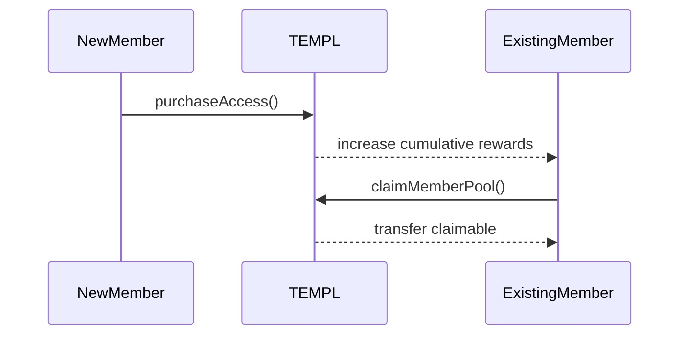
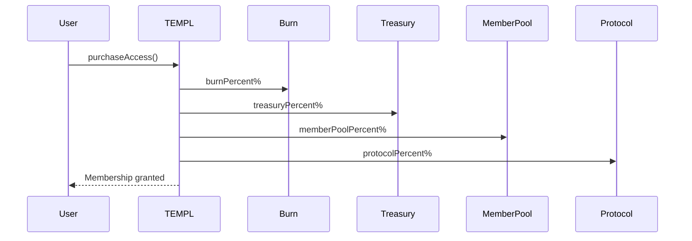
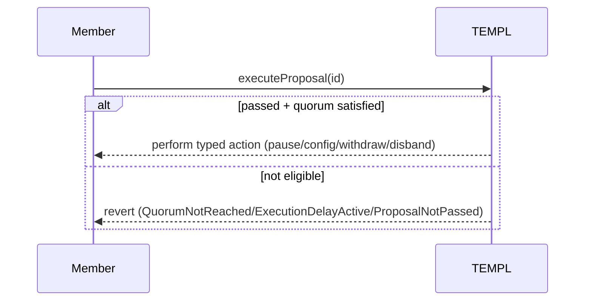

# Templ Contracts

Use this guide to understand the on-chain modules that handle membership, fee splits, and governance. Pair it with the flow diagrams to connect function names with runtime behavior.

## What this document covers

- Module layout and how responsibilities split across `TemplBase`, `TemplMembership`, `TemplTreasury`, `TemplGovernance`, `TEMPL`, and `TemplFactory`.
- Tribute economics for entry fees, reward remainders, and external reward pools.
- Governance constraints: proposal lifecycle, quorum, execution, and allowed actions.
- Deployment hooks and invariants auditors bless.

## At a glance

- Creation: `TemplFactory.createTempl` / `createTemplWithConfig` (sets splits, priest, optional cap/home link).
- Membership: `purchaseAccess`, `claimMemberPool`, `hasAccess`, `getMemberCount`.
- Governance: create/vote/execute typed proposals; post‑quorum delay; optional dictatorship mode.
- Treasury: `withdrawTreasuryDAO`, `disbandTreasuryDAO`, donations supported.
- Caps & Pausing: `setMaxMembersDAO`, `setPausedDAO`; disband proposals do not block joins.
- Views: `getConfig`, `getTreasuryInfo`, `getProposal*`, `getExternalReward*`.
- Events/Errors: emitted for all lifecycle actions; see the lists below and `contracts/TemplErrors.sol`.

## Overview

Solidity 0.8.23. Core contract lives in `contracts/TEMPL.sol` with shared errors in `contracts/TemplErrors.sol`. See `README.md#architecture` for the high-level system view; this document reflects the exact on-chain behavior and interfaces.

### Module layout

Each module handles a focused responsibility:

- `TemplBase`: shared storage layout, immutables, counters, events, and modifiers (including the `priestIsDictator` flag that toggles priest-only governance). It also stores the templ's canonical home link (`templHomeLink`) and emits `TemplHomeLinkUpdated` whenever governance changes it. All other modules inherit it, so audits can focus on a single storage contract.
- `TemplMembership`: membership lifecycle (`purchaseAccess`, claims, view helpers) and accounting for the member pool.
- `TemplTreasury`: governance-callable treasury/config/priest handlers and their internal helpers, including member limit management via `setMaxMembersDAO`.
- `TemplGovernance`: proposal creation, voting/quorum logic, execution router, and governance view helpers.
- `TEMPL`: thin concrete contract wiring the constructor requirements (`priest`, `protocolFeeRecipient`, `token`, `entryFee`, fee splits) and exposing the payable `receive` hook. The constructor auto-enrols the deploying priest as the founding member so the pioneer member-pool allocation immediately accrues to them.
- `TemplFactory`: immutable protocol recipient/percentage plus helpers that deploy templ instances with per-templ burn/treasury/member splits. Deployment structs include an initial `homeLink` string propagated into each `TEMPL` at construction.

## Entry-fee economics

Entry fees follow a fixed protocol share; each deployment chooses how the remaining percentages split:

- **Burn (`burnPercent`)** - transferred to the templ’s configured burn address (defaults to `0x000000000000000000000000000000000000dEaD`).
- **Treasury (`treasuryPercent`)** - retained on the contract and counted in `treasuryBalance`. Additional donations accrue to the contract balance and remain governable via `withdrawTreasuryDAO` / `disbandTreasuryDAO`.
- **Member Pool (`memberPoolPercent`)** - retained on the contract and counted in `memberPoolBalance`; claimable by existing members through `claimMemberPool()`.
- **Protocol (`protocolPercent`)** - forwarded to the immutable `protocolFeeRecipient`. The percentage is chosen when the factory is deployed (10% in our sample scripts) and applies to every TEMPL created by that factory.

The percentages must sum to 100%. On-chain these values are stored as basis points (BPS), so `30%` is represented as `3_000` and an even split of `30/30/30/10` becomes `3_000/3_000/3_000/1_000`. When a new member joins, existing members receive `floor(memberPoolShare / (n-1))` tokens each (where `n` is the new member count). Indivisible remainders accumulate in `memberRewardRemainder` and are rolled into the next distribution.

The zero-member edge case (reachable only in harnessed tests) simply parks the would-be member-pool slice in `memberPoolBalance` with no immediate reward accrual. Live deployments always start with the priest counted as member zero, so the first paid join streams its pool share exclusively to the priest. If a harness clears the list and a new wallet joins before anyone else exists, that pioneer can later reclaim their entire fee minus burn/protocol as soon as another member arrives because the balance sits in the pool awaiting the next pro-rata update.

### Member pool mechanics

- Accrual: Each purchase increases `memberPoolBalance` and `cumulativeMemberRewards`; members track a `rewardSnapshot` at their join time and on claim.
- Claim: `claimMemberPool()` transfers the unclaimed delta and advances the snapshot. Reverts with `NoRewardsToClaim` if zero or `InsufficientPoolBalance` if not enough distributable tokens (excludes remainder).
- Donations: Anyone may donate ETH or ERC-20 to the contract. Governance may move donations and the entry-fee treasury share, but member pool balances are not withdrawable except via disbanding into the pool.
- Remainders: Any indivisible leftovers from reward calculations accumulate in `memberRewardRemainder` and are rolled into the next distribution (purchase or disband) so the pool eventually captures every token.

### External rewards pools

- Non access-token assets (ETH or arbitrary ERC-20s) donated to the contract can be distributed pro-rata to members.
- When governance executes `disbandTreasuryDAO(address token)` with `token != accessToken`, the available balance for that token is added to an external rewards pool tracked in `externalRewards[token]`.
- Members can inspect available tokens via `getExternalRewardTokens()` and per-token state via `getExternalRewardState(token)`.
- Individual shares are reported by `getClaimableExternalToken(member, token)` and withdrawn with `claimExternalToken(token)` (supports ETH via `address(0)`).
- Successful external claims emit `ExternalRewardClaimed(token, member, amount)` and reduce the tracked pool balance; snapshots ensure each member only receives their share once.
- To keep join costs bounded, the contract tracks at most 256 distinct external reward tokens; attempts to register additional tokens revert with `ExternalRewardLimitReached`.
- Anyone can call `cleanupExternalRewardToken(address token)` once an external pool balance and remainder reach zero; this clears the token from enumeration so future disbands can reuse the slot without governance overhead.

## Governance mechanics

- One member = one vote; ballots can be changed until eligibility windows close.
- One live proposal per address: creating a second while the first is active reverts `ActiveProposalExists`. The slot is cleared on execution, and expired proposals are cleared when a new one is created.
- Voting periods are chosen per proposal: passing `0` defaults to seven days, otherwise proposers may pick any duration between 7 and 30 days. These bounds live in `TemplBase` and are not controlled by factory configuration.
- Factory-configurable governance parameters cover quorum percentage and the `executionDelayAfterQuorum`; they apply uniformly to every templ deployed by the factory.
- Execution: Any address may call `executeProposal(id)`. Execution is atomic and non-reentrant.
- Typed proposals only (no arbitrary calls). The allowed actions are:
  - `setPausedDAO(bool)` - pause/unpause membership purchasing.
  - `updateConfigDAO(address,uint256,bool,uint256,uint256,uint256)` - update the entry fee (must remain >0 and multiple of 10) and, when `_updateFeeSplit` is true, adjust the burn/treasury/member percentages. The protocol split comes from the factory and cannot be changed. Token changes are disabled (`_token` must be `address(0)` or the current token), else `TokenChangeDisabled`.
  - `withdrawTreasuryDAO(address,address,uint256,string)` - withdraw a specific amount of any asset (access token, other ERC-20, or ETH with `address(0)`).
  - `changePriestDAO(address)` - change the priest address via governance; backends persist the new priest and announce it via Telegram notifications.
  - `disbandTreasuryDAO(address token)` - move the full available balance of `token` into a member-distributable pool. When `token == accessToken`, funds roll into the member pool (`memberPoolBalance`) with per-member integer division and any remainder added to `memberRewardRemainder`. When targeting any other ERC-20 or native ETH (`address(0)`), the amount is recorded in an external rewards pool so members can later claim their share with `claimExternalToken`.
  Remaining external dust is queued for the current cohort before new members join. Because distribution relies on integer division, nothing is emitted unless the remainder is large enough to pay every existing member at least one token; any leftover micro-units stay in `rewardRemainder` until a later disband or donation makes a clean split possible.
  Creating a disband proposal keeps membership open. Governance keeps the templ open to new joins while the vote unfolds, and snapshot accounting ensures existing members keep their share of the disbanded funds.
  - `setMaxMembersDAO(uint256 limit)` - set the membership cap. `0` keeps access unlimited; any positive limit pauses new joins once the count is reached. Reverts with `MemberLimitTooLow` when the requested limit is below the current member count. When the cap is hit, `purchaseAccess` auto-pauses the contract and future joins revert with `MemberLimitReached` until governance raises or clears the limit **and** subsequently unpauses the templ with `setPausedDAO(false)`.
  - `setTemplHomeLinkDAO(string newLink)` - update the templ’s canonical off-chain URL; emits `TemplHomeLinkUpdated` so UIs and bots sync immediately.
  - `setDictatorshipDAO(bool enabled)` - flip the `priestIsDictator` flag. This helper is callable through proposals in both directions; when dictatorship is active, the DAO helper also accepts direct calls from the priest (all other callers receive `PriestOnly`).
- Dictatorship toggle: while `priestIsDictator` is `true`, standard proposal entrypoints (`createProposal*`, `vote`, `executeProposal`) revert with `DictatorshipEnabled`. The dedicated `createProposalSetDictatorship(...)` path stays open so members can vote the system back to democracy.

### Quorum and eligibility

- Quorum threshold: `quorumPercent = 33` (33% yes votes of `eligibleVoters`).
- On creation: proposer auto-YES, and `eligibleVoters` snapshots the member count at proposal creation. If quorum is immediately satisfied, `quorumReachedAt` is set, `postQuorumEligibleVoters` matches the creation snapshot, and `endTime` is reset to the current timestamp plus `executionDelayAfterQuorum`.
- Before quorum: only members captured in the creation snapshot may vote; anyone joining later reverts with `JoinedAfterProposal` until quorum is reached.
- After quorum: a new snapshot is recorded (`postQuorumEligibleVoters` + `quorumSnapshotBlock`). Members who joined before that quorum transaction retain voting rights; later joiners are rejected with `JoinedAfterProposal`. Because Ethereum timestamps are per block, joins mined in the same block that reached quorum remain eligible. When quorum is later lost (YES votes drop below the threshold), execution reverts with `QuorumNotReached` until quorum support is restored.
- Execution requires a simple majority (`yesVotes > noVotes`) and:
  - if quorum is required: quorum must have been reached and maintained, and the contract’s configured `executionDelayAfterQuorum` must have elapsed (default 7 days; customisable via the factory); otherwise it reverts with `QuorumNotReached` or `ExecutionDelayActive`.
  - priest exception: `createProposalDisbandTreasury(...)` proposed by `priest` is quorum-exempt and respects only its `endTime`. This leniency is intentional so an inactive templ that can no longer reach quorum still has a deterministic path to wind down via the priest.

### Proposal types (create functions)

All create functions require `string title, string description` parameters so that proposal metadata lives on-chain alongside the action parameters:

- `createProposalSetPaused(bool paused, uint256 votingPeriod, string title, string description)`
- `createProposalUpdateConfig(uint256 newEntryFee, uint256 newBurnPercent, uint256 newTreasuryPercent, uint256 newMemberPoolPercent, bool updateFeeSplit, uint256 votingPeriod, string title, string description)` - set `updateFeeSplit = true` to apply the provided percentages; when false, the existing burn/treasury/member splits remain unchanged and only the fee (or paused state) is updated.
- `createProposalSetMaxMembers(uint256 newLimit, uint256 votingPeriod, string title, string description)` - set the member cap (use `0` to remove the limit). Reverts immediately with `MemberLimitTooLow` if the proposal attempts to lower the cap beneath the current membership count.
- `createProposalSetHomeLink(string newLink, uint256 votingPeriod, string title, string description)` - update the templ home link surfaced in the frontend and Telegram notifications.
- `createProposalWithdrawTreasury(address token, address recipient, uint256 amount, string reason, uint256 votingPeriod, string title, string description)`
- `createProposalChangePriest(address newPriest, uint256 votingPeriod, string title, string description)`
- `createProposalDisbandTreasury(address token, uint256 votingPeriod, string title, string description)` (`token` can be the access token, another ERC-20, or `address(0)` for ETH)
- `createProposalSetDictatorship(bool enable, uint256 votingPeriod, string title, string description)` - enable or disable priest dictatorship. This proposal type is always available, even when dictatorship is already active, and reverts with `DictatorshipUnchanged` if the requested mode matches the current state.

Proposals emit `ProposalCreated(id, proposer, endTime, title, description)` and the metadata is returned from `getProposal`, giving frontends and bots direct access to display text.

### Security notes

- Reentrancy: `purchaseAccess`, `claimMemberPool`, and `executeProposal` are non-reentrant.
- Purchase guard: `purchaseAccess` disallows calls from the DAO address itself (`InvalidSender`).
- Pausing: only blocks `purchaseAccess`; proposing and voting continue while paused.
- Token compatibility: access tokens must follow standard ERC-20 semantics. Fee-on-transfer ("taxed") tokens will corrupt fee splits and are unsupported.

## User-facing functions and views

- `purchaseAccess()` - one-time purchase; applies the templ’s configured burn/treasury/member percentages (plus the factory-defined protocol split) via `safeTransferFrom`. Requires balance ≥ entry fee and contract not paused. Fee-on-transfer/taxed tokens are unsupported because they desync treasury accounting. If no members are active (possible only in harnesses) the would-be member-pool slice is parked in the pool and carried forward until a second member arrives; otherwise the current cohort (starting with the auto-enrolled priest) accrues the pioneer allocation.
  When the membership cap is full (`MAX_MEMBERS` reached) the call reverts with `MemberLimitReached`, preventing late entrants from sneaking in during temporary manual unpauses.
- `vote(uint256 proposalId, bool support)` - cast or change a vote until eligible; emits `VoteCast`.
- `executeProposal(uint256 proposalId)` - performs the allowlisted action; emits `ProposalExecuted` and action-specific events.
- `claimMemberPool()` - withdraw accrued rewards; emits `MemberPoolClaimed`.
- `getActiveProposals()` - returns IDs of proposals within their active window.
- `getActiveProposalsPaginated(uint256 offset, uint256 limit)` - returns `(ids, hasMore)`; `limit` in [1,100], else `LimitOutOfRange`. `offset` skips the first `offset` active proposals (after filtering), keeping pagination stable even when the tracked active array contains lazily-pruned entries.
- `pruneInactiveProposals(uint256 maxRemovals)` - shrinks the tracked active set by removing proposals that have expired or executed; anyone can call it to keep views efficient.
- `getProposal(uint256 id)` - returns `(proposer, yesVotes, noVotes, endTime, executed, passed, title, description)` with `passed` computed according to quorum/delay rules and only when YES votes continue to satisfy quorum.
- `getProposalSnapshots(uint256 id)` - returns `(eligibleVotersPreQuorum, eligibleVotersPostQuorum, preQuorumSnapshotBlock, quorumSnapshotBlock, createdAt, quorumReachedAt)` so clients can reason about eligibility windows.
- `hasVoted(uint256 id, address voter)` - returns `(voted, support)`.
- `hasAccess(address user)` - returns membership status.
- `getPurchaseDetails(address user)` - returns `(purchased, timestamp, blockNum)`.
- `getTreasuryInfo()` - returns `(treasury, memberPool, protocolFeeRecipient)` where `treasury` is the UI-facing available access-token balance (`currentBalance(accessToken) - memberPoolBalance`, including donations). Historical fee splits (burn/treasury/member/protocol) are derived from `AccessPurchased` event logs off-chain.
- `totalPurchases()` - view helper exposing the number of successful joins, derived from the current member count (excludes the auto-enrolled priest).
- `getConfig()` - returns `(token, fee, isPaused, purchases, treasury, pool, burnPercent, treasuryPercent, memberPoolPercent, protocolPercent)`.
- `getMemberCount()` - number of members; `getVoteWeight(address)` - 1 if member else 0.
- External reward helpers:
  - `getExternalRewardTokens()` - list of ERC-20/ETH reward tokens that currently have tracked pools (excludes the access token).
  - `getExternalRewardState(address token)` - returns `(poolBalance, cumulativeRewards, remainder)` for the token’s reward distribution.
  - `getClaimableExternalToken(address member, address token)` - accrued share for `member` of the external token pool (0 for non-members or when no rewards are pending).

## State, events, errors

- Key immutables: `protocolFeeRecipient`, `accessToken`, `burnAddress`. Priest is changeable via governance.
- Key variables: `entryFee` (≥10 and multiple of 10), `paused`, `MAX_MEMBERS` (0 = unlimited; when a non-zero cap is reached the contract auto-pauses new joins until governance raises or clears the limit and then unpauses), `treasuryBalance` (tracks fee-sourced tokens only), `memberPoolBalance`, `priestIsDictator`, `cumulativeMemberRewards`, and lightweight membership metadata (`memberCount`, per-member snapshots). Fee-flow totals derive from `AccessPurchased` events off-chain instead of being persisted in storage.
- Governance constants: `quorumPercent` and `executionDelayAfterQuorum` are set during deployment (factory defaults 33% and 7 days, but overridable during templ creation) and remain immutable afterwards.
- External reward claims:
  - `claimExternalToken(address token)` - transfers the caller’s accrued share of the specified external token (ERC-20 or `address(0)` for ETH). Reverts with `NoRewardsToClaim` if nothing is available. Emitted `ExternalRewardClaimed` mirrors successful withdrawals.
- Events:
  - `AccessPurchased(purchaser,totalAmount,burnedAmount,treasuryAmount,memberPoolAmount,protocolAmount,timestamp,blockNumber,purchaseId)`
  - `MemberPoolClaimed(member,amount,timestamp)`
  - `MaxMembersUpdated(maxMembers)`
  - `ProposalCreated(proposalId,proposer,endTime,title,description)`
  - `VoteCast(proposalId,voter,support,timestamp)`
  - `ProposalExecuted(proposalId,success,returnData)`
  - `TreasuryAction(proposalId,token,recipient,amount,description)`
  - `ConfigUpdated(token,entryFee,burnPercent,treasuryPercent,memberPoolPercent,protocolPercent)`
  - `ContractPaused(isPaused)`
  - `TreasuryDisbanded(proposalId,token,amount,perMember,remainder)`
  - `ExternalRewardClaimed(token,member,amount)`
  - `PriestChanged(oldPriest,newPriest)`
  - `DictatorshipModeChanged(enabled)`
  - `TemplHomeLinkUpdated(previousLink,newLink)`
    - Backend listeners persist the new link and broadcast a Telegram alert so members always see the canonical home.
- Custom errors live in `contracts/TemplErrors.sol`; reference that file for the authoritative list when wiring revert expectations.

## Flows

### Membership Purchase

### Proposal Execution

## Configuration & Deployment

- Primary entrypoint is `TemplFactory(address protocolFeeRecipient, uint256 protocolPercent)`. Creating a new templ instance can rely on defaults (`createTempl(token, entryFee)`) or a custom struct (`createTemplWithConfig`). Burn/treasury/member fields are expressed in basis points: each slice may be explicitly configured to `0`, and providing `-1` defers to the factory default. Once defaults resolve, the three slices plus the factory’s immutable `protocolPercent` must total `10_000` (100%). The struct also includes a `priestIsDictator` boolean to opt into priest-only governance and a `maxMembers` field (`0` for unlimited) to cap membership from genesis. The shipped defaults (`3_000/3_000/3_000`) intentionally assume the protocol percent is `1_000` (10%); deployers choosing a different protocol share must either modify the constants before deployment or pass explicit splits via `createTemplWithConfig` so the total sums to `10_000` BPS.
- `scripts/deploy.js` deploys a factory when none is provided (`FACTORY_ADDRESS`), then creates a templ via the factory using environment variables: `PRIEST_ADDRESS` (defaults to deployer), `PROTOCOL_FEE_RECIPIENT`, `PROTOCOL_PERCENT`, `TOKEN_ADDRESS`, `ENTRY_FEE`, `BURN_PERCENT`, `TREASURY_PERCENT`, `MEMBER_POOL_PERCENT` (plus optional `QUORUM_PERCENT`, `EXECUTION_DELAY_SECONDS`, `BURN_ADDRESS`, `PRIEST_IS_DICTATOR`). Set any of the three split variables to `-1` to reuse the defaults while editing the others; the resolved percentages must sum to 100 alongside the protocol fee.
- Commands:
  - Compile/tests: `npm run compile`, `npm test`, `npm run slither`.
  - Deploy example: `npx hardhat run scripts/deploy.js --network base`.

## Invariants & Assumptions

- No arbitrary external call execution; proposals are typed and restricted to internal handlers.
- Treasury movements only via approved proposals; member pool is preserved except when explicitly increased via disband.
- If quorum is never reached, proposals cannot be executed even after the voting period.
- Access token should be a standard ERC-20 without transfer fees/taxes to ensure exact splits.

## Tests

The Hardhat suite exercises: fee splits and counters, reentrancy guards, one-member/one-vote rules (proposer auto-YES), post-quorum voting eligibility, typed DAO actions (pause/config/withdraw/changePriest/disband), proposal pagination, and all public views.

## Next

Continue to [BACKEND.md](./BACKEND.md) for API behavior, environment setup, and operational runbooks.
