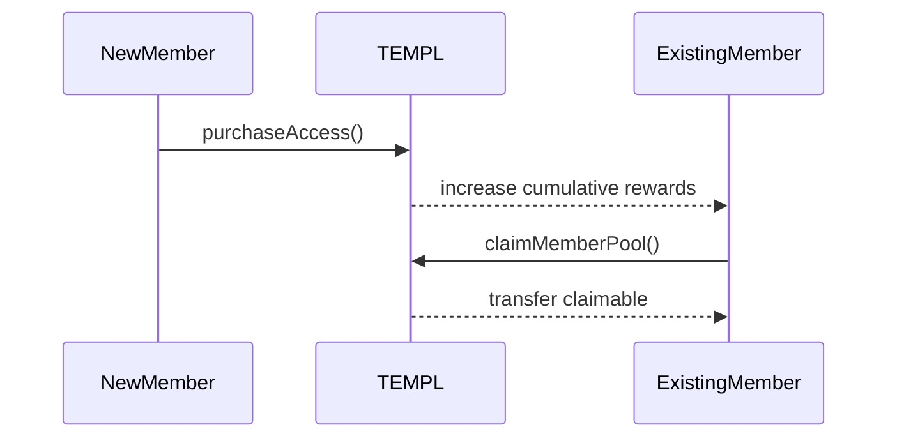
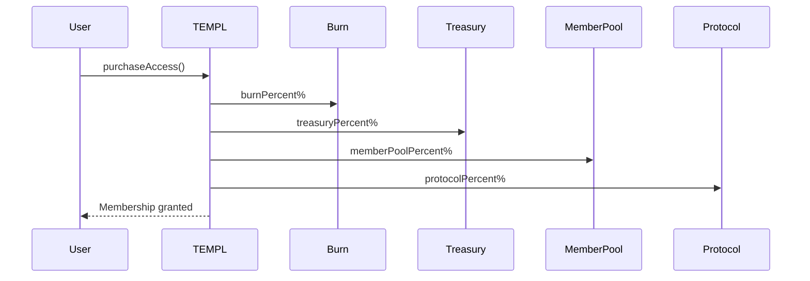
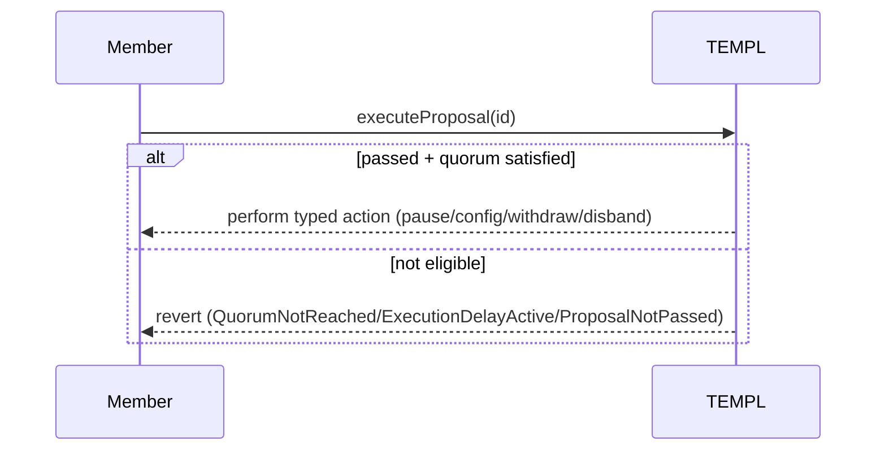

# TEMPL Contracts

Understand the Solidity modules that guarantee membership rules, treasury custody, and governance invariants. Use this alongside the flow diagrams to connect method names with runtime behavior.

## What you’ll learn
- Module layout and how responsibilities split across `TemplBase`, `TemplMembership`, `TemplTreasury`, `TemplGovernance`, `TEMPL`, and `TemplFactory`.
- Economic model for entry fees, reward remainders, and external reward pools.
- Governance constraints: proposal lifecycle, quorum, execution, and allowed actions.
- Deployment hooks and invariants auditors rely on.

## Overview
Solidity 0.8.23. Core contract is `contracts/TEMPL.sol` with shared errors in `contracts/TemplErrors.sol`. See `README.md#architecture` for the bigger picture; this document reflects the exact on-chain behavior and interfaces.

### Module Layout
- `TemplBase`: shared storage layout, immutables, counters, events, and modifiers. All other modules inherit it, so audits can focus on a single storage contract.
- `TemplMembership`: membership lifecycle (`purchaseAccess`, claims, view helpers) and accounting for the member pool.
- `TemplTreasury`: governance-callable treasury/config/priest handlers and their internal helpers.
- `TemplGovernance`: proposal creation, voting/quorum logic, execution router, and governance view helpers.
- `TEMPL`: thin concrete contract wiring the constructor requirements (`priest`, `protocolFeeRecipient`, `token`, `entryFee`, fee splits) and exposing the payable `receive` hook.
- `TemplFactory`: immutable protocol recipient/percentage plus helpers that deploy templ instances with per-templ burn/treasury/member splits.

## Economic Model
Entry fees are split according to four configurable percentages defined at deployment time (via `TemplFactory`):

- **Burn (`burnPercent`)** — transferred to the templ’s configured burn address (defaults to `0x000000000000000000000000000000000000dEaD`).
- **Treasury (`treasuryPercent`)** — retained on the contract and counted in `treasuryBalance`. Additional donations accrue to the contract balance and remain governable via `withdrawTreasuryDAO` / `disbandTreasuryDAO`.
- **Member Pool (`memberPoolPercent`)** — retained on the contract and counted in `memberPoolBalance`; claimable by existing members through `claimMemberPool()`.
- **Protocol (`protocolPercent`)** — forwarded to the immutable `protocolFeeRecipient`. This value is fixed per `TemplFactory` instance so every TEMPL created by a factory shares the same protocol fee.

The percentages must sum to 100. When a new member joins, existing members receive `floor(memberPoolShare / (n-1))` tokens each (where `n` is the new member count). Indivisible remainders accumulate in `memberRewardRemainder` and are rolled into the next distribution.

### Member Pool Mechanics
- Accrual: Each purchase increases `memberPoolBalance` and `cumulativeMemberRewards`; members track a `rewardSnapshot` at their join time and on claim.
- Claim: `claimMemberPool()` transfers the unclaimed delta and advances the snapshot. Reverts with `NoRewardsToClaim` if zero or `InsufficientPoolBalance` if not enough distributable tokens (excludes remainder).
- Donations: Anyone may donate ETH or ERC‑20 to the contract. Governance may move donations and the entry-fee treasury share, but member pool balances are not withdrawable except via disbanding into the pool.
- Remainders: Any indivisible leftovers from reward calculations accumulate in `memberRewardRemainder` and are rolled into the next distribution (purchase or disband) so the pool eventually captures every token.

### External Rewards Pools
- Non access-token assets (ETH or arbitrary ERC‑20s) donated to the contract can be distributed pro‑rata to members.
- When governance executes `disbandTreasuryDAO(address token)` with `token != accessToken`, the available balance for that token is added to an external rewards pool tracked in `externalRewards[token]`.
- Members can inspect available tokens via `getExternalRewardTokens()` and per-token state via `getExternalRewardState(token)`.
- Individual shares are reported by `getClaimableExternalToken(member, token)` and withdrawn with `claimExternalToken(token)` (supports ETH via `address(0)`).
- Successful external claims emit `ExternalRewardClaimed(token, member, amount)` and reduce the tracked pool balance; snapshots ensure each member only receives their share once.

## Governance
- One member = one vote; votes are changeable until eligibility windows close.
- One live proposal per address: creating a second while the first is active reverts `ActiveProposalExists`. The slot is cleared on execution. After expiry, attempting to create a new proposal clears the old slot before proceeding.
- Voting period bounds: 7–30 days (`0` means default 7 days).
- Execution: Any address may call `executeProposal(id)`. Execution is atomic and non‑reentrant.
- Typed proposals only (no arbitrary calls). The allowed actions are:
  - `setPausedDAO(bool)` — pause/unpause membership purchasing.
- `updateConfigDAO(address,uint256,bool,uint256,uint256,uint256)` — update the entry fee (must remain >0 and multiple of 10) and, when `_updateFeeSplit` is true, adjust the burn/treasury/member percentages. The protocol split comes from the factory and cannot be changed. Token changes are disabled (`_token` must be `address(0)` or the current token), else `TokenChangeDisabled`.
  - `withdrawTreasuryDAO(address,address,uint256,string)` — withdraw a specific amount of any asset (access token, other ERC‑20, or ETH with `address(0)`).
  - `changePriestDAO(address)` — change the priest address via governance.
  - `disbandTreasuryDAO(address token)` — move the full available balance of `token` into a member-distributable pool. When `token == accessToken`, funds roll into the member pool (`memberPoolBalance`) with per-member integer division and any remainder added to `memberRewardRemainder`. When targeting any other ERC‑20 or native ETH (`address(0)`), the amount is recorded in an external rewards pool so members can later claim their share with `claimExternalToken`.

### Quorum and Eligibility
- Quorum threshold: `quorumPercent = 33` (33% yes votes of `eligibleVoters`).
- On creation: proposer auto‑YES, `eligibleVoters = memberList.length`. If quorum is immediately satisfied, `quorumReachedAt` is set and `endTime` is reset to `now + executionDelayAfterQuorum`.
- Before quorum: any member (including those who joined after creation) may vote; `eligibleVoters` tracks the current member count.
- After quorum: voting eligibility freezes; only members who joined before `quorumReachedAt` may vote. Late joiners are rejected with `JoinedAfterProposal`. Because Ethereum timestamps are per block, joins mined in the same block that reached quorum remain eligible.
- Execution requires a simple majority (`yesVotes > noVotes`) and:
  - if quorum is required: that quorum has been reached and the delay `executionDelayAfterQuorum = 7 days` has elapsed; otherwise reverts with `QuorumNotReached` or `ExecutionDelayActive`.
  - priest exception: `createProposalDisbandTreasury(...)` proposed by `priest` is quorum‑exempt and respects only its `endTime`.

### Proposal Types (create functions)
- `createProposalSetPaused(bool paused, uint256 votingPeriod)`
- `createProposalUpdateConfig(uint256 newEntryFee, uint256 newBurnPercent, uint256 newTreasuryPercent, uint256 newMemberPoolPercent, bool updateFeeSplit, uint256 votingPeriod)` – set `updateFeeSplit = true` to apply the provided percentages; when false, the existing burn/treasury/member splits remain unchanged and only the fee (or paused state) is updated.
- `createProposalWithdrawTreasury(address token, address recipient, uint256 amount, string reason, uint256 votingPeriod)`
- `createProposalChangePriest(address newPriest, uint256 votingPeriod)`
- `createProposalDisbandTreasury(address token, uint256 votingPeriod)` (`token` can be the access token, another ERC‑20, or `address(0)` for ETH)

Note: Proposal metadata (title/description) is not stored on‑chain. Keep human‑readable text in XMTP group messages alongside the on‑chain proposal id.

### Security Notes
- Reentrancy: `purchaseAccess`, `claimMemberPool`, and `executeProposal` are non‑reentrant.
- Purchase guard: `purchaseAccess` disallows calls from the DAO address itself (`InvalidSender`).
- Pausing: only blocks `purchaseAccess`; proposing and voting continue while paused.

## User‑Facing Functions and Views
- `purchaseAccess()` — one-time purchase; applies the templ’s configured burn/treasury/member percentages (plus the factory-defined protocol split) via `safeTransferFrom`. Requires balance ≥ entry fee and contract not paused.
- `vote(uint256 proposalId, bool support)` — cast or change a vote until eligible; emits `VoteCast`.
- `executeProposal(uint256 proposalId)` — performs the allowlisted action; emits `ProposalExecuted` and action‑specific events.
- `claimMemberPool()` — withdraw accrued rewards; emits `MemberPoolClaimed`.
- `getActiveProposals()` — returns IDs of active proposals.
- `getActiveProposalsPaginated(uint256 offset, uint256 limit)` — returns `(ids, hasMore)`; `limit` in [1,100], else `LimitOutOfRange`.
- `getProposal(uint256 id)` — returns `(proposer, yesVotes, noVotes, endTime, executed, passed)` with `passed` computed according to quorum/delay rules.
- `hasVoted(uint256 id, address voter)` — returns `(voted, support)`.
- `hasAccess(address user)` — returns membership status.
- `getPurchaseDetails(address user)` — returns `(purchased, timestamp, blockNum)`.
- `getTreasuryInfo()` — returns `(treasury, memberPool, totalReceived, totalBurnedAmount, totalProtocolFees, protocolAddress)` where
  - `treasury` is the UI‑facing available access‑token balance: `currentBalance(accessToken) - memberPoolBalance` (includes donations), and
  - `totalReceived` tracks only entry‑fee allocations.
- `getConfig()` — returns `(token, fee, isPaused, purchases, treasury, pool, burnPercent, treasuryPercent, memberPoolPercent, protocolPercent)`.
- `getMemberCount()` — number of members; `getVoteWeight(address)` — 1 if member else 0.
- External reward helpers:
  - `getExternalRewardTokens()` — list of ERC‑20/ETH reward tokens that currently have tracked pools (excludes the access token).
  - `getExternalRewardState(address token)` — returns `(poolBalance, cumulativeRewards, remainder)` for the token’s reward distribution.
  - `getClaimableExternalToken(address member, address token)` — accrued share for `member` of the external token pool (0 for non-members or when no rewards are pending).

## State, Events, Errors
- Key immutables: `protocolFeeRecipient`, `accessToken`, `burnAddress`. Priest is changeable via governance.
- Key variables: `entryFee` (≥10 and multiple of 10), `paused`, `treasuryBalance` (tracks fee‑sourced tokens only), `memberPoolBalance`, counters (`totalBurned`, `totalToTreasury`, `totalToMemberPool`, `totalToProtocol`).
- Governance constants: `quorumPercent` and `executionDelayAfterQuorum` are set during deployment (factory defaults 33% and 7 days) and remain immutable afterwards.
- External reward claims:
  - `claimExternalToken(address token)` — transfers the caller’s accrued share of the specified external token (ERC‑20 or `address(0)` for ETH). Reverts with `NoRewardsToClaim` if nothing is available. Emitted `ExternalRewardClaimed` mirrors successful withdrawals.
- Events:
  - `AccessPurchased(purchaser,totalAmount,burnedAmount,treasuryAmount,memberPoolAmount,protocolAmount,timestamp,blockNumber,purchaseId)`
  - `MemberPoolClaimed(member,amount,timestamp)`
  - `ProposalCreated(proposalId,proposer,endTime)`
  - `VoteCast(proposalId,voter,support,timestamp)`
  - `ProposalExecuted(proposalId,success,returnData)`
  - `TreasuryAction(proposalId,token,recipient,amount,description)`
  - `ConfigUpdated(token,entryFee,burnPercent,treasuryPercent,memberPoolPercent,protocolPercent)`
  - `ContractPaused(isPaused)`
  - `TreasuryDisbanded(proposalId,token,amount,perMember,remainder)`
  - `ExternalRewardClaimed(token,member,amount)`
  - `PriestChanged(oldPriest,newPriest)`
    - Backend listeners purge all delegates/mutes on this event so the incoming priest takes over with a clean moderation slate.
 - Custom errors (from `TemplErrors.sol`): `NotMember`, `NotDAO`, `ContractPausedError`, `AlreadyPurchased`, `InsufficientBalance`, `ActiveProposalExists`, `VotingPeriodTooShort`, `VotingPeriodTooLong`, `InvalidProposal`, `VotingEnded`, `JoinedAfterProposal`, `VotingNotEnded`, `AlreadyExecuted`, `ProposalNotPassed`, `ProposalExecutionFailed`, `InvalidRecipient`, `AmountZero`, `InsufficientTreasuryBalance`, `NoTreasuryFunds`, `EntryFeeTooSmall`, `InvalidEntryFee`, `InvalidPercentageSplit`, `InvalidPercentage`, `InvalidExecutionDelay`, `NoRewardsToClaim`, `InsufficientPoolBalance`, `LimitOutOfRange`, `InvalidSender`, `InvalidCallData`, `TokenChangeDisabled`, `NoMembers`, `QuorumNotReached`, `ExecutionDelayActive`.

## Flows
### Membership Purchase

### Proposal Execution

## Configuration & Deployment
- Primary entrypoint is `TemplFactory(address protocolFeeRecipient, uint256 protocolPercent)`. Creating a new templ instance can rely on defaults (`createTempl(token, entryFee)`) or a custom struct (`createTemplWithConfig`). Percentages for burn/treasury/member must sum with the factory’s `protocolPercent` to 100. The factory enforces the protocol share and recipient across all templs it creates.
- `scripts/deploy.js` deploys a factory when none is provided (`FACTORY_ADDRESS`), then creates a templ via the factory using environment variables: `PRIEST_ADDRESS` (defaults to deployer), `PROTOCOL_FEE_RECIPIENT`, `PROTOCOL_PERCENT`, `TOKEN_ADDRESS`, `ENTRY_FEE`, `BURN_PERCENT`, `TREASURY_PERCENT`, `MEMBER_POOL_PERCENT` (plus optional `QUORUM_PERCENT`, `EXECUTION_DELAY_SECONDS`, `BURN_ADDRESS`). Percentages must sum to 100.
- Commands:
  - Compile/tests: `npm run compile`, `npm test`, `npm run slither`.
  - Deploy example: `npx hardhat run scripts/deploy.js --network base`.

## Invariants & Assumptions
- No arbitrary external call execution; proposals are typed and restricted to internal handlers.
- Treasury movements only via approved proposals; member pool is preserved except when explicitly increased via disband.
- If quorum is never reached, proposals cannot be executed even after the voting period.
- Access token should be a standard ERC‑20 without transfer fees/taxes to ensure exact splits.

## Tests
The Hardhat suite exercises: fee splits and counters, reentrancy guards, one‑member/one‑vote rules (proposer auto‑YES), post‑quorum voting eligibility, typed DAO actions (pause/config/withdraw/changePriest/disband), proposal pagination, and all public views.

## Next
Continue to [BACKEND.md](./BACKEND.md) for API behavior, environment setup, and operational runbooks.
