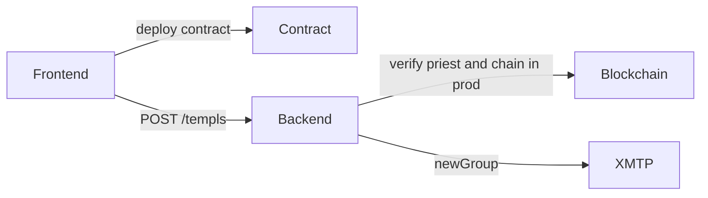
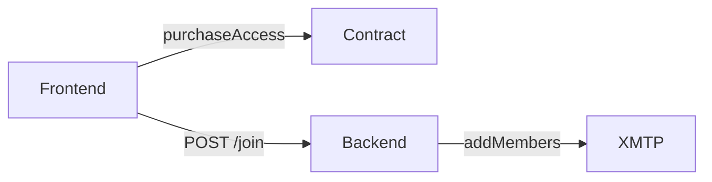
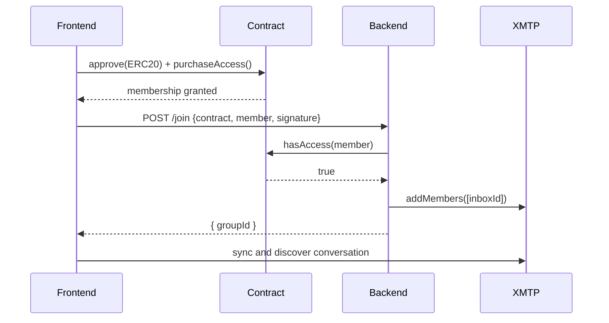
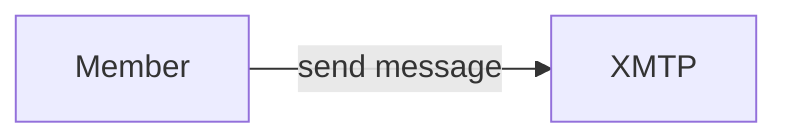
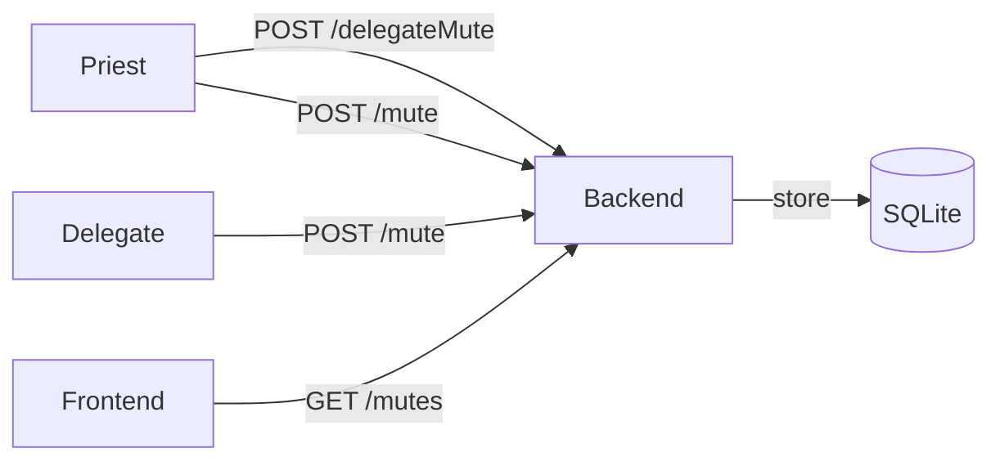
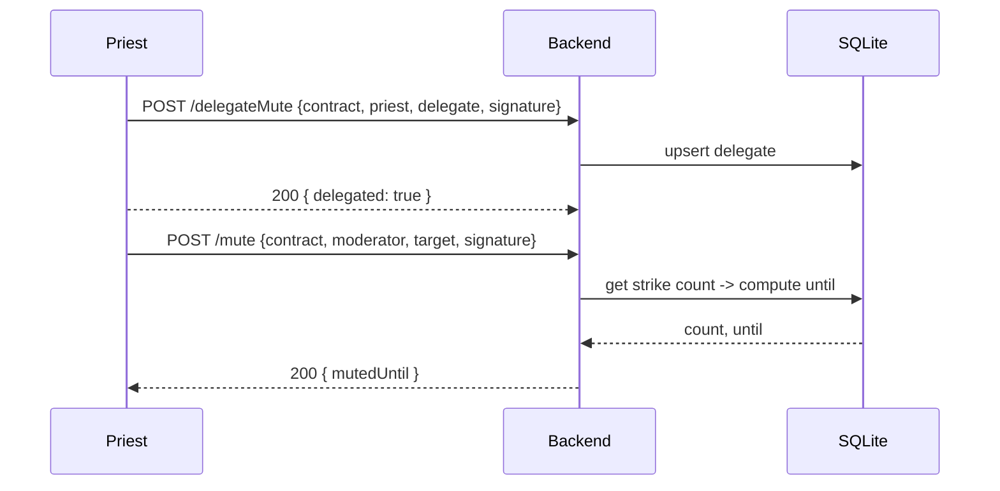
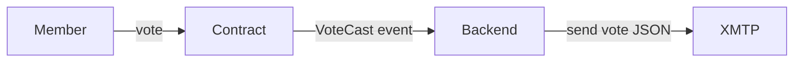
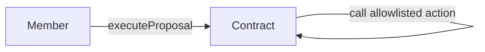
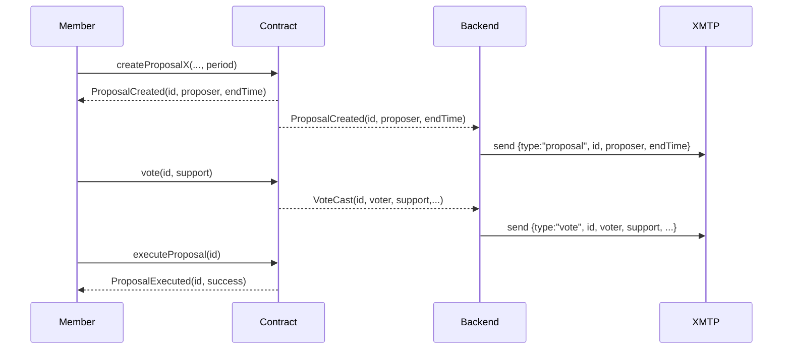
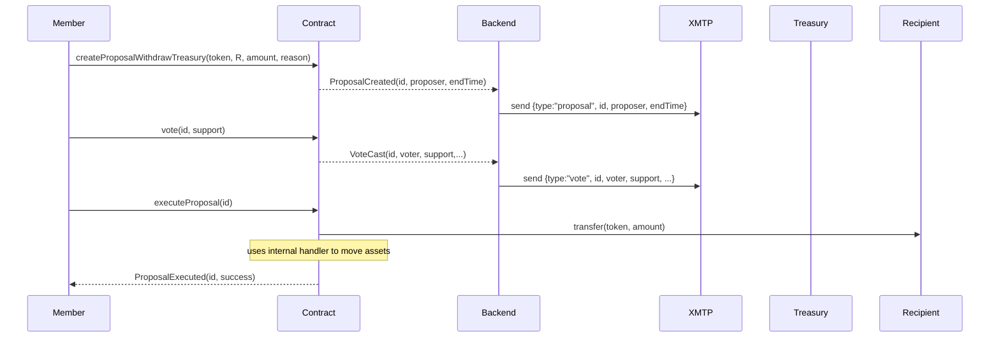

# Core Flow Service Diagrams

Components and message flows powering TEMPL's core protocol.

## Flow overview
- [1. Templ creation](#1-templ-creation)
- [2. Pay-to-join](#2-pay-to-join)
- [3. Messaging](#3-messaging)
- [4. Moderation](#4-moderation)
- [5. Proposal creation](#5-proposal-creation)
- [6. Voting](#6-voting)
- [7. Proposal execution](#7-proposal-execution)

## Actors & Legend
- Frontend: Browser app where users deploy, join, chat, and govern.
- Backend: Node service that owns the group, verifies chain state, and moderates.
- Contract: TEMPL logic split across `TemplBase`/`TemplMembership`/`TemplTreasury`/`TemplGovernance` with `TEMPL` as the concrete entrypoint.
- XMTP: Messaging network.
- SQLite: Backend DB for groups, delegates, and mutes.

Legend: F=Frontend, B=Backend, C=Contract, X=XMTP, D=SQLite, M=Member, P=Priest.

## 1. TEMPL creation
The backend creates the XMTP group when a TEMPL is deployed. By default it uses a short‑lived ephemeral creator key to create the group, and then operates it via the server’s invite‑bot identity (which invites members but does not need admin privileges).


- Frontend posts `{contract}`; backend verifies the contract and on-chain priest in production, resolves the priest inbox from the network, creates the group (including the priest), and stores the `groupId`.

## 2. Pay-to-join
Members sign a join message, and the backend verifies purchase before inviting them.
See [CONTRACTS.md#economic-model](./CONTRACTS.md#economic-model) for membership fee split details.


- Backend may send a small "member-joined" message to aid discovery.

Sequence detail:
The contract purchase and backend invite flow proceeds as follows.


## 3. Messaging
Members send messages directly to the XMTP group.


Discovery
- After joining, browser clients sync conversations and preferences until the group is found.

## 4. Moderation
The backend enforces escalating mutes and allows delegated moderation.


- Mutes escalate in duration.
- The priest can delegate mute power to other members.
- Frontends hide messages from muted members.

Sequence detail:
The moderation process from delegation to mute proceeds as follows.


## 5. Proposal creation
Members create typed proposals on-chain; the backend mirrors on-chain proposal events into the XMTP group. Proposal titles/descriptions live only in XMTP messages, not on-chain.
```mermaid
flowchart LR
    M[Member] -->|createProposalSetPaused / UpdateConfig / Withdraw / Disband / ChangePriest| C[Contract]
    C -->|ProposalCreated(id,proposer,endTime)| B[Backend]
    B -->|send {type:"proposal", id, proposer, endTime}| X[XMTP]
```

Notes
- The backend adds members by inboxId only and linearizes invites by waiting for inbox readiness on XMTP before adding.
- After group creation/join, the backend syncs and records network stats. A small warm message may be sent.

## 6. Voting
Members vote on proposals and the backend broadcasts vote events.


## 7. Proposal execution
Execution is limited to an allowlisted set of contract functions.


- Only pause/unpause, change priest, fee repricing (entry fee only), transfers of assets held by the contract, and disbanding treasury into the member pool are permitted. Token changes remain disabled, and member pool funds cannot be moved.
- Arbitrary external calls are disabled.

End-to-end proposal lifecycle (sequence):
This sequence shows proposal creation, voting, and execution across the system. Human‑readable metadata (title/description) is carried only in XMTP messages.


## Proposal lifecycle with treasury movement
Tokens or ETH may be donated to the contract by transferring them to its address; proposals can later withdraw these assets.


## Backend Endpoints & Signatures
- POST `/templs` – create group for a deployed TEMPL
  - Signature: EIP‑712 typed data `{ action:'create', contract, server, nonce, issuedAt, expiry }` signed by priest EOA.
  - Body: `{ contractAddress, priestAddress, signature, chainId, nonce, issuedAt, expiry }`
  - Response: `{ groupId }`
- POST `/join` – verify purchase and invite member
  - Signature: EIP‑712 `{ action:'join', contract, server, nonce, issuedAt, expiry }` signed by member EOA.
  - Body: `{ contractAddress, memberAddress, signature, chainId, nonce, issuedAt, expiry, inboxId? }` (`inboxId` is ignored in normal environments; local/test fallback may use it deterministically when network resolution is unavailable.)
  - Response: `{ groupId }` or HTTP 503 until identity is visible on XMTP.
- POST `/delegateMute` – grant mute rights
  - Signature: EIP‑712 `{ action:'delegateMute', contract, delegate, server, nonce, issuedAt, expiry }` signed by priest EOA.
  - Body: `{ contractAddress, priestAddress, delegateAddress, signature, chainId, nonce, issuedAt, expiry }`
  - Response: `{ delegated: true }`
- DELETE `/delegateMute` – revoke mute rights (same signature fields).
  - `{ delegated: false }` on success.
- POST `/mute` – escalate mute for a target
  - Signature: EIP‑712 `{ action:'mute', contract, target, server, nonce, issuedAt, expiry }` signed by priest or a delegate.
  - Response: `{ mutedUntil }` (ms since epoch; 0 means permanent after 5th strike).
- GET `/mutes?contractAddress=...` – list active mutes: `{ mutes: [{ address, count, until }] }`
- GET `/templs` – list known TEMPLs: `{ templs: [{ contract, priest, groupId? }] }` (include `?include=groupId` to include ids).
- Debug (when `ENABLE_DEBUG_ENDPOINTS=1`): `/debug/group`, `/debug/conversations`, `/debug/membership`, `/debug/last-join`, `/debug/inbox-state`, `/debug/send`.

Notes
- EIP‑712 messages include a `server` string; the backend verifies signatures against its own `BACKEND_SERVER_ID` (which must match the frontend’s `VITE_BACKEND_SERVER_ID`). A mismatch causes signature verification to fail.

Backend resolves inboxIds from the XMTP network via `findInboxIdByIdentifier` and waits for identity readiness before `addMembers`. In normal environments, client‑supplied inboxIds are ignored. In local/test fallback modes (e.g., during E2E runs), the server may deterministically accept a provided inboxId or generate one when network resolution is unavailable, to keep tests moving.

## Governance Allowlist & Rules
- Proposal actions are restricted to an allowlist enforced at creation and execution:
  - `setPausedDAO(bool)` — pause/unpause purchases
  - `updateConfigDAO(address,uint256)` — entry fee only (token change disabled)
  - `withdrawTreasuryDAO(address,address,uint256,string)` — move a specific amount of any asset held by the contract
  - `changePriestDAO(address)` — change the priest
  - `disbandTreasuryDAO(address token)` — disband the full available balance of the chosen token. Using the access token increases the member pool; other ERC‑20s or ETH become claimable via external reward pools.
- Voting: 1 vote per member; proposer auto‑YES; votes are changeable until eligibility closes.
- Eligibility freeze: before quorum, any member may vote; after quorum is reached, only members who joined before `quorumReachedAt` may vote (late joiners revert `JoinedAfterProposal`).
- Execution: requires simple majority (`yesVotes > noVotes`) and either:
  - quorum‑exempt proposals: `block.timestamp >= endTime`, or
  - proposals requiring quorum: quorum reached and the delay `executionDelayAfterQuorum` elapsed since `quorumReachedAt`.

## Data & Storage
- SQLite tables:
  - `groups(contract TEXT PRIMARY KEY, groupId TEXT, priest TEXT)`
  - `mutes(contract TEXT, target TEXT, count INTEGER, until INTEGER, PRIMARY KEY(contract, target))`
  - `delegates(contract TEXT, delegate TEXT, PRIMARY KEY(contract, delegate))`
  - `signatures(sig TEXT PRIMARY KEY, usedAt INTEGER)` – replay protection for EIP‑712 signatures
  - `kv(key TEXT PRIMARY KEY, value TEXT)` – stores generated invite-bot secrets (e.g., `bot_private_key`)
- XMTP client DBs:
  - Node: `xmtp-<env>-<inboxId>.db3` (SQLCipher when `dbEncryptionKey` provided).
  - Browser: OPFS per-origin; not OS-visible.

## Errors, Retries & Discovery
- `/join` may return HTTP 503 until the member identity is visible on XMTP; the frontend should retry.
- Browsers discover the group by calling `conversations.sync()`, `preferences.sync()`, `conversations.syncAll([...])` and polling/streaming for the conversation id.
