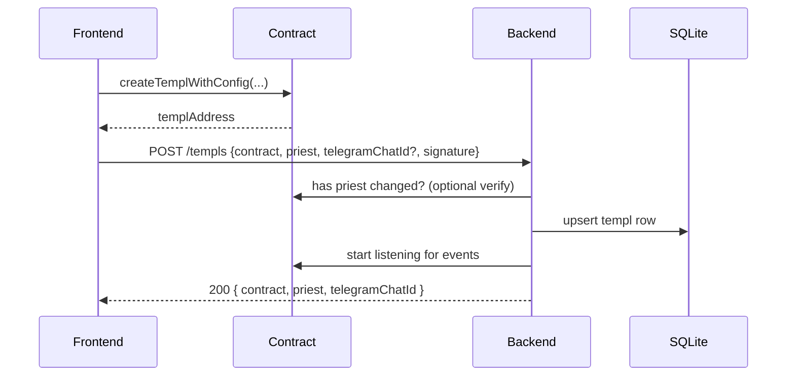
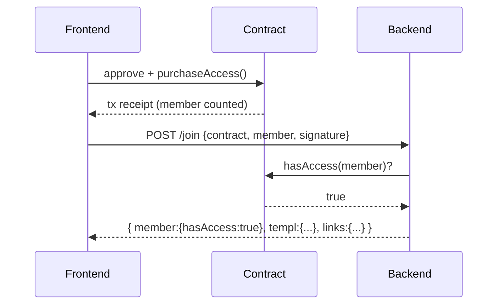
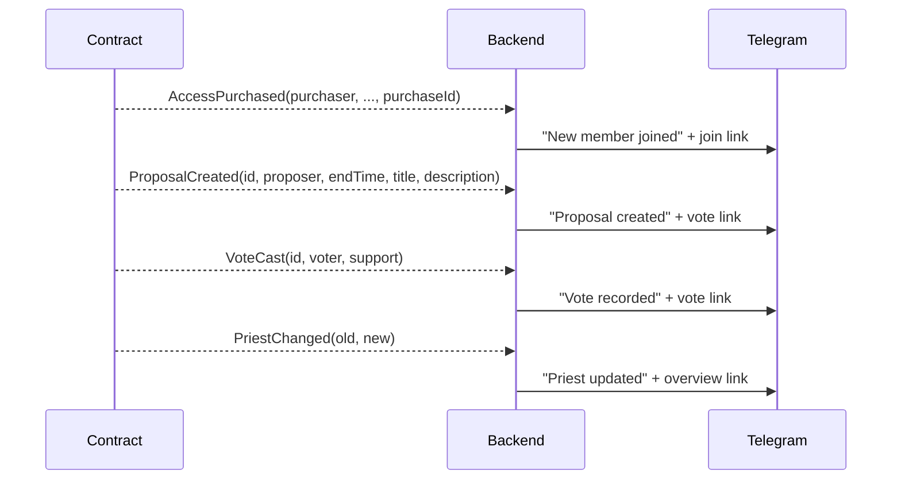
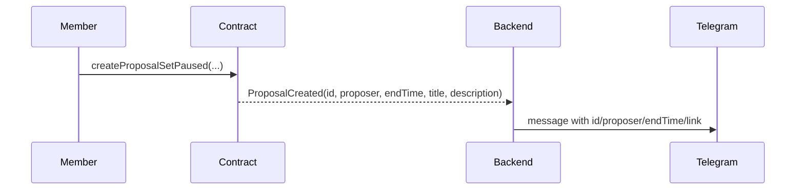
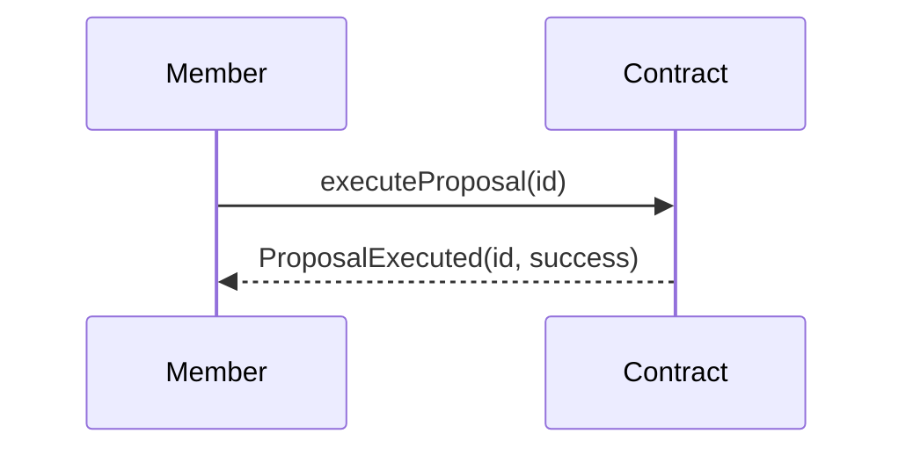
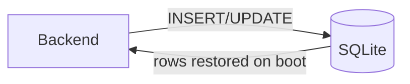

# Core Flow Diagrams (Telegram Edition)

Use this reference to see how the contracts, backend API, frontend, and Telegram notifier interact today. Every section pairs a flowchart with a sequence diagram so you can choose the view that fits your debugging or onboarding moment.

## Actors

- **Frontend (F)** – Vite + React app in the browser.
- **Backend (B)** – Express server handling signatures, persistence, and Telegram notifications.
- **Contract (C)** – On-chain templ instance.
- **Telegram (T)** – Bot-backed delivery of templ events (optional).
- **SQLite (D)** – Backend persistence.
- **Member (M)** / **Priest (P)** – Participants initiating actions.

## 1. Templ creation

```mermaid
flowchart LR
    F[Frontend] -->|factory.createTemplWithConfig| C[Contract]
    F -->|POST /templs| B[Backend]
    B -->|verify contract/priest (optional)| C
    B -->|persist templ + chat id| D[(SQLite)]
    B -->|register watcher| C
```

Sequence:



## 2. Pay-to-join + verification

```mermaid
flowchart LR
    F -->|purchaseAccess| C
    F -->|POST /join| B
    B -->|hasAccess(member)| C
    C -->|true/false| B
    B -->|respond with templ links| F
```

Sequence:



## 3. Telegram notifications

Whenever watchers detect events and the templ has a `telegramChatId`, the backend posts formatted messages. In addition to join/proposal/vote updates, the notifier announces quorum, flags when a voting window closes (including whether execution is possible), and emits a daily treasury/member-pool digest. No Telegram messages are sent if the bot token or chat id is missing.



Messages use `APP_BASE_URL` to build URLs such as `/templs/<address>` or `/templs/<address>/proposals/<id>/vote`.

## 4. Moderation (future-ready)

Delegate/mute APIs live on-chain for future moderation integrations (e.g., Discord bridges) even though the current product surface does not expose them directly.

## 5. Proposal creation

```mermaid
flowchart LR
    M -->|createProposalX| C
    C -->|emit ProposalCreated(title, description)| B
    B -->|store templ metadata| D
    B -->|notify Telegram| T
```

Sequence:



## 6. Voting

```mermaid
flowchart LR
    M -->|vote(id, support)| C
    C -->|VoteCast| B
    B -->|notify| T
```

## 7. Execution

Execution remains on-chain only. Telegram notifications can be extended later to reflect `ProposalExecuted` events if desired.



## Data persistence summary



- `groups` table keeps templ contract → priest + Telegram chat id.
- `signatures` table prevents replay attacks for `/templs` and `/join`.

These flows should serve as the canonical reference for the Telegram-based architecture.
