# Core Flow Diagrams (Telegram Edition)

Use this reference to see how the contracts, backend API, frontend, and Telegram notifier interact today. Every section pairs a flowchart with a sequence diagram so you can choose the view that fits your debugging or onboarding moment.

## Actors

- **Frontend (F)** – Vite + React app in the browser.
- **Backend (B)** – Express server handling signatures, persistence, and Telegram notifications.
- **Contract (C)** – On-chain templ instance.
- **Telegram (T)** – Bot-backed delivery of templ events (optional).
- **Cloudflare D1 (D)** – Serverless binding store (contract ↔ Telegram chat id) with an in-memory fallback for local runs.
- **Member (M)** / **Priest (P)** – Participants initiating actions.

## 1. Templ creation

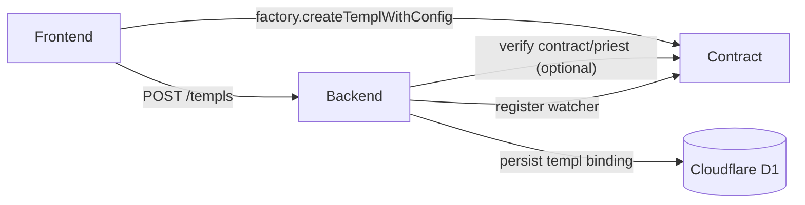

Sequence:

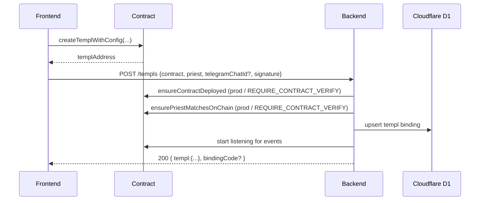

## 2. Pay-to-join + verification

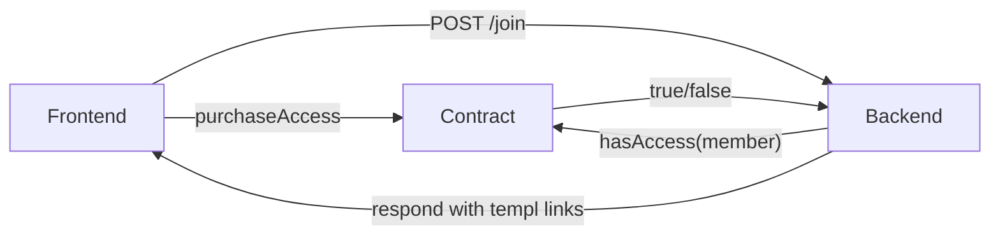

Sequence:

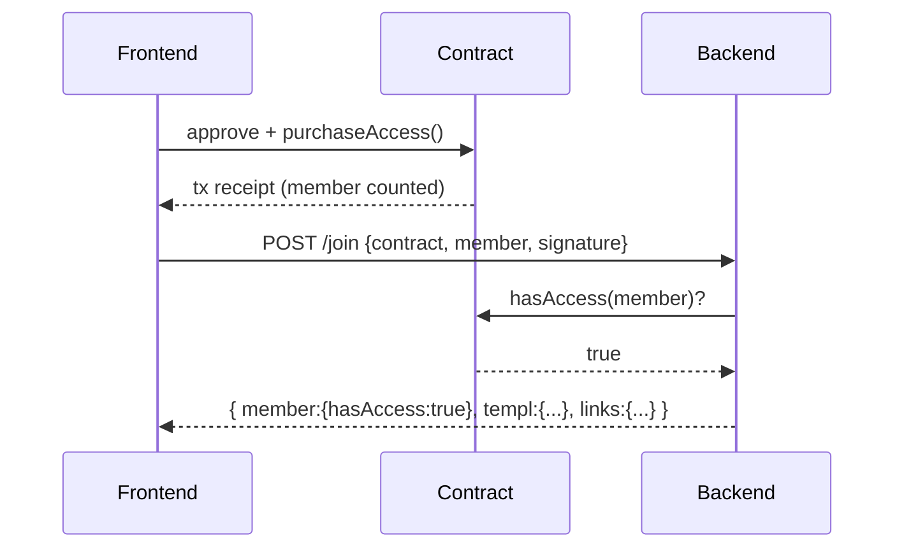

`purchaseAccess` executes only when the templ is unpaused, no disband lock is active, and the membership cap has spare capacity. Attempts during an active disband (custom error `DisbandLockActive`) or when the cap is reached (`MemberLimitReached`) revert on-chain; frontend helpers surface these messages so members know to wait for governance to resolve the lock or raise the cap.

Expired disband proposals clear without manual intervention—`purchaseAccess` automatically refreshes disband locks and releases those whose voting window has lapsed, so membership resumes as soon as a failed or abandoned disband times out.

## 3. Telegram notifications

Whenever watchers detect events and the templ has a `telegramChatId`, the backend posts formatted messages. In addition to join/proposal/vote updates, the notifier announces quorum, flags when a voting window closes (including whether execution is possible), and emits a daily treasury/member-pool digest. No Telegram messages are sent if the bot token or chat id is missing.

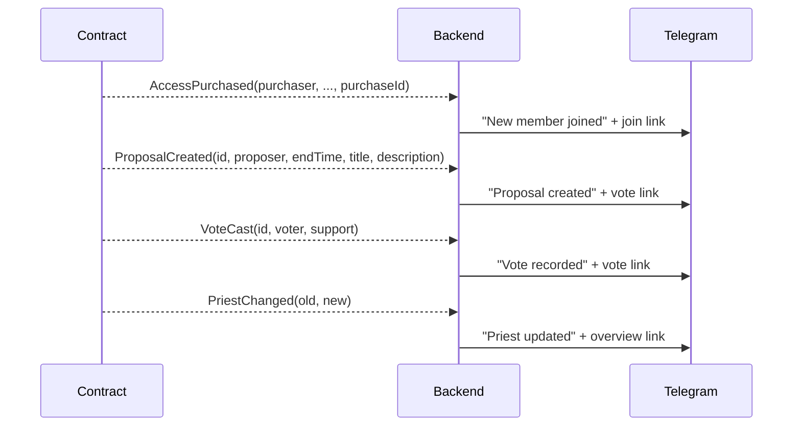

Messages use `APP_BASE_URL` to build URLs such as `/templs/<address>` or `/templs/<address>/proposals/<id>/vote`.

## 4. Proposal creation

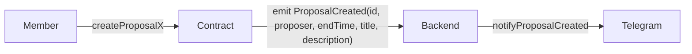

Sequence:

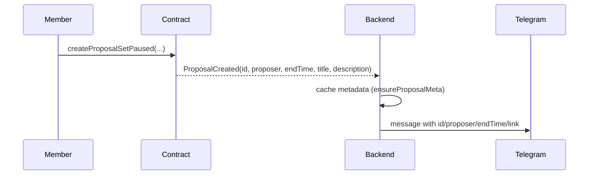

## 5. Voting

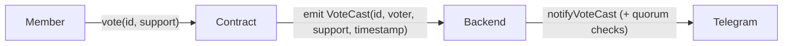

Sequence:

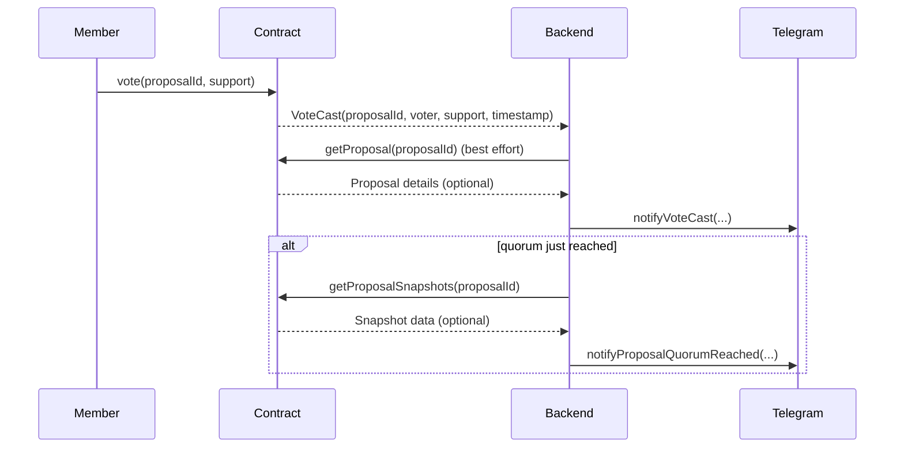

## 6. Execution

Execution remains on-chain only. Telegram notifications can be extended later to reflect `ProposalExecuted` events if desired.

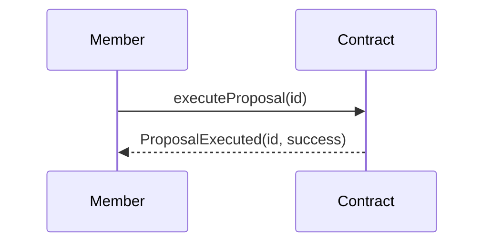

## Data persistence summary

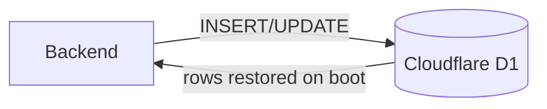

- `templ_bindings` keeps the templ contract ↔ optional Telegram chat mapping plus the last-seen priest address so notifications resume after restarts (NULL chat ids indicate pending bindings). When persisted in D1/SQLite the mapping survives backend restarts without extra infrastructure.
- `used_signatures` records typed-request signatures for ~6 hours. The backend prefers D1 and only falls back to the in-memory cache when the database binding is unavailable.
- `leader_election` tracks which backend instance currently holds leadership (identified by `owner` and guarded by an `expiresAt` TTL). Multi-instance deployments refresh this row to ensure only one server keeps contract watchers and background tasks running; single-instance or in-memory setups effectively auto-elect themselves.

These flows should serve as the canonical reference for the Telegram-based architecture.
