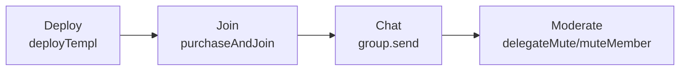

# TEMPL Frontend

See the [README](../README.md#architecture) for how the frontend fits into TEMPL and the flows in [CORE_FLOW_DOCS.MD](./CORE_FLOW_DOCS.MD); this doc covers local development and testing.

## Prerequisites

- Node.js `22.18.0` and the repo-wide setup steps from the [root README](../README.md#quick-start).
- Environment variables like `VITE_XMTP_ENV`, `VITE_E2E_DEBUG`, and `E2E_XMTP_LOCAL` configure the frontend. See [Environment variables](#environment-variables) for details.

## Setup

Install dependencies:

```bash
npm --prefix frontend ci
```

## Environment variables

Global variables such as `RPC_URL` live in the project `.env`; see the [README's environment variables](../README.md#environment-variables).

| Name | Description | Default |
| --- | --- | --- |
| `VITE_XMTP_ENV` | XMTP environment for the Browser SDK (`local`, `dev`, `production`). Defaults to `dev` on `localhost`/`127.0.0.1` and `production` elsewhere. | `dev` (localhost) / `production` |
| `VITE_E2E_DEBUG` | Enables debug helpers (`window.__XMTP`, etc.) during E2E runs. | `0` |
| `E2E_XMTP_LOCAL` | When `1`, Playwright E2E tests connect to a local XMTP node instead of production. | `0` |
| `VITE_BACKEND_SERVER_ID` | String identifier that must match the backend `BACKEND_SERVER_ID` to bind EIP‑712 signatures to your deployment. | — |
| `VITE_TEMPL_FACTORY_ADDRESS` | Optional: preloads the factory address so the creation form is read-only. Leave blank to supply it interactively. | — |
| `VITE_TEMPL_FACTORY_PROTOCOL_RECIPIENT` | Optional: expected factory protocol recipient (display-only). Useful for demos/tests. | — |
| `VITE_TEMPL_FACTORY_PROTOCOL_BP` | Optional: expected factory protocol basis points (display-only). | — |
| `VITE_E2E_NO_PURCHASE` | Skip the on-chain purchase step during E2E/dev runs when access is pre-seeded. | `0` |
| `VITE_ENABLE_BACKEND_FALLBACK` | When `1`, enables debug fallbacks that query backend `/debug` endpoints for membership snapshots. | `0` |
| `TEMPL_ENABLE_LOCAL_FALLBACK` | Node-unit toggle that lets tests merge localStorage templ registries with the backend list; keep `0` in production so the UI always reflects real `/templs` data. | `0` |

## Development

Start a hot-reloading dev server:

```bash
npm --prefix frontend run dev
```

## Tests & Lint

```bash
npm --prefix frontend test
npm --prefix frontend run lint
npm --prefix frontend run build
npm --prefix frontend run test:e2e                          # end‑to‑end (Playwright)
```
To run e2e against a local XMTP node: clone `xmtp-local-node`, run `npm run xmtp:local:up`, execute tests with `E2E_XMTP_LOCAL=1`, then `npm run xmtp:local:down`.

E2E artifacts (videos, traces, screenshots) are saved under `frontend/test-results/`.
## Architecture

- **Wallet connection** via `ethers` and `window.ethereum`.
- **Default configuration** – all members have 1 vote.
- **Governance** – members create proposals and vote from the chat; `watchProposals` updates the UI when events fire. The backend mirrors on‑chain events into the group as JSON so clients see real‑time updates. The quick-action UI encodes the allowlisted DAO calls: pause/unpause, withdraw the entire available treasury balance of a chosen asset to the connected wallet (demo helper), disband the full available balance of any token (entry-fee token, donated ERC‑20, or native ETH) into member rewards, and reprice the entry fee or adjust the non-protocol fee splits. Proposal titles/descriptions are not stored on-chain; they are shared only in XMTP messages next to the on-chain proposal id.

See backend endpoints in [BACKEND.md](./BACKEND.md#architecture) for `POST /templs`, `POST /join`, `POST/DELETE /delegateMute`, `POST /mute`, and `GET /mutes`.

### User flows



## Notes
- `VITE_XMTP_ENV` defaults to `dev` on localhost and `production` elsewhere; override for `local` nodes.
- `VITE_E2E_DEBUG=1` exposes `window.__XMTP` helpers for diagnostics.
- When debug helpers are enabled, the join flow automatically re-registers the contract with `/templs` if a 404 is encountered and retries the join; production runs continue to rely solely on the primary invite path.
- The Browser SDK sets `appVersion` for diagnostics and `src/flows.js` is typed via JSDoc.
- The chat exposes a single `Claim` button that sweeps both member-pool rewards and any external token pools using `claimExternalToken`; external balances remain visible for transparency.

## Security considerations
- Membership verification happens on-chain; bypassing the backend would require membership proof.
- The app relies on the backend service for invitations; if the service is down no new members can join.
- Users must share the contract address and group ID manually; there is no routing.
- Proposal and vote transactions are signed by the connected wallet; proposal actions are restricted to an allowlist (pause/unpause, config, treasury transfers), but users should still review the action and parameters before approving.
