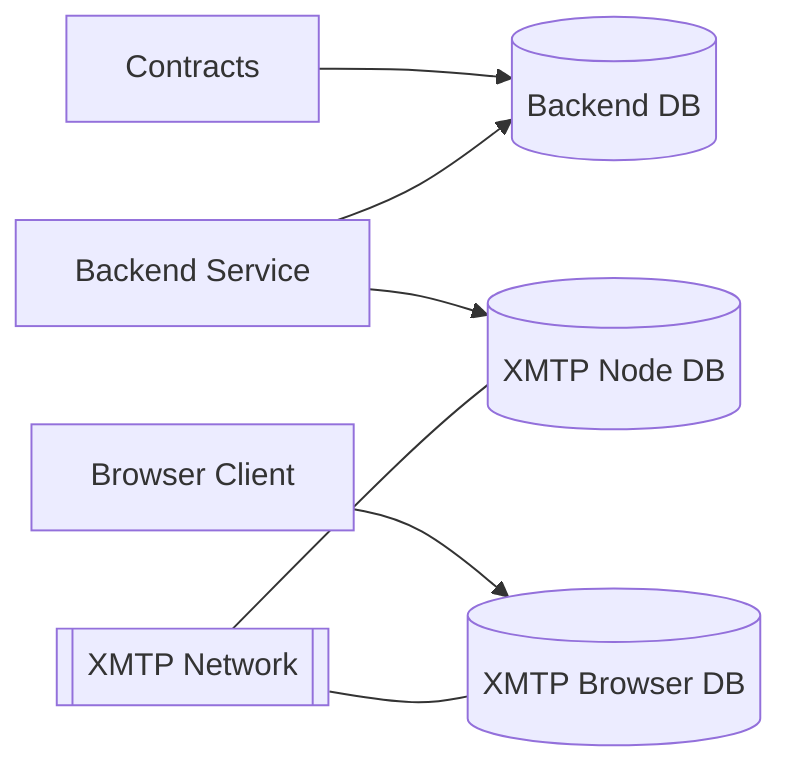
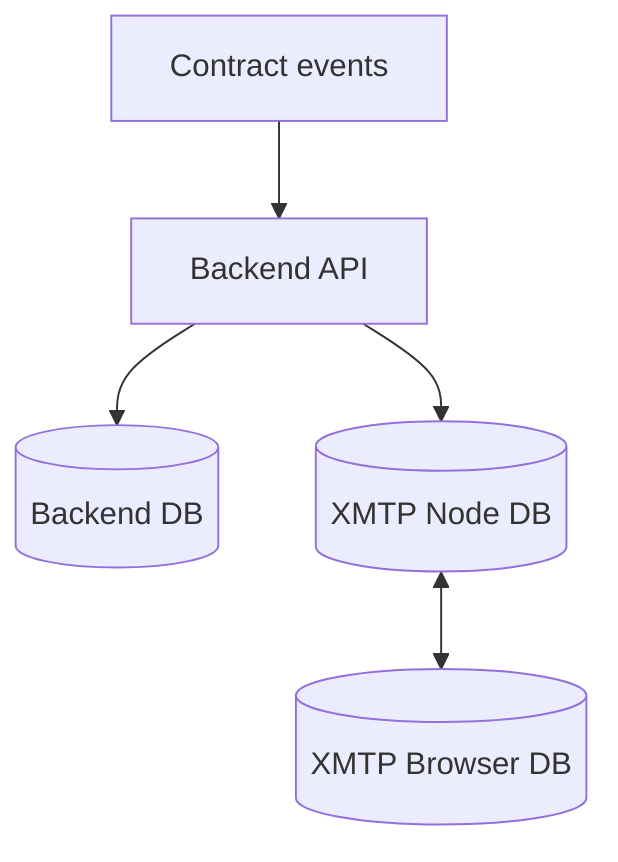

# Persistence Map

Understand what lives on-chain, inside SQLite, and within XMTP client databases so you can reason about backup, security, and local development. Read this right after the shared utilities to connect helpers with stored data.

## Why this map matters
- Identify every storage location touched by the stack and what data resides there.
- Learn how the backend manages replay protection, moderation state, and bot keys in SQLite.
- See how XMTP Node/Browser databases behave so you can avoid OPFS/SQLCipher pitfalls.

This document outlines where Templ persists state, the storage technologies in play, and how cult memory flows through the system.

| Storage          | Location                                            | Encryption                   | Usage                                            |
| ---------------- | --------------------------------------------------- | ---------------------------- | ------------------------------------------------ |
| Backend DB       | `backend/groups.db` (override with `DB_PATH`)       | none                         | Maps contracts to XMTP `groupId` and moderation; stores invite-bot key |
| XMTP Node DB     | `xmtp-<env>-<inboxId>.db3` in process CWD           | SQLCipher via `dbEncryptionKey` | Client identity and conversation metadata   |
| XMTP Browser DB  | OPFS `xmtp-<env>-<inboxId>.db3` per origin          | none                         | Browser client identity and metadata             |

## Storage relationships

## Backend DB (SQLite)

Where the invite-bot keeps its receipts:

- Default file: `backend/groups.db` (override with `DB_PATH`).
- Purpose: maps on-chain templ contracts to XMTP `groupId`, and stores moderation state.
- Startup: the `groups` table is mirrored to an in-memory `Map()` so the server can restore groups on boot.
- Invite-bot key: on first boot without `BOT_PRIVATE_KEY`, the backend generates and persists a private key under `kv.bot_private_key` so the invite-bot identity remains stable across restarts.

### Tables

- `groups(contract TEXT PRIMARY KEY, groupId TEXT, priest TEXT)`
  - Maps on-chain contract → XMTP group id and priest EOA.
  - Written on POST `/templs`; re-read on server boot.
- `mutes(contract TEXT, target TEXT, count INTEGER, until INTEGER, PRIMARY KEY(contract, target))`
  - Moderation strikes and mute expiry per address per contract; written on POST `/mute`.
- `delegates(contract TEXT, delegate TEXT, PRIMARY KEY(contract, delegate))`
  - Delegated moderation rights; written on POST/DELETE `/delegateMute`.
- `signatures(sig TEXT PRIMARY KEY, usedAt INTEGER)`
  - Server-side replay protection store for typed signatures.
 - `kv(key TEXT PRIMARY KEY, value TEXT)`
   - Generic key-value store; the backend saves the persistent invite-bot private key here under `key = 'bot_private_key'` when no `BOT_PRIVATE_KEY` env is provided.

## XMTP Node DB

Server-side memory palace for the invite-bot:

- File: `xmtp-<env>-<inboxId>.db3` in the server working directory.
- Encryption: SQLCipher; key supplied by `dbEncryptionKey`.
- Holds client identity, installation info, and conversation metadata.
- Reused across runs for the same inboxId when opened with the same `dbEncryptionKey`.
- Key material derivation:
  - Production: supply `BACKEND_DB_ENC_KEY` (32-byte hex). The server refuses to boot without it.
  - Dev/Test fallback: derived from bot private key + environment. Do not use in production.

### XMTP identity model (Node)

- `inboxId`: stable per identity (EOA/SCW) on XMTP.
- Installations: devices/agents attached to an inbox; XMTP dev network caps installs at 10.
- Installation rotation: changing the signer nonce (in `getIdentifier`) rotates installations under the same inboxId.
- Local DB reuse: opening the same inboxId with the same `dbEncryptionKey` re-attaches to the same SQLCipher DB.

## XMTP Browser DB

Where browsers stash their cult credentials:

- Storage: OPFS (`xmtp-<env>-<inboxId>.db3` per origin). Not host-visible; not encrypted.
- OPFS uses exclusive “synchronous access handles.” Multiple handles or rapid client churn can trigger `NoModificationAllowedError: createSyncAccessHandle`.
- Guidance: run a single client per page, avoid frequent teardown, and reuse a stable installation where possible.

## Data flows & endpoints

- POST `/templs` (create/register a templ group)
  - Verifies priest EIP-712 signature (`action: 'create'`, with chainId, nonce, issuedAt, expiry, server).
  - Optionally verifies on-chain `priest()` and code when `REQUIRE_CONTRACT_VERIFY=1` (or in production).
  - Resolves priest inbox via XMTP, waits for readiness, and creates the group; sends a warm “templ-created” message.
  - Persists `{ contract, groupId, priest }` to SQLite + in-memory cache.
- POST `/join` (purchase check + invite member)
  - Verifies member EIP-712 signature (`action: 'join'`, with chainId, nonce, issuedAt, expiry, server) and rejects replays.
  - Calls on-chain `hasAccess(member)`; rejects when false.
  - Resolves member inboxId via XMTP network; ignores arbitrary client-supplied inboxIds unless running local test fallback.
  - Adds the member to the group; re-syncs and sends a warm “member-joined” message; returns `groupId`.
- POST/DELETE `/delegateMute` (delegate moderation)
  - Priest EIP-712 signature (`action: 'delegateMute'`) controls rows in the `delegates` table.
- POST `/mute` (escalating mute)
  - Priest or delegate EIP-712 signature (`action: 'mute'`) records escalating `count` and `until` in `mutes`.
- Identity and membership live in XMTP; SQLite stores group mapping and moderation state but not membership or messages.

## FAQ (storage myths)

This section answers common questions about what data is stored. It clarifies that chat messages and membership live in XMTP.

- **Do we persist chat messages?**
  - No. Messages live in XMTP’s network + the client DB (OPFS in browser; SQLCipher DB on Node). Our backend doesn’t store chat messages.
- **Where is the “group membership” stored?**
  - In XMTP. We only store the mapping from TEMPL contract → `groupId` and the priest address. Adding/removing members happens via the XMTP group APIs and is reflected in the XMTP databases, not our SQLite.

## Testing

### Integration tests

- The backend suite runs under Node’s built-in `node:test` runner and spins up an in-process `createApp` with an in-memory SQLite database (`dbPath=':memory:'`).
- Helper wallets are deterministically seeded in `backend/test/helpers.js`, and the XMTP client surface is stubbed (no real network/SQLCipher DB access) so tests stay hermetic.
- Because the suite never touches the on-disk XMTP stores, OPFS/SQLCipher handle conflicts are avoided entirely during integration runs.

### E2E tests

- Browser SDK in Chromium; watch for XMTP dev installation caps and OPFS handle contention.
- Mitigations:
  - Use fresh funded wallets and reuse OPFS DBs when possible.
  - Avoid multiple browser clients for the same inbox on a single page.
  - Backend Node client reuses its local SQLCipher DB; clearing `groups.db` is safe.

## Next
Follow the hands-on setup in [TEST_LOCALLY.md](./TEST_LOCALLY.md) to exercise these storage layers end-to-end.
