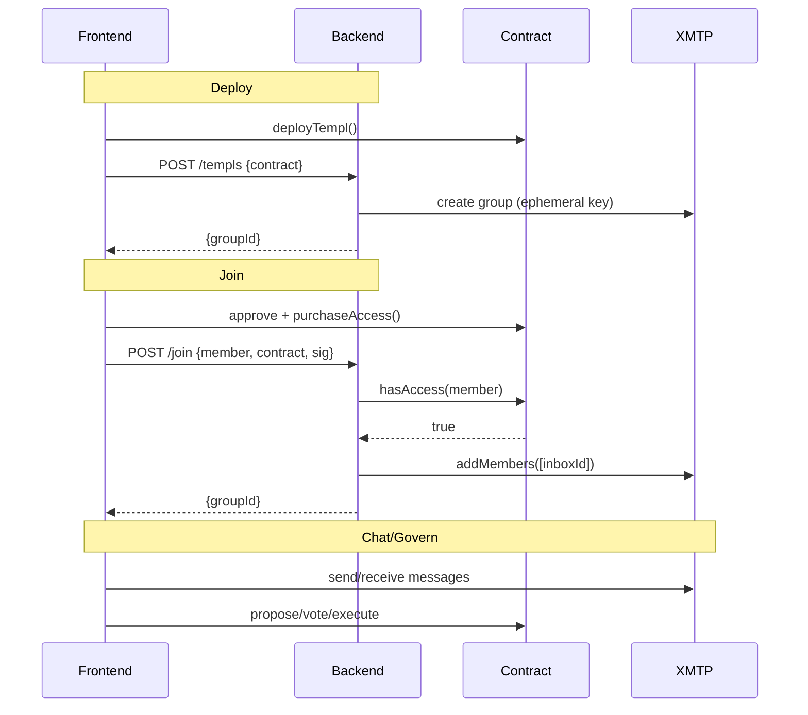
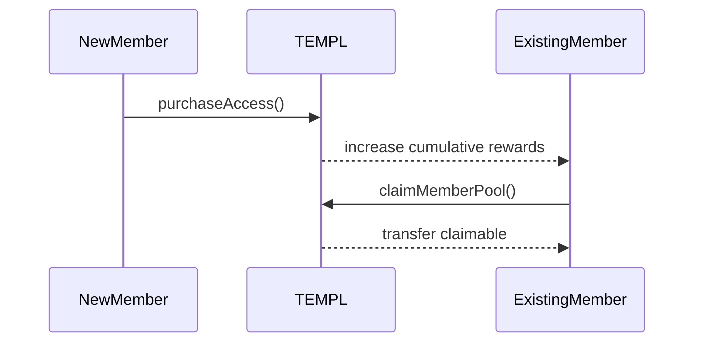
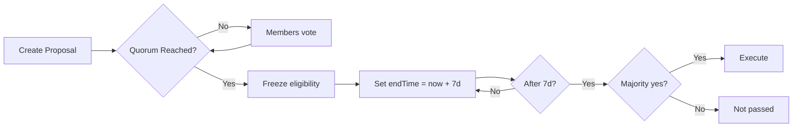
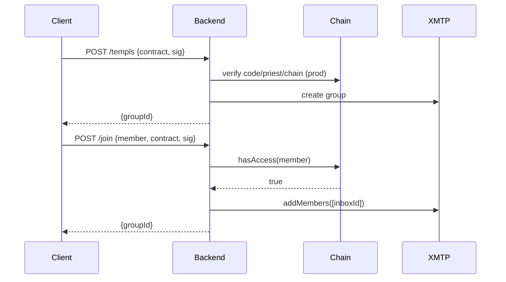
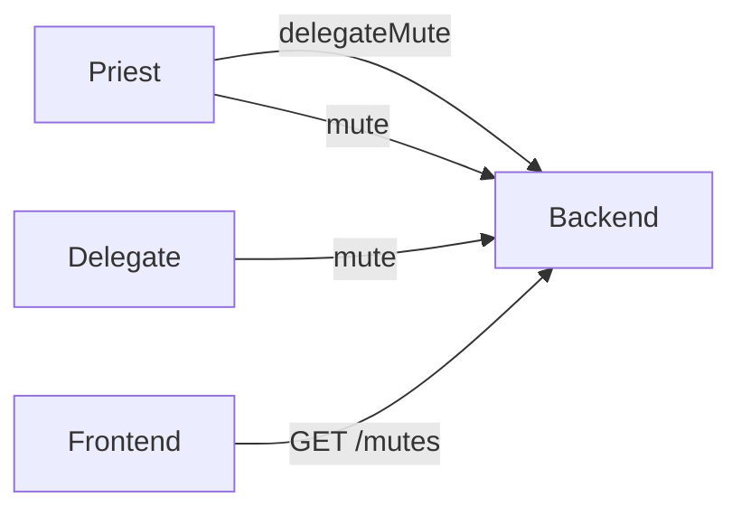

# Templ Protocol Technical Specifications

## Why this document exists

- Understand the economic guarantees every templ instance inherits from the factory.
- Follow the full membership and reward lifecycle before diving into implementation details.
- Map the governance guardrails that keep treasuries safe while priests and members steer proposals.

## How to use this guide

1. **Abstract and system overview** - quick mental model for the whole stack.
2. **On-chain mechanics** - storage layout, fee math, membership lifecycle, governance rules.
3. **Off-chain integration** - signatures, bots, and XMTP hooks that secure access.
4. **Safety notes** - invariants auditors rely on.

## Abstract

Templ is a DAO-governed access system that combines:

- On-chain membership with a one-time ERC-20 entry fee (non-transferable, forever binding).
- Automatic fee splits on every new member (burn/treasury/member-pool chosen per templ; protocol share comes from the factory configuration and is immutable per factory).
- One-member-one-vote governance over an allowlisted set of actions.
- Views and typed signatures so the backend can enforce XMTP group access.

## System overview

Three layers work together to keep access consistent with on-chain state:

- **Smart contracts** (Solidity 0.8.23) gate membership and guard the treasury and member pool.
- **Backend** (Node/Express) creates the XMTP group with an ephemeral creator key, then hands off to a persistent invite-bot identity that only admits on-chain members. It also mirrors governance events and enforces moderation signatures.
- **Frontend** (Vite + React) deploys templs, guides purchases, requests invites, and surfaces governance and chat.

### High-level flow (deploy → join → chat)

## On-chain mechanics (`contracts/TEMPL.sol`)

Everything on-chain is modular so each templ instance inherits the same safeguards:

- `TemplBase` (storage, immutables, modifiers)
- `TemplMembership` (purchase + claims)
- `TemplTreasury` (treasury/config/priest handlers)
- `TemplGovernance` (proposal lifecycle)
- `TEMPL` (constructor wiring + payable receive)
- `TemplFactory` (fixes protocol fee percentage + recipient and deploys templ instances). `createTempl(token, entryFee)` uses defaults (priest = caller, burn/treasury/member splits derived from `(100 - protocolPercent)`, quorum 33%, execution delay 7 days, burn address `0x000000000000000000000000000000000000dEaD`). `createTemplWithConfig(CreateConfig)` accepts overrides for priest, the three percentages, burn address, quorum percent, and execution delay - percentages must still sum with the factory’s immutable protocol percent to 100.

### Economic model (per `purchaseAccess()`)

Each purchase applies the same split:

- Split of `entryFee` (percentages configurable at deployment time):
  - Burn (`burnPercent`) → default `0x000000000000000000000000000000000000dEaD` unless overridden at deploy time
  - Treasury (`treasuryPercent`) → retained by contract and tracked in `treasuryBalance`; donations also accrue to the contract balance and remain governable.
  - Member Pool (`memberPoolPercent`) → retained by contract and tracked in `memberPoolBalance`
- Protocol (`protocolPercent`) → transferred to the factory’s immutable `protocolFeeRecipient`. The percentage is supplied when the factory is deployed (10% by default in our scripts) and applies to every templ the factory creates.
- Member rewards: When a new member joins, the contract increments `cumulativeMemberRewards` by `floor(memberPoolShare / (n-1))` for existing members (where `n` is new member count). Remainders accumulate in `memberRewardRemainder`.
- Donations: Anyone may send ETH/ERC-20 directly to the contract address. Governance may later withdraw donated assets; the member pool balance remains reserved for members.
- Leftovers: Any indivisible remainder from reward splits accumulates in `memberRewardRemainder` and is folded into the next distribution so every token is eventually claimable.

### Membership lifecycle

How members enter, prove access, and claim rewards:

- `purchaseAccess()` - one-time, guarded by `whenNotPaused` and `notSelf` (DAO cannot purchase). Transfers tokens using SafeERC20 and emits `AccessPurchased` with counters. Fee-on-transfer ("taxed") tokens are unsupported — the accounting assumes the contract receives the exact split.
- `hasAccess(address)` - returns membership boolean.
- `getPurchaseDetails(address)` - returns `(purchased, timestamp, block)`.
- Member rewards:
  - `getClaimablePoolAmount(address)` - accrued rewards since join/last claim.
  - `claimMemberPool()` - transfers claimable amount; reverts `NoRewardsToClaim` or `InsufficientPoolBalance` when applicable. Updates snapshot and `memberPoolBalance`.
- External reward pools:
  - Governance can disburse non access-token assets (ERC-20 or ETH) by disbanding them with `disbandTreasuryDAO(token)`.
  - The contract tracks each token in `externalRewards[token]`; members inspect via `getExternalRewardTokens()` / `getExternalRewardState(token)` and withdraw their share using `claimExternalToken(token)` (supports `address(0)` for ETH).
  - Successful withdrawals emit `ExternalRewardClaimed(token, member, amount)` and update per-member snapshots. Membership snapshots are now derived from token-specific checkpoints so joining no longer iterates through the external reward list.
- Governance constants:
  - `burnAddress` is set at deploy time (defaults to the canonical dead address, but `createTemplWithConfig` can override it).
  - `quorumPercent` and `executionDelayAfterQuorum` are established during deployment via the factory and remain immutable during contract lifetime.

### Governance model

Governance stays one-member-one-vote with predictable timelines:

- Voting power: one member = one vote. Proposer auto-YES. Votes can be changed until eligibility windows close.
- Proposal bounds: exactly one live proposal per address. A new proposal clears a previous one when it is expired or executed; otherwise creation reverts `ActiveProposalExists`.
- Voting windows: default `7 days` if `0` is provided; allowed range `[7, 30] days`.
- Quorum and eligibility:
  - Quorum: `quorumPercent = 33` of `eligibleVoters`, where `eligibleVoters` snapshots the member count at proposal creation.
  - Before quorum:
    - Only members recorded in the creation snapshot may vote; later joins revert `JoinedAfterProposal` until quorum is reached.
  - After quorum:
    - The contract records `postQuorumEligibleVoters` + `quorumSnapshotBlock` so members who joined before the quorum-reaching transaction can still vote. Joins in the same block remain eligible; later joins revert `JoinedAfterProposal`.
    - Post-quorum window uses the templ’s configured `executionDelayAfterQuorum`: on first quorum, `endTime` is reset to `now + executionDelayAfterQuorum`.
    - Voting continues during this window for eligible voters; after it, `vote()` reverts `VotingEnded`.
  - Execution:
    - Majority required: `yesVotes > noVotes`
    - If quorum-exempt: execute after `endTime`
    - Requires quorum: earliest execution at `quorumReachedAt + executionDelayAfterQuorum` (factory default 7 days, but configurable per templ during deployment)
- Quorum exemption: `createProposalDisbandTreasury` proposed by the `priest` sets `quorumExempt = true` and respects only `endTime`.

### Allowed actions (typed proposals only)

- `setPausedDAO(bool)` — pause or unpause purchases.
- `updateConfigDAO(address,uint256,bool,uint256,uint256,uint256)` — update entry fee and optionally the burn/treasury/member pool percentages. Token changes are disabled (`TokenChangeDisabled`). `_token` must be `address(0)` or the current token. When `_updateFeeSplit` is true the provided percentages must sum with `protocolPercent` to 100.
- `withdrawTreasuryDAO(address token, address recipient, uint256 amount, string reason)` — move a specific amount of any asset held by the contract. For the access token, only the treasury portion is withdrawable; the member pool is preserved.
- `disbandTreasuryDAO(address token)` — move the full available balance of `token` into a member-distributable pool. With the access token this increases the member pool (`memberPoolBalance`) and remainder; with any other ERC-20 or ETH the funds are tracked in an external rewards pool that members withdraw via `claimExternalToken`.
- `changePriestDAO(address)` — change the on-chain `priest` address.

Creation helpers (`createProposalX`) initialize proposals with normalized timing, proposer auto-YES, and optional quorum exemption for priest-proposed disband.

### Views and introspection

These helpers expose the templ state without mutating anything:

- `getTreasuryInfo()` - available treasury (excludes reserved member pool), current pool, totals, protocol recipient.
- `getConfig()` - token, entry fee, paused flag, member count, available treasury, pool, burn/treasury/member percentages, and protocol percentage.
- `getMemberCount()` - number of members.
- `getVoteWeight(address)` - `1` for members, `0` for non-members.
- External reward helpers: `getExternalRewardTokens()`, `getExternalRewardState(address)`, `getClaimableExternalToken(member, token)`, and `claimExternalToken(token)` (handles ERC-20 or native via `address(0)`).
- `getProposal(id)` - proposer, yes/no votes, endTime, executed flag, computed `passed`.
- `getProposalSnapshots(id)` - exposes `(eligibleVotersPreQuorum, eligibleVotersPostQuorum, preQuorumSnapshotBlock, quorumSnapshotBlock, createdAt, quorumReachedAt)` to reason about eligibility windows.
- `hasVoted(id, voter)` - whether and how a voter voted (`support`).
- `getActiveProposals()` / `getActiveProposalsPaginated(offset, limit)` - active proposal ids, with pagination support.

### Safety spells and invariants

- Non-reentrant: `purchaseAccess`, `claimMemberPool`, `executeProposal`.
- `onlyDAO` guards administration to self-calls via `executeProposal`.
- `notSelf` prevents DAO from purchasing membership.
- `paused` blocks new purchases; proposing/voting continue while paused.
- Token change disabled in governance; entry fee constrained (≥10 and multiple of 10).
- No arbitrary external calls; proposal execution is internal and typed.
- Member pool is preserved: withdrawals of access token are limited to the available treasury (excludes pool). Disband operations increase the pool for equitable member distribution.

## Off-chain integration (Backend API + XMTP)

### Responsibilities

- Maintains the XMTP group tied to a Templ contract: conjures it via a short-lived ephemeral key, then uses a persistent invite-only bot identity to add on-chain members (no persistent owner/admin privileges retained).
- Verifies EIP-712 signatures for all state-changing requests and enforces replay protection.
- Mirrors on-chain governance events (`ProposalCreated`, `VoteCast`) into the group as JSON messages.
- Enforces chat moderation via escalating mutes and optional delegated moderators.

### Group creation and invites

Two signed calls power the access flow:

- `POST /templs` - create/register a group for a deployed contract.
  - Production checks: verify contract code, `chainId`, and that `priestAddress` equals on-chain `priest()` (when `REQUIRE_CONTRACT_VERIFY=1`).
  - Signature: EIP-712 `{ action:'create', contract, server, nonce, issuedAt, expiry }` bound to `BACKEND_SERVER_ID`.
  - Response and persistence: `{ groupId }`; store `{ contract, groupId, priest }` in SQLite.
- `POST /join` - verify `hasAccess(member)` and invite by inboxId.
  - Signature: EIP-712 `{ action:'join', contract, server, nonce, issuedAt, expiry }` signed by the member.
  - Identity: server resolves inboxIds and waits for readiness; client-supplied ids are ignored except in explicit local/test fallback.

### Moderation endpoints

Mute actions stay limited and auditable:

- `POST /delegateMute` - grant mute rights (priest EIP-712 `{ action:'delegateMute', ... }`).
- `DELETE /delegateMute` - revoke mute rights (same typed signature).
- `POST /mute` - record escalating mute strike (priest or delegate EIP-712 `{ action:'mute', ... }`).
- `GET /mutes` - list active mutes for a contract.

### Identity, persistence, and operations

- XMTP environments: `local`, `dev`, `production` (`XMTP_ENV` / `VITE_XMTP_ENV`).
- Group ownership: An ephemeral creator key is used at creation; the persistent invite-bot identity manages invites thereafter (no need for admin powers like banning).
- Persistence (SQLite `backend/groups.db`):
  - `groups(contract, groupId, priest)`
  - `delegates(contract, delegate)`
  - `mutes(contract, target, count, until)`
  - `signatures(sig, usedAt)`
  - `kv` (stores generated bot key when `BOT_PRIVATE_KEY` not provided).
- XMTP Node DB: SQLCipher-encrypted `xmtp-<env>-<inboxId>.db3` using `BACKEND_DB_ENC_KEY`. Browser DB lives in OPFS per origin (not encrypted).
  - Contains (server): invite-bot identity and installation keys, stable `inboxId`, conversation/group identifiers and metadata (name/description), and sync cursors (e.g., last-seen sequence) the SDK needs to resume.
  - Excludes: chat message bodies or attachments, per-member message history, and any application payloads. Our backend does not store chat content.

## Frontend responsibilities

- Deploy Templ, purchase & join, chat, propose, vote, and execute from a React app.
- Governance UI composes the typed proposal actions (pause/unpause, withdraw the entire available treasury balance of the selected asset to the connected wallet, disband to pool, entry-fee reprice, change priest). Titles/descriptions are not on-chain; they are shared as XMTP messages adjacent to the on-chain proposal id. Crafting a proposal for a partial treasury withdrawal still requires entering custom calldata.
- `VITE_BACKEND_SERVER_ID` must match backend `BACKEND_SERVER_ID` to bind EIP-712 signatures to your deployment.

## Persistence overview

- On-chain: membership, treasury/pool balances, governance proposals, votes, and events.
- Backend SQLite: contract→group mapping, priest, moderation, replay-protection signatures, bot key (when generated).
- XMTP Node DB (server): encrypted invite-bot identity (inboxId + installation), conversation identifiers/metadata, and sync cursors - no chat message bodies.
- XMTP Browser DB: OPFS identity and metadata; advise one client per page to avoid OPFS access-handle contention.

## Cult glossary

- **Priest** - Contract’s designated address with limited special power:
  - its disband proposals are quorum-exempt.
  - priests can `/mute` and `/delegateMute` in the Templ XMTP chat.
  - priest can be changed via DAO proposal.
- **Treasury** - Portion of access token and any donations held by the contract, withdrawable via proposals.
- **Member Pool** - Accrual bucket distributed equally to members; claimable pro-rata by address.
- **Disband** - Governance action moving the entire available access-token treasury into the member pool equally.
- **Quorum** - 33% of eligible voters; eligibility freezes after quorum.
- **XMTP Group** - Off-chain chat space created via an ephemeral key; the backend’s bot identity has invite-only powers to add on-chain members. No persistent owner/admin keys are retained.

## Next

Move to [CORE_FLOW_DOCS.MD](./CORE_FLOW_DOCS.MD) for step-by-step diagrams of the flows outlined here.
