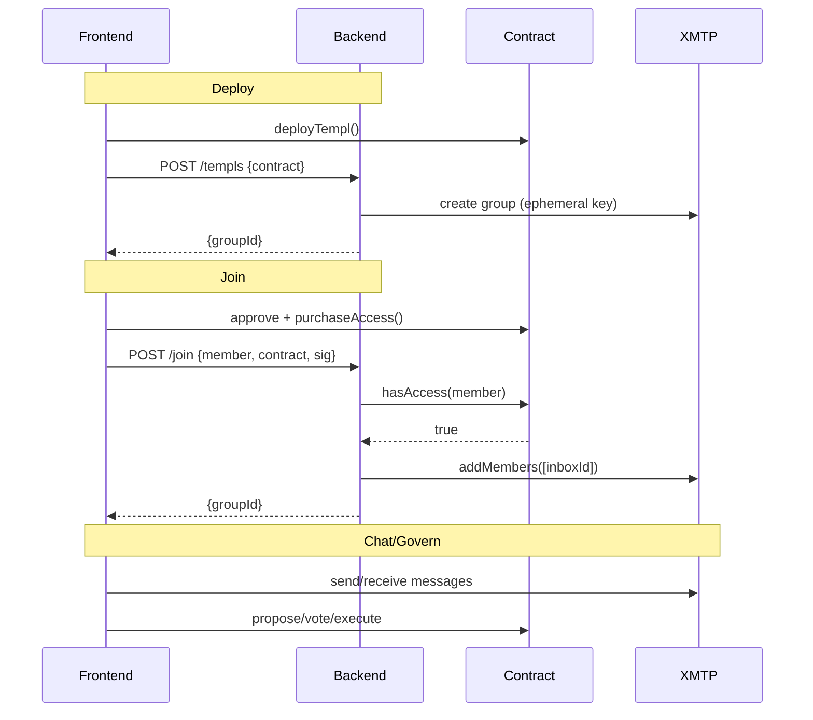
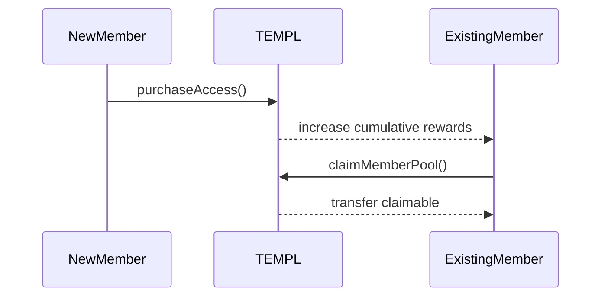
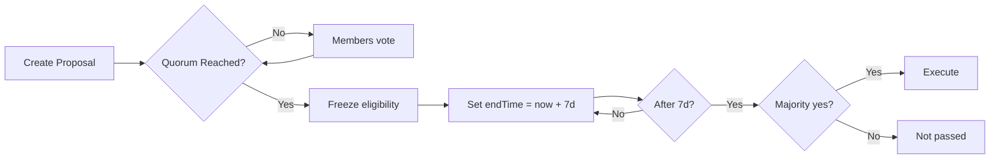
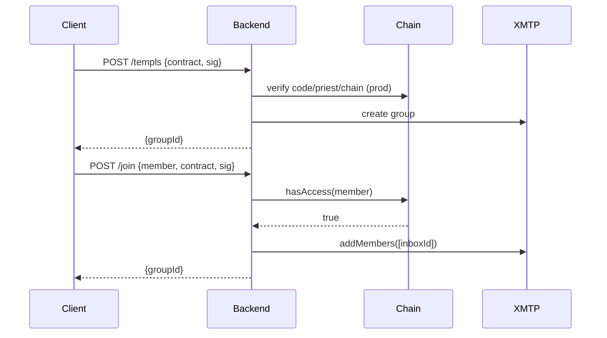
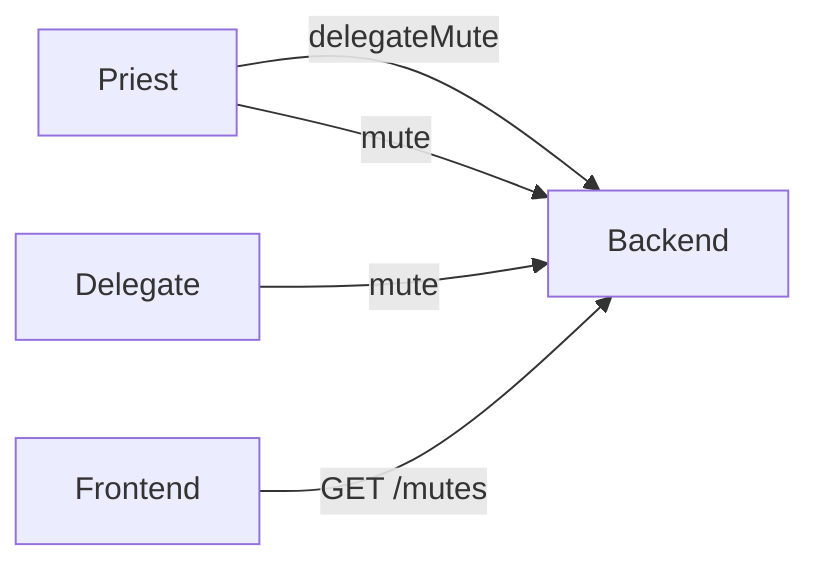

# TEMPL Protocol — Technical Specifications

## Abstract

TEMPL is a DAO‑governed, token‑gated private group system that combines:

- On‑chain membership with a fixed ERC‑20 entry fee (one‑time, non‑transferable)
- Automatic fee split when new member joins 30/30/30/10 (burn/treasury/member‑pool/protocol)
- One‑member‑one‑vote governance over an allowlisted set of safe actions
- Views and signatures that let a backend enforce access to an XMTP group chat

## System Overview

- Smart contracts (Solidity 0.8.23) gate membership and manage the treasury and member pool.
- Backend (Node/Express) creates the XMTP group with a short‑lived ephemeral key, then uses a persistent invite‑bot identity to invite on‑chain members. No persistent owner/admin keys are retained; the bot is not used for banning. It also mirrors governance events and enforces moderation via signatures.
- Frontend (Vite + React) deploys contracts, buys access, requests invites, and surfaces governance and chat.

**High‑level flow (deploy → join → chat):**

## On‑Chain Protocol (contracts/TEMPL.sol)

### Economic Model (per `purchaseAccess()`)

- Split of `entryFee`:
  - 30% Burn → `0x000000000000000000000000000000000000dEaD`
  - 30% Treasury → retained by contract, tracked in `treasuryBalance`
  - 30% Member Pool → retained by contract, tracked in `memberPoolBalance`
  - 10% Protocol → transferred to `protocolFeeRecipient`
- Member rewards: When a new member joins, the contract increments `cumulativeMemberRewards` by `floor(30% / (n-1))` for existing members (where `n` is new member count). Remainder accumulates in `memberRewardRemainder`.
- Donations: Anyone may send ETH/ERC‑20 directly to the contract address. Governance may later withdraw donated assets; the member pool balance remains reserved for members.

### Membership Lifecycle

- `purchaseAccess()` — one‑time, guarded by `whenNotPaused` and `notSelf` (DAO cannot purchase). Transfers tokens using SafeERC20 and emits `AccessPurchased` with counters.
- `hasAccess(address)` — returns membership boolean.
- `getPurchaseDetails(address)` — returns `(purchased, timestamp, block)`.
- Member rewards:
  - `getClaimablePoolAmount(address)` — accrued rewards since join/last claim.
  - `claimMemberPool()` — transfers claimable amount; reverts `NoRewardsToClaim` or `InsufficientPoolBalance` when applicable. Updates snapshot and `memberPoolBalance`.

### Governance Model

- Voting power: one member = one vote. Proposer auto‑YES. Votes can be changed until eligibility windows close.
- Proposal bounds: exactly one live proposal per address. A new proposal clears a previous one when it is expired or executed; otherwise creation reverts `ActiveProposalExists`.
- Voting windows: default `7 days` if `0` is provided; allowed range `[7, 30] days`.
- Quorum and eligibility:
  - Quorum: `quorumPercent = 33` of `eligibleVoters` (tracked over time).
  - Before quorum:
    - Any member may vote
    - `eligibleVoters = memberList.length`
  - After quorum:
    - Eligibility freezes at `quorumReachedAt`
    - Only members who joined before `quorumReachedAt` may vote; late joiners revert `JoinedAfterProposal`
    - Post‑quorum window is fixed to 7 days: on first quorum, `endTime` is reset to `now + 7 days`
    - Voting continues during this 7‑day window for eligible voters; after it, `vote()` reverts `VotingEnded`
  - Execution:
    - Majority required: `yesVotes > noVotes`
    - If quorum‑exempt: execute after `endTime`
    - Requires quorum: earliest execution at `quorumReachedAt + executionDelayAfterQuorum (7 days)`
- Quorum exemption: `createProposalDisbandTreasury` proposed by the `priest` sets `quorumExempt = true` and respects only `endTime`.

### Allowed Actions

- `setPausedDAO(bool)` — pause/unpause purchases.
- `updateConfigDAO(address,uint256)` — update entry fee only; token changes are disabled (`TokenChangeDisabled`). `_token` must be `address(0)` or the current token.
- `withdrawTreasuryDAO(address token, address recipient, uint256 amount, string reason)` — move a specific amount of any asset held by the contract. For the access token, only the treasury portion is withdrawable; the member pool is preserved.
- `disbandTreasuryDAO()` / `disbandTreasuryDAO(address)` — move the full available balance of the access token into the member pool equally. Only the access token can be pooled.
- `changePriestDAO(address)` — change the on‑chain `priest` address.

Creation helpers (`createProposalX`) initialize proposals with normalized timing, proposer auto‑YES, and optional quorum exemption for priest‑proposed disband.

### Views and Introspection

- `getTreasuryInfo()` — available treasury (excludes reserved member pool), current pool, totals, protocol recipient.
- `getConfig()` — token, entry fee, paused flag, member count, available treasury, pool.
- `getMemberCount()` — number of members.
- `getVoteWeight(address)` — `1` for members, `0` for non‑members.
- `getProposal(id)` — proposer, yes/no votes, endTime, executed flag, computed `passed`.
- `hasVoted(id, voter)` — whether and how a voter voted (`support`).
- `getActiveProposals()` / `getActiveProposalsPaginated(offset, limit)` — active proposal ids, with pagination support.

### Safety and Invariants

- Non‑reentrant: `purchaseAccess`, `claimMemberPool`, `executeProposal`.
- `onlyDAO` guards administration to self‑calls via `executeProposal`.
- `notSelf` prevents DAO from purchasing membership.
- `paused` blocks new purchases; proposing/voting continue while paused.
- Token change disabled in governance; entry fee constrained (≥10 and multiple of 10).
- No arbitrary external calls; proposal execution is internal and typed.
- Member pool is preserved: withdrawals of access token are limited to the available treasury (excludes pool). Disband operations increase the pool for equitable member distribution.

## Off‑Chain Protocol (Backend API + XMTP)

### Responsibilities

- Maintains the XMTP group tied to a TEMPL contract: creates it via a short‑lived ephemeral key, then uses a persistent invite‑only bot identity to add on‑chain members (no persistent owner/admin privileges retained).
- Verifies EIP‑712 signatures for all state‑changing requests and enforces replay protection.
- Mirrors on‑chain governance events (`ProposalCreated`, `VoteCast`) into the group as JSON messages.
- Enforces chat moderation via escalating mutes and optional delegated moderators.

### Group Creation and Invites

- `POST /templs` — create/register a group for a deployed contract.
  - Production checks: verify contract code, `chainId`, and that `priestAddress` equals on‑chain `priest()` (when `REQUIRE_CONTRACT_VERIFY=1`).
  - Signature: EIP‑712 `{ action:'create', contract, server, nonce, issuedAt, expiry }` bound to `BACKEND_SERVER_ID`.
  - Response and persistence: `{ groupId }`; store `{ contract, groupId, priest }` in SQLite.
- `POST /join` — verify `hasAccess(member)` and invite by inboxId.
  - Signature: EIP‑712 `{ action:'join', contract, server, nonce, issuedAt, expiry }` signed by the member.
  - Identity: server resolves inboxIds and waits for readiness; client‑supplied ids are ignored except in explicit local/test fallback.

### Moderation Endpoints

- `POST /delegateMute` — grant mute rights (priest EIP‑712 `{ action:'delegateMute', ... }`).
- `DELETE /delegateMute` — revoke mute rights (same typed signature).
- `POST /mute` — record escalating mute strike (priest or delegate EIP‑712 `{ action:'mute', ... }`).
- `GET /mutes` — list active mutes for a contract.

### Identity, Persistence, and Operations

- XMTP environments: `local`, `dev`, `production` (`XMTP_ENV` / `VITE_XMTP_ENV`).
- Group ownership: An ephemeral creator key is used at creation; the persistent invite‑bot identity manages invites thereafter (no need for admin powers like banning).
- Persistence (SQLite `backend/groups.db`):
  - `groups(contract, groupId, priest)`
  - `delegates(contract, delegate)`
  - `mutes(contract, target, count, until)`
  - `signatures(sig, usedAt)`
  - `kv` (stores generated bot key when `BOT_PRIVATE_KEY` not provided).
- XMTP Node DB: SQLCipher‑encrypted `xmtp-<env>-<inboxId>.db3` using `BACKEND_DB_ENC_KEY`. Browser DB lives in OPFS per origin (not encrypted).
  - Contains (server): invite‑bot identity and installation keys, stable `inboxId`, conversation/group identifiers and metadata (name/description), and sync cursors (e.g., last‑seen sequence) the SDK needs to resume.
  - Excludes: chat message bodies or attachments, per‑member message history, and any application payloads. Our backend does not store chat content.

## Client (Frontend)

- Deploy TEMPL, purchase & join, chat, propose, vote, and execute from a React app.
- Governance UI composes the typed proposal actions (pause/unpause, entry fee update, specific treasury transfer, disband to pool, change priest). Titles/descriptions are not on‑chain; they are shared as XMTP messages adjacent to the on‑chain proposal id.
- `VITE_BACKEND_SERVER_ID` must match backend `BACKEND_SERVER_ID` to bind EIP‑712 signatures to your deployment.

## Persistence Overview

- On‑chain: membership, treasury/pool balances, governance proposals, votes, and events.
- Backend SQLite: contract→group mapping, priest, moderation, replay‑protection signatures, bot key (when generated).
- XMTP Node DB (server): encrypted invite‑bot identity (inboxId + installation), conversation identifiers/metadata, and sync cursors — no chat message bodies.
- XMTP Browser DB: OPFS identity and metadata; advise one client per page to avoid OPFS access‑handle contention.

## Glossary
- **Priest**: Contract’s designated address with limited special power:
  - its disband proposals are quorum‑exempt
  - priests can `/mute` and `/delegateMute` in the TEMPL XMTP chat
  - priest can be changed via DAO proposal
- **Treasury**: Portion of access token and any donations held by the contract, withdrawable via proposals.
- **Member Pool**: Accrual bucket distributed equally to members; claimable pro‑rata by address.
- **Disband**: Governance action moving the entire available access‑token treasury into the member pool equally.
- **Quorum**: 33% of eligible voters; eligibility freezes after quorum.
- **XMTP Group**: Off‑chain chat space created via an ephemeral key; the backend’s bot identity has invite‑only powers to add on‑chain members. No persistent owner/admin keys are retained.
