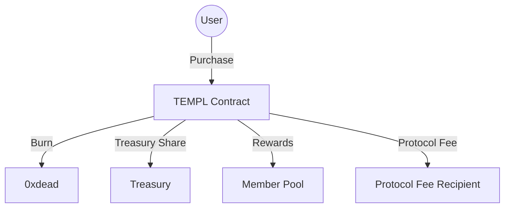
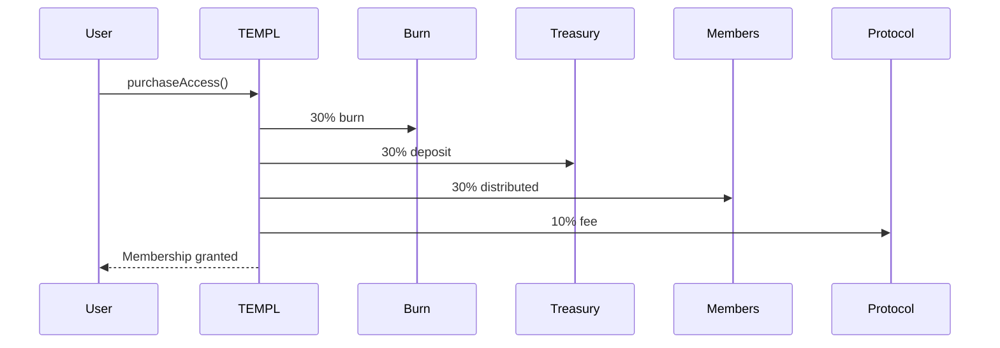
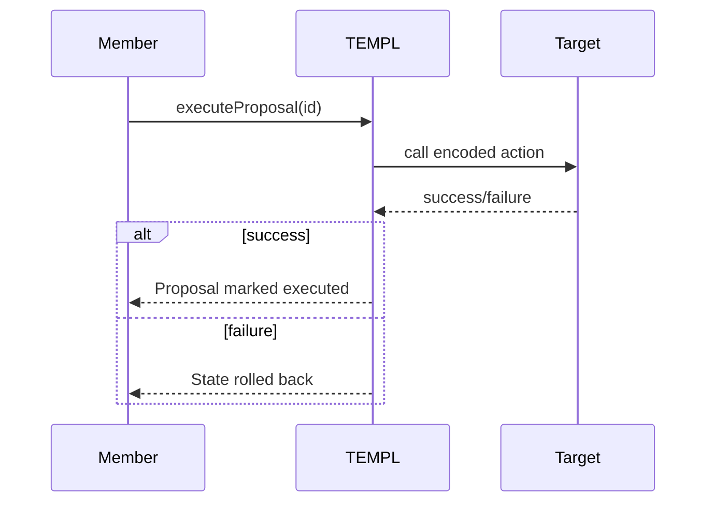
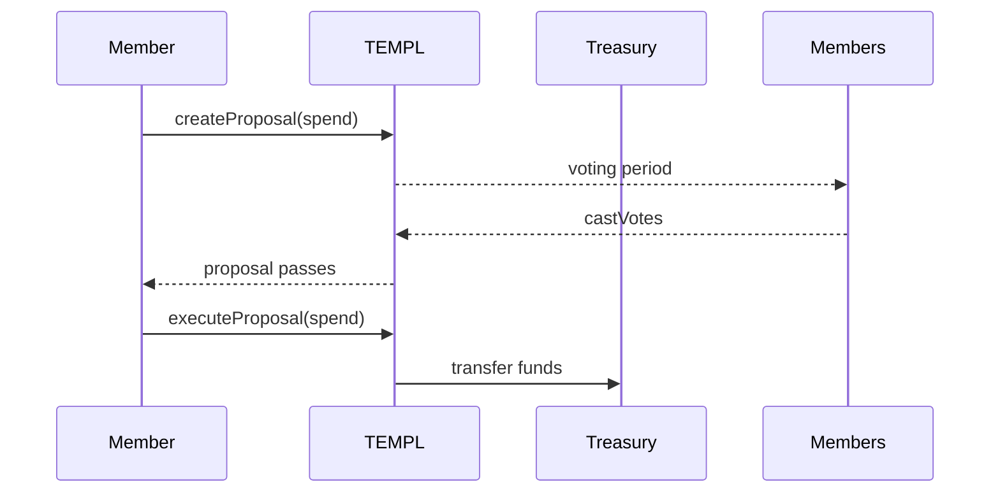

# Threat Model

## System Architecture
- **TEMPL Contract**: Governs memberships, proposals, and treasury.
- **Member Pool**: Distributes portions of entry fees to existing members.
- **Treasury**: Stores DAO funds released through successful proposals.
- **Protocol Fee Recipient**: Receives fixed sustainability fee.

## Trust Assumptions
- Contract code is immutable after deployment.
- External ERC20 token used for entry fees maintains expected behavior.
- Off-chain users and signers act honestly when broadcasting transactions.

## Invariants
- Total supply of memberships is capped by economic cost per entry.
- Proposal execution is atomic; state reverts on failure.
- Treasury transfers only occur through approved proposals.

## Failure Modes
- **Economic**: Entry fee token may depeg or lose liquidity.
- **Governance**: Malicious majority can drain treasury via proposals.
- **Operational**: Network congestion may delay proposal execution.

## Membership Purchase Flow

## Proposal Execution Flow

## Treasury Operation Flow

